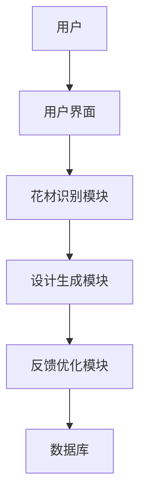
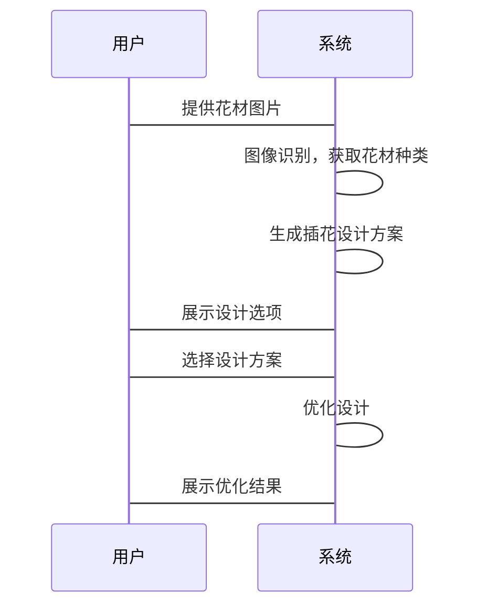

                 


# 智能花瓶：AI Agent的插花艺术指导

---

## 关键词：人工智能、插花艺术、AI代理、图像识别、自然语言处理

---

## 摘要：  
本文探讨了AI Agent在插花艺术中的应用，详细介绍了智能花瓶的设计与实现。通过分析插花艺术的历史、AI代理的核心功能、相关算法原理及系统架构，展示了如何利用AI技术提升插花艺术的创作体验。文章还提供了实际项目案例和代码实现，帮助读者全面理解智能花瓶的技术细节。

---

## 第一部分：智能花瓶的背景与概念

### 第1章：插花艺术的历史与文化价值

#### 1.1 插花艺术的起源与发展

插花艺术起源于古代，最早可追溯至古埃及和古希腊时期。人们用花朵装饰神庙和仪式，表达对生命的敬意。随着时间推移，插花艺术在不同文化中发展出独特的风格，例如东方式的 Ikebana 和西方式的花艺设计。

#### 1.2 插花艺术的现代发展

现代插花艺术结合了传统技法和创新理念，更加注重个性化和艺术性。随着技术的进步，插花艺术开始融入数字化工具，如虚拟设计和3D打印技术。然而，AI技术的应用为插花艺术带来了革命性的变化，智能花瓶作为AI代理的创新应用，正在重新定义插花艺术的创作方式。

#### 1.3 智能花瓶的背景介绍

智能花瓶是一款结合AI技术的插花指导工具，它通过图像识别、自然语言处理和机器学习算法，帮助用户完成插花设计。用户只需输入需求，AI代理即可提供花材推荐、设计灵感和实时指导，极大提升了插花创作的效率和乐趣。

---

## 第二部分：AI Agent在插花艺术中的核心概念

### 第2章：AI Agent的核心概念与功能

#### 2.1 AI Agent的定义与特点

AI Agent是一种智能代理系统，能够感知环境、理解用户需求并提供相应服务。在智能花瓶中，AI Agent通过图像识别和自然语言处理技术，分析用户输入并生成插花设计方案。

#### 2.2 AI Agent在插花中的核心功能

- **花材识别与推荐**：AI Agent能够识别用户提供的花材，并推荐搭配方案。例如，用户上传一束玫瑰，系统会推荐适合搭配的其他花材，如满天星或绿叶植物。
- **插花设计生成与优化**：基于用户需求，AI Agent生成多种设计建议，并优化布局和色彩搭配。用户可以选择不同的设计方案，并实时预览效果。
- **实时指导与反馈**：AI Agent提供实时反馈，指导用户完成插花步骤。例如，当用户插入花朵时，系统会提示是否正确放置，以确保最佳效果。

#### 2.3 AI Agent的系统架构

系统架构分为前端和后端两部分。前端是用户与AI Agent的交互界面，后端负责处理数据和算法运算。用户输入需求后，系统将数据传递到后端进行处理，生成设计方案并返回前端展示。

---

## 第三部分：AI Agent的算法原理

### 第3章：AI Agent的核心算法

#### 3.1 花材识别算法

花材识别基于图像识别技术，使用卷积神经网络（CNN）进行分类。训练数据包括各种花材的图片，系统通过深度学习模型识别花材种类和数量。

#### 3.2 插花设计生成算法

设计生成采用生成对抗网络（GAN），生成多种插花方案。生成器负责设计，判别器用于评估方案质量。用户可以选择最佳方案，或进一步优化。

#### 3.3 用户偏好分析算法

通过自然语言处理技术分析用户反馈，提取关键词和情感倾向，生成个性化推荐。系统会记录用户偏好，优化未来的设计方案。

---

## 第四部分：系统架构与设计

### 第4章：智能花瓶系统的架构设计

#### 4.1 系统功能模块

系统包括用户界面、花材识别、设计生成和反馈优化四大模块。用户界面负责输入和展示，花材识别模块处理图像数据，设计生成模块提供方案，反馈优化模块根据用户反馈调整设计。

#### 4.2 系统架构图

使用 Mermaid 绘制系统架构图：



#### 4.3 系统接口设计

系统接口包括图像识别接口、设计生成接口和反馈优化接口。每个接口定义了输入输出格式和调用方式，确保系统各部分协同工作。

#### 4.4 系统交互设计

使用 Mermaid 绘制交互流程图：



---

## 第五部分：项目实战

### 第5章：智能花瓶的开发实现

#### 5.1 环境安装

开发环境包括 Python 3.8+、TensorFlow 2.0+ 和 OpenCV 4.0+。安装命令如下：

```bash
pip install tensorflow==2.0.0
pip install numpy==1.21.0
pip install cv2==4.5.5
```

#### 5.2 核心代码实现

以下是花材识别模块的代码示例：

```python
import tensorflow as tf
import cv2
import numpy as np

# 加载预训练模型
model = tf.keras.models.load_model('flower_model.h5')

def recognize_flowers(image_path):
    image = cv2.imread(image_path)
    image = cv2.resize(image, (224, 224))
    image = image / 255.0
    image = np.expand_dims(image, axis=0)
    prediction = model.predict(image)
    predicted_class = np.argmax(prediction[0])
    return predicted_class

# 使用示例
recognize_flowers('rose.jpg')
```

#### 5.3 实际案例分析

案例分析：用户上传一束红色玫瑰，系统识别后推荐搭配白色百合和绿色叶子。生成设计方案包括圆形和竖直两种布局，用户选择竖直布局，系统优化后生成最终设计。

---

## 第六部分：最佳实践与总结

### 第6章：总结与展望

#### 6.1 总结

智能花瓶通过AI技术革新了插花艺术的创作方式，使用户能够轻松实现个性化设计。AI代理的应用不仅提高了创作效率，还为插花艺术注入了新的可能性。

#### 6.2 小结

- AI代理在插花中的应用前景广阔
- 技术实现需要结合图像识别和自然语言处理
- 未来发展方向包括增强现实技术的应用

#### 6.3 注意事项

- 数据隐私保护需重视
- 算法模型需不断优化
- 用户体验设计需简化操作步骤

#### 6.4 拓展阅读

建议阅读相关领域的最新论文和技术博客，深入了解AI在艺术创作中的应用。

---

## 作者：AI天才研究院/AI Genius Institute & 禅与计算机程序设计艺术/Zen And The Art of Computer Programming

