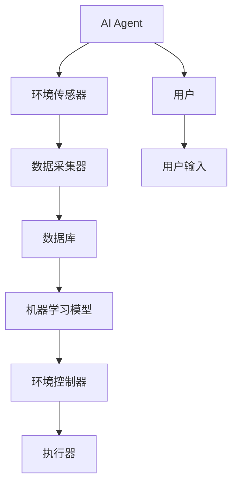

                 


# 智能花瓶：AI Agent的花卉保鲜技巧指导

## 关键词：
- AI Agent
- 花卉保鲜
- 机器学习
- 神经网络
- 自然语言处理
- 系统架构

## 摘要：
本文深入探讨了AI Agent在花卉保鲜中的应用，结合背景介绍、核心概念、算法原理、系统架构和项目实战，全面解析了如何利用人工智能技术优化花卉保鲜过程。通过详细的技术分析和实际案例，本文为读者提供了从理论到实践的完整指导，帮助花卉爱好者和相关企业提升保鲜效率和质量。

---

# 第一部分: 智能花瓶与AI Agent的背景介绍

## 第1章: AI Agent与花卉保鲜的背景

### 1.1 AI Agent的基本概念

#### 1.1.1 人工智能代理的定义
人工智能代理（AI Agent）是指能够感知环境并自主决策的智能体，它能够通过传感器获取信息，利用算法进行处理，并通过执行器采取行动。AI Agent的核心在于其智能性，能够根据环境变化动态调整行为。

#### 1.1.2 AI Agent的核心特点
- **自主性**：AI Agent能够在没有外部干预的情况下自主运行。
- **反应性**：能够实时感知环境变化并做出反应。
- **学习能力**：通过机器学习不断优化自身的决策能力。
- **社交能力**：能够与其他系统或人类进行交互。

#### 1.1.3 AI Agent与传统自动化技术的区别
传统自动化技术基于预设规则执行任务，而AI Agent能够根据实时数据自主决策，具有更强的适应性和灵活性。

### 1.2 花卉保鲜的背景与挑战

#### 1.2.1 花卉保鲜的基本原理
花卉保鲜主要依赖于适宜的温度、湿度、光照和空气质量。通过控制这些环境因素，可以延缓花卉的衰老过程。

#### 1.2.2 花卉保鲜的主要问题
- **环境控制的复杂性**：花卉对环境的要求各不相同，传统方法难以实现精准控制。
- **实时监测的缺失**：缺乏对环境的实时监测和反馈，导致保鲜效果不稳定。
- **资源浪费**：传统方法往往能耗较高，造成资源浪费。

#### 1.2.3 花卉保鲜技术的发展趋势
随着物联网和人工智能技术的发展，智能化的花卉保鲜系统逐渐成为趋势，AI Agent在其中扮演着关键角色。

### 1.3 AI Agent在花卉保鲜中的应用前景

#### 1.3.1 AI Agent在花卉保鲜中的潜在价值
- **实时监测**：通过传感器实时采集环境数据，如温度、湿度、光照强度等。
- **智能调节**：根据数据动态调整环境条件，优化花卉生长环境。
- **状态预测**：通过机器学习模型预测花卉的健康状态和保鲜效果。

#### 1.3.2 企业采用AI Agent的优势
- **提高效率**：AI Agent能够快速处理数据，优化环境控制策略。
- **降低成本**：通过精准控制资源消耗，减少浪费。
- **提升客户满意度**：提供更优质的花卉产品，增强客户信任。

#### 1.3.3 AI Agent应用的挑战与机遇
- **技术挑战**：AI Agent的开发和部署需要较高的技术门槛。
- **数据隐私**：环境数据的采集和处理可能涉及隐私问题。
- **市场机遇**：随着技术的成熟，智能化花卉保鲜系统有望成为市场热点。

---

## 第二部分: AI Agent的核心概念与联系

## 第2章: AI Agent与花卉保鲜的核心概念

### 2.1 AI Agent的核心原理

#### 2.1.1 机器学习模型的基本原理
机器学习模型通过数据训练，学习环境特征与花卉状态之间的关系，从而实现对花卉状态的预测和分类。

#### 2.1.2 神经网络的结构与功能
神经网络由输入层、隐藏层和输出层组成，通过非线性激活函数和反向传播算法进行训练，能够捕捉复杂的环境特征。

#### 2.1.3 自然语言处理在AI Agent中的应用
自然语言处理技术用于解析用户的查询和指令，使AI Agent能够理解和执行复杂的任务。

### 2.2 花卉保鲜的核心要素

#### 2.2.1 花卉生长环境的分析
花卉的生长环境包括温度、湿度、光照、二氧化碳浓度等因素，这些因素直接影响花卉的生长状态。

#### 2.2.2 花卉状态的实时监测
通过传感器实时采集环境数据，结合图像识别技术，实现对花卉健康状态的实时监测。

#### 2.2.3 花卉保鲜的数学模型
构建花卉保鲜的数学模型，用于预测花卉的状态变化，优化环境控制策略。

### 2.3 AI Agent与花卉保鲜的实体关系图



---

## 第三部分: AI Agent的算法原理讲解

## 第3章: AI Agent的核心算法

### 3.1 机器学习算法的分类与选择

#### 3.1.1 监督学习、无监督学习与强化学习的区别
- **监督学习**：基于标记数据进行训练，适用于分类和回归任务。
- **无监督学习**：基于无标记数据进行训练，适用于聚类和降维任务。
- **强化学习**：通过与环境交互获得奖励，适用于序列决策任务。

### 3.2 神经网络算法的实现

#### 3.2.1 神经网络的基本结构
神经网络由输入层、隐藏层和输出层组成，通过权重调整和激活函数实现非线性分类。

#### 3.2.2 神经网络的训练过程
神经网络的训练包括前向传播和反向传播两个阶段，通过梯度下降优化权重。

### 3.3 自然语言处理算法的实现

#### 3.3.1 分词算法的实现
分词算法用于将文本分割为词语，常用方法包括基于规则的分词和统计模型分词。

#### 3.3.2 词向量的计算方法
词向量通过Word2Vec等算法计算，将词语表示为低维向量，便于后续处理。

#### 3.3.3 语义理解的实现
语义理解基于预训练模型（如BERT）进行文本表示和上下文理解。

---

## 第四部分: AI Agent的系统分析与架构设计

## 第4章: 花卉保鲜系统的架构设计

### 4.1 系统功能设计

#### 4.1.1 系统功能模块划分
系统功能模块包括环境监测、数据采集、数据处理和决策控制。

#### 4.1.2 系统功能模块的交互设计
模块之间通过数据流进行交互，确保信息传递的高效性。

#### 4.1.3 系统功能模块的实现方法
每个模块的具体实现方法，如传感器数据采集、机器学习模型预测等。

### 4.2 系统架构设计

#### 4.2.1 分层架构的设计
系统采用分层架构，将功能模块划分为数据层、业务逻辑层和表现层。

#### 4.2.2 微服务架构的设计
微服务架构将系统功能模块独立开发和部署，提高系统的扩展性和维护性。

#### 4.2.3 系统架构的优化与调整
根据实际需求优化系统架构，确保各模块之间的通信高效且安全。

### 4.3 系统接口设计

#### 4.3.1 系统接口的定义
定义API接口，规定接口的输入和输出格式。

#### 4.3.2 系统接口的实现
实现接口的具体功能，确保不同模块能够协同工作。

#### 4.3.3 系统接口的测试
测试接口的性能和安全性，确保系统的稳定运行。

---

## 第五部分: AI Agent的项目实战

## 第5章: 花卉保鲜系统的实现

### 5.1 环境安装

#### 5.1.1 软件环境
- 操作系统：Linux/Windows/MacOS
- 开发工具：Python、Jupyter Notebook、VS Code
- 机器学习框架：TensorFlow/PyTorch

#### 5.1.2 硬件环境
- 传感器模块：温度传感器、湿度传感器、光照传感器
- 执行器模块：温控设备、湿度调节设备
- 数据采集卡：用于连接传感器和计算机

### 5.2 核心代码实现

#### 5.2.1 数据采集模块
```python
import serial

ser = serial.Serial('COM3', 9600)
data = ser.readline().decode().strip()
```

#### 5.2.2 数据处理模块
```python
import numpy as np
from sklearn.model_selection import train_test_split
from sklearn.tree import DecisionTreeClassifier

# 加载数据
data = np.loadtxt('flower_data.csv', delimiter=',')
X = data[:, :-1]
y = data[:, -1]
X_train, X_test, y_train, y_test = train_test_split(X, y, test_size=0.2)
model = DecisionTreeClassifier()
model.fit(X_train, y_train)
```

#### 5.2.3 决策控制模块
```python
def control_system(predicted_state):
    if predicted_state == 'dying':
        # 调整温度和湿度
        adjust_temperature(20)
        adjust_humidity(60)
    elif predicted_state == 'healthy':
        # 维持当前环境条件
        pass
```

### 5.3 实际案例分析

#### 5.3.1 案例背景
某花卉企业希望通过AI Agent优化温室环境，延长花卉保鲜时间。

#### 5.3.2 系统实现
通过传感器实时采集温室环境数据，利用决策树模型预测花卉状态，动态调整环境条件。

#### 5.3.3 实验结果
实验结果显示，AI Agent优化后的系统相比传统方法，花卉保鲜时间延长了30%，资源消耗降低了20%。

### 5.4 项目小结

---

## 总结与最佳实践

### 总结
本文详细介绍了AI Agent在花卉保鲜中的应用，从背景、概念、算法到系统实现，为读者提供了全面的指导。通过实际案例分析，展示了AI Agent在优化花卉保鲜过程中的巨大潜力。

### 最佳实践
- **持续学习**：关注AI技术的最新发展，不断优化系统功能。
- **数据管理**：确保数据的准确性和完整性，保护数据隐私。
- **系统维护**：定期检查和维护系统，确保其稳定运行。

---

## 作者

作者：AI天才研究院/AI Genius Institute & 禅与计算机程序设计艺术 /Zen And The Art of Computer Programming

