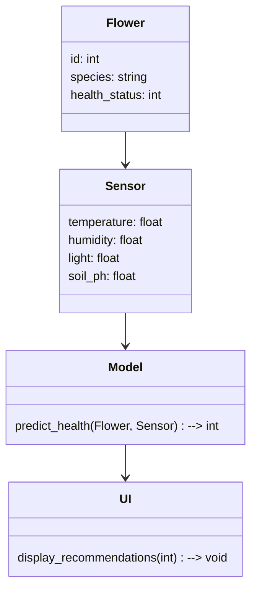
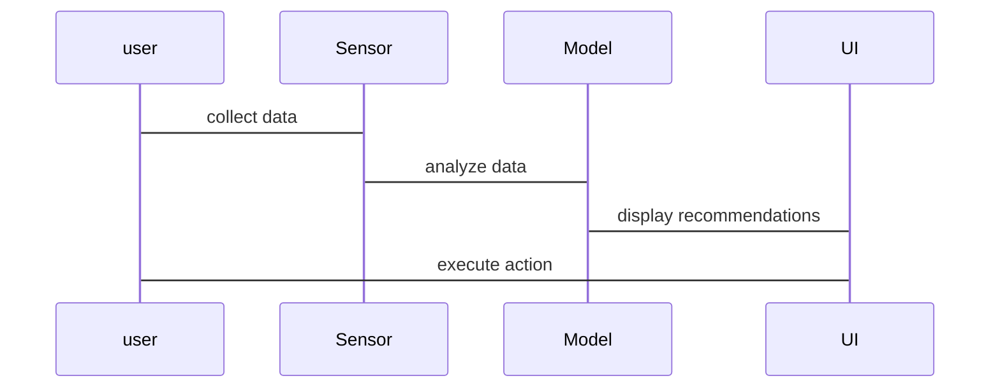

                 


# 智能花瓶：AI Agent的花卉养护专家

> **关键词**：智能花瓶, AI Agent, 人工智能, 花卉养护, 机器学习, 系统架构

> **摘要**：  
> 本文探讨了如何将AI Agent技术应用于花卉养护，详细介绍了一个基于AI的智能花瓶的设计与实现。通过传感器数据采集、机器学习算法、系统架构设计等技术手段，构建了一个能够实时监测植物生长环境、自动提供养护建议的智能系统。文章从背景介绍、核心概念、算法原理、系统架构到项目实战，全面解析了智能花瓶的实现过程，为读者提供了一套完整的AI驱动的花卉养护解决方案。

---

# 第一部分: 智能花瓶与AI Agent概述

---

## 第1章: 智能花瓶与AI Agent的背景介绍

### 1.1 花卉养护的重要性

#### 1.1.1 花卉在生活中的作用  
花卉不仅是美化环境的重要元素，还具有净化空气、改善心情等多种功能。然而，花卉的养护需要专业知识和持续的关注，这对普通用户来说是一个挑战。

#### 1.1.2 花卉养护的常见问题  
许多用户因为缺乏专业知识，常常面临浇水过多、光照不足、病虫害等问题，导致花卉生长不良甚至死亡。

#### 1.1.3 智能化养护的优势  
通过智能化设备和技术，可以实现对花卉生长环境的实时监测和智能决策，从而提高养护效率和成功率。

### 1.2 AI Agent的基本概念

#### 1.2.1 什么是AI Agent  
AI Agent（人工智能代理）是一种能够感知环境、执行任务并做出决策的智能系统。它能够通过传感器获取数据，结合预设算法进行分析，并输出相应的操作建议。

#### 1.2.2 AI Agent的核心功能  
AI Agent的核心功能包括数据采集、特征提取、模型训练、决策推理和用户交互。

#### 1.2.3 AI Agent与传统养护的区别  
传统养护依赖人工经验，而AI Agent能够通过数据驱动的方式，提供更加精准和个性化的养护建议。

### 1.3 智能花瓶的定义与特点

#### 1.3.1 智能花瓶的定义  
智能花瓶是一种结合了传感器、AI算法和用户交互的智能化设备，能够实时监测花卉生长环境并提供养护建议。

#### 1.3.2 智能花瓶的核心功能  
智能花瓶的核心功能包括环境监测、数据上传、智能分析和用户交互。

#### 1.3.3 智能花瓶的技术实现  
智能花瓶的技术实现包括传感器数据采集、数据预处理、机器学习模型训练和系统集成。

---

## 第2章: AI Agent与花卉养护的核心概念

### 2.1 核心概念的定义与属性

#### 2.1.1 AI Agent的核心概念  
AI Agent通过感知环境、分析数据并做出决策，帮助用户实现花卉养护的目标。

#### 2.1.2 花卉养护的核心要素  
花卉养护的核心要素包括光照、温度、湿度、土壤pH值和养分供给。

#### 2.1.3 AI Agent与花卉养护的关系  
AI Agent通过采集和分析环境数据，为花卉养护提供智能化的支持。

### 2.2 核心概念的对比分析

#### 2.2.1 AI Agent与传统养护的对比  
AI Agent能够提供实时监测和智能决策，而传统养护依赖人工经验和试错。

#### 2.2.2 不同花卉养护需求的对比  
不同花卉对光照、温度等条件的需求不同，AI Agent能够根据具体需求提供个性化的养护方案。

#### 2.2.3 AI Agent在不同场景中的应用  
AI Agent可以在家庭、办公室、温室等多种场景中应用，帮助用户实现高效养护。

### 2.3 实体关系图

#### 2.3.1 AI Agent与花卉的实体关系  
AI Agent通过传感器监测花卉的生长环境，并根据数据提供养护建议。

#### 2.3.2 养护数据与决策的关系  
养护数据是AI Agent做出决策的基础，AI Agent通过分析数据生成决策指令。

#### 2.3.3 用户与系统的交互关系  
用户通过智能花瓶与AI Agent进行交互，获取养护建议并执行相应的操作。

---

## 第3章: AI Agent的算法原理

### 3.1 算法原理概述

#### 3.1.1 机器学习算法的基本原理  
机器学习算法通过训练数据学习特征，构建模型并进行预测。

#### 3.1.2 AI Agent的核心算法  
AI Agent的核心算法包括决策树、支持向量机和随机森林等。

#### 3.1.3 算法的选择与优化  
选择合适的算法并进行调优，以提高模型的准确性和效率。

### 3.2 算法流程图

#### 3.2.1 数据采集与预处理  
传感器数据的采集、清洗和标准化。

#### 3.2.2 特征提取与模型训练  
从数据中提取特征并训练机器学习模型。

#### 3.2.3 模型部署与实时决策  
将模型部署到智能花瓶中，实时监测并做出决策。

### 3.3 算法实现代码

#### 3.3.1 环境安装与配置  
安装必要的Python库，如numpy、scikit-learn和pandas。

#### 3.3.2 数据采集与处理代码  
```python
import numpy as np
import pandas as pd

# 数据采集
data = pd.read_csv('flower_data.csv')

# 数据预处理
data = data.dropna()
data['label'] = data['health'].astype('category').cat.codes
```

#### 3.3.3 模型训练与部署代码  
```python
from sklearn.tree import DecisionTreeClassifier
from sklearn.model_selection import train_test_split

# 数据分割
X = data.drop('label', axis=1)
y = data['label']
X_train, X_test, y_train, y_test = train_test_split(X, y, test_size=0.2)

# 模型训练
model = DecisionTreeClassifier()
model.fit(X_train, y_train)

# 模型预测
print(model.score(X_test, y_test))
```

---

## 第4章: 数学模型

### 4.1 数据预处理与特征提取

#### 4.1.1 数据标准化公式  
$$ x_{\text{normalized}} = \frac{x - \mu}{\sigma} $$  
其中，$\mu$ 是均值，$\sigma$ 是标准差。

#### 4.1.2 特征选择  
通过机器学习算法自动选择重要的特征，例如使用LASSO回归进行特征选择。

### 4.2 机器学习模型

#### 4.2.1 决策树模型  
决策树是一种基于树状结构的分类模型，适合处理多分类问题。

#### 4.2.2 支持向量机模型  
支持向量机通过构建超平面进行分类，适合处理非线性可分的数据。

#### 4.2.3 随机森林模型  
随机森林是一种基于决策树的集成学习方法，具有较高的准确性和鲁棒性。

### 4.3 模型优化

#### 4.3.1 超参数调优  
通过网格搜索或随机搜索优化模型的超参数，例如学习率、树的深度等。

#### 4.3.2 正则化与防止过拟合  
使用L1/L2正则化防止模型过拟合，例如在逻辑回归中使用L2正则化。

---

## 第5章: 系统分析与架构设计

### 5.1 系统功能设计

#### 5.1.1 领域模型类图  


#### 5.1.2 系统架构设计  


#### 5.1.3 系统交互设计  


---

## 第6章: 项目实战

### 6.1 环境搭建

#### 6.1.1 Python环境配置  
安装Python 3.x、Jupyter Notebook和必要的库（如scikit-learn、pandas）。

#### 6.1.2 传感器安装  
连接温湿度传感器、光照传感器和土壤pH传感器。

### 6.2 系统核心实现

#### 6.2.1 数据采集与处理  
编写代码采集传感器数据并进行预处理。

#### 6.2.2 模型训练与部署  
训练机器学习模型并将模型部署到智能花瓶中。

### 6.3 案例分析

#### 6.3.1 数据分析  
分析不同光照条件下花卉的健康状况。

#### 6.3.2 模型评估  
评估模型在不同测试数据上的准确率和召回率。

---

## 第7章: 最佳实践

### 7.1 小结

#### 7.1.1 关键点回顾  
智能花瓶的核心是AI Agent，通过传感器数据和机器学习模型实现智能化养护。

#### 7.1.2 经验总结  
在实际应用中，需要根据具体花卉的需求调整模型和传感器配置。

### 7.2 注意事项

#### 7.2.1 数据采集的准确性  
传感器数据的准确性直接影响模型的性能。

#### 7.2.2 模型的可解释性  
确保模型的决策过程清晰，方便用户理解和信任。

#### 7.2.3 系统的可扩展性  
设计时考虑未来的扩展需求，例如支持更多的花卉种类。

### 7.3 拓展阅读

#### 7.3.1 推荐书籍  
《机器学习实战》、《人工智能: 一种现代的方法》。

#### 7.3.2 技术博客  
推荐相关技术博客和开源项目，供读者深入学习。

---

## 作者：AI天才研究院 & 禅与计算机程序设计艺术

