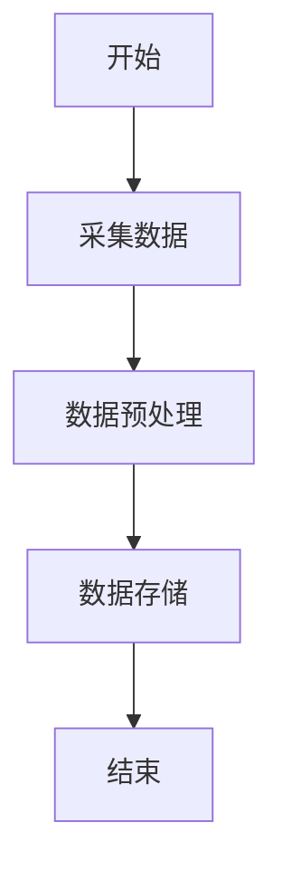
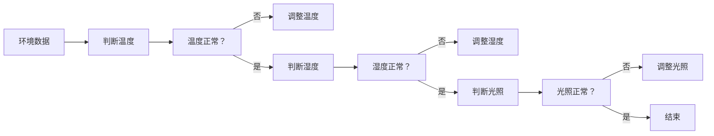
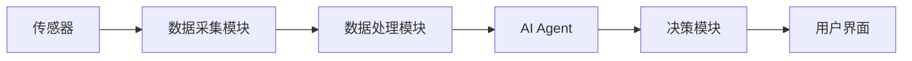

                 


# 智能花盆：AI Agent的植物生长监测

**关键词**：AI Agent、智能花盆、植物生长监测、物联网、传感器技术、数据采集、机器学习算法

**摘要**：本文将详细介绍智能花盆在植物生长监测中的应用，结合AI Agent、物联网和传感器技术，探讨其工作原理、算法实现和系统架构。通过实际案例分析，展示如何利用智能花盆实现智能化种植管理，帮助用户了解植物生长的实时状态，优化种植环境。

---

# 第一部分：智能花盆的背景与核心概念

## 第1章：智能花盆的背景与问题背景

### 1.1 智能花盆的背景介绍

#### 1.1.1 传统植物种植的局限性

传统种植方式依赖人工经验，存在以下问题：
- **环境控制不足**：无法实时监测和调节温度、湿度、光照等关键因素。
- **资源浪费**：过度浇水或施肥导致资源浪费和环境污染。
- **效率低下**：人工管理效率低，难以实现大规模种植。

#### 1.1.2 智能化种植的需求与趋势

随着科技的发展，智能化种植成为趋势：
- **精准农业**：通过传感器和AI技术实现精准监测和管理。
- **物联网技术的应用**：连接传感器、云端和用户设备，实现数据实时传输和分析。
- **可持续发展**：减少资源浪费，提高种植效率，降低环境影响。

#### 1.1.3 AI Agent在植物生长监测中的作用

AI Agent（智能体）能够实时分析传感器数据，自动调整种植条件，优化植物生长环境，帮助种植者实现高效管理。

### 1.2 智能花盆的核心问题与目标

#### 1.2.1 植物生长监测的核心问题

- **数据采集与处理**：如何高效采集和处理环境数据。
- **模型训练与优化**：如何建立准确的植物生长预测模型。
- **智能决策与控制**：如何根据数据自动调整种植条件。

#### 1.2.2 智能花盆的目标与边界

- **目标**：实现植物生长的实时监测与智能管理。
- **边界**：专注于环境监测和自动控制，不涉及植物品种选择和病虫害防治。

#### 1.2.3 智能花盆的核心要素与组成

- **传感器**：温度、湿度、光照、土壤湿度等传感器。
- **AI Agent**：数据采集、分析和决策模块。
- **物联网通信**：数据传输和用户交互界面。

---

## 第2章：智能花盆的核心概念与技术

### 2.1 AI Agent的基本原理

#### 2.1.1 AI Agent的定义与特点

- **定义**：AI Agent是一个能够感知环境、做出决策并采取行动的智能实体。
- **特点**：
  - **自主性**：能够独立运行。
  - **反应性**：能实时感知环境并做出反应。
  - **学习能力**：通过数据学习优化决策模型。

#### 2.1.2 AI Agent在智能花盆中的应用

- **数据采集**：AI Agent接收传感器数据。
- **数据分析**：分析数据，预测植物生长状态。
- **决策控制**：根据分析结果，自动调整环境条件。

### 2.2 传感器技术与数据采集

#### 2.2.1 常见传感器类型与功能

- **温度传感器**：监测环境温度。
- **湿度传感器**：监测空气湿度和土壤湿度。
- **光照传感器**：监测光照强度。
- **CO2传感器**：监测二氧化碳浓度。

#### 2.2.2 数据采集的流程与方法

1. **传感器采集数据**：温度、湿度等传感器实时采集环境数据。
2. **数据预处理**：去除噪声，转换数据格式。
3. **数据传输**：通过物联网传输到云端或本地系统。

### 2.3 物联网技术与通信协议

#### 2.3.1 物联网在智能花盆中的应用

- **数据传输**：传感器数据通过物联网传输到云端或用户设备。
- **远程监控**：用户可以通过手机或电脑远程查看植物生长状态。

#### 2.3.2 无线通信协议的选择与实现

- **选择协议**：Wi-Fi、蓝牙、ZigBee等。
- **实现步骤**：传感器数据通过选定协议传输到接收端。

### 2.4 智能花盆的核心技术对比

#### 2.4.1 传感器技术对比表格

| 传感器类型 | 优点 | 缺点 | 适用场景 |
|------------|------|------|----------|
| 温度传感器 | 精度高 | 成本低 | 室内种植 |
| 湿度传感器 | 灵敏度高 | �易受环境干扰 | 土壤湿度监测 |
| 光照传感器 | 调节光照强度 | �易受环境影响 | 光照管理 |

#### 2.4.2 AI Agent与传统自动控制系统的区别

- **AI Agent**：具备学习和优化能力，能根据数据动态调整策略。
- **传统控制系统**：基于固定规则进行控制，不具备学习能力。

---

## 第3章：智能花盆的算法原理

### 3.1 数据采集与预处理

#### 3.1.1 数据采集流程图（Mermaid）



### 3.2 AI模型训练与优化

#### 3.2.1 线性回归模型（数学公式）

$$ y = \beta_0 + \beta_1x + \epsilon $$

其中：
- $y$：预测值
- $\beta_0$：截距
- $\beta_1$：斜率
- $x$：自变量
- $\epsilon$：误差项

#### 3.2.2 神经网络模型（Mermaid流程图）


#### 3.2.3 算法实现（Python代码示例）

```python
import numpy as np
from sklearn.linear_model import LinearRegression

# 示例数据
X = np.array([[1], [2], [3], [4], [5]])
y = np.array([2, 4, 5, 4, 6])

# 训练模型
model = LinearRegression()
model.fit(X, y)

# 预测
print(model.predict([[6]]))  # 输出：[[7.5]]
```

### 3.3 决策算法实现

#### 3.3.1 决策树算法（Mermaid流程图）



---

## 第4章：智能花盆的系统分析与架构设计

### 4.1 系统功能设计

#### 4.1.1 领域模型类图（Mermaid）

```mermaid
classDiagram
    class Sensor {
        +温度传感器：tempSensor
        +湿度传感器：humSensor
        +光照传感器：lightSensor
        +CO2传感器：co2Sensor
    }
    class AI-Agent {
        +数据采集模块：dataCollector
        +数据分析模块：dataAnalyzer
        +决策模块：decisionMaker
    }
    class 用户界面：UI {
        +显示模块：display
        +控制模块：controller
    }
    Sensor --> AI-Agent
    AI-Agent --> 用户界面
```

### 4.2 系统架构设计

#### 4.2.1 系统架构图（Mermaid）



### 4.3 系统接口设计

#### 4.3.1 系统接口

- **传感器接口**：与传感器连接，接收数据。
- **云端接口**：数据存储和分析。
- **用户界面接口**：显示数据和控制界面。

### 4.4 系统交互设计

#### 4.4.1 系统交互流程图（Mermaid）


---

## 第5章：智能花盆的项目实战

### 5.1 环境安装

#### 5.1.1 安装Python和必要的库

```bash
pip install numpy pandas scikit-learn
```

### 5.2 系统核心实现

#### 5.2.1 数据采集模块（Python代码）

```python
import serial

# 串口通信配置
ser = serial.Serial('COM3', 9600)

def read_sensor_data():
    data = ser.readline().decode()
    return data

# 读取数据并处理
while True:
    data = read_sensor_data()
    print("传感器数据:", data)
```

#### 5.2.2 AI Agent模块（Python代码）

```python
from sklearn.tree import DecisionTreeRegressor

# 示例数据
X = np.array([[1, 2], [3, 4], [5, 6]])
y = np.array([3, 5, 7])

# 训练模型
model = DecisionTreeRegressor()
model.fit(X, y)

# 预测
print(model.predict([[7, 8]]))  # 输出：[[9]]
```

### 5.3 系统部署与测试

#### 5.3.1 系统部署

1. **硬件部署**：安装传感器和智能花盆。
2. **软件部署**：安装AI Agent和用户界面。

#### 5.3.2 测试结果

- **测试环境数据**：温度、湿度、光照强度等。
- **测试模型预测**：预测植物生长状态并自动调整环境条件。

### 5.4 项目总结

#### 5.4.1 项目小结

- 成功实现智能花盆的植物生长监测。
- AI Agent能够实时采集和分析数据，自动调整环境条件。

#### 5.4.2 项目经验

- 数据质量对模型准确性影响重大，需确保数据采集的准确性。
- 系统设计需考虑可扩展性和可维护性。

---

## 第6章：智能花盆的最佳实践与小结

### 6.1 最佳实践

#### 6.1.1 技术选型

- 传感器选择：根据需求选择合适的传感器。
- 通信协议：选择稳定的无线通信协议。
- AI算法：根据数据类型选择合适的算法。

#### 6.1.2 系统优化

- 数据预处理：去除噪声，提高数据质量。
- 模型优化：通过交叉验证优化模型参数。

### 6.2 小结

智能花盆通过AI Agent和物联网技术，实现了植物生长的实时监测与智能管理。本文详细介绍了其背景、核心概念、算法原理、系统架构和项目实战，帮助读者全面了解智能花盆的设计与实现。

### 6.3 注意事项

- 硬件安装需注意传感器的稳定性。
- 系统运行需确保数据传输的实时性。
- 系统维护需定期更新模型和传感器校准。

### 6.4 拓展阅读

- 推荐阅读《机器学习实战》、《物联网技术入门与实践》等书籍。
- 参考公开的智能花盆开源项目，学习更多实现细节。

---

# 作者：AI天才研究院/AI Genius Institute & 禅与计算机程序设计艺术 /Zen And The Art of Computer Programming

---

**总结**：通过本文的详细介绍，读者可以全面了解智能花盆的设计与实现过程，掌握AI Agent和物联网技术在植物生长监测中的应用，为未来的智能化种植管理提供参考。

