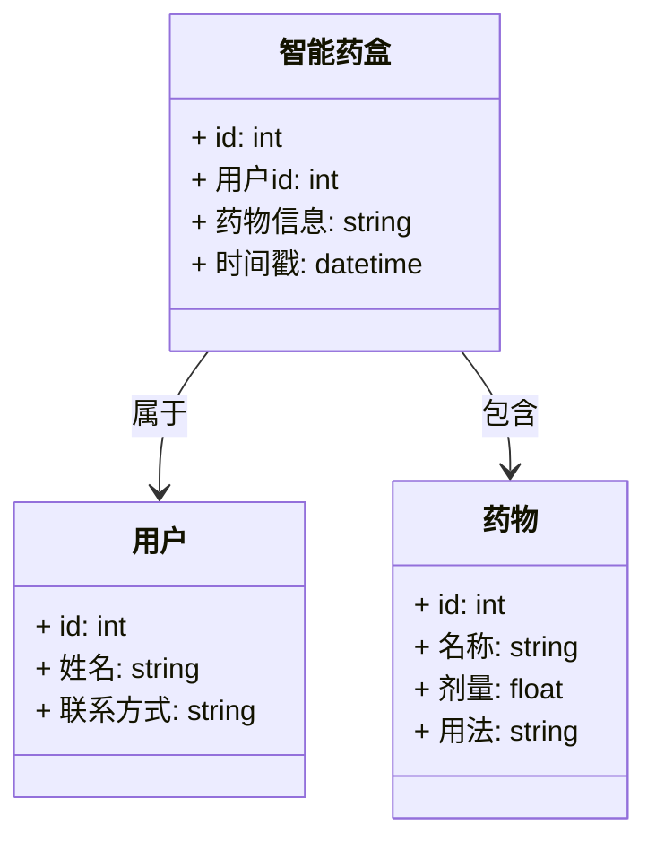

                 


# 智能药盒：AI Agent的用药安全监督助手

> 关键词：AI Agent, 智能药盒, 用药安全, 医疗健康, 监督系统, 人工智能

> 摘要：本文深入探讨了智能药盒的概念、核心原理、算法实现、系统架构以及实际应用，详细分析了AI Agent在用药安全监督中的重要作用，为医疗健康领域的技术开发者和研究人员提供了有价值的参考。

---

## 第一部分：背景介绍

### 第1章：智能药盒与AI Agent的背景

#### 1.1 问题背景与描述

用药安全是医疗健康领域的重要问题之一。据统计，全球每年因用药不当导致的医疗事故数量庞大，尤其是在老年人和慢性病患者群体中，用药依从性差的问题尤为突出。传统药盒仅能提供简单的提醒功能，无法实现对用药行为的实时监督和智能优化。

智能药盒作为一种新兴的医疗设备，结合了物联网技术和人工智能算法，能够实时监测用户的用药行为，并通过AI Agent提供个性化的用药建议和监督服务。AI Agent（人工智能代理）是一种能够感知环境、自主决策并执行任务的智能系统，其在智能药盒中的应用为用药安全提供了新的解决方案。

#### 1.2 问题解决与边界

智能药盒通过AI Agent的核心算法，能够解决以下问题：

1. **用药提醒**：通过定时提醒功能，确保患者按时用药。
2. **用药记录**：记录患者的用药数据，包括剂量、时间等信息。
3. **异常检测**：通过AI算法分析用药数据，发现潜在的用药异常行为。
4. **个性化建议**：根据患者的用药习惯和健康数据，提供个性化的用药建议。

系统的边界包括：

- **数据范围**：仅涉及患者的用药数据和健康数据，不涉及其他医疗信息。
- **功能范围**：专注于用药监督和提醒，不涉及药物配送或其他医疗行为。
- **用户范围**：主要面向慢性病患者和老年人群体。

### 1.3 智能药盒的核心要素与概念结构

智能药盒的核心要素包括：

1. **硬件设备**：智能药盒的物理部分，包括药盒、传感器和通信模块。
2. **AI Agent**：负责数据处理、决策和交互的智能系统。
3. **用药数据**：患者的用药记录和相关健康数据。
4. **用户界面**：与患者交互的界面，包括手机APP或网页端。

---

## 第二部分：核心概念与联系

### 第2章：AI Agent与智能药盒的核心概念

#### 2.1 核心概念原理

AI Agent的核心原理是通过感知环境、分析数据、做出决策并执行任务。在智能药盒中，AI Agent主要负责以下任务：

1. **数据采集**：通过传感器采集患者的用药行为数据。
2. **数据分析**：利用机器学习算法分析用药数据，发现异常行为。
3. **决策与提醒**：根据分析结果，生成用药提醒或建议。

#### 2.2 属性特征对比

下表对比了传统药盒和智能药盒的核心属性特征：

| 特性               | 传统药盒         | 智能药盒         |
|--------------------|------------------|------------------|
| 功能               | 提醒用药时间     | 提醒用药时间+监督用药行为 |
| 技术实现           | 机械结构+简单电路 | 物联网+人工智能   |
| 数据处理能力       | 无               | 支持数据采集与分析 |
| 用户交互方式       | 单一提醒         | 多样化交互（APP、语音等） |

#### 2.3 ER实体关系图

下图展示了智能药盒的核心实体关系：

```mermaid
er
    entity 智能药盒 {
        id
        用户id
        药物信息
        时间戳
    }
    entity 用户 {
        id
        姓名
        联系方式
    }
    entity 药物 {
        id
        名称
        剂量
        用法
    }
    智能药盒 --> 用户: 属于
    智能药盒 --> 药物: 包含
```

---

## 第三部分：算法原理讲解

### 第3章：AI Agent的算法实现

#### 3.1 监督学习算法

监督学习是AI Agent的核心算法之一，主要用于预测患者的用药行为。以下是监督学习算法的流程：

1. **数据采集**：从智能药盒中获取患者的用药数据，包括用药时间、剂量、药品名称等。
2. **特征提取**：将数据转换为模型可识别的特征，例如时间特征、剂量特征等。
3. **模型训练**：使用历史数据训练模型，常用算法包括逻辑回归、支持向量机（SVM）和随机森林。
4. **预测与评估**：基于训练好的模型，预测患者的用药行为，并评估预测结果的准确性。

以下是监督学习算法的Python代码示例：

```python
from sklearn.linear_model import LogisticRegression
from sklearn.metrics import accuracy_score
import pandas as pd

# 加载数据集
data = pd.read_csv('drug_data.csv')

# 特征工程
X = data[['time', 'dose', 'drug']]
y = data['label']

# 模型训练
model = LogisticRegression()
model.fit(X, y)

# 预测与评估
y_pred = model.predict(X)
print("准确率：", accuracy_score(y, y_pred))
```

#### 3.2 强化学习算法

强化学习算法用于优化AI Agent的决策过程，以下是一个强化学习算法的流程：

1. **状态定义**：定义状态空间，例如患者的用药记录、健康状况等。
2. **动作选择**：根据当前状态，选择最优的用药提醒策略。
3. **奖励机制**：根据患者的用药行为，给予奖励或惩罚。
4. **策略优化**：通过不断试错，优化策略，提高用药监督的准确性。

以下是强化学习算法的Python代码示例：

```python
import numpy as np
from collections import deque

# 状态空间和动作空间
state_space = 10
action_space = 5

# 初始化参数
learning_rate = 0.01
gamma = 0.99

# 策略网络
policy_network = ...
```

---

## 第四部分：系统分析与架构设计

### 第4章：系统分析与架构设计

#### 4.1 问题场景介绍

智能药盒的使用场景包括：

1. **家庭场景**：慢性病患者在家中使用智能药盒进行自我用药管理。
2. **医疗机构**：医生通过智能药盒获取患者的用药数据，进行远程监控。
3. **健康管理平台**：整合患者的用药数据和健康数据，提供个性化的健康管理服务。

#### 4.2 系统功能设计

以下是智能药盒的系统功能设计：



#### 4.3 系统架构设计

以下是智能药盒的系统架构图：


---

## 第五部分：项目实战

### 第5章：智能药盒的实现与案例分析

#### 5.1 环境安装

安装必要的开发环境和库：

```bash
pip install numpy scikit-learn matplotlib
```

#### 5.2 核心功能实现

以下是智能药盒的核心功能实现代码：

```python
import pandas as pd
from sklearn.linear_model import LogisticRegression
from sklearn.metrics import accuracy_score

# 加载数据集
data = pd.read_csv('drug_data.csv')

# 特征工程
X = data[['time', 'dose', 'drug']]
y = data['label']

# 模型训练
model = LogisticRegression()
model.fit(X, y)

# 预测与评估
y_pred = model.predict(X)
print("准确率：", accuracy_score(y, y_pred))
```

#### 5.3 案例分析

以下是一个实际案例分析：

某慢性病患者长期服用降压药，通过智能药盒记录了患者的用药数据。AI Agent通过监督学习算法，发现患者在某些时间段用药剂量不足，及时发出提醒，避免了潜在的健康风险。

---

## 第六部分：最佳实践与总结

### 第6章：智能药盒的总结与展望

#### 6.1 小结

智能药盒通过AI Agent实现了用药行为的实时监督和智能优化，为医疗健康领域提供了新的解决方案。

#### 6.2 注意事项

- 数据隐私保护：智能药盒涉及患者的敏感数据，需严格保护隐私。
- 系统稳定性：确保AI Agent的算法稳定性和可靠性。
- 用户体验：优化交互设计，提升用户体验。

#### 6.3 拓展阅读

- 《强化学习实战》
- 《机器学习在医疗健康中的应用》

---

## 作者信息

作者：AI天才研究院/AI Genius Institute & 禅与计算机程序设计艺术 /Zen And The Art of Computer Programming

