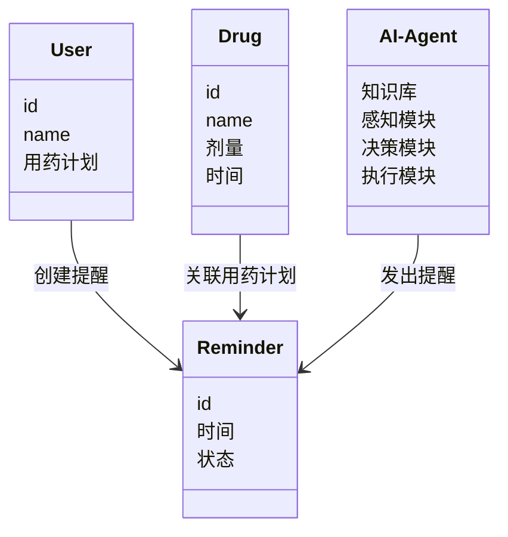
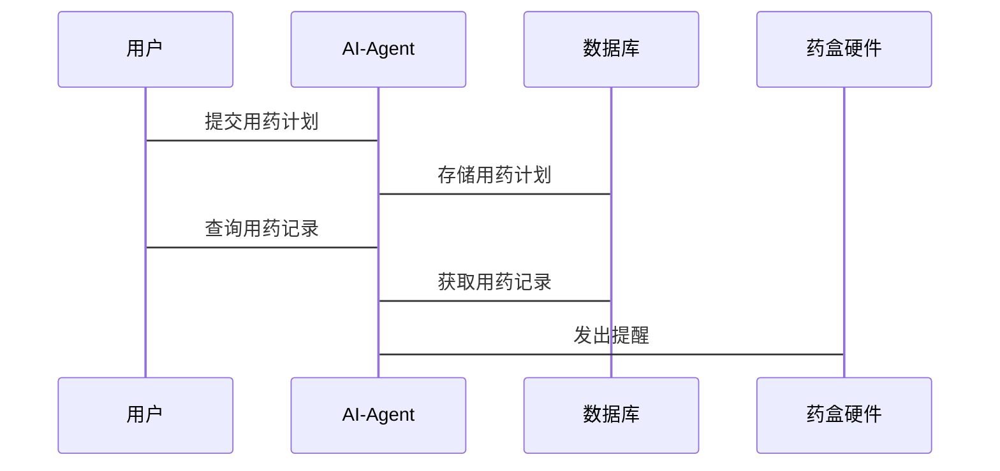

                 


# 智能药盒：AI Agent的用药提醒与管理系统

> 关键词：智能药盒、AI Agent、用药提醒、医疗健康管理、智能系统设计

> 摘要：本文将详细探讨智能药盒的设计与实现，重点分析AI Agent在用药提醒与管理系统中的应用。通过系统化的背景介绍、核心概念阐述、算法原理解析、系统架构设计以及项目实战案例，全面揭示智能药盒的技术本质和实际应用价值。

---

# 第一部分: 智能药盒的背景与核心概念

## 第1章: 智能药盒的定义与问题背景

### 1.1 智能药盒的定义
#### 1.1.1 药盒的演变历程
从传统药盒到智能药盒的演变过程，包括机械药盒、电子药盒到AI驱动的智能药盒。

#### 1.1.2 智能药盒的核心功能
- 药物存储与分类管理
- 自动用药提醒
- 数据记录与分析
- AI辅助决策

#### 1.1.3 智能药盒的市场现状
- 当前市场的主要产品分析
- 用户需求的多样化趋势

### 1.2 用药提醒与管理的痛点
#### 1.2.1 传统药盒的局限性
- 无法提醒按时用药
- 无法记录用药数据
- 无法提供用药建议

#### 1.2.2 现代用户对用药管理的需求
- 提醒功能智能化
- 数据管理便捷化
- AI辅助决策

#### 1.2.3 智能药盒解决的核心问题
- 提高用药依从性
- 优化用药管理效率
- 提供个性化用药建议

### 1.3 AI Agent的基本概念
#### 1.3.1 人工智能代理的定义
- AI Agent的定义与特征
- AI Agent的核心能力：感知、决策、执行

#### 1.3.2 AI Agent在药盒中的应用
- 作为智能药盒的核心驱动
- 与药物管理系统的协同工作

#### 1.3.3 AI Agent在医疗领域的应用潜力
- 用药提醒
- 疾病监测
- 健康管理

## 第2章: AI Agent与智能药盒的结合

### 2.1 AI Agent的核心原理
#### 2.1.1 代理的基本结构
- 知识库：存储用药规则、用户数据
- 感知模块：获取用户行为、环境数据
- 决策模块：基于数据做出提醒决策
- 执行模块：通过药盒硬件执行提醒操作

#### 2.1.2 代理的感知与决策机制
- 多模态感知：结合时间、地点、用户状态
- 基于规则的决策：优先级排序、条件判断
- 基于数据的决策：历史数据、实时数据

### 2.2 智能药盒的系统架构
#### 2.2.1 系统的功能模块划分
- 用户管理模块
- 用药提醒模块
- 数据分析模块
- AI决策模块

#### 2.2.2 各模块之间的关系
- 用户管理模块与用药提醒模块的数据交互
- 数据分析模块对AI决策模块的支持
- AI决策模块对用药提醒模块的控制

#### 2.2.3 系统的边界与外延
- 系统的核心功能边界
- 与外部系统的接口：智能药盒与其他健康设备的联动

### 2.3 智能药盒的核心要素
#### 2.3.1 用户需求分析
- 用户的基本需求：提醒功能、数据记录
- 用户的高级需求：个性化建议、健康报告

#### 2.3.2 药物信息管理系统
- 药物的基本信息管理
- 用药计划的制定与执行

#### 2.3.3 AI Agent的决策逻辑
- 基于规则的决策：固定条件触发提醒
- 基于数据的决策：动态调整提醒策略
- 基于反馈的优化：用户行为反馈优化决策

## 第3章: 智能药盒的数学模型与算法原理

### 3.1 AI Agent的算法基础
#### 3.1.1 监督学习算法
- 分类算法：用于识别用户的用药状态
- 回归算法：用于预测用户的用药时间

#### 3.1.2 强化学习算法
- Q-Learning：用于优化提醒策略
- Deep Q-Network：用于复杂环境下的决策

#### 3.1.3 生成对抗网络
- GAN在用药计划生成中的应用

### 3.2 用药提醒的数学模型
#### 3.2.1 时间序列分析模型
- ARIMA：用于预测用户的用药时间
- LSTM：用于处理连续时间序列数据

#### 3.2.2 基于规则的提醒算法
- 规则优先级排序
- 条件判断逻辑

#### 3.2.3 基于概率的提醒优化
- 贝叶斯网络：用于计算提醒策略的有效性
- 马尔可夫链：用于建模用户的用药行为

### 3.3 算法实现的数学公式
#### 3.3.1 分类问题的数学模型
$$ P(y|x) = \frac{P(x|y)P(y)}{P(x)} $$

#### 3.3.2 回归问题的数学模型
$$ y = \beta_0 + \beta_1x + \epsilon $$

---

# 第四部分: 智能药盒的系统分析与架构设计

## 第4章: 智能药盒的系统分析与架构设计

### 4.1 问题场景介绍
#### 4.1.1 用户需求分析
- 用户的基本需求：按时用药提醒
- 用户的高级需求：个性化用药建议

#### 4.1.2 系统目标设定
- 提供智能提醒服务
- 实现用药数据的智能化管理
- 提供AI辅助的用药建议

### 4.2 系统功能设计
#### 4.2.1 领域模型（Mermaid 类图）


#### 4.2.2 系统架构设计（Mermaid 架构图）


#### 4.2.3 系统接口设计
- 用户端接口：设置用药计划、查看用药记录
- 服务器端接口：处理提醒请求、存储数据
- AI-Agent接口：接收数据、做出决策

#### 4.2.4 系统交互设计（Mermaid 序列图）


## 第5章: 智能药盒的项目实战

### 5.1 环境安装与配置
#### 5.1.1 开发环境配置
- Python 3.8+
- PyTorch 1.9+
- Flask 2.0+

#### 5.1.2 依赖安装
```bash
pip install flask torch numpy
```

### 5.2 系统核心实现
#### 5.2.1 AI-Agent的实现
- 使用PyTorch实现一个简单的分类模型
- 模型训练代码示例：
```python
import torch
from torch import nn

# 定义模型
class AI-Agent(nn.Module):
    def __init__(self):
        super().__init__()
        self.fc1 = nn.Linear(2, 4)
        self.fc2 = nn.Linear(4, 1)
    
    def forward(self, x):
        x = torch.relu(self.fc1(x))
        x = torch.sigmoid(self.fc2(x))
        return x

# 训练数据
X = torch.tensor([[1, 0], [0, 1], [1, 1]], dtype=torch.float32)
y = torch.tensor([0, 1, 1], dtype=torch.float32)

# 训练模型
model = AI-Agent()
criterion = nn.BCELoss()
optimizer = torch.optim.Adam(model.parameters(), lr=0.01)

for epoch in range(100):
    outputs = model(X)
    loss = criterion(outputs, y)
    loss.backward()
    optimizer.step()
    print(f"Epoch {epoch}, Loss: {loss.item()}")
```

#### 5.2.2 用药提醒模块的实现
- 使用Flask实现API接口
- 提醒服务代码示例：
```python
from flask import Flask
import time

app = Flask(__name__)

@app.route('/reminder', methods=['POST'])
def set_reminder():
    data = request.get_json()
    # 提取用药时间
    time = data['time']
    # 设置提醒
    scheduleReminder(time)
    return jsonify({'status': 'success'})

if __name__ == '__main__':
    app.run(debug=True)
```

### 5.3 案例分析与实现解读
#### 5.3.1 案例分析
- 案例背景：糖尿病患者用药提醒
- 案例实现：基于AI-Agent的个性化提醒

#### 5.3.2 代码实现与解读
- 系统核心代码实现
- 系统功能的实现细节

### 5.4 项目总结
- 项目实现的关键点
- 项目中存在的问题与解决方案
- 项目的未来优化方向

## 第6章: 总结与展望

### 6.1 总结
- 智能药盒的核心功能总结
- AI-Agent在系统中的作用总结
- 项目实现的成果总结

### 6.2 展望
- 智能药盒的未来发展
- AI-Agent在医疗领域的更多应用
- 技术的持续优化与创新

---

## 第7章: 最佳实践与注意事项

### 7.1 最佳实践
- 系统设计中的注意事项
- 开发中的常见问题及解决方案
- 系统维护与更新建议

### 7.2 小结
- 系统设计的核心原则
- 项目开发的关键点
- 系统应用的未来方向

---

## 第8章: 附录

### 8.1 附录A: 术语解释
- AI Agent
- 时间序列分析
- 生成对抗网络

### 8.2 附录B: 相关技术资料
- AI-Agent的参考文献
- 用药提醒系统的参考资料

---

## 作者：AI天才研究院/AI Genius Institute & 禅与计算机程序设计艺术 /Zen And The Art of Computer Programming

---

通过以上目录结构，我们能够系统地了解智能药盒的设计与实现，从背景到核心概念，从算法原理到系统架构，从项目实战到总结展望，全面覆盖智能药盒的各个方面。

