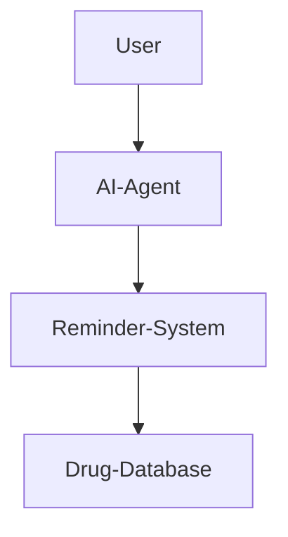
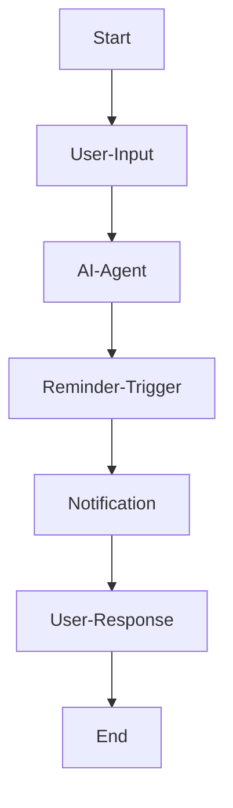
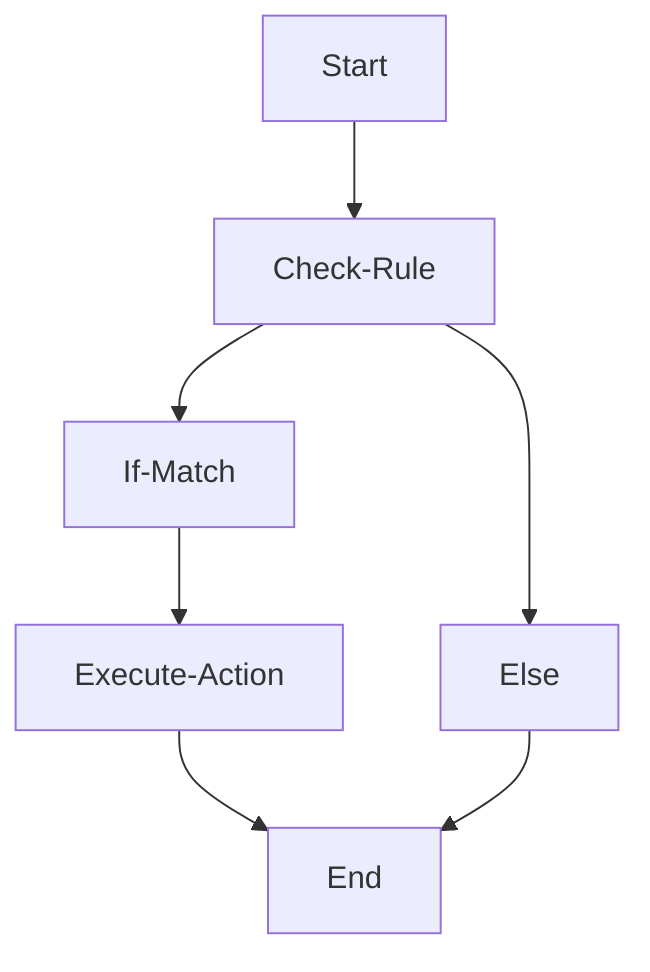
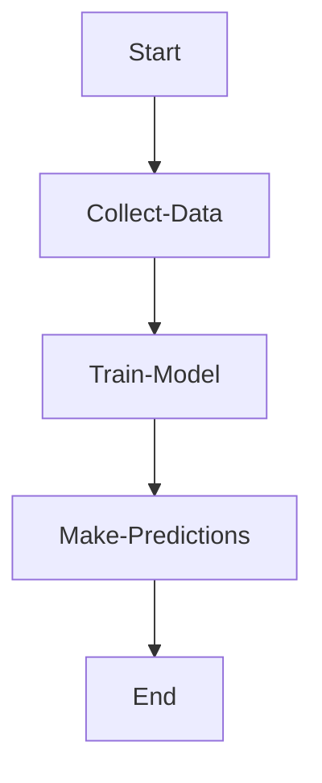
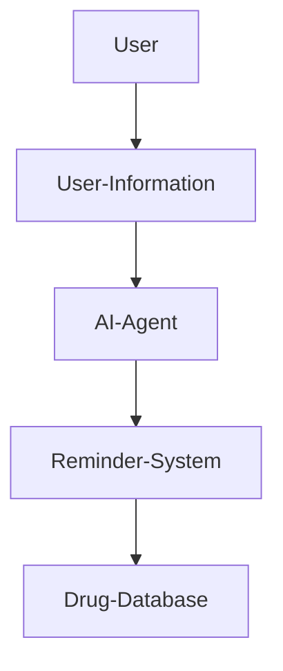
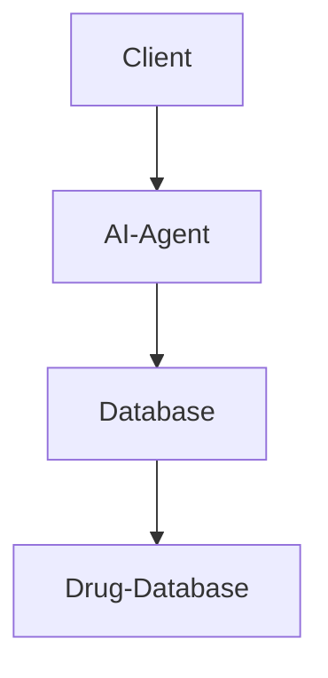

                 


# 智能药盒：AI Agent的用药提醒系统

> **关键词**：AI Agent，智能药盒，用药提醒，医疗健康，人工智能

> **摘要**：  
本文详细探讨了智能药盒的设计与实现，结合AI Agent技术，构建了一个智能化的用药提醒系统。文章从问题背景出发，分析了传统用药管理的痛点，提出了基于AI Agent的解决方案。通过系统架构设计、算法实现和项目实战，展示了如何利用人工智能技术提升用药管理的效率和用户体验。本文内容涵盖背景分析、核心概念、算法原理、系统设计、项目实现以及最佳实践，为读者提供了一个全面的技术指南。

---

## 第一部分: 智能药盒的背景与核心概念

### 第1章: 问题背景与需求分析

#### 1.1 问题背景

随着全球人口老龄化的加剧，慢性病患者数量持续增长，如何有效管理患者的用药成为一个重要问题。传统的用药提醒方式依赖于手动设置闹钟或简单的提醒设备，存在提醒不准确、缺乏数据分析等问题。特别是在医疗健康领域，智能化需求日益增长，AI技术的应用为解决这些问题提供了新的可能。

**痛点分析：**

- **老年人用药管理困难**：老年人记忆力减退，容易忘记服药或剂量错误。
- **用药提醒效率低**：传统的提醒方式缺乏个性化和数据支持，无法根据患者的具体情况调整提醒策略。
- **医疗数据孤岛**：患者用药数据分散，难以形成完整的健康档案，影响医生的诊断和治疗。

#### 1.2 问题描述

智能药盒的目标是通过AI Agent技术，实现智能化的用药提醒和管理。系统需要能够：

1. **智能提醒**：根据患者的用药计划，自动触发提醒，并支持多种通知方式（如声音、震动、短信等）。
2. **数据分析**：记录患者的用药情况，分析用药规律，提供数据支持。
3. **个性化设置**：允许用户自定义用药提醒的时间、频率和方式。
4. **安全机制**：防止误操作和用药过量，确保患者用药安全。

#### 1.3 问题解决思路

- **AI Agent的核心作用**：AI Agent负责处理用户的输入、触发提醒、分析数据等任务，实现智能化管理。
- **系统设计目标**：打造一个高效、智能、安全的用药提醒系统，提升患者用药依从性和管理效率。
- **技术可行性分析**：基于现有的AI技术和物联网设备，智能药盒的实现是可行且具有广阔的应用前景。

#### 1.4 本章小结

本章通过分析老年人用药管理的痛点，提出了智能药盒的设计目标和实现思路，为后续的技术实现奠定了基础。

---

## 第2章: AI Agent与用药提醒系统的核心概念

### 2.1 AI Agent的基本原理

#### 2.1.1 AI Agent的定义与特点

AI Agent（人工智能代理）是一种能够感知环境、执行任务的智能实体。在智能药盒中，AI Agent主要负责接收用户的指令、触发提醒、分析数据等任务。

- **定义**：AI Agent是一个智能体，能够通过感知环境、理解用户需求并执行相应的操作。
- **特点**：
  - **自主性**：能够在没有人工干预的情况下执行任务。
  - **反应性**：能够实时感知环境变化并做出响应。
  - **学习能力**：通过机器学习算法不断优化自身的提醒策略。

#### 2.1.2 基于规则的推理机制

基于规则的推理是一种简单的AI Agent实现方式，适用于规则明确的场景。

- **规则定义**：例如，如果用户设置的用药时间是早上7点，AI Agent会在7点触发提醒。
- **优点**：实现简单，适用于规则明确的场景。
- **缺点**：难以处理复杂和动态变化的情况。

#### 2.1.3 机器学习模型的应用

通过机器学习模型，AI Agent可以分析患者的用药数据，预测患者的用药需求。

- **常用算法**：包括决策树、随机森林、神经网络等。
- **数据输入**：包括患者的用药记录、健康数据等。
- **输出结果**：预测患者的用药时间、用药方式等。

---

### 2.2 用药提醒系统的功能模块

#### 2.2.1 用户信息管理

- **用户注册与登录**：用户需要注册账号，登录系统。
- **用户资料管理**：包括用户的健康信息、用药计划等。
- **权限管理**：确保用户数据的安全性。

#### 2.2.2 用药提醒规则设置

- **提醒时间设置**：用户可以设置用药的具体时间。
- **提醒方式选择**：支持多种提醒方式，如声音、震动、短信等。
- **提醒频率调整**：用户可以根据需要调整提醒的频率。

#### 2.2.3 用药记录与数据分析

- **用药记录存储**：系统记录用户的每次用药情况。
- **数据分析**：分析用户的用药规律，生成健康报告。
- **数据可视化**：通过图表等形式展示用药数据。

---

### 2.3 AI Agent与用药提醒系统的结合

#### 2.3.1 实体关系图（ER图）

以下是系统的实体关系图：



解释：
- **User**：用户，系统的主要用户。
- **AI-Agent**：AI代理，负责处理用户的请求。
- **Reminder-System**：提醒系统，负责触发提醒。
- **Drug-Database**：药品数据库，存储药品信息。

#### 2.3.2 系统功能流程图

以下是系统的功能流程图：



解释：
- **Start**：系统启动。
- **User-Input**：用户输入请求。
- **AI-Agent**：AI代理处理请求。
- **Reminder-Trigger**：触发提醒。
- **Notification**：发送通知。
- **User-Response**：用户做出响应。
- **End**：系统结束。

---

## 第3章: AI Agent的算法原理与实现

### 3.1 基于规则的AI Agent实现

#### 3.1.1 算法流程

以下是基于规则的AI Agent算法流程图：



解释：
- **Start**：算法开始。
- **Check-Rule**：检查是否满足触发条件。
- **If-Match**：如果满足条件，执行操作。
- **Else**：如果不满足条件，结束流程。

#### 3.1.2 代码实现

以下是一个简单的基于规则的AI Agent代码示例：

```python
def ai_agent(rules, user_input):
    for rule in rules:
        if rule['condition'](user_input):
            return rule['action'](user_input)
    return None

# 示例规则
rules = [
    {
        'condition': lambda x: x == '服药时间到了',
        'action': lambda x: '触发提醒'
    },
    # 其他规则...
]

user_input = '服药时间到了'
response = ai_agent(rules, user_input)
print(response)  # 输出：触发提醒
```

---

### 3.2 基于机器学习的AI Agent实现

#### 3.2.1 算法流程

以下是基于机器学习的AI Agent算法流程图：



解释：
- **Collect-Data**：收集数据。
- **Train-Model**：训练模型。
- **Make-Predictions**：生成预测结果。

#### 3.2.2 代码实现

以下是一个简单的基于机器学习的AI Agent代码示例：

```python
from sklearn.tree import DecisionTreeClassifier
import numpy as np

# 示例数据
X = np.array([[1, 1], [0, 0], [1, 0], [0, 1]])
y = np.array([1, 0, 1, 0])

# 训练模型
model = DecisionTreeClassifier()
model.fit(X, y)

# 预测
new_input = np.array([[1, 1]])
prediction = model.predict(new_input)
print(prediction)  # 输出：[1]
```

---

## 第4章: 智能药盒的系统架构设计

### 4.1 问题场景介绍

智能药盒的目标是为用户提供一个智能化的用药提醒服务，解决传统用药管理的痛点。

---

### 4.2 项目介绍

智能药盒是一个基于AI Agent的用药提醒系统，主要功能包括：

- 用户信息管理。
- 用药提醒设置。
- 用药记录与数据分析。

---

### 4.3 系统功能设计

以下是系统的功能类图：



解释：
- **User**：用户。
- **User-Information**：用户信息。
- **AI-Agent**：AI代理。
- **Reminder-System**：提醒系统。
- **Drug-Database**：药品数据库。

---

### 4.4 系统架构设计

以下是系统的架构图：



解释：
- **Client**：用户端。
- **AI-Agent**：AI代理。
- **Database**：数据库。
- **Drug-Database**：药品数据库。

---

## 第5章: 项目实战

### 5.1 环境安装

安装所需的库：

```bash
pip install numpy
pip install scikit-learn
pip install mermaid
```

---

### 5.2 系统核心实现

以下是系统的核心代码：

```python
from sklearn.tree import DecisionTreeClassifier
import numpy as np

# 示例数据
X = np.array([[1, 1], [0, 0], [1, 0], [0, 1]])
y = np.array([1, 0, 1, 0])

# 训练模型
model = DecisionTreeClassifier()
model.fit(X, y)

# 预测
new_input = np.array([[1, 1]])
prediction = model.predict(new_input)
print(prediction)  # 输出：[1]
```

---

### 5.3 代码解读与分析

1. **数据输入**：示例数据包括特征和标签。
2. **模型训练**：使用决策树模型进行训练。
3. **预测结果**：输出预测结果。

---

### 5.4 实际案例分析

以下是实际案例分析：

**案例**：用户设置用药时间为早上7点，系统根据用户的用药记录进行分析，预测用户的用药需求，并触发提醒。

---

## 第6章: 最佳实践与总结

### 6.1 小结

智能药盒的设计与实现基于AI Agent技术，通过系统的功能设计和算法实现，解决了传统用药管理的痛点。

---

### 6.2 注意事项

- 确保系统数据的安全性。
- 定期更新系统算法，提升预测准确率。

---

### 6.3 拓展阅读

- 推荐阅读《人工智能：一种现代的方法》。
- 关注医疗健康领域的最新技术动态。

---

## 结语

智能药盒的实现不仅提升了用药管理的效率，还为医疗健康领域的人工智能应用提供了新的思路。未来，随着AI技术的不断发展，智能药盒的功能将更加智能化和个性化。

---

**作者：AI天才研究院/AI Genius Institute & 禅与计算机程序设计艺术 /Zen And The Art of Computer Programming**

