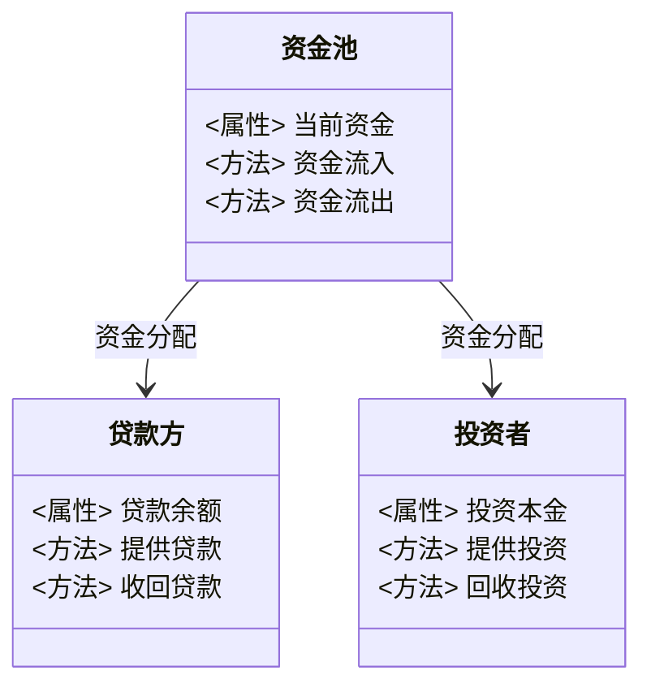
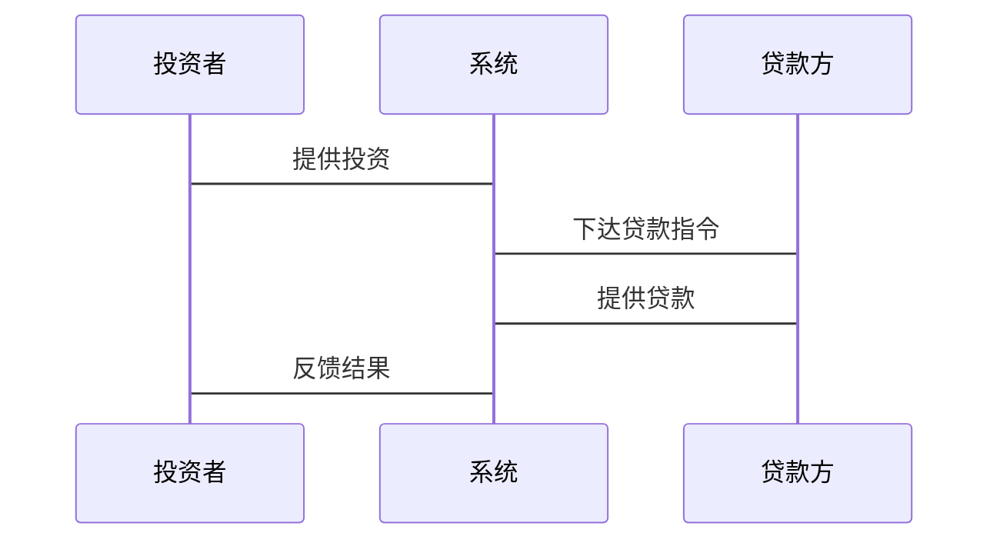

                 


# 智能营运资本管理优化系统

## 关键词
- 智能资本管理
- 营运资本优化
- 人工智能
- 算法优化
- 系统架构

## 摘要
本文深入探讨智能营运资本管理优化系统的构建与应用，结合人工智能技术，分析系统优化的核心算法、架构设计和实际案例。通过背景介绍、核心概念、算法原理、系统架构、项目实战和总结展望，全面解析智能资本管理的创新与实践，为企业资本优化提供新的思路和解决方案。

---

# 第1章 智能营运资本管理优化系统背景

## 1.1 营运资本管理的基本概念

### 1.1.1 营运资本的定义与组成
营运资本是企业在日常运营中用于支持正常业务活动的资金，主要包括现金、应收账款、存货和应付账款等。这些资产的管理和优化直接影响企业的流动性和盈利能力。

### 1.1.2 营运资本管理的目标与意义
- **目标**：提高资金使用效率，降低资金成本，增强企业流动性。
- **意义**：优化营运资本管理可以提升企业的财务健康度，增强市场竞争力。

### 1.1.3 营运资本管理的常见挑战
- 数据分散：企业各部门数据孤岛问题严重，难以统一管理。
- 预测难度：市场需求波动和供应链不确定性增加了预测的难度。
- 决策滞后：传统管理方式依赖人工分析，决策周期长，难以及时响应。

## 1.2 智能化管理的必要性

### 1.2.1 传统营运资本管理的局限性
- 依赖人工经验，主观性强，难以量化。
- 数据分析能力有限，无法支持实时决策。
- 缺乏动态优化能力，难以应对复杂市场环境。

### 1.2.2 智能化管理的优势与价值
- **数据驱动**：通过大数据分析，实现精准预测和决策。
- **实时监控**：利用AI技术实时跟踪资本流动，快速响应变化。
- **动态优化**：基于实时数据，自动调整资本分配策略。

### 1.2.3 数字化转型对企业资本管理的影响
- 提高管理效率，降低成本。
- 增强数据洞察能力，支持科学决策。
- 促进业务创新，提升企业竞争力。

## 1.3 优化系统的提出

### 1.3.1 系统优化的目标
- 实现资本管理的智能化、自动化。
- 提高资本使用效率，降低管理成本。
- 支持企业实时决策，增强市场应对能力。

### 1.3.2 系统优化的核心问题
- 如何构建高效的数据采集与分析系统？
- 如何设计智能优化算法？
- 如何实现系统与业务流程的无缝集成？

### 1.3.3 系统优化的边界与外延
- **边界**：聚焦于企业内部资本管理，不涉及外部资本市场。
- **外延**：未来可能扩展到供应链金融、风险管理等领域。

## 1.4 本章小结
本章从营运资本管理的基本概念出发，分析了传统管理的局限性，提出了智能优化系统的必要性，并明确了系统的优化目标和核心问题。

---

# 第2章 智能营运资本管理优化系统的核心概念

## 2.1 智能资本管理的定义与特点

### 2.1.1 智能资本管理的定义
智能资本管理是利用人工智能技术，通过数据驱动的方式，优化资本分配和管理流程，实现资本效率的最大化。

### 2.1.2 智能资本管理的核心特点
- **数据驱动**：基于实时数据进行决策。
- **智能优化**：利用AI算法自动调整资本分配策略。
- **实时监控**：支持资本流动的实时跟踪和预警。

### 2.1.3 智能资本管理与传统资本管理的对比

| 特性                | 传统资本管理         | 智能资本管理         |
|---------------------|----------------------|----------------------|
| 数据来源            | 离散数据，人工收集     | 结构化数据，实时采集   |
| 决策方式            | 人工判断，经验为主     | 数据分析，算法驱动     |
| 决策效率            | 低效，周期长           | 高效，实时响应         |

## 2.2 系统优化的关键要素

### 2.2.1 数据驱动的决策支持
- 数据采集：通过传感器、ERP系统等获取实时数据。
- 数据分析：利用大数据技术进行清洗、建模和分析。

### 2.2.2 AI算法在资本优化中的应用
- **预测分析**：利用机器学习预测资金需求和市场趋势。
- **优化算法**：如线性规划、遗传算法等，用于资源分配。

### 2.2.3 系统架构的设计原则
- **模块化设计**：各功能模块独立，便于维护和升级。
- **高可用性**：确保系统稳定运行，支持容灾备份。

## 2.3 核心概念的ER实体关系图

```mermaid
erDiagram
    actor 投资者 {
        <属性> 投资金额
        <属性> 投资时间
    }
    actor 贷款方 {
        <属性> 贷款金额
        <属性> 贷款期限
    }
    actor 企业 {
        <属性> 资产总额
        <属性> 负债总额
    }
    investor --> 资金池 : 提供资金
    loan --> 资金池 : 提供贷款
    资金池 --> 企业 : 提供营运资本
```

## 2.4 本章小结
本章详细介绍了智能资本管理的核心概念，分析了系统优化的关键要素，并通过ER图展示了系统的主要实体关系。

---

# 第3章 智能资本优化算法原理

## 3.1 算法原理概述

### 3.1.1 算法的基本思想
智能资本优化算法基于大数据分析和机器学习，通过构建数学模型，优化资本分配策略。

### 3.1.2 算法的输入与输出
- **输入**：历史财务数据、市场数据、业务数据。
- **输出**：资本分配建议、资金使用效率提升方案。

### 3.1.3 算法的优化目标
- 最大化资本使用效率。
- 最小化资本管理成本。
- 实现资本分配的动态优化。

## 3.2 算法实现流程

### 3.2.1 数据预处理
- 数据清洗：去除异常值和重复数据。
- 数据转换：将数据转换为适合建模的形式。

### 3.2.2 模型训练
- **特征选择**：筛选影响资本效率的关键特征。
- **模型训练**：使用机器学习算法（如随机森林、支持向量机）进行训练。

### 3.2.3 模型优化与调参
- 调整模型参数，优化模型性能。
- 使用交叉验证评估模型效果。

### 3.2.4 结果分析与反馈
- 分析模型输出，生成优化建议。
- 根据反馈调整模型，持续优化。

## 3.3 算法的数学模型与公式

### 3.3.1 线性规划模型
$$ \text{最大化} \quad c^T x $$
$$ \text{约束} \quad A x \leq b $$
$$ \quad x \geq 0 $$

### 3.3.2 支持向量机模型
$$ \text{最小化} \quad \frac{1}{2}||w||^2 + C \sum_{i=1}^{n} \xi_i $$
$$ \text{约束} \quad y_i (w \cdot x_i + b) \geq 1 - \xi_i $$
$$ \quad \xi_i \geq 0 $$

## 3.4 本章小结
本章详细讲解了智能资本优化算法的原理和实现流程，通过数学模型和公式展示了算法的核心思想。

---

# 第4章 智能营运资本管理优化系统的架构设计

## 4.1 系统功能设计

### 4.1.1 领域模型设计


### 4.1.2 系统架构设计


### 4.1.3 系统接口设计
- **API接口**：提供RESTful API，供其他系统调用。
- **数据接口**：与企业ERP系统对接，获取实时数据。

### 4.1.4 系统交互设计


## 4.2 系统优化策略

### 4.2.1 数据驱动的优化
- 利用历史数据预测未来资本需求。
- 基于实时数据调整资本分配策略。

### 4.2.2 AI算法的优化
- 使用强化学习优化资本分配策略。
- 基于自然语言处理技术分析市场新闻，影响资本分配决策。

## 4.3 本章小结
本章详细设计了智能营运资本管理优化系统的架构，包括功能设计、系统交互和优化策略。

---

# 第5章 智能营运资本管理优化系统项目实战

## 5.1 项目环境安装

### 5.1.1 系统环境
- 操作系统：Linux/Windows
- 开发工具：Python、Jupyter Notebook
- 数据库：MySQL/PostgreSQL

### 5.1.2 依赖库安装
```bash
pip install numpy pandas scikit-learn matplotlib flask
```

## 5.2 系统核心实现源代码

### 5.2.1 数据采集模块
```python
import pandas as pd
import requests

def fetch_data(api_key):
    url = f"http://api.example.com/financial_data?api_key={api_key}"
    response = requests.get(url)
    data = response.json()
    df = pd.DataFrame(data)
    return df
```

### 5.2.2 AI算法实现
```python
from sklearn.model

