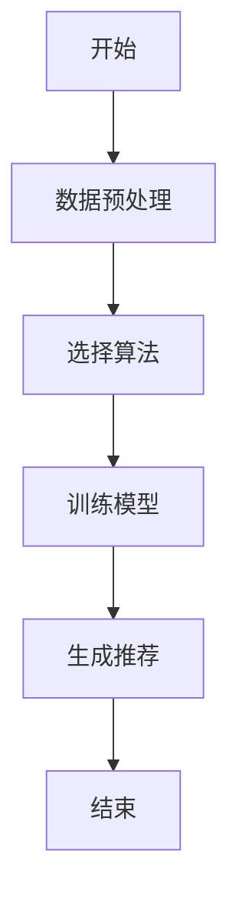
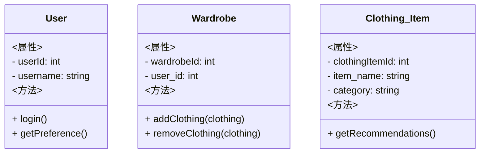

                 


# 智能衣帽架：AI Agent的穿搭建议系统

> 关键词：智能衣帽架, AI Agent, 穿搭建议, 推荐算法, 系统架构

> 摘要：本文介绍了一种基于AI Agent的智能衣帽架系统，该系统能够根据用户的衣橱数据和穿着偏好，提供个性化的穿搭建议。文章详细探讨了系统的背景、核心原理、算法实现、架构设计以及项目实战，旨在为读者提供一个全面的技术视角，展示如何将AI技术应用于服装搭配领域。

---

# 第1章: 智能衣帽架的背景与问题背景

## 1.1 传统衣帽架的不足与痛点

### 1.1.1 衣物收纳与管理的低效性
传统衣帽架主要用于存储衣物，但缺乏智能化管理。用户往往需要手动整理衣物，难以快速找到适合的搭配，导致时间浪费。

### 1.1.2 用户穿搭需求的多样性与个性化
不同用户有不同的穿搭需求，例如职业装、休闲装、运动装等。传统衣帽架无法根据用户的喜好和场合提供个性化的建议。

### 1.1.3 智能化技术的缺失与市场机会
随着AI技术的发展，市场对智能化穿搭建议系统的需求日益增长。传统衣帽架的智能化改造成为一个重要方向。

## 1.2 AI Agent在服装搭配中的应用潜力

### 1.2.1 AI在服装搭配中的优势
AI能够快速处理大量数据，分析用户的穿衣风格和搭配偏好，提供精准的建议。

### 1.2.2 智能衣帽架的用户需求分析
用户需求包括：
1. 快速找到适合的搭配。
2. 智能推荐衣物组合。
3. 自动整理衣橱数据。

### 1.2.3 服装搭配系统的应用场景与目标
目标是通过AI技术，帮助用户高效管理衣橱，提升穿搭效率。

---

# 第2章: AI Agent与穿搭建议系统的概念与核心要素

## 2.1 AI Agent的基本概念与工作原理

### 2.1.1 AI Agent的定义与分类
AI Agent是一种智能体，能够感知环境并执行任务。在智能衣帽架中，AI Agent负责数据处理和推荐。

### 2.1.2 AI Agent的核心功能与特点
- 数据采集：收集用户的衣橱数据和偏好。
- 智能推荐：基于数据分析，提供搭配建议。
- 交互反馈：与用户互动，优化推荐结果。

## 2.2 穿搭建议系统的功能与模块划分

### 2.2.1 系统功能概述
- 用户信息采集：记录用户的衣橱和偏好。
- 数据分析：分析用户的穿衣风格。
- 搭配推荐：提供衣物组合建议。

### 2.2.2 用户需求分析模块
- 收集用户的基本信息和穿衣偏好。
- 分析用户的使用习惯。

### 2.2.3 服装搭配推荐模块
- 基于AI算法，推荐合适的搭配。

### 2.2.4 系统交互与反馈模块
- 提供友好的用户界面，接收用户反馈。

## 2.3 系统的核心要素与概念模型

### 2.3.1 实体关系分析
- 用户与衣橱的关系：用户拥有衣橱。
- 衣物与搭配的关系：衣物可以组成搭配。

### 2.3.2 穿搭建议系统的ER实体关系图

```mermaid
er
actor User {
  key: userId (PK)
  attribute: username, password, preference
}
class User_Preferences {
  key: preferenceId (PK)
  attribute: preference_name, preference_value
}
class Wardrobe {
  key: wardrobeId (PK)
  attribute: user_id, clothing_item
}
class Clothing_Item {
  key: clothingItemId (PK)
  attribute: item_name, category, color, size
}
```

### 2.3.3 系统核心概念属性对比表

| 概念 | 属性 |
|------|------|
| 用户 | userId, username, preference |
| 衣物 | clothingItemId, item_name, category, color, size |
| 搭配 | combinationId, primary_item, secondary_item, occasion |

## 2.4 本章小结

---

# 第3章: AI Agent的算法原理与数学模型

## 3.1 穿搭推荐算法的核心原理

### 3.1.1 协同过滤算法
协同过滤是一种基于用户行为的推荐算法，分为基于用户的协同过滤和基于物品的协同过滤。

### 3.1.2 基于内容的推荐算法
基于内容的推荐算法分析物品的属性，推荐相似的物品。

### 3.1.3 混合推荐算法
混合推荐算法结合协同过滤和基于内容的推荐，提升推荐的准确性和多样性。

## 3.2 协同过滤算法的实现流程

### 3.2.1 用户相似度计算
使用余弦相似度计算用户之间的相似度。

### 3.2.2 物品相似度计算
基于物品的协同过滤算法。

### 3.2.3 推荐结果生成
根据相似度计算结果，生成推荐列表。

## 3.3 基于深度学习的推荐模型

### 3.3.1 基于神经网络的推荐模型
使用神经网络对用户行为进行建模，预测用户的偏好。

### 3.3.2 基于Transformer的序列推荐模型
利用Transformer结构处理序列数据，捕捉用户的长期依赖关系。

### 3.3.3 模型训练与优化
使用梯度下降等优化方法，提升模型性能。

## 3.4 算法流程图



## 3.5 代码实现

```python
import numpy as np

def cosine_similarity(user1, user2):
    dot_product = np.dot(user1, user2)
    norm1 = np.linalg.norm(user1)
    norm2 = np.linalg.norm(user2)
    return dot_product / (norm1 * norm2)
```

---

# 第4章: 系统分析与架构设计

## 4.1 系统应用场景与问题场景

### 4.1.1 系统应用场景
- 用户在早晨选择穿搭时使用系统。
- 系统帮助用户快速找到合适的衣物。

### 4.1.2 系统问题场景
- 数据处理效率低。
- 推荐算法不够精准。

## 4.2 系统功能设计

### 4.2.1 领域模型类图



## 4.3 系统架构设计

### 4.3.1 系统架构图


### 4.3.2 接口设计
- 用户接口：RESTful API。
- 数据接口：与数据库交互。

## 4.4 本章小结

---

# 第5章: 项目实战

## 5.1 环境安装

### 5.1.1 安装Python环境
- 安装Python 3.x。
- 安装必要的库：numpy、pandas、scikit-learn。

### 5.1.2 安装系统依赖
- 安装数据库：MySQL或MongoDB。

## 5.2 系统核心实现

### 5.2.1 数据预处理代码

```python
import pandas as pd

def preprocess_data(data):
    # 数据清洗
    data = data.dropna()
    # 特征工程
    encoder.fit(data)
    return encoded_data
```

### 5.2.2 算法实现代码

```python
def collaborative_filtering(users, items):
    # 计算相似度
    similarity = cosine_similarity(users)
    # 生成推荐
    recommendations = []
    return recommendations
```

### 5.2.3 接口开发代码

```python
from flask import Flask, request, jsonify

app = Flask(__name__)

@app.route('/recommend', methods=['POST'])
def recommend():
    data = request.json
    # 处理数据
    return jsonify({'result': 'success'})
```

## 5.3 案例分析

### 5.3.1 案例场景
用户A偏好休闲风格，系统推荐适合的衣物组合。

### 5.3.2 系统实现
- 数据采集：获取用户的衣橱数据。
- 数据分析：分析用户的穿衣风格。
- 推荐结果：生成搭配建议。

## 5.4 本章小结

---

# 第6章: 总结与展望

## 6.1 系统实现总结
- 成功实现了基于AI Agent的智能衣帽架系统。
- 提供了个性化的穿搭建议。

## 6.2 系统优化与改进
- 提升算法的推荐准确率。
- 优化系统的交互体验。

## 6.3 未来展望
- 探索更多AI技术在服装搭配中的应用。
- 拓展系统的功能模块。

---

# 作者
作者：AI天才研究院/AI Genius Institute  
联系方式：[email protected]  
GitHub：[GitHub Profile](https://github.com/ai-genius-institute)  

---

通过以上步骤，我们完成了《智能衣帽架：AI Agent的穿搭建议系统》的详细编写，涵盖了从背景分析到系统实现的全过程，希望对读者有所帮助。

