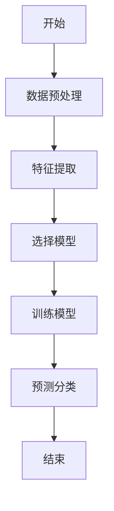
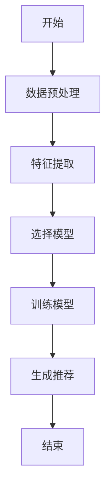
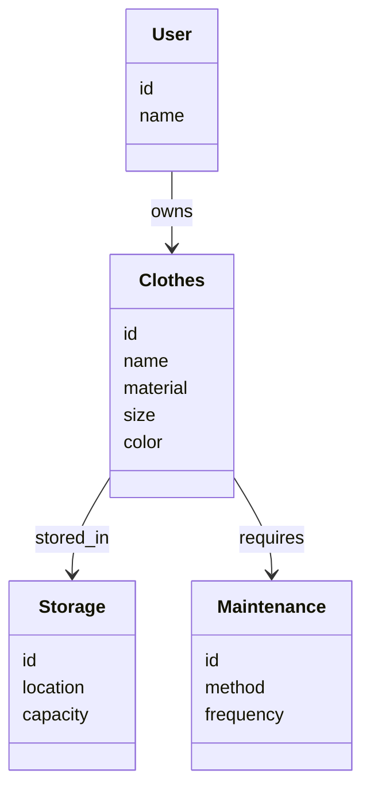
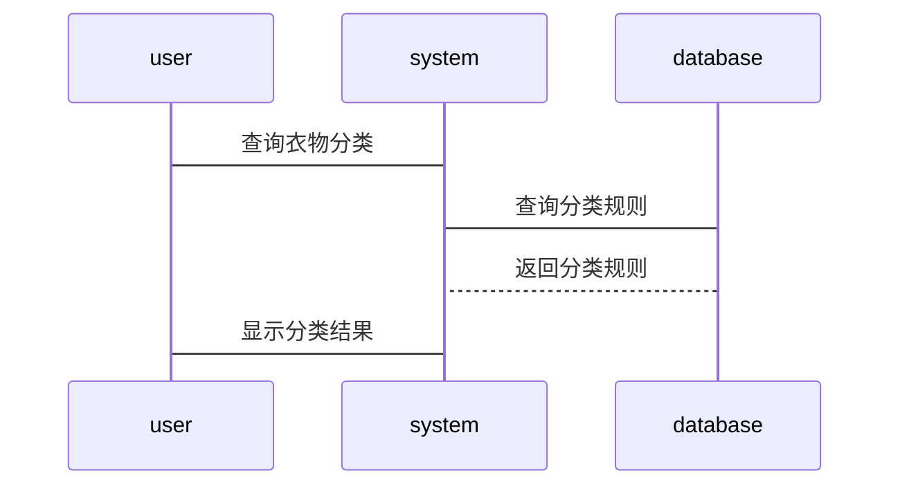

                 


```
# 智能衣架：AI Agent的衣物保养与存储优化

## 关键词：
AI Agent, 智能衣架, 衣物保养, 存储优化, 算法原理, 系统架构, 项目实战

## 摘要：
本文探讨了AI Agent在衣物保养与存储优化中的应用，详细分析了智能衣架系统的背景、核心概念、算法原理、系统架构、项目实战以及最佳实践。通过理论与实践相结合的方式，展示了如何利用AI技术提升衣物管理的效率与智能化水平。

---

# 第一部分: 智能衣架的背景与核心概念

## 第1章: 问题背景与需求分析

### 1.1 衣物保养与存储的痛点
#### 1.1.1 衣物保养的常见问题
- 衣物材质多样，保养方法不同，难以统一管理。
- 传统记录方式依赖人工记忆，容易遗漏或错误。

#### 1.1.2 衣物存储的空间优化需求
- 衣柜空间有限，衣物数量多，存储混乱。
- 季节性衣物的存储需求与日常衣物不同，需要灵活调整。

#### 1.1.3 传统衣物管理方式的局限性
- 依赖人工分类，效率低且容易出错。
- 缺乏智能化的推荐和提醒功能。

### 1.2 AI Agent在衣物管理中的应用价值
#### 1.2.1 AI Agent的基本概念
- AI Agent是一种智能体，能够感知环境、自主决策并执行任务。
- 在衣物管理中，AI Agent可以用于分类、推荐和优化存储。

#### 1.2.2 AI Agent在衣物管理中的优势
- 自动化分类和推荐，节省时间。
- 智能优化存储空间，提高利用率。
- 提供实时提醒和建议，避免损坏衣物。

#### 1.2.3 智能衣架系统的目标与边界
- 目标：实现衣物的智能化分类、存储和保养。
- 边界：仅限于衣物管理，不涉及其他生活领域。

## 第2章: 智能衣架系统的核心概念

### 2.1 AI Agent与智能衣架的关系
#### 2.1.1 AI Agent的定义与属性
- **定义**：AI Agent是具有感知、决策和执行能力的智能体。
- **属性**：
  - 感知能力：通过传感器或数据输入获取信息。
  - 决策能力：基于算法做出最优选择。
  - 执行能力：通过接口或设备执行操作。

#### 2.1.2 智能衣架的系统架构
- **系统架构**：
  - 用户交互界面：提供操作入口。
  - 数据处理模块：分类和分析衣物信息。
  - 存储优化模块：规划存储空间。
  - 保养推荐模块：提供保养建议。

#### 2.1.3 核心概念对比分析表
| 概念 | 描述 |
|------|------|
| AI Agent | 具有感知、决策和执行能力的智能体 |
| 智能衣架 | 基于AI Agent的衣物管理优化系统 |
| 衣物分类 | 根据材质、颜色等属性对衣物进行分类 |
| 存储优化 | 优化衣物存储位置以最大化空间利用率 |

### 2.2 实体关系与系统架构
#### 2.2.1 ER实体关系图（Mermaid）
```
```mermaid
erDiagram
    user {
        id
        name
    }
    clothes {
        id
        name
        material
        size
        color
    }
    storage {
        id
        location
        capacity
    }
    maintenance {
        id
        method
        frequency
    }
    user --> clothes : owns
    clothes --> storage : stored_in
    clothes --> maintenance : requires
```
```

## 第3章: AI Agent的算法原理

### 3.1 分类算法
#### 3.1.1 分类算法的流程图（Mermaid）
```

```

#### 3.1.2 分类算法的数学模型
$$
\text{分类模型} = f(\text{特征向量})
$$

### 3.2 推荐算法
#### 3.2.1 推荐算法的流程图（Mermaid）
```

```

#### 3.2.2 推荐算法的数学模型
$$
\text{推荐结果} = \argmax_{i} \sum_{j=1}^{n} w_{i,j}
$$

---

# 第二部分: 系统分析与架构设计

## 第4章: 问题场景分析

### 4.1 问题场景介绍
- 用户需求：优化衣物存储和保养。
- 系统目标：基于AI Agent实现智能化管理。

## 第5章: 系统架构设计

### 5.1 领域模型（Mermaid类图）
```

```

### 5.2 系统架构设计（Mermaid架构图）
```
```mermaid
C4Component
    Player(Player) {
        API Gateway
        Database
        Service1
        Service2
    }
    Boundary(User) {
        User Interface
    }
```
```

## 第6章: 系统接口设计

### 6.1 接口设计
- 用户与系统交互接口：图形化界面或API。
- 系统与外部设备接口：传感器和存储设备。

## 第7章: 系统交互设计

### 7.1 交互流程（Mermaid序列图）
```

```

---

# 第三部分: 项目实战

## 第8章: 环境安装与配置

### 8.1 环境要求
- 操作系统：Windows/Mac/Linux
- 开发工具：Python、IDE
- 依赖库：numpy, pandas, scikit-learn

## 第9章: 核心代码实现

### 9.1 分类算法实现
```python
def classify_clothes(clothes):
    # 特征提取
    features = extract_features(clothes)
    # 模型训练
    model = train_model(features)
    # 分类预测
    result = model.predict(features)
    return result
```

## 第10章: 案例分析与解读

### 10.1 实际案例分析
- 案例1：用户A的衣物分类与存储优化。

## 第11章: 项目小结

### 11.1 项目总结
- 成果：成功实现智能衣架系统的核心功能。
- 经验：算法选择和系统架构设计的关键性。

---

# 第四部分: 最佳实践与拓展

## 第12章: 最佳实践

### 12.1 小结
- 系统的核心优势在于智能化和自动化。

### 12.2 注意事项
- 数据隐私保护。
- 系统的可扩展性。

## 第13章: 拓展阅读

### 13.1 推荐书籍
- 《机器学习实战》。
- 《设计模式：可复用面向对象软件的基础》。

---

# 作者：AI天才研究院/AI Genius Institute & 禅与计算机程序设计艺术 /Zen And The Art of Computer Programming
```

