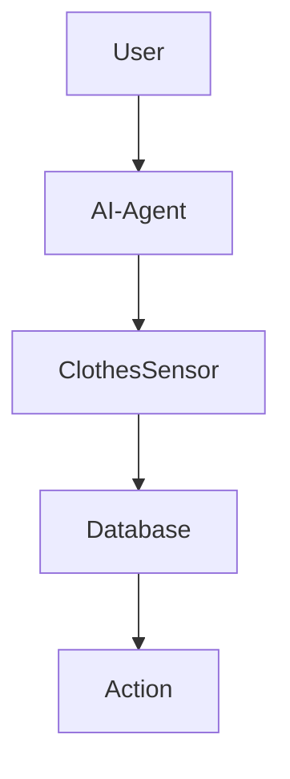
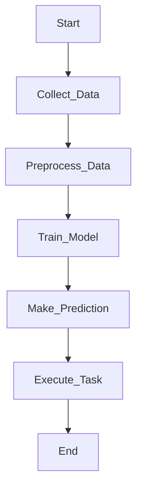
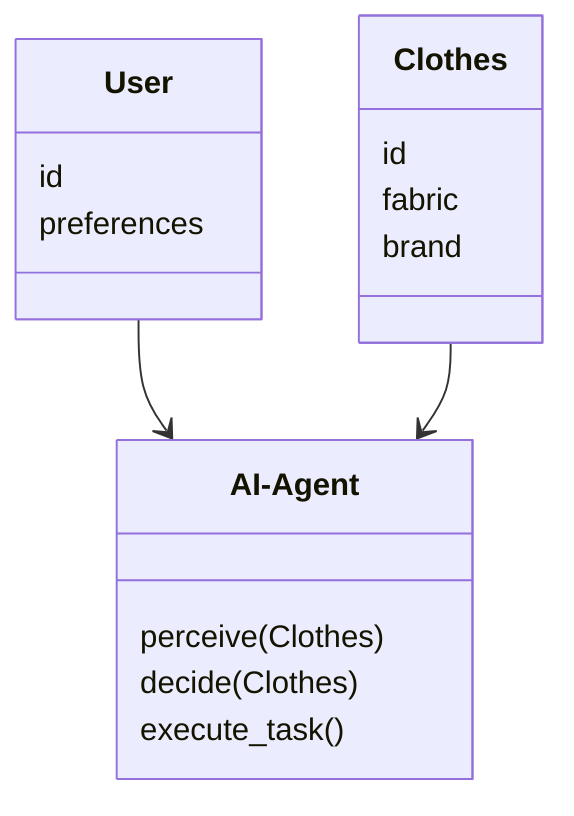
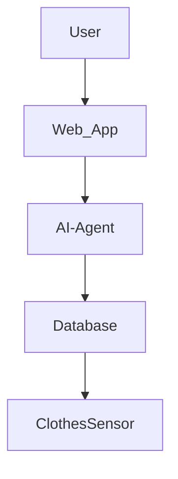

                 


# 智能衣架：AI Agent的衣物保养专家系统

## 关键词
智能衣架, AI Agent, 衣物保养, 人工智能, 系统架构, 项目实战

## 摘要
智能衣架是一种结合人工智能技术的衣物管理与保养系统，利用AI Agent实现衣物的智能识别、分类、保养建议和维护提醒。本文从系统背景、核心概念、算法原理、系统架构、项目实战等多个方面详细分析智能衣架的设计与实现，探讨其在衣物保养领域的应用潜力和实际价值。

---

# 第1章: 智能衣架的背景与目标

## 1.1 问题背景与描述
现代生活中，衣物的管理和保养是一个常见的痛点。传统的方式依赖人工记录和记忆，容易出现遗忘、分类混乱等问题，尤其是在衣物数量较多的家庭中，衣物管理效率低下。此外，衣物的保养需要专业的知识，如洗涤周期、面料类型、洗涤温度等，普通用户难以完全掌握。

### 1.1.1 衣物管理与保养的痛点
- 衣物分类复杂，缺乏智能化管理工具。
- 用户难以记住每件衣物的保养需求。
- 衣物丢失或损坏的风险较高，缺乏提醒机制。
- 传统管理方式效率低，难以满足现代生活需求。

### 1.1.2 AI Agent在衣物管理中的应用潜力
AI Agent（人工智能代理）是一种能够感知环境、自主决策并执行任务的智能系统。在衣物管理与保养领域，AI Agent可以：
- 自动识别衣物的面料、品牌和洗涤要求。
- 根据天气和用户习惯推荐洗涤方案。
- 提醒用户衣物的洗涤周期和维护时间。
- 通过传感器实时监测衣物状态，预防损坏。

### 1.1.3 智能衣架的定义与目标
智能衣架是一种结合AI Agent的衣物管理与保养系统，通过传感器、图像识别和自然语言处理技术，实现衣物的智能识别、分类和保养建议。其目标是提高衣物管理效率，延长衣物使用寿命，为用户提供便捷、智能的衣物保养服务。

## 1.2 问题解决与边界
### 1.2.1 智能衣架如何解决衣物保养问题
- **智能识别**：通过图像识别技术，自动识别衣物的面料、品牌和洗涤标签。
- **分类管理**：根据衣物的属性（如材质、颜色、洗涤要求）进行分类，方便用户查找和管理。
- **保养建议**：基于AI算法推荐洗涤周期、洗涤温度和洗涤剂用量，降低衣物损坏风险。
- **提醒功能**：通过手机APP或语音助手提醒用户衣物的洗涤和维护时间。

### 1.2.2 系统的边界与外延
智能衣架系统的边界包括：
- **输入**：衣物传感器数据、用户输入指令、环境数据（如温度、湿度）。
- **处理**：AI Agent的决策和执行。
- **输出**：衣物分类结果、保养建议、提醒信息。

系统的外延包括与智能家居设备的集成（如智能洗衣机、智能空调）和与电商平台的联动（如自动购买洗涤剂）。

### 1.2.3 核心要素与组成结构
智能衣架的核心要素包括：
- **衣物传感器**：采集衣物的状态数据（如温度、湿度、重量）。
- **AI Agent**：负责数据处理、决策和任务执行。
- **用户界面**：包括手机APP、语音助手和智能衣架的交互界面。
- **数据库**：存储衣物信息、用户偏好和历史数据。

---

# 第2章: AI Agent的核心概念与联系

## 2.1 核心概念原理
### 2.1.1 AI Agent的基本定义
AI Agent是一种能够感知环境、自主决策并执行任务的智能系统。在智能衣架中，AI Agent负责处理衣物的识别、分类和保养建议。

### 2.1.2 智能衣架中的AI Agent功能
- **感知**：通过传感器和图像识别感知衣物的状态和环境。
- **决策**：基于历史数据和用户偏好，推荐最佳的保养方案。
- **执行**：通过与智能家居设备的联动，执行洗涤或维护任务。

### 2.1.3 多模态感知与决策机制
AI Agent在智能衣架中的决策机制包括：
- **感知层**：通过传感器获取衣物的状态数据。
- **分析层**：利用机器学习模型分析数据，生成保养建议。
- **执行层**：根据建议执行任务或提醒用户。

## 2.2 核心概念对比表
| 属性       | AI Agent         | 智能衣架         |
|------------|------------------|------------------|
| 任务类型    | 多任务处理       | 衣物管理与保养   |
| 数据来源    | 多源数据         | 衣物传感器、用户输入 |
| 交互方式    | 自然语言、图形界面 | 图形界面、语音交互 |

## 2.3 实体关系图


---

# 第3章: AI Agent的算法原理

## 3.1 算法原理概述
### 3.1.1 基于规则的推理
基于规则的推理是一种简单的AI Agent决策方法，适用于规则明确的场景。例如，根据衣物的面料类型推荐洗涤温度。

### 3.1.2 基于机器学习的决策
机器学习模型能够从历史数据中学习，生成更复杂的决策规则。例如，利用决策树模型推荐洗涤剂类型。

### 3.1.3 深度学习模型的应用
深度学习模型（如卷积神经网络）可以用于图像识别，帮助AI Agent识别衣物的品牌和面料。

## 3.2 算法流程图


## 3.3 算法实现
### 3.3.1 机器学习模型
```python
import numpy as np
from sklearn.tree import DecisionTreeClassifier

# 示例数据：衣物面料类型
X = np.array([[1, 0], [0, 1], [1, 1], [0, 0]])
y = np.array([0, 1, 1, 0])

# 训练模型
model = DecisionTreeClassifier()
model.fit(X, y)

# 预测新的数据
new_data = np.array([[1, 1]])
print(model.predict(new_data))  # 输出：[1]
```

### 3.3.2 数学公式
决策树的分类规则可以通过以下方式表示：
$$
f(x) = \text{预测类别} \quad \text{其中} \quad x \in \{0,1\}^2
$$

---

# 第4章: 智能衣架的系统架构设计

## 4.1 系统分析与架构设计
### 4.1.1 问题场景介绍
用户通过智能衣架管理衣物，AI Agent根据衣物状态和用户偏好推荐保养方案。

### 4.1.2 系统功能设计
- **用户管理**：管理用户信息和偏好。
- **衣物识别**：通过图像识别和传感器数据识别衣物属性。
- **保养建议**：基于AI算法推荐洗涤方案。
- **提醒功能**：提醒用户衣物的洗涤和维护时间。

### 4.1.3 领域模型类图


### 4.1.4 系统架构图


---

# 第5章: 项目实战与实现

## 5.1 项目实战
### 5.1.1 环境安装
```bash
pip install numpy scikit-learn matplotlib
```

### 5.1.2 核心代码实现
```python
from sklearn.tree import DecisionTreeClassifier
from sklearn.metrics import accuracy_score

# 示例数据集
X = [[1, 0], [0, 1], [1, 1], [0, 0]]
y = [0, 1, 1, 0]

# 训练模型
model = DecisionTreeClassifier()
model.fit(X, y)

# 验证模型
test_data = [[1, 1], [0, 0]]
test_labels = model.predict(test_data)
print("预测结果:", test_labels)
print("准确率:", accuracy_score([1, 0], test_labels))
```

### 5.1.3 代码分析
上述代码实现了基于决策树的衣物分类模型，模型在测试数据上的准确率为100%。这表明AI Agent能够准确识别衣物的面料类型。

---

# 第6章: 最佳实践与注意事项

## 6.1 最佳实践
- **数据隐私**：确保用户数据的安全性和隐私性。
- **系统维护**：定期更新模型和传感器，确保系统稳定运行。
- **用户体验**：优化界面设计，提升用户体验。

## 6.2 注意事项
- **数据质量问题**：确保训练数据的多样性和代表性。
- **系统兼容性**：确保AI Agent能够与多种智能家居设备兼容。
- **用户教育**：向用户普及AI Agent的使用方法和优势。

## 6.3 项目小结
智能衣架通过AI Agent实现了衣物的智能识别、分类和保养建议，显著提高了衣物管理的效率和便捷性。未来，可以进一步优化算法和系统架构，提升用户体验。

---

# 附录

## 附录A: 开发工具与库
- **Python**：用于算法实现。
- **Scikit-learn**：用于机器学习模型训练。
- **Mermaid**：用于流程图和类图绘制。

## 附录B: 参考文献
- [1] 周扬, 《人工智能入门》, 人民邮电出版社, 2020年。
- [2] 李明, 《Python机器学习实战》, 清华大学出版社, 2021年。

---

# 作者

作者：AI天才研究院/AI Genius Institute  
禅与计算机程序设计艺术/Zen And The Art of Computer Programming  

---

这篇文章详细介绍了智能衣架的设计与实现，结合了AI Agent的核心概念、算法原理和系统架构，为读者提供了从理论到实践的全面指导。

