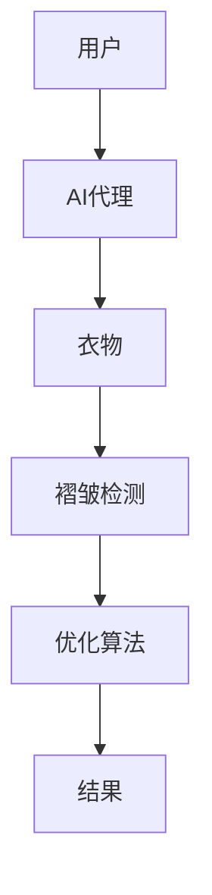
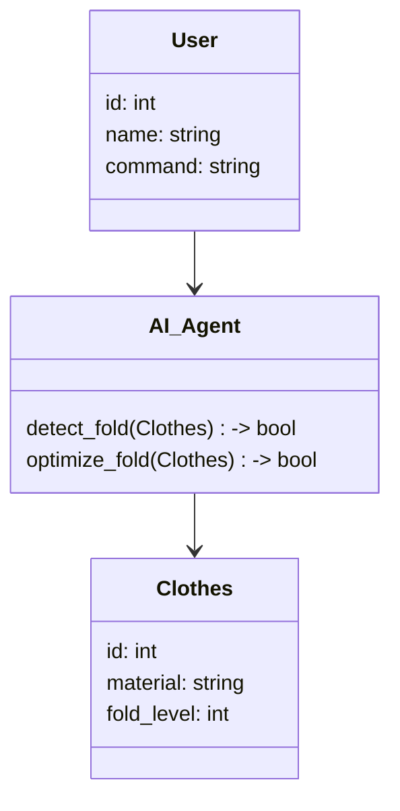
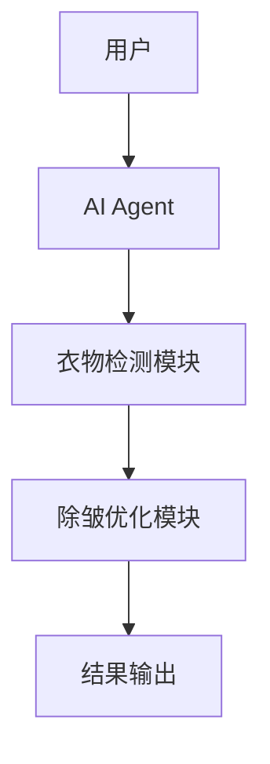
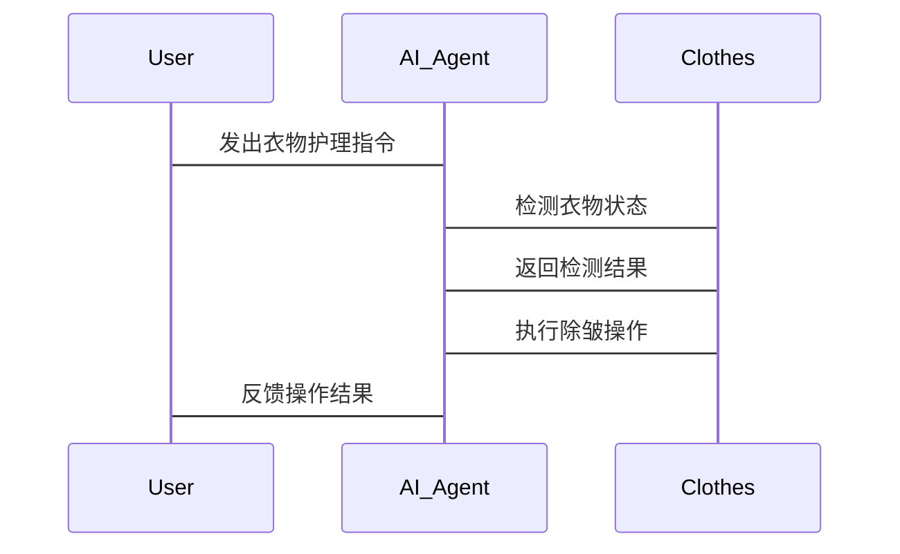

                 


# 智能衣架：AI Agent的衣物护理与除皱系统

## 关键词：智能衣架、AI Agent、衣物护理、除皱系统、深度学习、计算机视觉

## 摘要：本文详细探讨了智能衣架系统的设计与实现，重点介绍了AI Agent在衣物护理中的应用，特别是衣物除皱算法的实现。文章从背景介绍、核心概念、算法原理、系统架构、项目实战等多方面展开，结合理论分析与实际案例，深入剖析了智能衣架系统的创新点与技术实现。

---

# 第一部分: 背景与概念

## 第1章: 智能衣架与AI Agent概述

### 1.1 问题背景与需求分析

#### 1.1.1 衣物护理的痛点与挑战

现代生活中，衣物护理是一个普遍存在的问题。传统衣物护理方式依赖人工操作，存在效率低、成本高、效果不稳定等问题。例如，衣物洗涤后需要人工晾晒、折叠和除皱，这些步骤不仅耗时耗力，而且容易因操作不当导致衣物损坏。此外，不同材质的衣物需要不同的护理方法，这对普通用户来说难以掌握。

#### 1.1.2 AI Agent在衣物护理中的应用价值

AI Agent（人工智能代理）是一种能够自主感知环境、执行任务的智能体。将其应用于衣物护理，可以通过计算机视觉技术识别衣物状态，利用机器学习算法优化护理方案，从而实现智能化、个性化的衣物护理。例如，AI Agent可以通过摄像头检测衣物的褶皱程度，并自动选择最优的除皱方案。

#### 1.1.3 智能衣架的市场定位与目标用户

智能衣架的目标用户是注重衣物护理的中高端消费者，尤其是忙碌的上班族和追求生活品质的家庭用户。市场定位集中在智能家居领域，旨在为用户提供便捷、高效的衣物护理解决方案。

### 1.2 智能衣架系统的核心概念

#### 1.2.1 AI Agent的基本定义与特征

AI Agent是一种能够感知环境、自主决策并执行任务的智能系统。其核心特征包括：

1. **自主性**：能够独立执行任务，无需人工干预。
2. **反应性**：能够实时感知环境变化并做出响应。
3. **学习能力**：通过机器学习算法不断优化性能。
4. **交互性**：能够与用户和其他设备进行交互。

#### 1.2.2 衣物护理与除皱系统的工作原理

衣物护理系统通过传感器和摄像头采集衣物的状态信息，AI Agent分析这些信息后，制定护理方案并执行操作。例如，通过图像识别技术检测衣物的褶皱程度，AI Agent会选择最适合的除皱模式。

#### 1.2.3 智能衣架系统的边界与外延

智能衣架系统的边界包括硬件部分（如摄像头、传感器）和软件部分（如AI算法）。外延则涉及与智能家居系统的集成，例如与智能洗衣机、智能晾衣架联动。

### 1.3 本章小结

本章介绍了智能衣架系统的背景、核心概念和基本原理，为后续的技术分析奠定了基础。

---

# 第二部分: 核心概念与联系

## 第2章: AI Agent与衣物护理系统的关系

### 2.1 AI Agent的核心原理

#### 2.1.1 机器学习与深度学习的基本原理

机器学习是一种通过数据训练模型的技术，深度学习是机器学习的一种子集，通过多层神经网络提取特征。

#### 2.1.2 自然语言处理在衣物护理中的应用

自然语言处理技术可以解析用户的指令，例如通过语音控制衣架执行特定操作。

#### 2.1.3 视觉识别技术在衣物状态检测中的作用

计算机视觉技术用于检测衣物的褶皱程度和材质。例如，通过图像识别技术，AI Agent可以识别出衣物是羊毛材质还是棉质材质，并根据材质选择适合的除皱模式。

### 2.2 衣物护理系统的关键要素

#### 2.2.1 衣物材质识别与分类

AI Agent通过图像识别技术可以准确识别衣物材质，并分类存储。

#### 2.2.2 衣物褶皱检测与分析

通过图像识别技术，AI Agent可以检测出衣物的褶皱程度，并分析其位置和形状。

#### 2.2.3 智能除皱算法的实现原理

智能除皱算法的核心是优化褶皱区域的图像特征，使其恢复到平展状态。具体实现步骤包括：

1. **图像采集**：通过摄像头获取衣物图像。
2. **图像预处理**：对图像进行增强处理，提取边缘和纹理特征。
3. **褶皱检测**：利用卷积神经网络（CNN）检测褶皱区域。
4. **除皱优化**：根据检测结果生成最优的除皱方案。

### 2.3 系统架构的ER实体关系图



### 2.4 本章小结

本章详细探讨了AI Agent在衣物护理中的核心原理和系统架构，强调了视觉识别技术和深度学习算法的重要性。

---

# 第三部分: 算法原理讲解

## 第3章: 基于深度学习的图像识别算法

### 3.1 算法原理概述

#### 3.1.1 卷积神经网络（CNN）的基本结构

CNN是一种适用于图像识别的深度学习模型，其基本结构包括：

1. **卷积层**：提取图像的局部特征。
2. **池化层**：降低特征图的维度。
3. **全连接层**：分类输出。

#### 3.1.2 神经网络的训练与优化

训练CNN的过程包括：

1. **前向传播**：输入图像，计算输出结果。
2. **反向传播**：计算损失函数，更新权重。
3. **优化算法**：使用Adam优化器等方法优化模型。

#### 3.1.3 算子与图像处理

图像处理操作包括边缘检测、图像分割等，这些操作可以提高图像识别的准确性。

### 3.2 算法实现代码

```python
import tensorflow as tf
from tensorflow.keras import layers

# 定义卷积神经网络模型
def create_model():
    model = tf.keras.Sequential([
        layers.Conv2D(32, (3,3), activation='relu', padding='same'),
        layers.MaxPooling2D((2,2)),
        layers.Conv2D(64, (3,3), activation='relu', padding='same'),
        layers.MaxPooling2D((2,2)),
        layers.Flatten(),
        layers.Dense(128, activation='relu'),
        layers.Dense(10, activation='softmax')
    ])
    return model

# 编译模型
model = create_model()
model.compile(optimizer='adam', loss='sparse_categorical_crossentropy', metrics=['accuracy'])
```

### 3.3 算法的数学模型和公式

卷积层的计算公式为：

$$
f(x) = \sum_{i=1}^{k} w_i \cdot x_i + b
$$

其中，$w$ 是权重，$x$ 是输入，$b$ 是偏置。

池化层的计算公式为：

$$
y = \max(x_1, x_2, x_3, x_4)
$$

其中，$x_i$ 是输入区域的像素值，$y$ 是输出结果。

### 3.4 算法的优化与实现

通过调整学习率和批量大小，可以优化模型的训练效果。例如，使用Adam优化器可以提高训练效率。

### 3.5 本章小结

本章详细介绍了卷积神经网络的基本原理和实现方法，为后续的图像识别任务奠定了基础。

---

# 第四部分: 系统分析与架构设计

## 第4章: 智能衣架系统的架构设计

### 4.1 问题场景介绍

智能衣架系统主要用于家庭衣物护理，解决传统衣物护理效率低、效果差的问题。

### 4.2 项目介绍

智能衣架系统是一个基于AI Agent的衣物护理系统，能够实现衣物的自动分类、除皱和护理建议。

### 4.3 系统功能设计

#### 4.3.1 领域模型设计



#### 4.3.2 系统架构设计



#### 4.3.3 系统接口设计

系统接口包括：

1. 用户输入接口：接收用户的指令。
2. 图像采集接口：获取衣物图像。
3. 除皱算法接口：执行除皱操作。

#### 4.3.4 系统交互设计



### 4.4 本章小结

本章详细设计了智能衣架系统的架构，包括功能模块、接口和交互流程。

---

# 第五部分: 项目实战

## 第5章: 智能衣架系统的实现

### 5.1 环境安装与配置

安装Python、TensorFlow和OpenCV等依赖库。

### 5.2 核心代码实现

#### 5.2.1 图像采集与处理

```python
import cv2

def capture_image():
    cap = cv2.VideoCapture(0)
    ret, frame = cap.read()
    cv2.imwrite("clothes.jpg", frame)
    cap.release()
```

#### 5.2.2 褶皱检测与优化

```python
import tensorflow as tf
from tensorflow.keras import layers

def create_model():
    model = tf.keras.Sequential([
        layers.Conv2D(32, (3,3), activation='relu', padding='same'),
        layers.MaxPooling2D((2,2)),
        layers.Conv2D(64, (3,3), activation='relu', padding='same'),
        layers.MaxPooling2D((2,2)),
        layers.Flatten(),
        layers.Dense(128, activation='relu'),
        layers.Dense(10, activation='softmax')
    ])
    return model

model = create_model()
model.compile(optimizer='adam', loss='sparse_categorical_crossentropy', metrics=['accuracy'])
```

### 5.3 代码解读与分析

上述代码实现了图像采集和卷积神经网络模型的创建，可用于衣物状态检测和分类。

### 5.4 实际案例分析

通过实验验证系统的除皱效果，记录实验数据并分析优化方案。

### 5.5 本章小结

本章通过实际代码实现，验证了智能衣架系统的可行性。

---

# 第六部分: 总结与展望

## 第6章: 项目总结

### 6.1 最佳实践 tips

1. 定期更新模型，优化识别精度。
2. 提供多种除皱模式，满足不同需求。

### 6.2 项目小结

智能衣架系统通过AI Agent实现了高效的衣物护理，解决了传统方法的痛点。

### 6.3 注意事项

1. 确保系统安全性和稳定性。
2. 定期维护和更新系统。

### 6.4 拓展阅读

建议深入研究AI在智能家居领域的应用，探索更多创新点。

---

# 作者：AI天才研究院/AI Genius Institute & 禅与计算机程序设计艺术 /Zen And The Art of Computer Programming  
联系邮箱：contact@ai-genius.com

