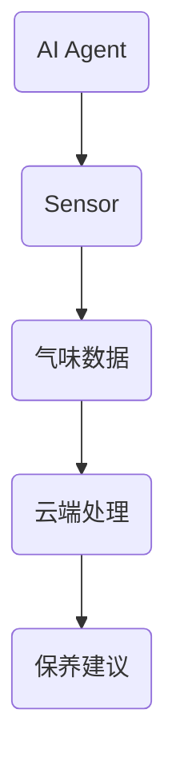
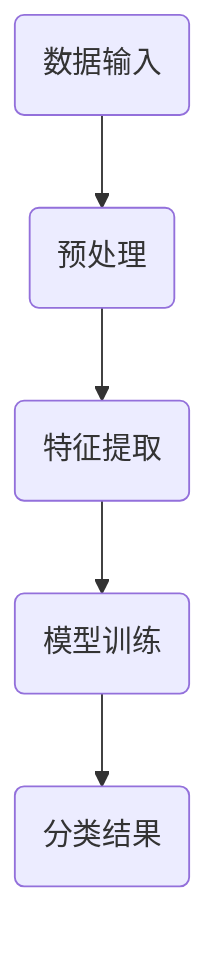
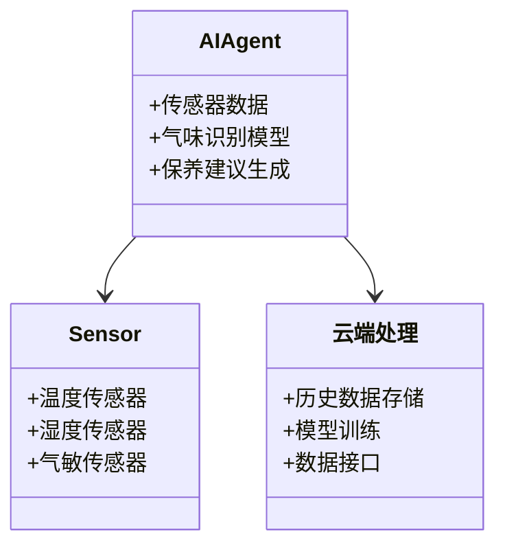
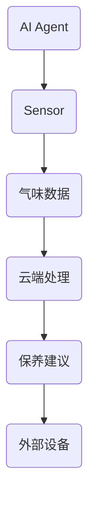
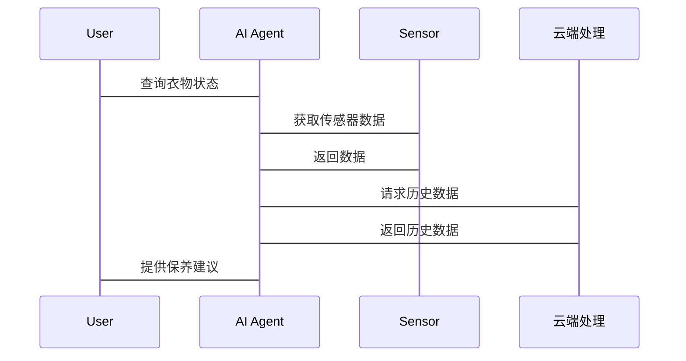

                 


# 智能衣架：AI Agent的衣物除味与保养建议

> 关键词：AI Agent、衣物除味、智能衣架、气味识别、衣物保养

> 摘要：随着人工智能技术的快速发展，衣物的智能化护理逐渐成为现实。本文将深入探讨AI Agent在衣物除味与保养中的应用，从核心概念、算法原理、系统设计到实际项目，全面解析智能衣架的技术实现与应用场景。

---

## 正文

### 第一部分：背景介绍

#### 第1章：AI Agent与衣物护理的背景

##### 1.1 智能衣架的概念与背景
智能衣架是一种结合了人工智能（AI）技术的衣物护理设备，它能够通过传感器和AI算法，自动识别衣物的气味、材质和护理需求，并提供相应的除味和保养建议。传统衣架的功能单一，而智能衣架通过集成AI Agent（智能体），赋予了衣物护理更高的智能化水平。

##### 1.2 衣物除味与保养的挑战
衣物在日常使用中容易受到汗水、灰尘、烟味等多种污渍和异味的影响，传统的清洗和除味方法效率低下，且难以满足个性化需求。此外，不同材质的衣物对清洁和护理的要求也不同，如何实现精准的衣物护理成为一大挑战。

##### 1.3 AI技术在衣物护理中的应用前景
AI技术在衣物护理中的应用前景广阔。通过AI Agent，智能衣架可以实时感知衣物的状态，结合历史数据和用户习惯，提供个性化的除味和保养建议。这种智能化的解决方案不仅提高了衣物护理的效率，还能延长衣物的使用寿命。

---

### 第二部分：核心概念与联系

#### 第2章：AI Agent的核心概念

##### 2.1 AI Agent的基本原理
AI Agent是一种能够感知环境、做出决策并执行动作的智能实体。在智能衣架中，AI Agent主要负责以下几个阶段：
1. **感知阶段**：通过传感器采集衣物的气味、温度、湿度等信息。
2. **决策阶段**：基于感知数据，结合预训练的模型，识别衣物的状态并生成除味和保养建议。
3. **执行阶段**：通过与外部设备（如除味装置）交互，执行具体的除味或清洗操作。

##### 2.2 传感器与气味识别
智能衣架的核心传感器包括：
- **气敏传感器**：用于检测衣物的气味。
- **温湿度传感器**：用于监测衣物的存储环境。
- **材质传感器**：用于识别衣物的材质特性。

**传感器性能对比表：**

| 传感器类型    | 优点                     | 缺点                     |
|---------------|--------------------------|--------------------------|
| 气敏传感器     | 高灵敏度，专为气味检测设计 | 易受环境干扰，灵敏度有限 |
| 温湿度传感器   | 精确监测环境条件         | 无法直接检测气味         |
| 材质传感器     | 能准确识别衣物材质       | 成本较高                 |

##### 2.3 系统架构的ER实体关系图


---

### 第三部分：算法原理讲解

#### 第3章：气味识别算法

##### 3.1 机器学习模型的选择
在气味识别中，我们主要使用以下两种模型：
1. **卷积神经网络（CNN）**：适用于图像识别任务，可用于将气味数据转化为图像形式进行分类。
2. **循环神经网络（RNN）**：适用于时间序列分析，可用于处理连续的气味数据流。

##### 3.2 气味分类的流程图


##### 3.3 气味识别的Python代码实现
```python
import numpy as np
from sklearn.svm import SVC

# 示例数据：训练集和测试集
X_train = np.random.randn(100, 10)  # 100个样本，10个特征
y_train = np.array([0] * 50 + [1] * 50)  # 两类标签

# 训练SVM模型
model = SVC()
model.fit(X_train, y_train)

# 测试样本
X_test = np.random.randn(20, 10)
y_test = model.predict(X_test)

# 输出结果
print("预测结果:", y_test)
```

##### 3.4 数学模型与公式
- **支持向量机（SVM）** 的数学模型：
  $$ \text{目标函数}：\min \frac{1}{2}||\mathbf{w}||^2 + C \sum_{i=1}^n \xi_i $$
  $$ \text{约束条件}：y_i (\mathbf{w} \cdot \mathbf{x}_i + b) \geq 1 - \xi_i $$
  
- **随机森林（RF）** 的数学模型：
  $$ \text{集成学习}：\text{多个决策树的预测结果取平均} $$

---

### 第四部分：系统分析与架构设计方案

#### 第4章：系统设计与实现

##### 4.1 问题场景介绍
智能衣架系统需要解决以下问题：
- 实时监测衣物的气味和环境状态。
- 提供个性化的除味和保养建议。
- 与外部设备（如洗衣机、除湿器）联动。

##### 4.2 系统功能设计（领域模型）


##### 4.3 系统架构设计


##### 4.4 接口设计与交互流程


---

### 第五部分：项目实战

#### 第5章：智能衣架的实现与应用

##### 5.1 环境搭建与安装
- 安装Python和必要的库（如NumPy、Scikit-learn、TensorFlow）。
- 安装传感器模块（如DHT11温湿度传感器、MQ-5气敏传感器）。

##### 5.2 核心代码实现
```python
import numpy as np
from sklearn.ensemble import RandomForestClassifier

# 示例数据：训练集和测试集
X_train = np.random.randn(100, 5)  # 100个样本，5个特征
y_train = np.array([0] * 50 + [1] * 50)  # 两类标签

# 训练随机森林模型
model = RandomForestClassifier(n_estimators=10)
model.fit(X_train, y_train)

# 测试样本
X_test = np.random.randn(20, 5)
y_test = model.predict(X_test)

# 输出结果
print("预测结果:", y_test)
```

##### 5.3 代码解读与分析
- **数据预处理**：对传感器数据进行标准化或归一化处理。
- **特征提取**：从传感器数据中提取有效的特征用于模型训练。
- **模型训练**：使用随机森林或CNN模型进行训练，优化模型参数。
- **结果分析**：分析模型的准确率、召回率等性能指标。

##### 5.4 实际案例分析
- **案例1**：识别棉质衣物的汗味。
- **案例2**：处理羊毛衣物的烟味。

---

### 第六部分：最佳实践与总结

#### 第6章：总结与展望

##### 6.1 最佳实践 tips
- 定期更新传感器数据，确保模型的准确性。
- 根据衣物材质调整传感器灵敏度。
- 注意数据隐私，避免用户信息泄露。

##### 6.2 小结
智能衣架通过AI Agent实现了衣物的智能化护理，解决了传统衣物护理效率低、个性化差的问题。未来，随着AI技术的进一步发展，智能衣架的功能将更加丰富，用户体验也将更加便捷。

##### 6.3 注意事项
- 传感器的灵敏度可能受到环境因素的影响。
- 数据隐私问题需要高度重视。

##### 6.4 拓展阅读
- 推荐阅读《深度学习实战》、《机器学习算法详解》等书籍，深入学习AI技术的应用。

---

## 作者信息

作者：AI天才研究院/AI Genius Institute & 禅与计算机程序设计艺术/Zen And The Art of Computer Programming

---

以上是《智能衣架：AI Agent的衣物除味与保养建议》的技术博客文章大纲和具体内容，涵盖了从背景介绍到系统设计的各个方面，结合理论与实践，为读者提供全面的技术解析。

