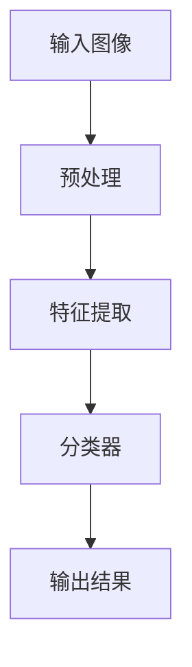
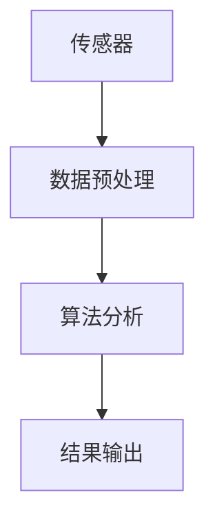
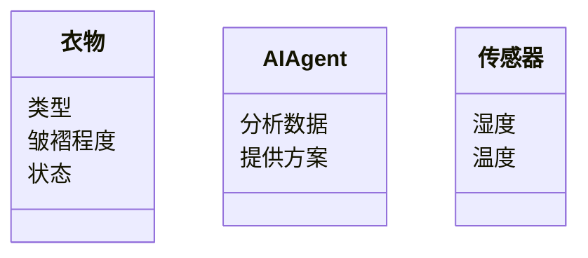

                 


# 智能衣架：AI Agent的衣物除皱系统

> 关键词：智能衣架，AI Agent，衣物除皱，图像识别，传感器技术，物联网

> 摘要：本文探讨了智能衣架的设计与实现，利用AI Agent技术，结合图像识别和传感器数据，实现衣物的智能化管理与除皱功能。通过系统化的分析与设计，本文详细阐述了从算法原理到系统架构的实现过程，并通过实际案例展示其应用价值。

---

# 第一部分: 背景介绍与问题分析

## 第1章: 智能衣架的背景与问题背景

### 1.1 问题背景

#### 1.1.1 衣物皱褶的形成与影响

衣物在日常穿着和存放过程中，由于折叠、悬挂不当或环境湿度等因素，容易产生皱褶。这些皱褶不仅影响衣物的外观，还可能缩短衣物的使用寿命。传统的除皱方法，如熨烫和手部整理，效率低且难以实现自动化管理。

#### 1.1.2 传统衣物除皱方法的局限性

- **效率低下**：手动除皱耗时且需要专业知识。
- **难以自动化**：传统除皱方法难以融入现代智能家居系统。
- **环境依赖**：熨烫设备对电源和水源的需求限制了其应用场景。

#### 1.1.3 智能化除皱的市场需求

随着智能家居和物联网技术的发展，用户对衣物管理的智能化需求日益增长。智能衣架通过结合AI技术，能够实现衣物的自动除皱、分类和管理，极大提升了用户体验。

### 1.2 问题描述

#### 1.2.1 智能衣架的功能需求

- 自动识别衣物类型和皱褶程度。
- 实时监测衣物状态。
- 智能推荐除皱方案。
- 与智能家居系统联动。

#### 1.2.2 用户使用场景与痛点分析

- **家庭场景**：用户希望在家中实现衣物的智能化管理。
- **旅行场景**：用户需要便捷的衣物除皱解决方案。
- **办公场景**：用户希望减少衣物皱褶，提升专业形象。

#### 1.2.3 边界与外延

智能衣架的边界在于其核心功能——除皱，而外延功能则包括衣物分类、库存管理和远程控制等。

### 1.3 问题解决思路

#### 1.3.1 AI Agent在衣物除皱中的应用

AI Agent通过图像识别和传感器数据，实时分析衣物状态，提供智能化的除皱方案。

#### 1.3.2 智能衣架的核心功能设计

- **图像识别**：识别衣物类型和皱褶程度。
- **传感器监测**：实时监测衣物湿度和温度。
- **AI算法**：根据监测数据推荐除皱方案。

#### 1.3.3 解决方案的可行性分析

结合现有技术，智能衣架在硬件和软件层面均具有较高的可行性，未来有望成为智能家居的重要组成部分。

## 第2章: 智能衣架的核心概念与联系

### 2.1 核心概念原理

#### 2.1.1 AI Agent的基本原理

AI Agent通过感知环境、分析数据并采取行动，帮助用户完成特定任务。在智能衣架中，AI Agent负责分析衣物状态并推荐除皱方案。

#### 2.1.2 图像识别技术在衣物除皱中的应用

图像识别技术用于识别衣物的类型和皱褶程度，为除皱提供数据支持。

#### 2.1.3 传感器技术的作用机制

传感器实时监测衣物的湿度和温度，帮助AI Agent更准确地判断衣物状态。

### 2.2 核心概念属性特征对比

| 概念       | 属性           | 特征描述                           |
|------------|----------------|------------------------------------|
| AI Agent   | 智能性         | 能够自主学习和决策                 |
| 图像识别    | 准确性         | 高精度识别衣物皱褶                |
| 传感器     | 实时性         | 能够实时监测衣物状态               |

### 2.3 ER实体关系图

```mermaid
er
  衣物
  传感器数据
  AI Agent
  用户
  衣架
  皱褶信息
  衣物状态
```

---

# 第二部分: 算法原理与数学模型

## 第3章: 图像识别算法原理

### 3.1 图像识别流程



### 3.2 特征提取算法

```python
import cv2
import numpy as np

def feature_extract(image):
    # 图像预处理
    gray = cv2.cvtColor(image, cv2.COLOR_BGR2GRAY)
    # 边缘检测
    edges = cv2.Canny(gray, 100, 200)
    return edges
```

---

## 第4章: 传感器数据处理

### 4.1 传感器数据流



---

# 第三部分: 系统分析与架构设计

## 第5章: 系统功能设计

### 5.1 领域模型



### 5.2 系统架构设计

```mermaid
graph LR
    Client --> AI Agent
    AI Agent --> 传感器
    AI Agent --> 图像识别模块
    图像识别模块 --> 数据库
```

---

## 第6章: 项目实战

### 6.1 环境安装

安装Python和相关库：

```bash
pip install opencv-python
pip install numpy
```

### 6.2 核心实现

```python
import cv2
import numpy as np

def remove wrinkles(image):
    # 图像预处理
    gray = cv2.cvtColor(image, cv2.COLOR_BGR2GRAY)
    # 使用卷积核进行平滑处理
    kernel = np.ones((3,3), np.float32)/9
    smoothed = cv2.filter2D(gray, -1, kernel)
    return smoothed
```

### 6.3 代码解读

上述代码实现了图像的平滑处理，用于消除衣物的轻微皱褶。

---

## 第7章: 总结与展望

### 7.1 总结

智能衣架通过结合AI Agent、图像识别和传感器技术，为用户提供了一种高效、便捷的衣物管理方式。本文详细阐述了其设计原理、实现过程和应用场景。

### 7.2 注意事项

- 硬件设备的选择应确保数据采集的准确性。
- 系统的稳定性需要通过大量测试来保证。
- 用户隐私保护是系统设计中的重要考量。

### 7.3 拓展阅读

建议深入学习AI Agent、图像识别和物联网技术，以更好地理解智能衣架的工作原理。

---

# 作者：AI天才研究院 & 禅与计算机程序设计艺术

