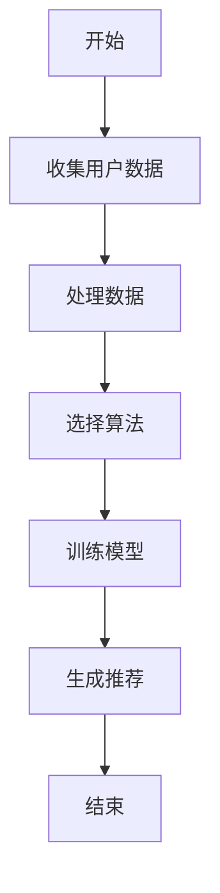
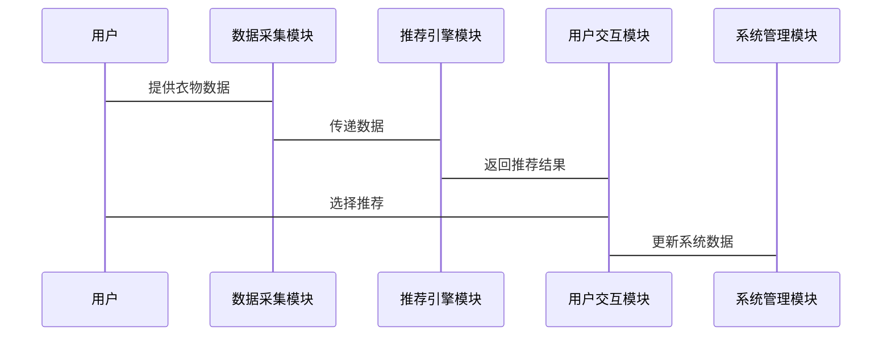

                 


# 智能衣柜：AI Agent的个人形象管理顾问

**关键词：** 智能衣柜, AI Agent, 个人形象管理, 人工智能, 推荐算法, 系统架构, 项目实战

**摘要：** 本文探讨智能衣柜作为AI Agent的个人形象管理工具，分析其背景、核心概念、算法原理、系统架构，并通过项目实战展示其实现过程，最后提出最佳实践和未来展望。

---

## 第1章：智能衣柜的背景与概念

### 1.1 智能衣柜的定义与背景
1.1.1 智能衣柜的定义  
1.1.2 传统衣柜与智能衣柜的对比  
1.1.3 智能衣柜的发展背景与趋势  

### 1.2 AI Agent在智能衣柜中的作用
1.2.1 AI Agent的基本概念  
1.2.2 AI Agent在个人形象管理中的应用  
1.2.3 智能衣柜中的AI Agent功能模块  

---

## 第2章：智能衣柜的核心概念与联系

### 2.1 AI Agent的核心原理
2.1.1 AI Agent的基本原理  
2.1.2 AI Agent在智能衣柜中的具体实现  
2.1.3 AI Agent与智能衣柜的关系  

### 2.2 智能衣柜的核心功能模块
2.2.1 数据采集与处理模块  
2.2.2 AI推荐算法模块  
2.2.3 用户交互界面模块  

### 2.3 智能衣柜的实体关系图
```mermaid
erDiagram
    user {
        id
        username
        preferences
    }
    clothes {
        id
        type
        color
        size
    }
    recommendation {
        id
        user_id
        clothes_id
        score
    }
    
    user --> recommendation: 1..n
    clothes --> recommendation: 1..n
```

---

## 第3章：智能衣柜的算法原理

### 3.1 推荐算法的基本原理
3.1.1 协同过滤算法  
3.1.2 基于内容的推荐算法  
3.1.3 深度学习模型在推荐中的应用  

### 3.2 推荐算法的流程图


### 3.3 算法实现与代码示例
```python
# 协同过滤算法示例
import numpy as np

def collaborative_filtering(user_items, item_features):
    # 计算用户相似度
    user_similarity = np.dot(user_items, item_features.T)
    # 生成推荐
    recommendations = np.matmul(user_items, item_features)
    return recommendations

# 使用示例
user_items = np.array([[1, 2, 3], [4, 5, 6]])
item_features = np.array([[7, 8], [9, 10], [11, 12]])
print(collaborative_filtering(user_items, item_features))
```

### 3.4 数学模型与公式
协同过滤的相似度计算公式：  
$$ sim(u, v) = \frac{\sum_{i=1}^{n} (r_{u,i} - \bar{r}_u)(r_{v,i} - \bar{r}_v)}{\sqrt{\sum_{i=1}^{n} (r_{u,i} - \bar{r}_u)^2} \cdot \sqrt{\sum_{i=1}^{n} (r_{v,i} - \bar{r}_v)^2}} $$

---

## 第4章：智能衣柜的系统架构设计

### 4.1 系统架构概述
4.1.1 智能衣柜的整体架构  
4.1.2 核心模块与子模块  

### 4.2 系统架构图


### 4.3 系统交互流程


---

## 第5章：智能衣柜的项目实战

### 5.1 环境配置与工具安装
5.1.1 安装Python与相关库  
5.1.2 安装AI框架（如TensorFlow或PyTorch）  

### 5.2 核心代码实现
```python
# 推荐引擎实现
class RecommendationEngine:
    def __init__(self, data):
        self.data = data
    
    def train(self):
        # 训练模型
        pass
    
    def predict(self, user_id):
        # 生成推荐
        return []
```

### 5.3 案例分析与解读
5.3.1 案例背景  
5.3.2 数据处理与分析  
5.3.3 算法实现与结果展示  

---

## 第6章：智能衣柜的最佳实践

### 6.1 设计与实现 tips
6.1.1 数据隐私保护  
6.1.2 系统可扩展性设计  
6.1.3 用户体验优化  

### 6.2 项目小结与展望
6.2.1 项目总结  
6.2.2 未来发展方向  

### 6.3 注意事项与风险提示
6.3.1 数据安全风险  
6.3.2 系统性能优化  

### 6.4 拓展阅读与资源推荐
6.4.1 推荐算法相关文献  
6.4.2 系统架构设计书籍  

---

## 作者：AI天才研究院 & 禅与计算机程序设计艺术

