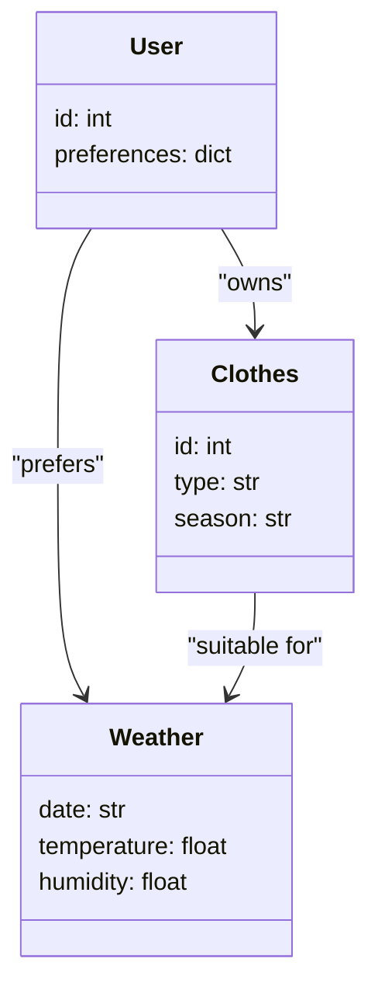
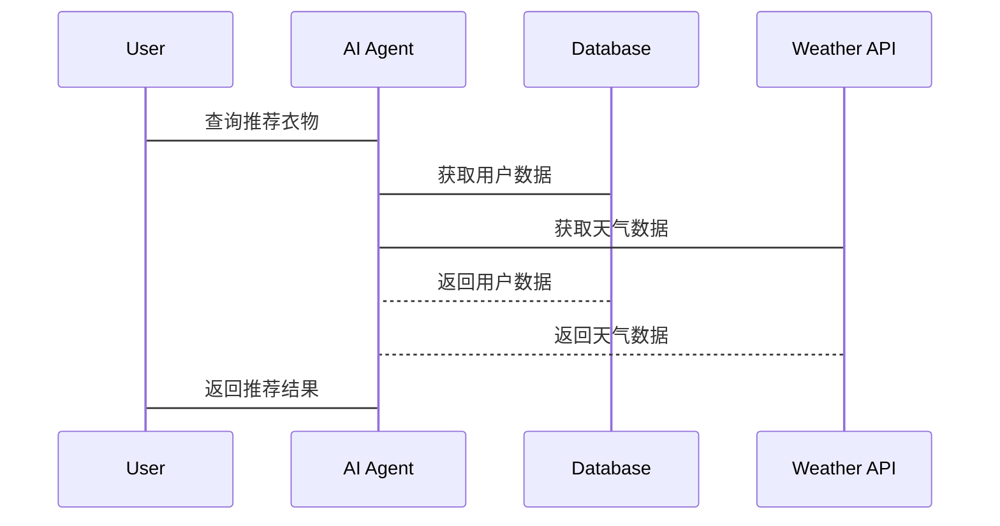

                 


# 智能衣柜：AI Agent的季节性衣物轮换建议

## 关键词：AI Agent, 智能衣柜, 季节性衣物, 轮换建议, 衣物管理, 人工智能, 智能家居

## 摘要：  
本文探讨AI Agent在智能衣柜中的应用，重点分析其如何通过数据驱动的算法优化季节性衣物的轮换管理。文章从背景介绍、核心概念、算法原理、系统架构到项目实战，全面解析AI Agent在衣物管理中的潜力与实现。通过详细的技术分析和案例解读，展示AI如何提升衣物管理效率，为用户带来更智能、便捷的生活体验。

---

## 第一部分：智能衣柜的背景与核心概念

### 第1章：智能衣柜的背景与问题背景

#### 1.1 问题背景
- **从传统衣柜到智能衣柜的演进**：传统衣柜的随机性管理导致衣物查找困难，空间利用低效。智能衣柜通过AI技术实现高效管理，提升生活效率。
- **季节性衣物管理的痛点**：衣物存放混乱、查找耗时、重复购置等问题亟待解决。AI Agent通过数据驱动的优化，帮助用户科学管理衣物。
- **AI Agent在衣物管理中的应用前景**：AI技术在智能家居中的应用扩展到衣物管理，季节性衣物的智能化轮换成为未来趋势。

#### 1.2 问题描述
- **衣物轮换的复杂性**：季节变化快，衣物需求多样，用户难以高效管理。AI Agent通过分析气候和用户习惯，优化轮换策略。
- **用户需求与衣物管理效率的矛盾**：用户希望快速找到所需衣物，AI Agent通过智能推荐和自动化管理满足需求。
- **季节性衣物管理的优化空间**：AI Agent通过数据挖掘和预测，提供个性化建议，减少资源浪费，提升用户体验。

#### 1.3 问题解决
- **AI Agent的核心作用**：AI Agent通过学习用户行为和环境数据，优化衣物轮换策略，提供智能化建议。
- **智能衣柜的解决方案**：结合物联网和AI技术，智能衣柜实现衣物的智能化管理，提升用户体验。
- **季节性衣物轮换的优化策略**：基于历史数据和天气预报，AI Agent制定最优轮换计划，减少不必要的衣物购置和存储。

#### 1.4 智能衣柜的边界与外延
- **系统边界定义**：智能衣柜的核心功能包括衣物识别、分类、推荐和自动化管理。系统边界明确，不涉及其他智能家居设备。
- **外延功能扩展**：未来可扩展至衣物清洗、搭配建议和环保管理，提升系统价值。
- **相关领域的关联性**：与智能家居、物联网、数据挖掘等领域密切相关，具备广泛的应用潜力。

#### 1.5 概念结构与核心要素
- **核心要素组成**：数据采集（传感器、用户输入）、数据分析（AI算法）、用户交互（推荐、提醒）、系统执行（自动化管理）。
- **概念结构图**：展示各要素的相互关系和协同作用。
- **核心要素的关联性**：数据采集为AI分析提供基础，分析结果指导用户交互和系统执行，形成闭环优化。

---

## 第二部分：智能衣柜的核心概念与联系

### 第2章：AI Agent在智能衣柜中的核心作用

#### 2.1 AI Agent的定义与特点
- **AI Agent的基本定义**：AI Agent是具备感知、决策、执行能力的智能体，能够根据环境数据和用户需求做出优化决策。
- **智能衣柜中的AI Agent特点**：实时感知环境、自适应学习、自动化执行、提供个性化服务。
- **AI Agent与传统衣柜管理的区别**：传统管理依赖人工，效率低；AI Agent实现智能化、自动化和个性化管理。

#### 2.2 季节性衣物轮换的逻辑
- **季节性衣物轮换的基本逻辑**：根据天气变化和用户习惯，动态调整衣物轮换顺序，优先推荐当季衣物。
- **AI Agent在轮换中的作用**：通过数据预测和用户行为分析，优化轮换策略，减少用户负担。
- **轮换策略的优化**：基于历史气候数据和用户偏好，制定个性化轮换计划，提升管理效率。

#### 2.3 核心概念原理
- **AI Agent的核心原理**：AI Agent通过数据采集、分析和学习，制定优化策略并执行。其算法模型包括数据预处理、特征提取、模型训练和预测。
- **季节性衣物轮换的逻辑原理**：AI Agent结合气候预测和用户习惯，预测用户需求，优化衣物轮换顺序。
- **AI Agent与衣物轮换的协同作用**：AI Agent通过智能化决策，提升衣物管理效率，优化用户体验。

#### 2.4 概念属性特征对比
- **AI Agent与传统衣柜管理的对比**：传统管理随机性高、效率低；AI Agent管理高效、个性化。
- **季节性衣物轮换的特征对比**：传统管理被动、单一；AI Agent管理主动、多样化。
- **AI Agent与衣物轮换策略的对比**：传统策略静态、固定；AI Agent策略动态、自适应。

---

## 第三部分：算法原理讲解

### 第3章：AI Agent的核心算法

#### 3.1 推荐算法的流程
- **数据采集与预处理**：收集用户行为数据、天气数据和衣物属性数据，清洗和标准化处理。
- **特征提取与选择**：提取用户偏好、气候特征和衣物属性作为输入特征。
- **模型训练与优化**：使用机器学习模型（如协同过滤、深度学习）训练推荐系统，调整参数优化模型。
- **结果输出与反馈**：生成推荐列表，反馈用户行为数据，用于后续优化。

#### 3.2 算法实现的代码示例
```python
import numpy as np
from sklearn.metrics.pairwise import cosine_similarity

# 示例数据：用户-衣物矩阵
user_item_matrix = np.array([[1, 0, 1, 1],
                              [0, 1, 1, 0],
                              [1, 1, 0, 0],
                              [0, 0, 1, 1]])

# 计算余弦相似度
similarity_matrix = cosine_similarity(user_item_matrix)

# 根据相似度推荐衣物
def get_recommendations(user_id, similarity_matrix, num_recommendations=3):
    user_similarities = similarity_matrix[user_id]
    recommendations = []
    for i in range(len(user_similarities)):
        if i != user_id:
            recommendations.append((i, user_similarities[i]))
    recommendations.sort(key=lambda x: x[1], reverse=True)
    return recommendations[:num_recommendations]

# 示例用户ID（从0开始）
user_id = 0
recommendations = get_recommendations(user_id, similarity_matrix)
print(f"推荐结果：{recommendations}")
```

#### 3.3 数学模型与公式
- **评分预测公式**：基于协同过滤的评分预测公式如下：
  $$ \hat{r}_{u,i} = \bar{r}_u + \sum_{j \in N(u)} (w_{u,j} \times (r_{j,i} - \bar{r}_j)) $$
  其中，$\bar{r}_u$是用户的平均评分，$N(u)$是与用户u相似的用户集合，$w_{u,j}$是相似度权重，$r_{j,i}$是用户j对物品i的评分，$\bar{r}_j$是用户j的平均评分。
- **相似度计算公式**：余弦相似度公式为：
  $$ \text{similarity}(u, v) = \frac{\sum_{i=1}^n u_i v_i}{\sqrt{\sum_{i=1}^n u_i^2} \times \sqrt{\sum_{i=1}^n v_i^2}} $$
  其中，$u$和$v$是用户u和v的特征向量。

---

## 第四部分：系统分析与架构设计方案

### 第4章：系统架构设计

#### 4.1 系统功能设计
- **领域模型类图**：展示用户、衣物、天气等实体及其关系。使用mermaid类图表示。


#### 4.2 系统架构设计
- **分层架构图**：展示数据层、业务逻辑层和用户界面层的交互。使用mermaid架构图表示。


#### 4.3 系统接口设计
- **接口设计**：AI Agent与数据库、天气API的交互接口设计。使用mermaid序列图表示。


---

## 第五部分：项目实战

### 第5章：智能衣柜的实现

#### 5.1 环境安装
- **Python安装**：确保安装Python 3.x及以上版本。
- **依赖库安装**：安装numpy、scikit-learn、mermaid等库。

#### 5.2 核心代码实现
- **数据预处理**：清洗和标准化数据。
- **模型训练**：训练推荐算法模型。
- **推荐系统实现**：基于模型生成推荐列表。

#### 5.3 代码解读与分析
- **数据预处理代码**：展示如何清洗和标准化数据。
- **模型训练代码**：详细解释模型训练过程。
- **推荐系统代码**：展示如何生成推荐结果。

#### 5.4 实际案例分析
- **案例背景**：描述一个典型用户场景。
- **数据处理**：展示数据预处理过程。
- **模型训练**：解释模型如何优化。
- **推荐结果**：分析推荐结果的有效性。

#### 5.5 项目小结
- **项目总结**：回顾项目实现的主要步骤。
- **经验分享**：分享开发中的经验和最佳实践。
- **注意事项**：提醒读者在实际应用中需要注意的事项。

---

## 第六部分：总结与展望

### 第6章：总结与展望

#### 6.1 最佳实践
- **技术建议**：推荐使用机器学习模型优化推荐系统。
- **工具推荐**：推荐使用Python和相关库进行开发。

#### 6.2 小结
- **核心内容回顾**：总结文章的主要内容和结论。
- **关键点强调**：强调AI Agent在智能衣柜中的重要性。

#### 6.3 注意事项
- **数据隐私**：提醒用户注意数据隐私保护。
- **系统维护**：建议定期更新模型和数据。

#### 6.4 拓展阅读
- **推荐书籍和论文**：推荐相关的技术书籍和研究论文，供读者深入学习。

---

## 作者：AI天才研究院/AI Genius Institute & 禅与计算机程序设计艺术 /Zen And The Art of Computer Programming

---

通过以上大纲，文章系统地介绍了智能衣柜中AI Agent的应用，从背景到算法，从系统设计到项目实战，全面解析了AI技术在衣物管理中的潜力与实现。希望本文能为相关领域的研究者和开发者提供有价值的参考和启发。

