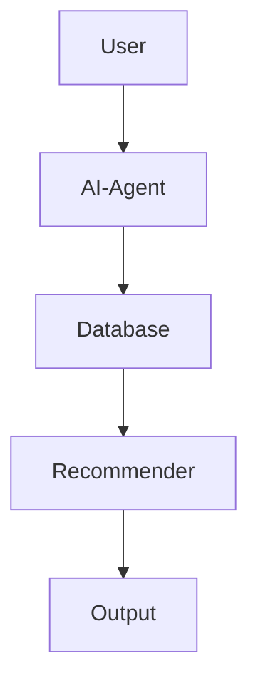

                 


# 智能衣柜：AI Agent的穿搭推荐系统

## 关键词：人工智能, 智能衣柜, 穿搭推荐, AI Agent, 机器学习, 物联网, 推荐系统

## 摘要： 
随着人工智能技术的快速发展，智能衣柜逐渐成为现代生活中不可或缺的一部分。本文将详细介绍智能衣柜的概念、AI Agent在穿搭推荐中的作用、系统的算法原理、架构设计以及实际应用场景。通过深入分析，我们旨在为读者提供一个全面的技术视角，展示如何利用AI技术提升生活品质。

---

## 第一部分: 背景介绍

### 第1章: 智能衣柜的背景与问题背景

#### 1.1 智能衣柜的定义与特点
- **定义**：智能衣柜是一种结合物联网和人工智能技术的智能设备，能够根据用户的个人喜好、天气情况、场合需求等信息，自动推荐最优的穿搭方案。
- **特点**：
  - 数据采集：通过传感器和用户输入，获取用户的身高、体重、穿衣偏好等信息。
  - 智能推荐：基于机器学习算法，分析用户的穿搭数据，提供个性化的推荐。
  - 自动化管理：支持衣物分类、自动折叠等功能，提升用户的使用体验。

#### 1.2 穿搭推荐系统的问题背景
- **问题描述**：传统衣柜缺乏智能化，用户在选择穿搭时往往需要花费大量时间，且难以根据天气、场合等因素快速找到合适的衣物。
- **解决方法**：通过AI Agent技术，智能衣柜能够实时分析用户的穿搭需求，提供精准的推荐，帮助用户快速完成穿搭选择。

#### 1.3 AI Agent在智能衣柜中的作用
- **AI Agent的核心功能**：
  - 数据采集与处理：收集用户的穿搭数据、天气信息等。
  - 智能推荐：基于机器学习算法，生成最优的穿搭方案。
  - 人机交互：通过语音或触控界面，与用户进行实时互动。

---

## 第2章: 智能衣柜穿搭推荐系统的概念结构

### 2.1 智能衣柜穿搭推荐系统的组成要素
- **用户数据**：包括用户的身高、体重、肤色、穿衣风格偏好等。
- **历史穿搭数据**：记录用户过去的穿搭记录，用于分析用户的偏好。
- **天气数据**：获取实时天气信息，确保推荐的穿搭符合当前天气条件。
- **场景需求**：根据用户当前的场景（如工作、休闲、运动等），推荐合适的衣物。

### 2.2 智能衣柜穿搭推荐系统的边界与外延
- **系统边界**：智能衣柜仅限于推荐穿搭方案，不涉及衣物的购买和配送。
- **系统外延**：可以与其他智能家居设备（如智能空调、智能灯泡）联动，提供更全面的智能化体验。

### 2.3 智能衣柜穿搭推荐系统的概念模型
- **概念模型的构建**：通过数据流图展示系统中各个组件之间的关系。
- **概念模型的可视化**：
  ```mermaid
  graph TD
    User --> AI-Agent
    AI-Agent --> Database
    Database --> Recommender
    Recommender --> Output
  ```

---

## 第三部分: 核心概念与联系

### 第3章: AI Agent的核心原理

#### 3.1 AI Agent的基本原理
- **AI Agent的定义**：AI Agent是一种能够感知环境并采取行动以实现目标的智能实体。
- **AI Agent的核心算法**：基于监督学习或无监督学习的推荐算法，如协同过滤、聚类分析等。
- **AI Agent的决策机制**：通过分析用户的输入数据和环境信息，生成最优的穿搭方案。

#### 3.2 AI Agent与智能衣柜的结合
- **AI Agent在智能衣柜中的角色**：作为系统的“大脑”，负责数据处理、算法计算和推荐输出。
- **AI Agent的核心功能**：
  - 数据采集与处理
  - 智能推荐
  - 人机交互

---

## 第4章: 核心概念的属性特征对比

### 4.1 AI Agent与传统推荐系统的对比
- **核心功能对比**：
  - 传统推荐系统：基于用户的历史行为数据进行推荐。
  - AI Agent：结合实时环境数据和用户偏好，提供更精准的推荐。
- **技术实现对比**：
  - 传统推荐系统：基于协同过滤或基于内容的推荐。
  - AI Agent：结合机器学习和自然语言处理技术，提供更智能的推荐。
- **应用场景对比**：
  - 传统推荐系统：广泛应用于电商、视频等领域。
  - AI Agent：专注于特定场景，如智能衣柜的穿搭推荐。

### 4.2 智能衣柜与普通衣柜的对比
- **功能对比**：
  - 普通衣柜：仅提供存储功能。
  - 智能衣柜：提供存储、推荐和管理功能。
- **技术实现对比**：
  - 普通衣柜：无智能化技术。
  - 智能衣柜：结合物联网、AI技术。
- **用户体验对比**：
  - 普通衣柜：用户体验单一，缺乏个性化。
  - 智能衣柜：用户体验丰富，提供个性化推荐和管理功能。

---

## 第5章: 实体关系图与流程图

### 5.1 实体关系图（ER图）


---

## 第四部分: 算法原理讲解

### 第6章: 算法原理

#### 6.1 算法选择与实现
- **算法选择**：基于协同过滤的推荐算法。
- **算法实现**：
  ```python
  def collaborative_filtering(user_id):
      # 获取用户历史评分
      user_ratings = get_user_ratings(user_id)
      # 找出与用户相似的用户
      similar_users = find_similar_users(user_ratings)
      # 综合相似用户的评分，生成推荐列表
      recommendations = generate_recommendations(similar_users)
      return recommendations
  ```

#### 6.2 数学模型与公式
- **协同过滤的数学模型**：
  $$ sim(u, v) = \frac{\sum_{i}(r_{u,i} - \bar{r}_u)(r_{v,i} - \bar{r}_v)}{\sqrt{\sum_{i}(r_{u,i} - \bar{r}_u)^2} \cdot \sqrt{\sum_{i}(r_{v,i} - \bar{r}_v)^2}} $$
  其中，$sim(u, v)$ 表示用户 $u$ 和 $v$ 的相似度，$r_{u,i}$ 表示用户 $u$ 对物品 $i$ 的评分，$\bar{r}_u$ 表示用户 $u$ 的平均评分。

---

## 第五部分: 系统分析与架构设计方案

### 第7章: 系统架构设计

#### 7.1 系统应用场景
- **应用场景**：用户通过智能衣柜选择衣物，系统根据天气和场合推荐穿搭方案。

#### 7.2 系统功能设计
- **领域模型**：
  ```mermaid
  classDiagram
      class User {
          id
          preferences
          size
      }
      class AI-Agent {
          collect_data()
          analyze_data()
          generate_recommendation()
      }
      class Database {
          store_data()
          retrieve_data()
      }
      User --> AI-Agent
      AI-Agent --> Database
  ```

#### 7.3 系统架构设计
- **架构图**：
  ```mermaid
  graph TD
      User --> AI-Agent
      AI-Agent --> Database
      Database --> Recommender
      Recommender --> Output
  ```

---

## 第六部分: 项目实战

### 第8章: 项目实战

#### 8.1 环境安装
- **Python环境**：安装Python 3.8及以上版本。
- **依赖库**：安装numpy、pandas、scikit-learn等库。

#### 8.2 核心代码实现
- **推荐算法实现**：
  ```python
  from sklearn.metrics.pairwise import cosine_similarity

  def collaborative_filtering(user_id, user_features, item_features):
      user_vector = user_features[user_id]
      similarities = cosine_similarity([user_vector], item_features)
      recommendations = sorted(range(len(similarities[0])), key=lambda i: -similarities[0][i])
      return recommendations
  ```

#### 8.3 代码解读与分析
- **代码解读**：
  - `user_features` 表示用户特征矩阵。
  - `item_features` 表示物品特征矩阵。
  - `cosine_similarity` 计算用户与物品之间的余弦相似度。

#### 8.4 案例分析与详细讲解
- **案例分析**：
  - 用户输入身高、体重、肤色等信息。
  - 系统分析用户的偏好，结合天气数据，生成推荐的穿搭方案。

---

## 第七部分: 最佳实践

### 第9章: 最佳实践 tips

#### 9.1 tips
- **数据安全**：确保用户的个人信息和穿搭数据不会被泄露。
- **用户体验**：设计简洁直观的交互界面，提升用户的使用体验。
- **系统维护**：定期更新算法模型，保持推荐的精准度。

#### 9.2 小结
- 本文详细介绍了智能衣柜的概念、AI Agent的核心原理、系统的架构设计以及实际的项目实现。通过这些内容，读者可以全面了解如何利用AI技术提升生活品质。

#### 9.3 注意事项
- 在实际应用中，需注意数据的实时性和算法的可扩展性。
- 确保系统的稳定性，避免因数据错误导致推荐失败。

#### 9.4 拓展阅读
- 推荐阅读《机器学习实战》、《深入理解人工智能》等书籍，进一步提升对AI技术的理解。

---

## 作者：AI天才研究院/AI Genius Institute & 禅与计算机程序设计艺术 /Zen And The Art of Computer Programming

---

通过以上内容，我们希望为读者提供一个全面的技术视角，展示如何利用AI技术打造一个智能衣柜，帮助用户更好地管理衣物，提升生活质量。

