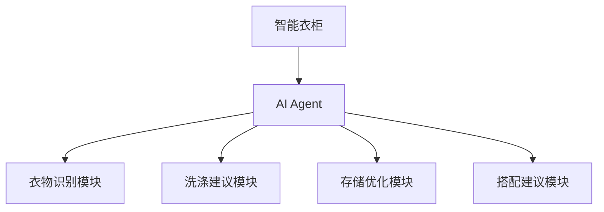

                 


# 智能衣柜：AI Agent的衣物保养建议

> 关键词：智能衣柜，AI Agent，衣物保养，算法原理，系统架构，项目实战

> 摘要：本文探讨了AI Agent在智能衣柜中的应用，详细分析了智能衣柜的发展背景、核心概念、算法原理、系统架构，并通过项目实战展示了AI Agent在衣物保养中的具体应用。文章还提供了最佳实践、注意事项和拓展阅读等内容，帮助读者全面了解智能衣柜的技术实现和应用价值。

---

# 第一部分: 智能衣柜与AI Agent的背景介绍

## 第1章: 智能衣柜的发展背景

### 1.1 智能衣柜的概念与定义

#### 1.1.1 智能衣柜的定义
智能衣柜是一种结合了物联网技术和人工智能的智能设备，能够通过传感器和AI算法，自动识别衣物的种类、材质、颜色，并提供洗涤、保存和搭配建议。

#### 1.1.2 智能衣柜的核心功能与特点
- **衣物识别**：通过图像识别技术，自动识别衣物的种类、品牌和颜色。
- **洗涤建议**：根据衣物的材质和颜色，提供最佳的洗涤温度、水位和洗涤剂建议。
- **存储优化**：通过传感器监测衣柜内的湿度和温度，提供最佳的存储环境建议。
- **搭配建议**：根据用户的穿着习惯和场合，推荐衣物搭配方案。

#### 1.1.3 智能衣柜的发展历程
智能衣柜的发展经历了从传统衣柜到智能衣柜的演变，随着AI技术的进步，智能衣柜逐渐融入更多智能化功能，成为智能家居的重要组成部分。

### 1.2 AI Agent的基本概念

#### 1.2.1 AI Agent的定义
AI Agent是一种能够感知环境、自主决策并执行任务的智能体。它能够通过传感器获取信息，利用算法进行分析，并根据结果采取行动。

#### 1.2.2 AI Agent的核心特征
- **自主性**：能够在没有人工干预的情况下独立工作。
- **反应性**：能够实时感知环境变化并做出反应。
- **学习能力**：能够通过数据学习和优化自己的行为。

#### 1.2.3 AI Agent与智能衣柜的结合
AI Agent作为智能衣柜的核心模块，负责处理衣物识别、洗涤建议等任务，并通过与用户的交互提供个性化的衣物保养服务。

### 1.3 智能衣柜与AI Agent的结合背景

#### 1.3.1 衣物保养问题的现状
传统衣物保养方法依赖于人工经验，存在效率低、易出错的问题。随着AI技术的发展，智能衣柜能够通过AI Agent提供更精准、更高效的衣物保养建议。

#### 1.3.2 AI技术在衣物保养中的应用潜力
AI技术在图像识别、自然语言处理和机器学习领域的应用，为智能衣柜提供了强大的技术支持。

#### 1.3.3 智能衣柜的市场前景与用户需求
随着智能家居的普及和消费者对衣物保养需求的增加，智能衣柜市场潜力巨大，用户对智能化、个性化的衣物保养服务需求日益增长。

## 1.4 本章小结
本章介绍了智能衣柜的发展背景，详细阐述了AI Agent的基本概念，并分析了AI Agent与智能衣柜结合的背景和意义。智能衣柜通过AI Agent的应用，能够为用户提供更智能、更便捷的衣物保养服务。

---

## 第二章: AI Agent在智能衣柜中的核心原理

### 2.1 AI Agent的核心原理

#### 2.1.1 AI Agent的基本工作原理
AI Agent通过感知环境、分析数据、制定决策并执行任务来实现衣物保养的智能化。

#### 2.1.2 AI Agent的感知与决策机制
AI Agent利用图像识别技术感知衣物的种类和材质，通过机器学习模型分析数据并制定洗涤建议。

#### 2.1.3 AI Agent的学习与优化过程
AI Agent通过用户反馈不断优化自身的算法模型，提升衣物保养建议的准确性和实用性。

### 2.2 智能衣柜中的AI Agent架构

#### 2.2.1 智能衣柜AI Agent的系统架构
智能衣柜的AI Agent架构包括数据采集模块、数据处理模块、决策模块和执行模块。

#### 2.2.2 AI Agent与智能衣柜的交互流程
1. 数据采集：AI Agent通过传感器和摄像头采集衣物的信息。
2. 数据处理：AI Agent利用算法分析衣物的种类、材质和颜色。
3. 决策制定：AI Agent根据分析结果制定洗涤建议和存储方案。
4. 执行任务：AI Agent通过智能设备执行洗涤和存储任务。

#### 2.2.3 AI Agent在衣物保养中的具体应用
AI Agent在智能衣柜中的具体应用包括衣物识别、洗涤建议、存储优化和搭配建议。

### 2.3 AI Agent与智能衣柜的关系

#### 2.3.1 AI Agent作为智能衣柜的核心模块
AI Agent是智能衣柜的核心模块，负责处理衣物的识别、分析和建议生成。

#### 2.3.2 AI Agent与智能衣柜其他功能模块的协同工作
AI Agent与其他功能模块协同工作，共同实现智能衣柜的智能化功能。

#### 2.3.3 AI Agent在智能衣柜中的价值体现
AI Agent通过智能化的衣物保养建议，提升了用户的衣物管理效率和生活质量。

## 2.4 本章小结
本章详细介绍了AI Agent在智能衣柜中的核心原理，包括AI Agent的工作机制、系统架构和具体应用。AI Agent作为智能衣柜的核心模块，为用户提供智能化的衣物保养服务。

---

## 第三章: AI Agent的算法原理

### 3.1 AI Agent的核心算法

#### 3.1.1 机器学习算法在AI Agent中的应用
机器学习算法用于AI Agent的衣物识别和分类任务。

#### 3.1.2 自然语言处理算法在AI Agent中的应用
自然语言处理算法用于AI Agent与用户的交互和指令解析。

#### 3.1.3 图像识别算法在AI Agent中的应用
图像识别算法用于AI Agent的衣物种类和材质识别。

### 3.2 AI Agent的算法实现流程

#### 3.2.1 数据采集与预处理
AI Agent通过摄像头和传感器采集衣物信息，并进行数据清洗和特征提取。

#### 3.2.2 模型训练与优化
AI Agent利用训练数据训练机器学习模型，并通过优化算法提升模型的准确性和效率。

#### 3.2.3 模型部署与应用
AI Agent将训练好的模型部署到智能衣柜中，并通过实时数据处理提供衣物保养建议。

### 3.3 AI Agent的算法实现案例

#### 3.3.1 图像识别算法实现
使用卷积神经网络（CNN）进行衣物种类识别，代码如下：

```python
import tensorflow as tf
from tensorflow.keras import layers

model = tf.keras.Sequential([
    layers.Conv2D(32, (3,3), activation='relu', input_shape=(100, 100, 3)),
    layers.MaxPooling2D((2,2)),
    layers.Conv2D(64, (3,3), activation='relu'),
    layers.MaxPooling2D((2,2)),
    layers.Flatten(),
    layers.Dense(128, activation='relu'),
    layers.Dense(10, activation='softmax')
])
```

#### 3.3.2 机器学习模型优化
通过交叉验证和超参数优化提升模型的准确率。

### 3.4 本章小结
本章详细介绍了AI Agent的核心算法，包括机器学习、自然语言处理和图像识别算法，并通过具体案例展示了算法的实现过程。AI Agent通过算法的优化和实现，为智能衣柜提供了强大的技术支撑。

---

## 第四章: 数学模型与公式

### 4.1 图像识别中的数学模型

#### 4.1.1 卷积神经网络（CNN）模型
卷积神经网络用于衣物种类识别，其数学模型如下：

$$
y = f(Wx + b)
$$

其中，$W$ 是权重矩阵，$x$ 是输入数据，$b$ 是偏置项，$f$ 是激活函数。

### 4.2 机器学习中的损失函数
常用的损失函数包括均方误差（MSE）和交叉熵损失函数。

#### 4.2.1 均方误差（MSE）
$$
L = \frac{1}{n}\sum_{i=1}^{n}(y_i - \hat{y}_i)^2
$$

其中，$y_i$ 是真实值，$\hat{y}_i$ 是预测值。

#### 4.2.2 交叉熵损失函数
$$
L = -\frac{1}{n}\sum_{i=1}^{n} y_i \log(\hat{y}_i) + (1 - y_i)\log(1 - \hat{y}_i)
$$

### 4.3 自然语言处理中的语言模型
语言模型用于AI Agent与用户的交互，常用的模型包括循环神经网络（RNN）和Transformer模型。

#### 4.3.1 Transformer模型
Transformer模型的数学公式如下：

$$
\text{Attention}(Q, K, V) = \text{softmax}\left(\frac{QK^T}{\sqrt{d_k}}\right)V
$$

其中，$Q$ 是查询向量，$K$ 是键向量，$V$ 是值向量，$d_k$ 是向量的维度。

### 4.4 本章小结
本章介绍了AI Agent中常用的数学模型和公式，包括卷积神经网络、损失函数和Transformer模型。这些模型为AI Agent的算法实现提供了理论基础。

---

## 第五章: 系统分析与架构设计

### 5.1 问题场景介绍

#### 5.1.1 智能衣柜的使用场景
智能衣柜在家庭、办公室和酒店等多种场景中都有广泛应用。

#### 5.1.2 用户需求分析
用户需要智能衣柜提供衣物识别、洗涤建议、存储优化和搭配建议等服务。

### 5.2 项目介绍

#### 5.2.1 项目目标
本项目旨在开发一款基于AI Agent的智能衣柜，实现衣物的智能化管理和保养。

#### 5.2.2 项目范围
项目范围包括智能衣柜的硬件设计、软件开发和用户界面设计。

### 5.3 系统功能设计

#### 5.3.1 领域模型设计
领域模型设计包括衣物识别、洗涤建议、存储优化和搭配建议四个功能模块。

#### 5.3.2 功能模块设计
- **衣物识别模块**：通过图像识别技术识别衣物的种类和材质。
- **洗涤建议模块**：根据衣物的材质和颜色提供洗涤建议。
- **存储优化模块**：通过传感器监测衣柜内的环境并提供存储建议。
- **搭配建议模块**：根据用户的穿着习惯推荐衣物搭配方案。

### 5.4 系统架构设计

#### 5.4.1 系统架构图
系统架构图展示了智能衣柜的各个功能模块及其相互关系。



#### 5.4.2 接口设计
智能衣柜通过API接口与外部设备和用户进行数据交互。

#### 5.4.3 交互流程设计
智能衣柜的交互流程包括数据采集、数据处理、决策制定和任务执行四个阶段。

### 5.5 本章小结
本章通过问题场景介绍、项目介绍和系统架构设计，详细阐述了智能衣柜的系统设计。系统架构图和功能模块设计为项目的实现提供了清晰的指导。

---

## 第六章: 项目实战

### 6.1 环境安装

#### 6.1.1 系统要求
智能衣柜的开发需要一台计算机、摄像头和传感器。

#### 6.1.2 软件安装
安装Python、TensorFlow和OpenCV等开发工具。

### 6.2 系统核心实现源代码

#### 6.2.1 图像识别代码
使用OpenCV进行衣物颜色检测的代码如下：

```python
import cv2

def detect_color(image):
    # 转换为HSV颜色空间
    hsv = cv2.cvtColor(image, cv2.COLOR_BGR2HSV)
    # 设置颜色检测的阈值
    lower_blue = np.array([100, 50, 50])
    upper_blue = np.array([140, 255, 255])
    # 使用颜色检测提取蓝色区域
    mask = cv2.inRange(hsv, lower_blue, upper_blue)
    return mask
```

#### 6.2.2 洗涤建议代码
根据衣物材质和颜色生成洗涤建议的代码如下：

```python
def generate_wash_recommendations(material, color):
    recommendations = []
    if material == '棉' and color == '深色':
        recommendations.append('使用温水洗涤')
        recommendations.append('选择温和洗涤剂')
    elif material == '丝绸' and color == '浅色':
        recommendations.append('手洗')
        recommendations.append('使用中性洗涤剂')
    return recommendations
```

### 6.3 代码应用解读与分析

#### 6.3.1 图像识别代码分析
图像识别代码通过OpenCV库实现衣物颜色的检测，为洗涤建议提供数据支持。

#### 6.3.2 洗涤建议代码分析
洗涤建议代码根据衣物的材质和颜色生成洗涤建议，确保衣物的清洗过程更加科学和高效。

### 6.4 实际案例分析

#### 6.4.1 案例1: 棉质白色衬衫的洗涤建议
- **材质**：棉
- **颜色**：白色
- **洗涤建议**：
  1. 使用温水洗涤
  2. 使用温和洗涤剂
  3. 常规洗涤周期

#### 6.4.2 案例2: 丝绸黑色礼服的洗涤建议
- **材质**：丝绸
- **颜色**：黑色
- **洗涤建议**：
  1. 手洗
  2. 使用中性洗涤剂
  3. 水温不超过30度

### 6.5 本章小结
本章通过项目实战展示了智能衣柜的实现过程，包括环境安装、代码实现和案例分析。通过实际案例的分析，读者可以更好地理解智能衣柜的技术实现和应用场景。

---

## 第七章: 最佳实践、小结、注意事项和拓展阅读

### 7.1 最佳实践

#### 7.1.1 使用建议
建议用户在使用智能衣柜时，定期更新AI Agent的算法模型，以确保衣物保养建议的准确性。

#### 7.1.2 维护建议
定期清洁智能衣柜的传感器和摄像头，确保设备的正常运行。

### 7.2 小结
智能衣柜通过AI Agent的应用，实现了衣物的智能化管理和保养。本文详细介绍了智能衣柜的发展背景、核心概念、算法原理、系统架构和项目实战，为读者提供了全面的技术指导。

### 7.3 注意事项

#### 7.3.1 数据隐私
智能衣柜需要处理用户的衣物数据，用户需要关注数据隐私问题。

#### 7.3.2 设备兼容性
智能衣柜需要与多种设备兼容，用户在选择时需要注意设备的兼容性。

### 7.4 拓展阅读

#### 7.4.1 智能家居
智能衣柜是智能家居的重要组成部分，读者可以进一步了解智能家居的相关技术。

#### 7.4.2 AI在服装行业的应用
AI技术在服装行业的应用前景广阔，读者可以进一步研究AI在服装设计、生产和销售中的应用。

### 7.5 本章小结
本章总结了智能衣柜的使用建议和注意事项，为读者提供了实用的参考。同时，通过拓展阅读，读者可以进一步了解智能衣柜的相关技术和应用前景。

---

# 作者：AI天才研究院/AI Genius Institute & 禅与计算机程序设计艺术 /Zen And The Art of Computer Programming

---

这篇文章详细介绍了AI Agent在智能衣柜中的应用，从背景介绍到算法实现，再到项目实战，为读者提供了全面的技术指导。通过本文的阅读，读者可以深入了解智能衣柜的技术实现和应用价值，为未来的智能化衣物管理提供参考。

