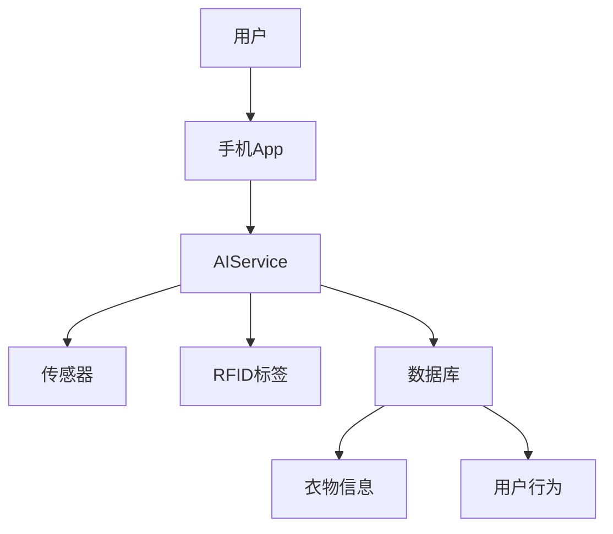
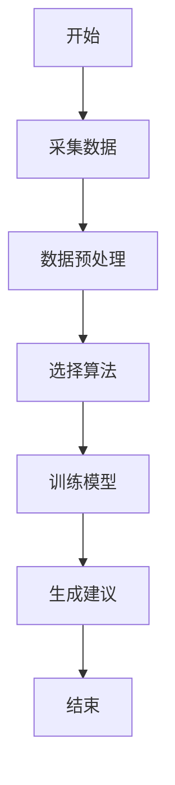
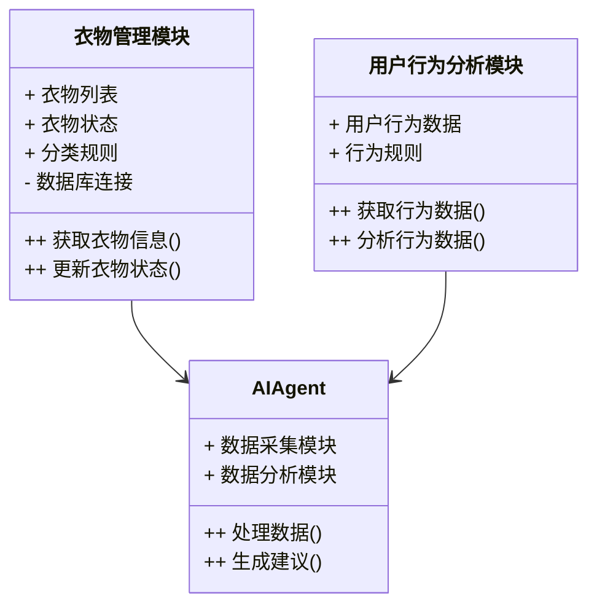
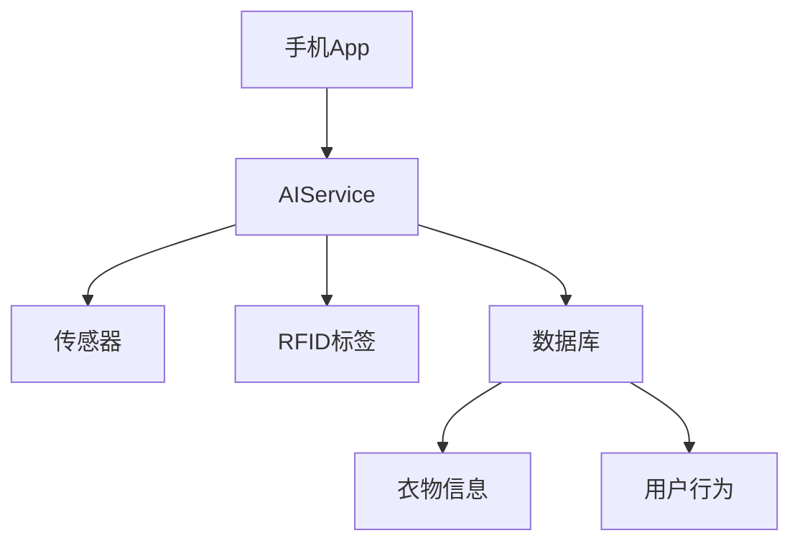
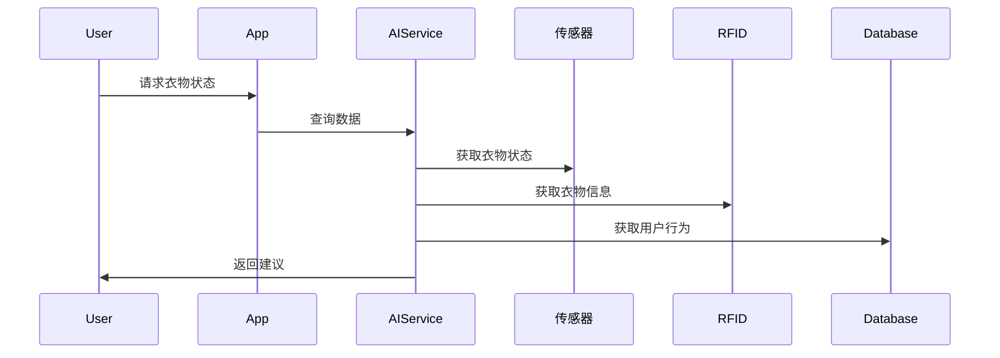

                 


# 智能衣柜：AI Agent的衣物保养提醒

**关键词**：智能衣柜、AI Agent、衣物保养、机器学习、物联网、智能家居

**摘要**：  
随着智能家居的普及，衣物管理的智能化需求日益增长。本文详细探讨了智能衣柜的设计与实现，重点介绍了AI Agent在衣物保养提醒中的应用。通过分析智能衣柜的核心概念、系统架构、算法原理以及项目实战，本文为读者提供了从理论到实践的全面指导。

---

## 第一部分: 智能衣柜与AI Agent的背景与概念

### 第1章: 智能衣柜的背景与问题背景

#### 1.1 智能衣柜的概念与定义
- **智能衣柜的定义**：智能衣柜是一种结合物联网和人工智能技术的衣物管理设备，能够通过传感器和AI算法实现衣物的智能分类、存储和保养提醒。
- **智能衣柜的核心功能**：
  - 衣物分类与存储
  - 衣物状态监测（如材质、颜色、是否需要清洗或熨烫）
  - 用户行为分析与智能提醒
  - 数据同步与远程控制
- **智能衣柜与传统衣柜的区别**：
  | 特性       | 传统衣柜       | 智能衣柜       |
  |------------|----------------|----------------|
  | 功能       | 储物、收纳     | 储物、收纳 + AI |
  | 智能化程度 | 无             | 高             |
  | 交互方式   | 单一           | 多样（语音、App等） |

#### 1.2 问题背景与用户需求
- **问题背景**：
  - 衣物管理混乱，找不到合适的衣物。
  - 衣物保养不及时，导致损坏。
  - 用户对衣物的使用习惯缺乏数据分析支持。
- **用户需求**：
  - 自动分类和存储衣物。
  - 智能提醒衣物的清洗、晾晒和熨烫时间。
  - 通过手机App远程查看衣物状态。
- **市场潜力**：
  - 智能家居市场的快速发展为智能衣柜提供了广阔的空间。
  - Z世代和高收入人群对智能化生活的追求推动了市场增长。

#### 1.3 AI Agent在智能衣柜中的作用
- **AI Agent的定义**：AI Agent是一种能够感知环境、执行任务的智能体，能够根据用户需求主动提供服务。
- **AI Agent在智能衣柜中的应用场景**：
  - 自动监测衣物状态（如材质、颜色、是否需要清洗）。
  - 分析用户行为（如穿衣习惯、衣物使用频率）。
  - 提供智能提醒（如“今天适合穿这条裤子”或“这条衬衫需要清洗”）。
- **AI Agent与智能衣柜的结合方式**：
  - 数据采集：通过传感器获取衣物状态和用户行为数据。
  - 数据分析：利用机器学习算法分析数据，生成个性化建议。
  - 交互反馈：通过语音助手或App与用户互动。

### 第2章: 智能衣柜的核心概念与系统架构

#### 2.1 智能衣柜的核心概念
- **AI Agent的核心功能模块**：
  - 数据采集模块：负责采集衣物状态和用户行为数据。
  - 数据分析模块：利用机器学习算法分析数据，生成保养建议。
  - 交互反馈模块：通过语音或App与用户互动。
- **衣物信息采集与分析**：
  - 采集方式：RFID标签、图像识别、重量传感器。
  - 分析内容：衣物材质、颜色、使用频率。
- **用户行为分析与预测**：
  - 行为数据：用户取衣时间、穿衣习惯。
  - 预测模型：基于时间序列的用户行为预测。

#### 2.2 智能衣柜的系统架构
- **系统模块划分**：
  - 用户界面模块：手机App或语音助手。
  - AI Agent核心模块：数据处理和智能决策。
  - 数据采集模块：传感器和RFID标签。
- **系统功能流程**：
  1. 用户通过App或语音助手发出指令。
  2. 系统采集衣物状态和用户行为数据。
  3. AI Agent分析数据，生成保养建议。
  4. 系统反馈结果给用户。
- **系统架构图（Mermaid）**：



---

## 第二部分: 智能衣柜的算法原理与实现

### 第3章: 智能衣柜的算法原理与实现

#### 3.1 AI Agent的核心算法
- **机器学习算法在衣物保养中的应用**：
  - 分类算法：用于判断衣物是否需要清洗。
  - 聚类算法：根据衣物使用频率进行分类。
- **基于时间序列的用户行为预测**：
  - 使用LSTM（长短期记忆网络）预测用户穿衣习惯。
  - 使用ARIMA模型预测衣物使用频率。
- **基于规则的智能提醒机制**：
  - 设置规则（如“每穿3次后提醒清洗”）。
  - 根据规则生成提醒。

#### 3.2 算法实现与流程图（Mermaid）
- **算法流程图**：



- **数学模型与公式**：
  - **时间序列预测模型**：使用LSTM的数学公式如下：
    $$ f_{\text{LSTM}}(x_t) = \text{LSTM}(x_t, h_{t-1}, c_{t-1}) $$
    其中，$x_t$ 是输入数据，$h_{t-1}$ 是前一时刻的隐藏状态，$c_{t-1}$ 是前一时刻的细胞状态。
  - **分类模型**：使用SVM（支持向量机）进行衣物状态分类：
    $$ \text{ SVM: } y = \text{sign}(w \cdot x + b) $$

#### 3.3 代码应用

```python
import numpy as np
from sklearn.svm import SVC

# 示例数据：衣物状态（0：干净，1：需要清洗）
X = np.array([[1, 0], [2, 0], [3, 1], [4, 1]])
y = np.array([0, 0, 1, 1])

# 训练SVM模型
model = SVC()
model.fit(X, y)

# 预测新的数据点
new_point = np.array([[2.5, 0]])
print("预测结果：", model.predict(new_point))
```

---

## 第三部分: 智能衣柜的系统分析与架构设计

### 第4章: 智能衣柜的系统分析与架构设计

#### 4.1 问题场景介绍
- **用户需求分析**：
  - 用户希望智能衣柜能够自动分类衣物。
  - 用户希望系统能够提供智能提醒。
  - 用户希望可以通过手机App远程查看衣物状态。
- **系统功能需求**：
  - 衣物分类与存储。
  - 衣物状态监测与保养建议。
  - 用户行为分析与智能提醒。
- **系统性能需求**：
  - 响应时间小于1秒。
  - 数据同步延迟不超过5分钟。

#### 4.2 系统功能设计
- **领域模型（Mermaid类图）**：



- **系统功能模块划分**：
  - 衣物管理模块：负责衣物的分类和存储。
  - 用户行为分析模块：分析用户的穿衣习惯。
  - AI Agent：整合数据，生成智能建议。

#### 4.3 系统架构设计
- **系统架构图（Mermaid）**：



- **系统交互流程图（Mermaid）**：



---

## 第四部分: 智能衣柜的项目实战

### 第5章: 智能衣柜的项目实战

#### 5.1 环境安装与配置
- **开发环境搭建**：
  - 操作系统：Windows/Mac/Linux
  - 开发工具：PyCharm/VS Code
- **依赖库安装**：
  - Python库：numpy, scikit-learn, mermaid, matplotlib
  - 其他依赖：传感器SDK、RFID标签驱动
- **数据集准备**：
  - 衣物状态数据：干净/需要清洗。
  - 用户行为数据：取衣时间、穿衣习惯。

#### 5.2 系统核心实现
- **AI Agent核心代码实现**：

```python
import numpy as np
from sklearn.svm import SVC
from sklearn.preprocessing import StandardScaler

# 示例数据：衣物状态（0：干净，1：需要清洗）
X = np.array([[1, 0], [2, 0], [3, 1], [4, 1]])
y = np.array([0, 0, 1, 1])

# 数据预处理
scaler = StandardScaler()
X_scaled = scaler.fit_transform(X)

# 训练SVM模型
model = SVC()
model.fit(X_scaled, y)

# 预测新的数据点
new_point = np.array([[2.5, 0]])
new_point_scaled = scaler.transform(new_point)
print("预测结果：", model.predict(new_point_scaled))
```

- **衣物信息采集模块实现**：
  - 使用RFID标签采集衣物信息。
  - 使用重量传感器监测衣物使用频率。

- **用户行为分析模块实现**：
  - 使用时间序列分析预测用户行为。
  - 基于用户行为生成智能提醒。

#### 5.3 代码应用

```python
# 示例代码：AI Agent的核心逻辑
import pandas as pd
from sklearn.ensemble import RandomForestClassifier

# 示例数据：用户行为数据
data = {
    '时间': [1, 2, 3, 4],
    '行为': ['取衣', '穿衣', '放衣', '清洗']
}
df = pd.DataFrame(data)

# 训练随机森林模型
model = RandomForestClassifier()
model.fit(df[['时间']], df['行为'])

# 预测新的行为
new_time = 5
print("预测行为：", model.predict([[new_time]]))
```

---

## 第五部分: 总结与展望

### 5.4 总结
- **本章小结**：通过本章的学习，读者可以了解智能衣柜的核心概念、系统架构、算法原理以及项目实战。智能衣柜结合AI Agent，能够为用户提供智能化的衣物管理服务，显著提升用户体验。

### 5.5 注意事项
- 数据隐私保护：智能衣柜需要处理用户的衣物数据和行为数据，必须确保数据的安全性和隐私性。
- 系统兼容性：智能衣柜需要与多种设备和平台兼容，确保用户体验的一致性。

### 5.6 拓展阅读
- 推荐书籍：《人工智能：一种现代方法》、《机器学习实战》
- 推荐论文：基于深度学习的衣物状态监测研究

---

**作者：AI天才研究院/AI Genius Institute & 禅与计算机程序设计艺术 /Zen And The Art of Computer Programming**

