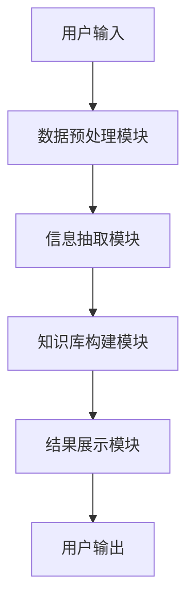
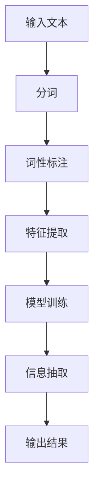
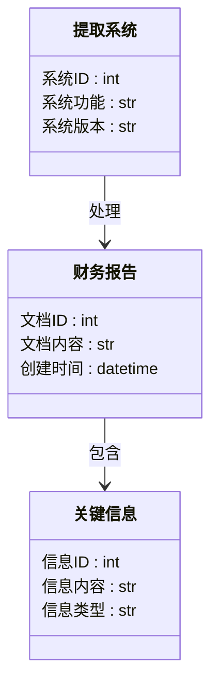
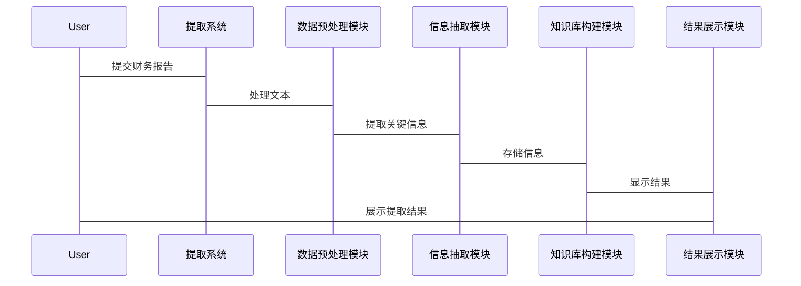

                 


# 《智能财务报告关键信息提取系统》

> 关键词：智能财务报告，关键信息提取，自然语言处理，机器学习，系统架构，Python实现

> 摘要：本文详细探讨了智能财务报告关键信息提取系统的设计与实现，从背景介绍、核心概念、算法原理到系统架构和项目实战，结合实际案例分析，深入剖析了系统的核心技术与实现细节，为读者提供了从理论到实践的全面指导。

---

# 第一部分：智能财务报告关键信息提取系统概述

## 第1章：背景介绍

### 1.1 问题背景

#### 1.1.1 财务报告的重要性
财务报告是企业经营状况的重要反映，包括利润表、资产负债表和现金流量表等。传统方式依赖人工阅读和分析，效率低且容易出错。

#### 1.1.2 传统财务信息处理的痛点
- 数据量大，人工处理耗时耗力。
- 信息分散，提取困难。
- 易受主观因素影响，准确性不足。

#### 1.1.3 智能化信息提取的需求
随着企业数据化转型，智能化信息提取成为提升财务管理效率的关键。

### 1.2 问题描述

#### 1.2.1 财务报告关键信息的定义
关键信息包括财务数据、公司治理信息和行业动态等。

#### 1.2.2 信息提取的难点与挑战
- 文本复杂性：财务报告包含专业术语和复杂结构。
- 数据多样性：格式多样，信息提取难度大。
- 信息关联性：需要理解上下文。

#### 1.2.3 问题解决的目标与意义
目标是实现自动、高效、准确的关键信息提取，意义在于提高财务分析效率和决策支持能力。

### 1.3 问题解决思路

#### 1.3.1 智能化信息提取的核心思想
利用自然语言处理和机器学习技术，从文本中提取关键信息。

#### 1.3.2 技术选型与实现路径
采用NLP技术进行文本处理，结合机器学习模型进行信息提取。

#### 1.3.3 系统边界与外延
系统仅关注财务报告文本，不涉及其他数据源。

### 1.4 核心概念与系统架构

#### 1.4.1 系统核心要素组成
包括输入数据、处理模块、输出结果和反馈机制。

#### 1.4.2 系统功能模块划分
- 数据预处理模块
- 信息抽取模块
- 知识库构建模块
- 结果展示模块

#### 1.4.3 系统整体架构图


---

## 第2章：核心概念与联系

### 2.1 实体定义

#### 2.1.1 财务报告
包含财务数据和公司治理信息的文本文件。

#### 2.1.2 关键信息
财务数据、公司治理信息和行业动态。

#### 2.1.3 提取系统
利用NLP和机器学习技术提取关键信息的软件系统。

### 2.2 实体关系

#### 2.2.1 ER实体关系图
```mermaid
er
  entity 财务报告 {
    key: 文档ID
    attributes: 文档内容, 创建时间
  }
  entity 关键信息 {
    key: 信息ID
    attributes: 信息内容, 信息类型
  }
  entity 提取系统 {
    key: 系统ID
    attributes: 系统功能, 系统版本
  }
  relationship 提取系统 -> 财务报告: 处理
  relationship 财务报告 -> 关键信息: 包含
```

### 2.3 系统基本工作原理

#### 2.3.1 信息抽取过程
1. 数据预处理：分词、句法分析。
2. 实体识别：识别财务数据和公司名称。
3. 信息融合：整合上下文信息。

#### 2.3.2 实体识别机制
使用CRF模型识别财务数据中的实体。

#### 2.3.3 信息融合策略
结合领域知识进行信息验证。

---

## 第3章：算法原理与实现

### 3.1 算法原理

#### 3.1.1 算法选择与原理
- 采用CRF模型进行命名实体识别。
- 使用LSTM进行序列建模。

#### 3.1.2 算法流程
1. 数据预处理：分词、词性标注。
2. 特征提取：利用词向量表示。
3. 模型训练：训练CRF和LSTM模型。
4. 信息抽取：识别关键信息。

#### 3.1.3 算法实现步骤


### 3.2 算法实现代码

#### 3.2.1 数据预处理代码
```python
import jieba

def preprocess(text):
    words = jieba.lcut(text)
    return words
```

#### 3.2.2 模型训练代码
```python
import tensorflow as tf
from tensorflow.keras import layers

model = tf.keras.Sequential([
    layers.Embedding(input_dim=10000, output_dim=100),
    layers.LSTM(64, return_sequences=True),
    layers.Dense(2, activation='softmax')
])
model.compile(loss='sparse_categorical_crossentropy', optimizer='adam', metrics=['accuracy'])
model.fit(X_train, y_train, epochs=10, batch_size=32)
```

#### 3.2.3 信息抽取代码
```python
def extract_info(text):
    words = preprocess(text)
    predicted_labels = model.predict(words)
    info = []
    for word, label in zip(words, predicted_labels):
        if label == '财务数据':
            info.append(word)
    return info
```

### 3.3 算法数学模型

#### 3.3.1 CRF模型条件概率公式
$$ P(y|x) = \frac{\exp(score(y|x))}{\sum_{y'} \exp(score(y'|x))} $$

#### 3.3.2 LSTM模型结构
- 输入层：接收词向量。
- LSTM层：捕捉序列信息。
- 输出层：分类结果。

---

## 第4章：系统分析与架构设计

### 4.1 系统分析

#### 4.1.1 问题场景介绍
财务报告多样性强，需要高效准确的提取系统。

#### 4.1.2 系统功能需求
- 数据预处理模块：处理文本格式。
- 信息抽取模块：识别关键实体。
- 知识库构建模块：存储关键信息。
- 结果展示模块：呈现提取结果。

### 4.2 系统架构设计

#### 4.2.1 领域模型类图


#### 4.2.2 系统架构图


### 4.3 系统接口设计

#### 4.3.1 系统接口定义
- 输入接口：接收财务报告文本。
- 输出接口：返回提取的关键信息。

#### 4.3.2 系统交互流程图


---

## 第5章：项目实战

### 5.1 环境安装与配置

#### 5.1.1 安装Python和相关库
```bash
pip install jieba
pip install tensorflow
pip install matplotlib
```

### 5.2 核心代码实现

#### 5.2.1 数据预处理代码
```python
import jieba

def preprocess(text):
    words = jieba.lcut(text)
    return words
```

#### 5.2.2 模型训练代码
```python
import tensorflow as tf
from tensorflow.keras import layers

model = tf.keras.Sequential([
    layers.Embedding(input_dim=10000, output_dim=100),
    layers.LSTM(64, return_sequences=True),
    layers.Dense(2, activation='softmax')
])
model.compile(loss='sparse_categorical_crossentropy', optimizer='adam', metrics=['accuracy'])
model.fit(X_train, y_train, epochs=10, batch_size=32)
```

#### 5.2.3 信息抽取代码
```python
def extract_info(text):
    words = preprocess(text)
    predicted_labels = model.predict(words)
    info = []
    for word, label in zip(words, predicted_labels):
        if label == '财务数据':
            info.append(word)
    return info
```

### 5.3 实际案例分析

#### 5.3.1 案例背景
假设有一份财务报告文本，需要提取收入、利润等关键信息。

#### 5.3.2 提取过程
1. 预处理：分词。
2. 模型预测：识别财务数据。
3. 展示结果：输出提取的信息。

#### 5.3.3 结果解读
提取的财务数据包括收入、利润等，帮助用户快速了解公司财务状况。

### 5.4 项目小结

#### 5.4.1 项目实现总结
成功实现了从财务报告中提取关键信息的功能。

#### 5.4.2 实践经验总结
- 数据预处理是关键。
- 模型调优可以提高准确率。
- 系统架构设计影响性能。

---

## 第6章：总结与展望

### 6.1 小结

#### 6.1.1 系统总结
介绍了智能财务报告关键信息提取系统的实现，包括算法原理和系统架构。

#### 6.1.2 实践总结
通过项目实战，验证了系统的可行性和有效性。

### 6.2 注意事项

#### 6.2.1 系统使用注意事项
- 确保数据预处理正确。
- 定期更新模型以适应新数据。

#### 6.2.2 系统维护建议
- 定期检查系统性能。
- 及时更新模型参数。

### 6.3 拓展阅读

#### 6.3.1 相关领域延伸
- 多语言信息提取。
- 实时财务信息监控。

#### 6.3.2 推荐学习资源
- 《自然语言处理入门》。
- 《机器学习实战》。

---

# 作者：AI天才研究院 & 禅与计算机程序设计艺术

---

通过本文，读者可以全面了解智能财务报告关键信息提取系统的实现过程，从理论到实践，掌握系统设计的核心技术和方法。希望本文能为读者在实际应用中提供有价值的参考和指导。

