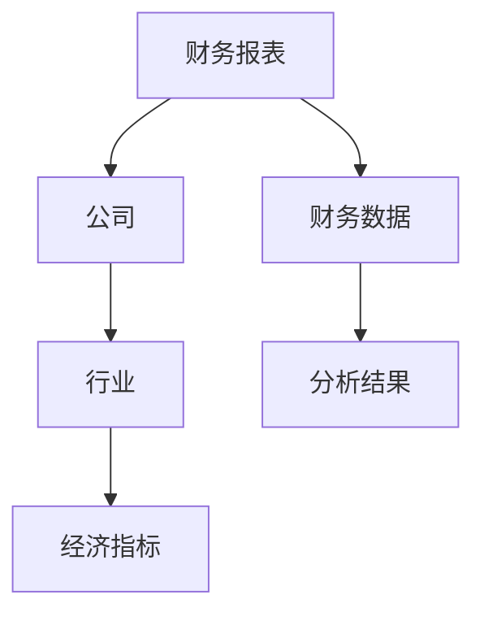
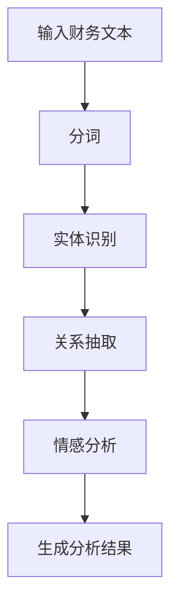
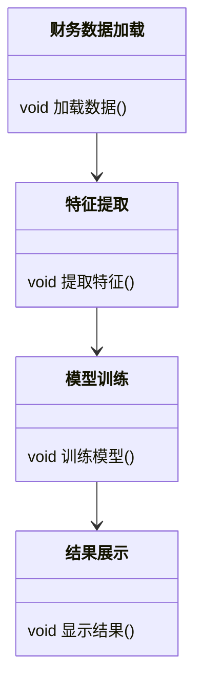
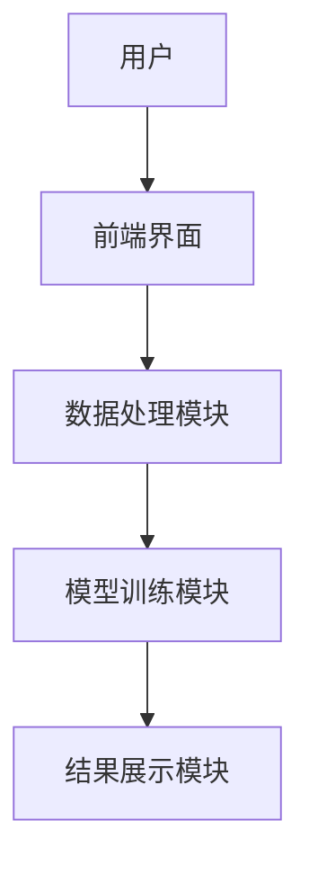
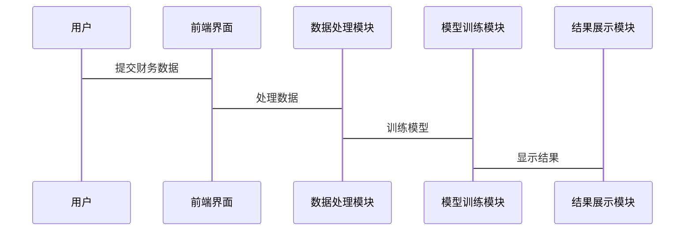

                 


# 智能财务报表分析器

> 关键词：智能财务报表分析器，NLP，机器学习，财务数据，数据分析，人工智能

> 摘要：本文深入探讨了智能财务报表分析器的设计与实现，结合NLP和机器学习技术，详细分析了其核心算法、系统架构、项目实战及最佳实践。通过案例分析，展示了如何利用人工智能技术提升财务报表分析的效率与准确性。

---

## 第一部分: 智能财务报表分析器的背景与核心概念

### 第1章: 智能财务报表分析器的背景介绍

#### 1.1 财务报表分析的现状与挑战

##### 1.1.1 传统财务报表分析的局限性

传统的财务报表分析主要依赖人工审查和手动计算，这种方式效率低下、容易出错，并且难以处理大规模数据。具体表现在以下几个方面：

- **数据量大**：企业财务报表通常包含大量数据，人工分析耗时耗力。
- **信息分散**：财务数据可能分布在多个系统中，难以整合分析。
- **主观性高**：人工分析容易受到主观因素影响，结果可能存在偏差。

##### 1.1.2 企业财务分析的痛点与需求

随着企业规模的扩大和业务复杂度的增加，传统的财务分析方式已无法满足以下需求：

- **实时性**：企业需要快速获取财务数据的实时分析结果。
- **准确性**：避免人为错误，确保分析结果的准确性。
- **智能化**：通过自动化技术提升分析效率，降低人工成本。

##### 1.1.3 智能化财务分析的必要性

智能化财务分析能够帮助企业更好地应对市场变化和内部管理需求。通过引入人工智能技术，可以实现以下目标：

- **自动化数据处理**：自动提取、清洗和整合财务数据。
- **智能预测与决策**：基于历史数据和机器学习模型，预测未来财务状况。
- **实时监控**：实时跟踪企业财务状况，及时发现异常情况。

#### 1.2 智能财务报表分析器的定义与特点

##### 1.2.1 智能财务报表分析器的定义

智能财务报表分析器是一种基于人工智能技术的财务数据分析工具，能够自动处理和分析财务报表数据，生成有意义的财务分析结果，并提供可视化展示。

##### 1.2.2 智能分析的核心特点

智能财务报表分析器的核心特点包括：

- **自动化**：能够自动从财务报表中提取数据，无需人工干预。
- **智能化**：通过机器学习算法，实现财务数据的智能分析与预测。
- **可视化**：以图表形式展示分析结果，便于用户理解和决策。

##### 1.2.3 与传统财务分析工具的区别

与传统财务分析工具相比，智能财务报表分析器的主要区别在于其智能化和自动化能力。传统工具需要人工操作和分析，而智能分析器能够自动完成数据处理、分析和结果展示。

#### 1.3 智能财务报表分析器的核心要素

##### 1.3.1 数据来源与处理

智能财务报表分析器的数据来源包括企业的财务报表、业务数据以及其他相关数据。数据处理过程包括数据清洗、数据整合和数据转换。

##### 1.3.2 分析模型与算法

智能分析器的核心是其分析模型和算法，包括自然语言处理（NLP）、机器学习和数据挖掘等技术。

##### 1.3.3 可视化与用户交互

通过可视化技术，智能分析器将分析结果以图表形式展示给用户，并支持用户与系统进行交互，以便更好地理解和分析数据。

### 第2章: 智能财务报表分析器的核心概念与联系

#### 2.1 核心概念原理

##### 2.1.1 自然语言处理（NLP）在财务文本分析中的应用

NLP技术可以用于财务文本分析，例如从财务报告中提取关键信息和情感分析。

##### 2.1.2 机器学习在财务数据预测中的作用

机器学习算法可以用于预测企业的财务状况，例如利润预测和风险评估。

##### 2.1.3 数据挖掘在财务报表分析中的价值

数据挖掘技术可以帮助发现财务数据中的隐藏模式和趋势，支持企业做出更明智的决策。

#### 2.2 核心概念属性对比表

| 概念         | 特性1           | 特性2           | 特性3           |
|--------------|-----------------|-----------------|-----------------|
| NLP          | 文本处理         | 情感分析         | 实体识别         |
| 机器学习     | 数据训练         | 模型预测         | 模型优化         |
| 数据挖掘     | 数据清洗         | 数据建模         | 数据可视化         |

#### 2.3 ER实体关系图



---

## 第二部分: 智能财务报表分析器的算法原理

### 第3章: 基于NLP的财务文本分析算法

#### 3.1 算法原理概述

##### 3.1.1 NLP在财务文本分析中的流程

NLP在财务文本分析中的流程包括分词、实体识别、关系抽取和情感分析。

##### 3.1.2 常用NLP模型（如BERT）在财务分析中的应用

BERT模型可以用于财务文本的情感分析和实体识别。

##### 3.1.3 NLP与财务知识图谱的结合

通过将NLP与财务知识图谱结合，可以更好地理解财务文本的语义。

#### 3.2 算法流程图



#### 3.3 数学模型与公式

##### 3.3.1 词嵌入表示

$$ \text{词向量} = \text{模型训练结果} $$

##### 3.3.2 情感分析模型

$$ \text{概率} = \sigma(\text{模型输出}) $$

---

## 第三部分: 智能财务报表分析器的系统架构设计

### 第4章: 系统分析与架构设计方案

#### 4.1 问题场景介绍

智能财务报表分析器需要解决的问题包括数据处理、模型训练和结果展示。

#### 4.2 项目介绍

项目目标是开发一个基于人工智能的财务报表分析系统，能够自动处理财务数据并生成分析结果。

#### 4.3 系统功能设计

##### 4.3.1 领域模型



##### 4.3.2 系统架构设计



#### 4.4 系统接口设计

##### 4.4.1 系统接口描述

系统接口包括数据输入接口、模型训练接口和结果展示接口。

##### 4.4.2 接口交互流程



---

## 第四部分: 智能财务报表分析器的项目实战

### 第5章: 项目实战

#### 5.1 环境安装

需要安装Python、TensorFlow、Keras和相关库。

#### 5.2 系统核心实现源代码

##### 5.2.1 数据加载代码

```python
import pandas as pd

def load_financial_data():
    data = pd.read_csv('financial_data.csv')
    return data
```

##### 5.2.2 特征提取代码

```python
from sklearn.feature_extraction.text import TfidfVectorizer

vectorizer = TfidfVectorizer()
features = vectorizer.fit_transform(text_data)
```

##### 5.2.3 模型训练代码

```python
from sklearn.model_selection import train_test_split
from sklearn.linear_model import LogisticRegression

X_train, X_test, y_train, y_test = train_test_split(features, labels, test_size=0.2)
model = LogisticRegression()
model.fit(X_train, y_train)
```

#### 5.3 代码应用解读与分析

##### 5.3.1 数据加载

加载财务数据并进行预处理，确保数据格式符合模型输入要求。

##### 5.3.2 特征提取

使用TF-IDF方法提取文本数据的特征向量。

##### 5.3.3 模型训练

使用逻辑回归模型进行分类训练，生成财务分析结果。

#### 5.4 实际案例分析

##### 5.4.1 案例分析

分析一家公司的财务报表，预测其财务状况。

##### 5.4.2 结果展示

将分析结果以图表形式展示，帮助用户更好地理解。

---

## 第五部分: 智能财务报表分析器的总结与展望

### 第6章: 总结与展望

#### 6.1 总结

智能财务报表分析器通过结合NLP和机器学习技术，能够高效、准确地分析财务数据，为企业提供有力支持。

#### 6.2 展望

未来，随着人工智能技术的不断发展，智能财务报表分析器将在更多领域得到应用，进一步提升财务分析的效率和准确性。

---

## 第六部分: 附录

### 附录A: 数据集

- 数据来源：企业财务报表数据
- 数据格式：CSV文件

### 附录B: 参考文献

- [1] 刘军. 《深度学习与自然语言处理》. 北京: 清华大学出版社, 2020.
- [2] 张伟. 《机器学习实战》. 北京: 人民邮电出版社, 2019.

---

作者：AI天才研究院/AI Genius Institute & 禅与计算机程序设计艺术/Zen And The Art of Computer Programming

