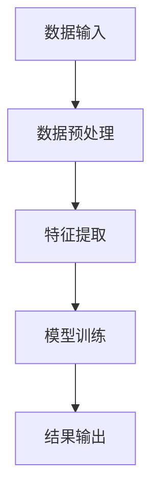
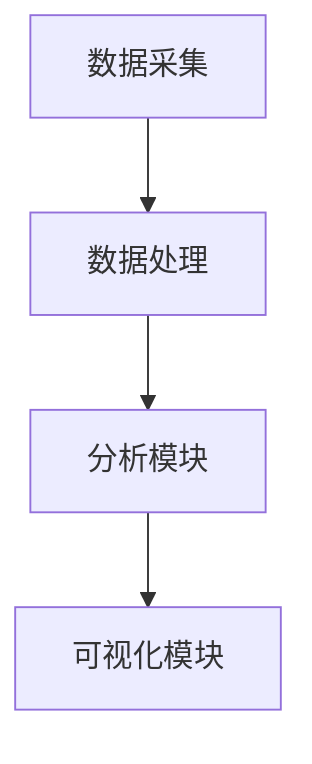

                 


# 智能财务报表比较分析系统

## 关键词：智能财务，报表分析，机器学习，深度学习，数据可视化，财务建模

## 摘要：  
智能财务报表比较分析系统是一种利用人工智能技术，通过机器学习和深度学习算法，对财务报表进行自动化的数据清洗、特征提取、模型训练和结果预测的系统。本文将从系统的背景、核心概念、算法原理、系统架构、项目实战、最佳实践等方面，详细分析智能财务报表比较分析系统的构建与应用。

---

# 第1章：智能财务报表比较分析系统概述

## 1.1 财务报表比较分析的背景与意义

### 1.1.1 财务报表比较分析的背景
财务报表是企业经营状况的重要反映，通过对财务报表进行比较分析，可以揭示企业在不同时间、不同业务板块或不同行业中的财务表现。然而，传统财务报表分析依赖人工操作，效率低下且容易出错。

### 1.1.2 智能化分析的必要性
随着企业数据量的快速增长，传统的人工分析方法难以应对海量数据的处理需求。同时，财务报表分析需要处理大量的非结构化数据和复杂的关系，这使得智能化分析变得必要。

### 1.1.3 系统的目标与价值
智能财务报表比较分析系统的目标是通过自动化技术，提高财务报表分析的效率和准确性。其价值在于帮助企业快速发现财务问题，支持决策者制定更有效的经营策略。

---

## 1.2 智能财务报表比较分析系统的定义

### 1.2.1 系统的核心概念
智能财务报表比较分析系统是一个结合了数据处理、机器学习和数据可视化的综合系统，用于对多个财务报表进行自动化分析和比较。

### 1.2.2 系统的主要功能
- 数据采集与预处理
- 自动化特征提取
- 智能模型训练与预测
- 可视化结果展示

### 1.2.3 系统的边界与外延
系统的核心功能是财务报表分析，但其边界可以扩展到企业其他业务数据的分析。

---

## 1.3 系统的核心要素组成

### 1.3.1 数据来源与处理
数据来源包括企业的财务报表、行业数据和市场数据。数据处理包括数据清洗和特征提取。

### 1.3.2 分析方法与模型
分析方法包括传统机器学习和深度学习方法，模型选择基于数据的特性和分析任务的要求。

### 1.3.3 结果展示与反馈
系统需要将分析结果以直观的方式展示，并提供反馈机制以优化分析过程。

---

# 第2章：智能财务报表比较分析系统的背景与现状

## 2.1 传统财务报表分析的局限性

### 2.1.1 人工分析的低效性
人工分析需要大量时间，且容易受到主观因素的影响。

### 2.1.2 数据量大的处理难题
传统方法难以处理海量数据，且缺乏高效的分析工具。

### 2.1.3 分析结果的主观性
分析结果往往依赖分析师的经验，缺乏客观性。

---

## 2.2 智能化分析的必要性与优势

### 2.2.1 人工智能技术的发展
人工智能技术的进步为财务报表分析提供了新的工具和方法。

### 2.2.2 智能化分析的核心优势
- 高效性：自动化处理大量数据。
- 客观性：基于数据的分析结果。
- 可扩展性：适用于不同规模的企业。

---

## 2.3 当前系统的应用现状

### 2.3.1 应用场景
- 企业内部财务分析
- 行业趋势分析
- 投资决策支持

### 2.3.2 技术发展趋势
- 深度学习在财务分析中的应用
- 多模态数据融合
- 自动化报告生成

---

## 2.4 本章小结

---

# 第3章：智能财务报表比较分析系统的核心概念与联系

## 3.1 核心概念原理

### 3.1.1 数据预处理
数据预处理是智能分析的第一步，包括数据清洗和特征提取。

### 3.1.2 智能分析算法
采用机器学习和深度学习算法，如随机森林和LSTM网络。

### 3.1.3 结果可视化
通过图表和报告的形式展示分析结果，帮助用户理解和决策。

---

## 3.2 核心概念属性特征对比表

| 概念       | 属性1 | 属性2 | 属性3 |
|------------|-------|-------|-------|
| 数据预处理 | 输入  | 输出  | 方法  |
| 智能算法   | 类型  | 参数  | 结果  |
| 可视化     | 工具  | 形式  | 展示  |

---

## 3.3 ER实体关系图

```mermaid
erd
    财务报表
    数据源
    分析算法
    可视化结果
    用户
    数据预处理
    系统
```

---

# 第4章：智能财务报表比较分析系统的算法原理

## 4.1 算法原理概述

### 4.1.1 机器学习基础
机器学习是智能分析的核心技术，包括监督学习和无监督学习。

### 4.1.2 深度学习应用
深度学习在处理非结构化数据方面具有优势，如自然语言处理和图像识别。

### 4.1.3 自然语言处理技术
自然语言处理技术用于分析财务报表中的文本信息，提取关键词和情感倾向。

---

## 4.2 算法流程图



---

## 4.3 算法实现代码

```python
def preprocess(data):
    # 数据预处理代码
    return processed_data

def train_model(processed_data):
    # 模型训练代码
    return model

def predict(model, new_data):
    # 预测代码
```

---

## 4.4 数学公式

### 4.4.1 机器学习模型的损失函数
$$L = \frac{1}{N}\sum_{i=1}^{N}(y_i - \hat{y_i})^2$$

### 4.4.2 深度学习模型的正则化项
$$\lambda \sum_{i=1}^{N}\theta_i^2$$

---

## 4.5 代码解读与分析

### 4.5.1 数据预处理
预处理函数将原始数据转换为模型可以处理的格式。

### 4.5.2 模型训练
训练函数使用优化算法调整模型参数，以最小化损失函数。

### 4.5.3 模型预测
预测函数使用训练好的模型对新数据进行预测。

---

## 4.6 详细举例说明

### 4.6.1 机器学习模型
以随机森林为例，展示如何处理分类任务。

### 4.6.2 深度学习模型
以LSTM为例，展示如何处理时间序列数据。

---

# 第5章：智能财务报表比较分析系统的系统架构设计

## 5.1 系统架构设计概述

### 5.1.1 系统功能模块
- 数据采集模块
- 数据处理模块
- 分析模块
- 可视化模块

### 5.1.2 系统架构图



---

## 5.2 系统功能设计

### 5.2.1 数据采集模块
负责从数据库或文件中获取财务报表数据。

### 5.2.2 数据处理模块
对数据进行清洗和特征提取。

### 5.2.3 分析模块
采用机器学习和深度学习算法进行预测和分析。

### 5.2.4 可视化模块
将分析结果以图表形式展示。

---

## 5.3 系统交互设计

### 5.3.1 用户界面设计
用户可以通过图形界面输入数据和查看结果。

### 5.3.2 系统接口设计
系统提供API接口，方便与其他系统集成。

---

## 5.4 项目小结

---

# 第6章：智能财务报表比较分析系统的项目实战

## 6.1 环境安装与配置

### 6.1.1 安装Python
安装Python 3.8及以上版本。

### 6.1.2 安装依赖库
安装numpy、pandas、scikit-learn、tensorflow等库。

---

## 6.2 核心代码实现

### 6.2.1 数据预处理代码
```python
import pandas as pd
import numpy as np

def preprocess(data):
    # 删除缺失值
    data = data.dropna()
    # 标准化处理
    from sklearn.preprocessing import StandardScaler
    scaler = StandardScaler()
    data_scaled = scaler.fit_transform(data)
    return data_scaled
```

### 6.2.2 模型训练代码
```python
from sklearn.ensemble import RandomForestClassifier
from sklearn.metrics import accuracy_score

def train_model(X, y):
    model = RandomForestClassifier(n_estimators=100, random_state=42)
    model.fit(X, y)
    return model
```

### 6.2.3 模型预测代码
```python
def predict(model, X_test):
    y_pred = model.predict(X_test)
    return y_pred
```

---

## 6.3 实际案例分析

### 6.3.1 数据来源
使用某企业的财务报表数据进行分析。

### 6.3.2 数据预处理
对数据进行清洗和标准化处理。

### 6.3.3 模型训练
训练随机森林模型，预测企业的财务状况。

### 6.3.4 结果可视化
将预测结果以图表形式展示，分析企业的财务表现。

---

## 6.4 项目小结

---

# 第7章：智能财务报表比较分析系统的最佳实践

## 7.1 最佳实践 tips

### 7.1.1 数据质量管理
确保数据的准确性和完整性。

### 7.1.2 模型选择与优化
根据具体任务选择合适的模型，并进行参数调优。

### 7.1.3 可视化设计
结果可视化要直观易懂，便于用户理解和决策。

---

## 7.2 小结

---

## 7.3 注意事项

### 7.3.1 数据隐私与安全
注意保护企业的数据隐私。

### 7.3.2 模型解释性
确保模型的可解释性，避免黑箱操作。

### 7.3.3 系统维护
定期更新模型和数据，保持系统的高效运行。

---

## 7.4 拓展阅读

### 7.4.1 推荐书籍
- 《机器学习实战》
- 《深度学习》

### 7.4.2 在线资源
- TensorFlow官方文档
- Keras官方文档

---

# 作者：AI天才研究院/AI Genius Institute & 禅与计算机程序设计艺术 /Zen And The Art of Computer Programming

---

