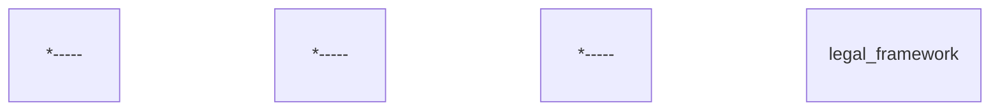
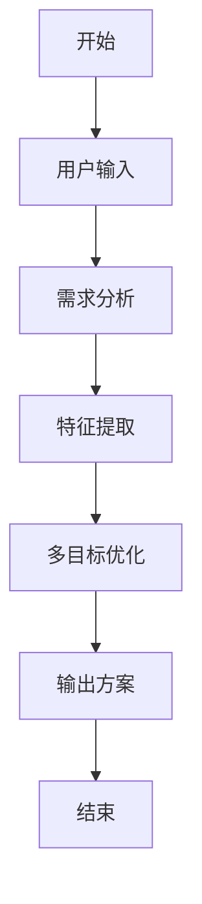
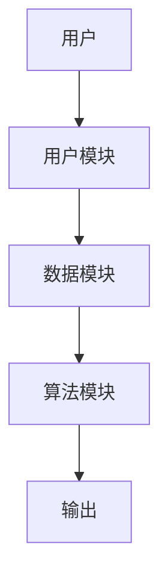

                 


# 智能财富传承规划助手

## 关键词
智能财富传承，人工智能，财富管理，规划助手，数字遗产，风险管理

## 摘要
智能财富传承规划助手是一种结合人工智能技术的工具，旨在通过分析用户的资产配置、家庭结构和法律环境，制定个性化的财富传承方案。本文将从背景介绍、核心概念、算法原理、系统架构、项目实战等方面详细阐述智能财富传承规划助手的设计与实现。

---

# 第一部分: 智能财富传承规划助手的背景与核心概念

## 第1章: 智能财富传承规划助手的背景介绍

### 1.1 问题背景与问题描述
#### 1.1.1 传统财富传承方式的局限性
传统的财富传承方式通常依赖于律师、遗产规划师等专业人员，这种方式存在效率低、成本高、信息不透明等问题。此外，传统方法难以应对复杂的法律环境和多样化的家庭结构需求。

#### 1.1.2 数字化与智能化时代的财富传承需求
随着数字化和智能化时代的到来，人们对于财富管理的需求日益增长，尤其是在资产多样化、家族传承复杂化的情况下，传统方式已无法满足现代人的需求。智能化工具的引入，可以提高效率、降低成本，并提供更加个性化的服务。

#### 1.1.3 智能财富传承规划助手的提出
智能财富传承规划助手是一种结合人工智能技术的工具，旨在通过自动化分析和优化算法，为用户提供高效、个性化的财富传承方案。

### 1.2 问题解决与边界定义
#### 1.2.1 智能财富传承规划助手的目标
智能财富传承规划助手的目标是通过分析用户的需求和资产配置，提供最优的财富传承方案，确保资产的安全性和最大化利用。

#### 1.2.2 边界与外延
智能财富传承规划助手主要关注财富传承的规划阶段，其边界包括用户需求分析、资产配置优化、法律框架分析等。外延则不包括具体的法律执行和资产过户过程。

#### 1.2.3 核心要素与组成部分
智能财富传承规划助手的核心要素包括用户画像、需求分析、财富传承规划算法和多目标优化等。

---

## 第2章: 智能财富传承规划助手的核心概念与联系

### 2.1 核心概念原理
#### 2.1.1 用户画像与需求分析
用户画像是智能财富传承规划助手的基础，通过分析用户的资产、家庭结构、法律环境等信息，构建用户的画像。需求分析则是基于用户画像，提取用户的传承需求和目标。

#### 2.1.2 财富传承规划算法
财富传承规划算法是智能助手的核心，通过分析用户的资产、家庭结构、法律环境等因素，制定最优的传承方案。常用的算法包括多目标优化算法和概率论模型。

#### 2.1.3 多目标优化与风险评估
多目标优化是财富传承规划的重要环节，旨在在多个目标之间找到最优平衡点。风险评估则是对规划方案的稳健性进行评估，确保方案在各种情况下都能有效实施。

### 2.2 核心概念属性对比表
| 概念 | 属性 | 描述 |
|------|------|------|
| 用户画像 | 数据来源 | 用户的资产、家庭结构、法律环境等 |
| 财富传承规划算法 | 输入 | 用户需求、资产配置、法律框架 |
| 多目标优化 | 输出 | 综合最优传承方案 |

### 2.3 ER实体关系图


---

## 第3章: 智能财富传承规划助手的算法原理

### 3.1 算法原理概述
#### 3.1.1 用户画像构建
用户画像是通过收集和分析用户的资产、家庭结构、法律环境等信息，构建用户在财富传承中的需求和目标。

#### 3.1.2 需求分析与特征提取
需求分析是通过自然语言处理和机器学习算法，从用户输入中提取关键特征，如资产分配目标、继承人需求等。

#### 3.1.3 多目标优化与风险评估
多目标优化算法通过在多个目标之间找到最优平衡点，确保传承方案的公平性和效率。风险评估则是对规划方案的稳健性进行评估，确保方案在各种情况下都能有效实施。

### 3.2 算法流程图


### 3.3 数学模型与公式
#### 3.3.1 用户画像模型
$$
u = (a, f, l)
$$
其中，$a$ 表示资产，$f$ 表示家庭结构，$l$ 表示法律环境。

#### 3.3.2 多目标优化模型
$$
\min_{x} \quad f(x) = (f_1(x), f_2(x), ..., f_n(x))
$$
其中，$f_i(x)$ 表示第$i$个目标函数。

---

## 第4章: 智能财富传承规划助手的系统架构

### 4.1 系统功能设计
#### 4.1.1 用户模块
用户模块负责接收用户的输入，包括资产、家庭结构等信息，并将其传递给数据模块。

#### 4.1.2 数据模块
数据模块负责处理和分析用户输入的数据，构建用户画像，并提取特征。

#### 4.1.3 算法模块
算法模块负责根据用户的需求和特征，运行多目标优化算法，生成最优的传承方案。

### 4.2 系统架构图


### 4.3 接口设计与交互
#### 4.3.1 用户接口
用户接口是用户与智能助手之间的交互界面，通常包括输入表单和结果显示界面。

#### 4.3.2 数据接口
数据接口负责与外部数据源（如资产管理系统）进行交互，获取用户的相关数据。

#### 4.3.3 算法接口
算法接口是算法模块与其他模块之间的接口，负责传递数据和控制流程。

---

## 第5章: 智能财富传承规划助手的项目实战

### 5.1 环境安装与配置
#### 5.1.1 系统环境
需要安装Python、Jupyter Notebook等开发工具，并配置相关依赖库。

### 5.2 核心实现代码
#### 5.2.1 用户画像构建
```python
class UserPortrait:
    def __init__(self, assets, family, legal):
        self.assets = assets
        self.family = family
        self.legal = legal
```

#### 5.2.2 需求分析与特征提取
```python
from sklearn.feature_extraction.text import TfidfVectorizer

def extract_features(text):
    vectorizer = TfidfVectorizer()
    features = vectorizer.fit_transform([text])
    return features
```

#### 5.2.3 多目标优化算法
```python
import numpy as np

def multi_objective_optimization(features):
    # 示例：简单多目标优化
    weights = np.random.dirichlet([1,1,1])
    return np.dot(features, weights)
```

### 5.3 代码解读与分析
#### 5.3.1 用户画像构建
用户画像通过类的形式，存储用户的资产、家庭结构和法律环境信息。

#### 5.3.2 需求分析与特征提取
使用TF-IDF方法，从用户输入文本中提取关键词，作为用户需求的特征表示。

#### 5.3.3 多目标优化算法
通过随机权重的方式，对多个目标进行加权求和，生成最终的优化结果。

### 5.4 实际案例分析
#### 5.4.1 案例背景
用户A是一位企业家，资产主要包括公司股权和房地产，家庭结构包括配偶和两个子女，法律环境较为复杂。

#### 5.4.2 分析与实施
通过用户画像构建，提取用户的资产、家庭结构和法律环境信息，然后通过需求分析和特征提取，生成用户的需求模型。最后，通过多目标优化算法，生成最优的传承方案。

### 5.5 项目小结
智能财富传承规划助手通过结合人工智能技术，能够高效地为用户提供个性化的传承方案，帮助用户实现财富的稳健传承。

---

## 第6章: 最佳实践与注意事项

### 6.1 最佳实践 tips
1. 在使用智能财富传承规划助手前，建议用户先进行详细的资产盘点和法律咨询。
2. 定期更新用户的资产和家庭信息，确保传承方案的有效性。

### 6.2 小结
智能财富传承规划助手通过结合人工智能技术，能够为用户提供高效、个性化的财富传承方案，帮助用户实现财富的稳健传承。

### 6.3 注意事项
1. 智能助手的输出仅供参考，具体实施需要结合专业法律意见。
2. 用户在使用过程中，应确保数据的隐私和安全。

### 6.4 拓展阅读
推荐阅读相关领域的书籍和论文，深入理解财富传承和人工智能的结合。

---

## 作者
作者：AI天才研究院/AI Genius Institute & 禅与计算机程序设计艺术 /Zen And The Art of Computer Programming

