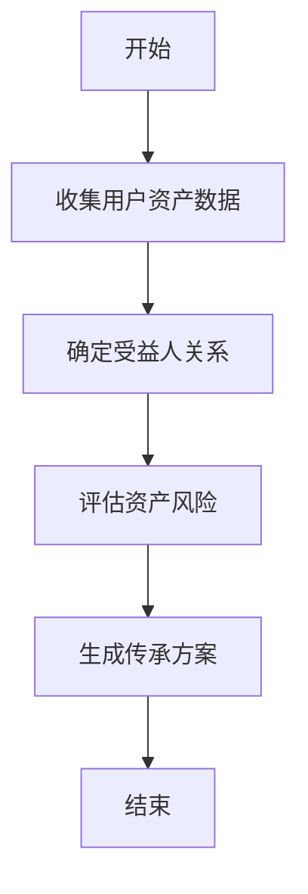
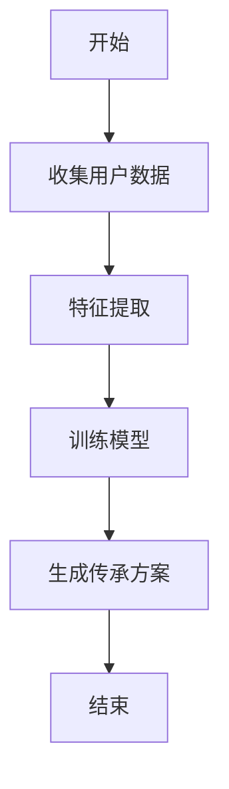

                 


# 智能财富传承规划工具

> 关键词：智能财富传承、AI规划工具、区块链、风险管理、金融计算、法律合规

> 摘要：智能财富传承规划工具利用人工智能和区块链技术，提供高效、透明的财富传承方案，解决传统方式的低效和信息不对称问题。本文详细探讨其实现原理、系统架构及实际应用。

---

## 第一部分: 智能财富传承规划工具的背景与核心概念

### 第1章: 智能财富传承规划工具的背景介绍

#### 1.1 智能财富传承规划工具的背景
- 传统财富传承方式效率低、成本高，且存在信息不对称问题。
- 智能化技术的应用能够提升传承过程的透明度和效率。
- 当前市场对智能化工具的需求日益增长。

#### 1.2 智能财富传承规划工具的定义与目标
- 定义：利用AI和区块链技术，自动化制定和执行财富传承计划的工具。
- 目标：实现财富传承的高效性、透明性和合规性。

#### 1.3 智能财富传承规划工具的市场现状
- 当前市场参与者包括金融科技公司和传统金融机构。
- 技术趋势：AI推荐算法、区块链存证、智能合约的应用。
- 市场痛点：信息孤岛、效率低下、合规风险。

### 第2章: 智能财富传承规划工具的核心概念与联系

#### 2.1 核心概念原理
- 财富传承的核心要素：用户信息、资产配置、法律合规。
- AI技术的应用：数据挖掘、推荐算法、自然语言处理。
- 区块链技术的应用：数据存证、智能合约。

#### 2.2 核心概念属性特征对比
| 特性      | 传统方式        | 智能化工具        |
|-----------|-----------------|-------------------|
| 效率       | 低效            | 高效             |
| 透明度     | 不透明          | 高透明           |
| 成本       | 高              | 低               |
| 合规性     | 易出错          | 高               |

#### 2.3 ER实体关系图架构
```mermaid
erDiagram
    user [用户] {
        <属性> 用户ID : integer
        <属性> 用户名称 : string
        <属性> 用户资产 : float
    }
    advisor [遗产顾问] {
        <属性> 顾问ID : integer
        <属性> 顾问名称 : string
        <属性> 资格认证 : boolean
    }
    beneficiary [受益人] {
        <属性> 受益人ID : integer
        <属性> 受益人名称 : string
        <属性> 受益人关系 : string
    }
    inheritance_plan [遗产计划] {
        <属性> 计划ID : integer
        <属性> 用户ID : integer
        <属性> 创建时间 : datetime
    }
    asset_assessment [资产评估] {
        <属性> 资产评估ID : integer
        <属性> 计划ID : integer
        <属性> 资产价值 : float
    }
    legal_document [法律文件] {
        <属性> 文件ID : integer
        <属性> 计划ID : integer
        <属性> 文件状态 : string
    }
    relationship : 用户 --> 遗产顾问
    relationship : 用户 --> 受益人
    relationship : 遗产计划 --> 资产评估
    relationship : 遗产计划 --> 法律文件
```

---

## 第二部分: 智能财富传承规划工具的算法原理

### 第3章: 基于规则的推荐算法

#### 3.1 算法原理
- 基于用户资产、风险偏好、受益人关系等因素，生成推荐的传承方案。

#### 3.2 算法实现


#### 3.3 算法代码实现
```python
def generate_inheritance_plan(user_assets, beneficiary_relationship):
    if beneficiary_relationship == 'spouse':
        return {'spouse': user_assets * 0.5, 'children': user_assets * 0.5}
    elif beneficiary_relationship == 'children':
        return {'children': user_assets * 0.8, 'charity': user_assets * 0.2}
    else:
        return {'other': user_assets * 1.0}
```

### 第4章: 基于机器学习的推荐算法

#### 4.1 算法原理
- 使用分类模型预测用户最适合的传承方案。

#### 4.2 算法实现


#### 4.3 算法代码实现
```python
import numpy as np
from sklearn import svm

# 示例数据
X = np.array([[500000, 0.5, 'spouse'], [300000, 0.7, 'children']])
y = np.array(['equity', 'trust'])

model = svm.SVC()
model.fit(X, y)
new_case = np.array([[400000, 0.6, 'spouse']])
prediction = model.predict(new_case)
print(prediction)
```

---

## 第三部分: 智能财富传承规划工具的系统分析与架构设计

### 第5章: 系统分析与架构设计方案

#### 5.1 系统功能设计
- 用户管理模块：用户注册、登录、信息管理。
- 资产评估模块：资产评估、风险评估。
- 传承方案生成模块：基于规则和机器学习生成方案。
- 合规检查模块：法律合规性检查。

#### 5.2 系统架构设计


#### 5.3 接口设计与交互流程
- 接口设计：RESTful API。
- 交互流程：用户输入需求，系统生成方案，用户确认后存证到区块链。

---

## 第四部分: 智能财富传承规划工具的项目实战

### 第6章: 项目实战

#### 6.1 环境安装
- 安装Python、TensorFlow、区块链框架。

#### 6.2 核心功能实现
- 资产评估模块实现。
- 传承方案生成模块实现。

#### 6.3 案例分析
- 案例1：用户A的资产分配方案。
- 案例2：用户B的风险评估与合规检查。

---

## 第五部分: 智能财富传承规划工具的最佳实践

### 第7章: 最佳实践

#### 7.1 小结
- 总结工具的核心功能和实现方式。

#### 7.2 注意事项
- 数据安全、用户隐私、法律合规。

#### 7.3 拓展阅读
- 推荐相关书籍和论文。

---

## 作者信息

作者：AI天才研究院/AI Genius Institute & 禅与计算机程序设计艺术 /Zen And The Art of Computer Programming

---

这篇文章详细探讨了智能财富传承规划工具的背景、核心概念、算法原理、系统架构和项目实战，为读者提供了全面的技术视角和实际应用指导。

