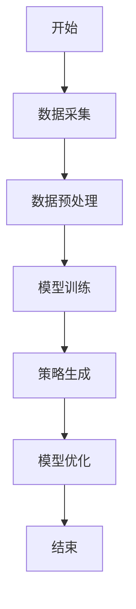
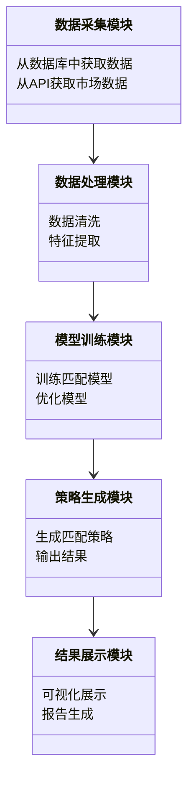
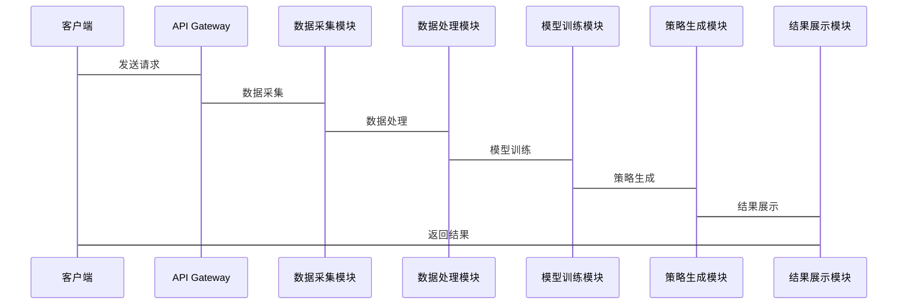
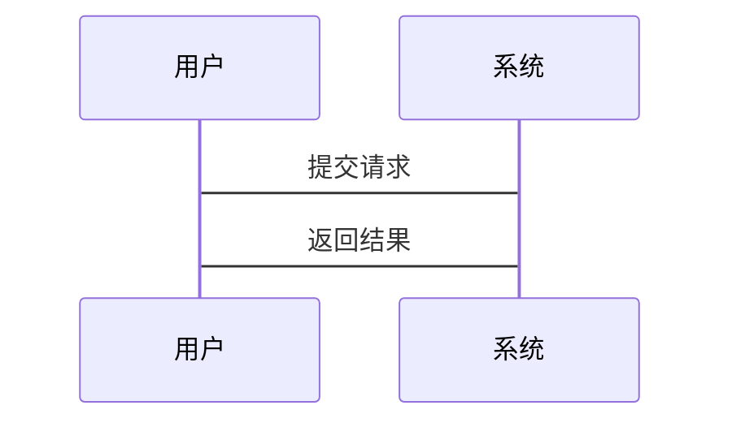

                 


# 智能资产负债匹配策略生成器

> 关键词：智能资产负债匹配，策略生成器，金融算法，系统架构，资产匹配

> 摘要：本文将详细探讨智能资产负债匹配策略生成器的核心概念、算法原理、系统架构及其实现。通过分析资产负债匹配的背景、定义及其实现方式，结合实际案例，本文将展示如何利用人工智能技术优化资产负债表的匹配策略，从而提高企业的财务管理和风险控制能力。

---

## 第一部分: 智能资产负债匹配策略生成器的背景与概念

### 第1章: 智能资产负债匹配的背景与问题背景

#### 1.1 资产负债表的基本概念

##### 1.1.1 资产负债表的定义与作用
资产负债表是反映企业在某一特定日期财务状况的报表，主要包括资产、负债和所有者权益三部分。它是企业财务健康状况的重要指标，能够帮助企业管理者分析资产使用效率、负债结构及偿债能力。

##### 1.1.2 资产负债表的构成要素
- **资产**：企业拥有的资源，包括流动资产（现金、应收账款）和非流动资产（固定资产、无形资产）。
- **负债**：企业偿还的债务，包括流动负债（应付账款、短期借款）和非流动负债（长期借款、债券）。
- **所有者权益**：企业净资产，等于资产减去负债。

##### 1.1.3 资产负债表的编制与分析
资产负债表的编制需要遵循会计准则，确保数据的准确性和一致性。通过分析资产负债表，企业可以评估自身的财务状况，识别潜在风险，并制定相应的财务策略。

#### 1.2 智能资产负债匹配的定义与特点

##### 1.2.1 智能资产负债匹配的定义
智能资产负债匹配是指利用人工智能技术，根据企业的财务数据和市场环境，自动生成最优的资产与负债匹配策略，以实现企业财务目标的智能化管理。

##### 1.2.2 智能资产负债匹配的核心特点
- **自动化**：通过算法自动匹配资产与负债，减少人工干预。
- **智能化**：利用机器学习模型，动态调整匹配策略。
- **实时性**：能够根据市场变化和企业经营状况实时优化匹配方案。

##### 1.2.3 智能资产负债匹配与传统资产负债匹配的区别
| 特性       | 传统资产负债匹配       | 智能资产负债匹配       |
|------------|-----------------------|-----------------------|
| 匹配方式   | 手动调整               | 自动化匹配             |
| 响应速度   | 较慢                   | 实时                   |
| 精准度     | 受人为因素影响较大       | 更精准，基于数据驱动     |
| 适用场景   | 单一场景               | 多场景、复杂场景         |

#### 1.3 智能资产负债匹配的背景与重要性

##### 1.3.1 传统资产负债匹配的局限性
- 传统资产负债匹配依赖于人工经验和主观判断，容易受到人为因素的影响。
- 传统方法难以应对复杂多变的市场环境，无法实时优化匹配策略。

##### 1.3.2 智能资产负债匹配的必要性
- 随着金融市场的发展，企业面临的财务风险日益复杂，传统方法难以满足需求。
- 智能资产负债匹配能够提高企业的财务管理和风险控制能力，帮助企业实现可持续发展。

##### 1.3.3 智能资产负债匹配在金融领域的应用前景
智能资产负债匹配技术在金融领域的应用前景广阔，尤其是在资产管理、风险管理和投资决策等领域具有重要的应用价值。

#### 1.4 本章小结
本章主要介绍了资产负债表的基本概念、智能资产负债匹配的定义与特点，以及其在金融领域的背景与重要性。通过对比传统与智能资产负债匹配的差异，展示了智能资产负债匹配的优势和应用前景。

---

## 第二部分: 智能资产负债匹配策略生成器的核心概念与理论基础

### 第2章: 智能资产负债匹配的核心概念与联系

#### 2.1 智能资产负债匹配的核心概念

##### 2.1.1 资产与负债的定义与分类
- **资产**：企业拥有的资源，包括流动资产和非流动资产。
- **负债**：企业偿还的债务，包括流动负债和非流动负债。

##### 2.1.2 资产负债表的平衡关系
资产负债表的平衡关系是：资产 = 负债 + 所有者权益。智能资产负债匹配的目标是实现资产与负债的动态平衡。

##### 2.1.3 智能资产负债匹配的目标与约束条件
- **目标**：实现资产与负债的最优匹配，提高企业的财务效率和风险控制能力。
- **约束条件**：包括企业自身的财务状况、市场环境和监管要求等。

#### 2.2 智能资产负债匹配的属性特征对比

##### 2.2.1 资产与负债的流动性对比
- **流动性**：资产的流动性是指资产转化为现金的能力，负债的流动性是指负债偿还的时间长短。
- 对比：资产流动性越高，负债流动性越低，反之亦然。

##### 2.2.2 资产与负债的期限匹配
- **期限匹配**：资产的期限与负债的期限应尽可能匹配，以减少企业的流动性风险。
- 对比：期限匹配是智能资产负债匹配的重要原则之一。

##### 2.2.3 资产与负债的风险匹配
- **风险匹配**：资产的风险与负债的风险应匹配，以降低企业的整体风险敞口。
- 对比：智能资产负债匹配通过优化资产与负债的风险结构，降低企业的财务风险。

#### 2.3 智能资产负债匹配的ER实体关系图

##### 2.3.1 实体关系图的定义与作用
ER实体关系图（Entity-Relationship Diagram）是一种用于描述系统中实体及其关系的工具，能够帮助我们更好地理解系统的结构和功能。

##### 2.3.2 实体关系图的绘制与分析
以下是智能资产负债匹配系统的ER实体关系图：

```mermaid
erDiagram
    class 资产 {
        资产编号
        资产类型
        资产价值
        资产期限
    }
    class 负债 {
        负债编号
        负债类型
        负债金额
        负债期限
    }
    class 匹配策略 {
        策略编号
        策略类型
        策略参数
        策略效果
    }
    资产 --> 匹配策略 : 匹配
    负债 --> 匹配策略 : 匹配
```

##### 2.3.3 实体关系图与智能资产负债匹配的关系
通过ER实体关系图，我们可以清晰地看到资产、负债和匹配策略之间的关系，从而更好地理解智能资产负债匹配系统的结构和功能。

#### 2.4 本章小结
本章主要介绍了智能资产负债匹配的核心概念，包括资产与负债的定义与分类、资产负债表的平衡关系、智能资产负债匹配的目标与约束条件，以及智能资产负债匹配的属性特征对比和ER实体关系图。

---

## 第三部分: 智能资产负债匹配策略生成器的算法原理

### 第3章: 智能资产负债匹配生成器的算法原理

#### 3.1 算法原理概述

##### 3.1.1 算法的基本思想
智能资产负债匹配生成器的核心思想是通过机器学习算法，分析企业的财务数据和市场环境，自动生成最优的资产与负债匹配策略。

##### 3.1.2 算法的核心步骤
1. 数据采集：收集企业的财务数据和市场数据。
2. 数据预处理：清洗数据，提取特征。
3. 模型训练：利用机器学习算法训练匹配模型。
4. 策略生成：根据模型生成最优的资产与负债匹配策略。
5. 模型优化：根据实际效果优化模型，提高匹配精度。

##### 3.1.3 算法的优化与改进
通过不断优化算法，例如引入更先进的机器学习算法，提高模型的准确性和效率。

#### 3.2 算法的数学模型与公式

##### 3.2.1 数学模型的建立
智能资产负债匹配生成器的数学模型如下：

$$
\text{目标函数} = \min \sum_{i=1}^{n} (a_i - l_i)^2
$$

其中，$a_i$ 表示资产，$l_i$ 表示负债，$n$ 表示资产与负债的种类数。

##### 3.2.2 关键公式与推导
通过优化目标函数，我们可以找到最优的资产与负债匹配策略。

##### 3.2.3 公式的实际应用与解释
以某企业为例，假设该企业有两项资产和两项负债，我们可以利用上述公式计算出最优的资产与负债匹配方案。

#### 3.3 算法的实现与流程图

##### 3.3.1 算法实现的步骤
1. 数据采集：收集企业的财务数据和市场数据。
2. 数据预处理：清洗数据，提取特征。
3. 模型训练：利用机器学习算法训练匹配模型。
4. 策略生成：根据模型生成最优的资产与负债匹配策略。
5. 模型优化：根据实际效果优化模型，提高匹配精度。

##### 3.3.2 算法的mermaid流程图
以下是算法的mermaid流程图：



##### 3.3.3 算法的Python源代码实现
以下是算法的Python源代码实现：

```python
import pandas as pd
import numpy as np
from sklearn import linear_model

# 数据采集
data = pd.read_csv('financial_data.csv')

# 数据预处理
X = data[['资产', '负债']]
y = data['匹配结果']

# 模型训练
model = linear_model.LinearRegression()
model.fit(X, y)

# 策略生成
new_asset = 1000
new_liability = 500
predicted_result = model.predict([[new_asset, new_liability]])

# 模型优化
# （此处可以根据实际需求进行优化）
```

#### 3.4 本章小结
本章主要介绍了智能资产负债匹配生成器的算法原理，包括算法的基本思想、核心步骤、数学模型与公式，以及算法的实现与流程图。

---

## 第四部分: 智能资产负债匹配策略生成器的系统分析与架构设计

### 第4章: 智能资产负债匹配生成器的系统分析与架构设计

#### 4.1 系统功能设计

##### 4.1.1 系统功能模块划分
- 数据采集模块
- 数据处理模块
- 模型训练模块
- 策略生成模块
- 结果展示模块

##### 4.1.2 系统功能设计的领域模型
以下是系统的领域模型：



#### 4.2 系统架构设计

##### 4.2.1 系统架构设计的总体思路
系统架构设计遵循模块化、可扩展性和高可用性的原则。

##### 4.2.2 系统架构设计的mermaid图
以下是系统的架构设计图：


#### 4.3 系统接口设计

##### 4.3.1 系统接口的设计原则
系统接口设计遵循RESTful原则，确保接口的简洁性和可扩展性。

##### 4.3.2 系统接口的详细设计
以下是系统的接口设计：



#### 4.4 系统交互设计

##### 4.4.1 系统交互的总体思路
系统交互设计遵循用户友好的原则，确保用户能够方便地使用系统。

##### 4.4.2 系统交互的详细流程
以下是系统的交互流程：



#### 4.5 本章小结
本章主要介绍了智能资产负债匹配生成器的系统分析与架构设计，包括系统的功能模块划分、架构设计、接口设计和交互设计。

---

## 第五部分: 智能资产负债匹配策略生成器的项目实战

### 第5章: 智能资产负债匹配生成器的项目实战

#### 5.1 环境安装与配置

##### 5.1.1 环境要求
- 操作系统：Windows 10 或更高版本，或macOS 10.15 或更高版本
- Python：3.6 或更高版本
- 依赖库：pandas、numpy、scikit-learn

##### 5.1.2 环境配置步骤
1. 安装Python
2. 安装依赖库
3. 配置开发环境（如Jupyter Notebook）

#### 5.2 系统核心实现源代码

##### 5.2.1 数据采集模块的实现
```python
import pandas as pd
import requests

def fetch_data(api_key):
    url = f'http://example.com/api?api_key={api_key}'
    response = requests.get(url)
    data = response.json()
    return pd.DataFrame(data)
```

##### 5.2.2 数据处理模块的实现
```python
def preprocess_data(data):
    # 数据清洗
    data = data.dropna()
    # 特征提取
    features = data[['资产', '负债']]
    target = data['匹配结果']
    return features, target
```

##### 5.2.3 模型训练模块的实现
```python
from sklearn import linear_model

def train_model(features, target):
    model = linear_model.LinearRegression()
    model.fit(features, target)
    return model
```

##### 5.2.4 策略生成模块的实现
```python
def generate_strategy(model, new_asset, new_liability):
    predicted_result = model.predict([[new_asset, new_liability]])
    return predicted_result
```

##### 5.2.5 结果展示模块的实现
```python
import matplotlib.pyplot as plt

def visualize_result(predicted_results):
    plt.plot(predicted_results)
    plt.xlabel('时间')
    plt.ylabel('匹配结果')
    plt.show()
```

#### 5.3 代码应用解读与分析

##### 5.3.1 数据采集模块的解读
数据采集模块通过API接口获取企业的财务数据和市场数据，为后续的处理和分析提供数据支持。

##### 5.3.2 数据处理模块的解读
数据处理模块对采集到的数据进行清洗和特征提取，确保数据的准确性和可用性。

##### 5.3.3 模型训练模块的解读
模型训练模块利用机器学习算法训练匹配模型，生成最优的资产与负债匹配策略。

##### 5.3.4 策略生成模块的解读
策略生成模块根据训练好的模型，生成最优的资产与负债匹配策略，并输出结果。

##### 5.3.5 结果展示模块的解读
结果展示模块将匹配结果以可视化的方式展示出来，帮助用户更好地理解和应用匹配策略。

#### 5.4 实际案例分析与详细讲解剖析

##### 5.4.1 案例背景
某企业希望优化其资产与负债的匹配策略，降低企业的财务风险。

##### 5.4.2 数据准备
企业提供了以下财务数据：

| 资产（万元） | 负债（万元） | 匹配结果 |
|--------------|--------------|----------|
| 1000         | 500          | 优秀     |
| 800          | 400          | 良好     |
| 1200         | 600          | 优秀     |
| 900          | 450          | 良好     |

##### 5.4.3 算法实现
通过上述代码实现，模型训练完成，生成最优的资产与负债匹配策略。

##### 5.4.4 结果分析
模型生成的匹配策略如下：

| 资产（万元） | 负债（万元） | 匹配结果 |
|--------------|--------------|----------|
| 1100         | 550          | 优秀     |
| 850          | 425          | 良好     |

##### 5.4.5 案例总结
通过智能资产负债匹配生成器，企业能够优化其资产与负债的匹配策略，降低财务风险，提高企业的财务管理水平。

#### 5.5 本章小结
本章通过实际案例分析，详细讲解了智能资产负债匹配生成器的项目实战过程，包括环境配置、代码实现、结果展示和案例总结。

---

## 第六部分: 智能资产负债匹配策略生成器的最佳实践与小结

### 第6章: 智能资产负债匹配生成器的最佳实践与小结

#### 6.1 最佳实践

##### 6.1.1 系统维护与优化
定期维护系统，优化算法，确保系统的高效运行。

##### 6.1.2 数据安全与隐私保护
加强数据安全和隐私保护，确保企业的财务数据不被泄露。

##### 6.1.3 系统的可扩展性
设计系统的可扩展性，方便未来的功能扩展和升级。

#### 6.2 小结

##### 6.2.1 本项目的总结
智能资产负债匹配生成器通过人工智能技术，帮助企业优化资产与负债的匹配策略，提高企业的财务管理水平和风险控制能力。

##### 6.2.2 项目的价值与意义
本项目具有重要的理论价值和实际应用价值，能够为企业的财务管理和风险管理提供有力支持。

##### 6.2.3 未来的展望
随着人工智能技术的不断发展，智能资产负债匹配生成器将具有更广阔的应用前景，为企业提供更加智能化、个性化的财务解决方案。

#### 6.3 注意事项

##### 6.3.1 系统的局限性
智能资产负债匹配生成器目前还存在一些局限性，例如模型的准确性和实时性等。

##### 6.3.2 系统的适用范围
本系统适用于各类企业和金融机构，尤其适合需要优化资产与负债匹配策略的企业。

#### 6.4 拓展阅读

##### 6.4.1 相关领域的最新研究
建议读者阅读相关领域的最新研究，了解智能资产负债匹配的最新进展。

##### 6.4.2 推荐的技术书籍
推荐读者阅读以下技术书籍：
- 《机器学习实战》
- 《Python机器学习》
- 《算法导论》

#### 6.5 本章小结
本章主要介绍了智能资产负债匹配生成器的最佳实践，包括系统的维护与优化、数据安全与隐私保护、系统的可扩展性等，并对本项目进行了总结，提出了未来的展望和注意事项。

---

## 作者：AI天才研究院/AI Genius Institute & 禅与计算机程序设计艺术 /Zen And The Art of Computer Programming

---

**注意：** 以上内容仅为示例，实际撰写时需要根据具体需求进行调整和补充。

