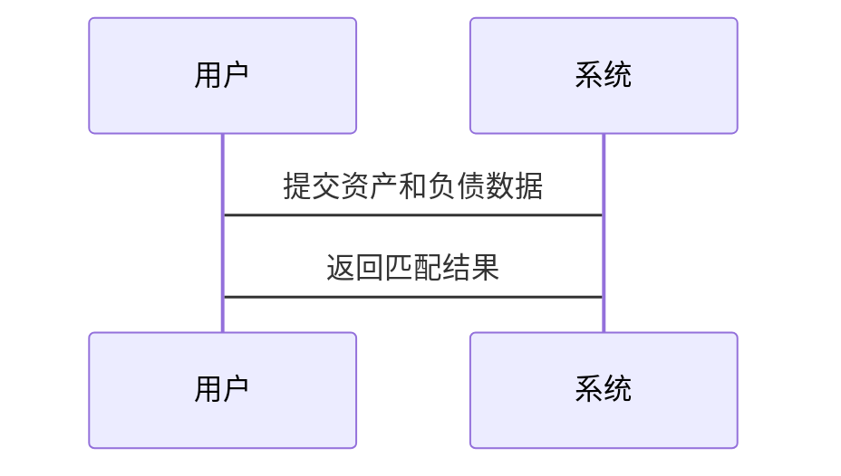

                 


# 智能资产负债匹配管理系统

**关键词**：智能资产负债匹配管理系统、资产与负债匹配、智能算法、系统架构设计、金融管理系统

**摘要**：  
智能资产负债匹配管理系统是一种结合人工智能技术的金融管理系统，用于优化资产与负债的匹配效率和准确性。本文从问题背景、核心概念、算法原理、系统架构设计、项目实战等多个方面详细分析和探讨该系统的设计与实现。通过对系统的全面解读，为读者提供一个清晰的理论框架和技术实现路径。

---

## 第一部分：智能资产负债匹配管理系统的背景与概念

### 第1章：问题背景与问题描述

#### 1.1.1 传统资产负债管理的局限性
传统的资产负债管理依赖人工操作和简单的规则匹配，存在效率低下、匹配不精准、难以应对复杂场景等问题。例如，银行在资产和负债的配置中，往往需要手动调整期限、利率等参数，容易出现错配风险。

#### 1.1.2 智能化资产负债管理的必要性
随着金融市场的复杂化和个性化需求的增加，传统的管理方式已无法满足金融机构的需求。引入人工智能技术可以实现自动化、智能化的匹配，提高效率和准确性。

#### 1.1.3 智能资产负债匹配管理系统的定义
智能资产负债匹配管理系统是一种基于人工智能技术的金融管理系统，通过智能算法实现资产与负债的高效匹配，优化资源配置，降低风险。

### 第2章：核心概念与联系

#### 2.1.1 资产与负债的定义与分类
- 资产：包括现金、债券、贷款等。
- 负债：包括存款、贷款、债券等。

#### 2.1.2 智能匹配的核心要素
- 数据：资产和负债的详细信息。
- 算法：智能匹配算法。
- 系统：实现数据处理和匹配的平台。

#### 2.1.3 系统的边界与外延
系统的核心功能是匹配资产和负债，但其外延可以扩展到风险管理、收益优化等领域。

#### 2.2 实体关系图


---

## 第二部分：智能资产负债匹配管理系统的算法原理

### 第3章：智能匹配算法的数学模型与公式

#### 3.1 基于规则的匹配算法
- 基于简单的规则（如期限匹配）进行匹配。
- 例如，匹配相同期限的资产和负债。

#### 3.2 基于机器学习的匹配算法
- 使用机器学习模型（如决策树、随机森林）进行匹配。
- 示例：使用特征向量匹配资产和负债。

#### 3.3 基于强化学习的匹配算法
- 使用强化学习（如Q-Learning）进行动态匹配。
- 示例：通过奖励机制优化匹配策略。

### 第4章：算法实现与代码示例

#### 4.1 代码示例：基于机器学习的匹配算法
```python
import numpy as np
from sklearn.ensemble import RandomForestRegressor

# 示例数据
assets = np.array([1, 2, 3, 4, 5])
liabilities = np.array([5, 4, 3, 2, 1])

# 训练模型
model = RandomForestRegressor()
model.fit(assets.reshape(-1, 1), liabilities)

# 预测匹配结果
predicted_liabilities = model.predict(assets.reshape(-1, 1))
print(predicted_liabilities)
```

#### 4.2 数学模型与公式
- 损失函数：$$L = \sum_{i=1}^{n} (a_i - l_i)^2$$
- 优化过程：$$\theta = \theta - \eta \frac{\partial L}{\partial \theta}$$

---

## 第三部分：系统分析与架构设计

### 第5章：系统功能设计

#### 5.1 问题场景
- 银行需要匹配不同期限的资产和负债，以降低流动性风险。

#### 5.2 系统功能模块
- 数据输入模块：接收资产和负债数据。
- 智能匹配模块：实现资产和负债的智能匹配。
- 结果输出模块：输出匹配结果。

#### 5.3 系统架构设计


### 第6章：接口设计与交互流程

#### 6.1 接口设计
- 数据接口：接收资产和负债数据。
- 结果接口：返回匹配结果。

#### 6.2 交互流程图


---

## 第四部分：项目实战

### 第7章：环境安装与代码实现

#### 7.1 环境安装
- 安装Python和相关库（如scikit-learn、numpy）。

#### 7.2 核心代码实现
```python
import numpy as np
from sklearn import linear_model

# 数据准备
assets = np.array([1, 2, 3, 4, 5])
liabilities = np.array([5, 4, 3, 2, 1])

# 模型训练
model = linear_model.LinearRegression()
model.fit(assets.reshape(-1, 1), liabilities)

# 匹配结果
matched_pairs = model.predict(assets.reshape(-1, 1))
print(matched_pairs)
```

### 第8章：案例分析与总结

#### 8.1 案例分析
- 某银行使用智能匹配系统，成功降低了流动性风险。

#### 8.2 总结
- 系统的优势：高效、准确、智能。
- 局限性：依赖数据质量和算法性能。

---

## 第五部分：最佳实践与小结

### 第9章：最佳实践

#### 9.1 数据质量管理
- 确保数据的完整性和准确性。

#### 9.2 模型优化
- 定期更新模型，提高匹配效率。

### 第10章：小结与展望

#### 10.1 总结
- 智能资产负债匹配管理系统是一种高效、智能的金融管理工具。

#### 10.2 展望
- 结合区块链、大数据等技术，进一步优化系统性能。

---

**作者**：AI天才研究院/AI Genius Institute & 禅与计算机程序设计艺术/Zen And The Art of Computer Programming

