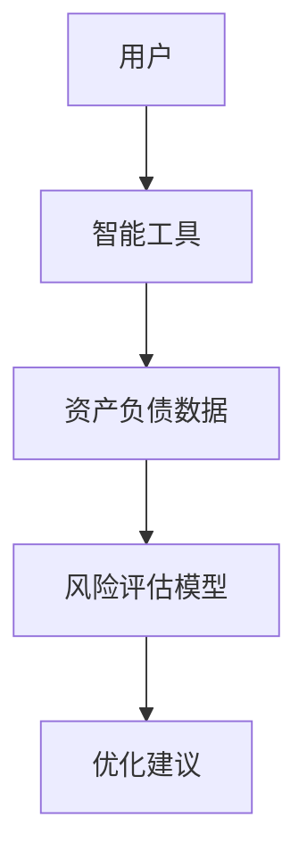
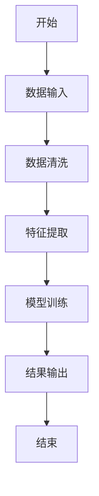
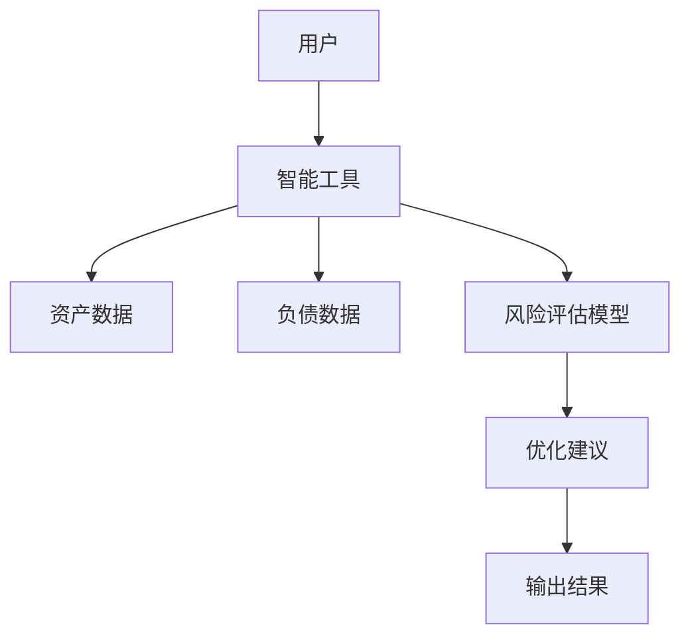
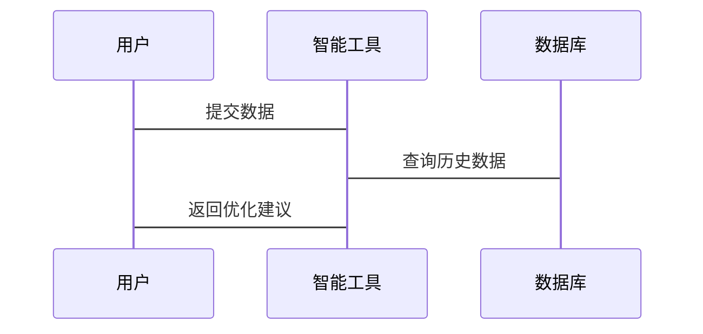

                 


# 智能资产负债管理工具

> 关键词：智能资产负债管理、人工智能、金融科技、风险管理、系统架构、量化分析

> 摘要：智能资产负债管理工具是一种结合人工智能和大数据技术的先进工具，旨在优化金融机构的资产和负债管理流程，提高风险控制能力和资源优化配置。本文将从背景、核心概念、算法原理、系统架构、项目实战等方面，详细探讨智能资产负债管理工具的设计与实现。

---

# 第1章 智能资产负债管理工具的背景与概念

## 1.1 资产负债管理的基本概念

### 1.1.1 资产负债管理的定义
资产负债管理（Asset and Liability Management，ALM）是指通过科学的方法和策略，对金融机构的资产和负债进行规划、监控和调整，以实现风险控制、收益最大化和资本效率优化的过程。

### 1.1.2 资产负债管理的核心要素
- **资产**：包括现金、投资、贷款等金融资产。
- **负债**：包括存款、借款、发行债券等金融负债。
- **目标**：在满足流动性、安全性和盈利性的前提下，优化资产和负债的配置。

### 1.1.3 资产负债管理的目标与原则
- **目标**：通过合理配置资产和负债，实现风险最小化、收益最大化。
- **原则**：匹配性原则、稳定性原则、收益性原则。

## 1.2 智能资产负债管理工具的定义

### 1.2.1 智能工具的定义与特征
智能资产负债管理工具是一种基于人工智能和大数据技术的数字化工具，能够通过自动化、智能化的方式，对资产负债进行实时监控、预测和优化。

### 1.2.2 智能资产负债管理工具的分类
- **基于规则的工具**：根据预设规则进行资产和负债的匹配。
- **基于机器学习的工具**：利用机器学习算法进行预测和优化。
- **混合型工具**：结合规则和机器学习的混合模式。

### 1.2.3 智能工具在现代金融中的作用
- 提高管理效率。
- 增强风险控制能力。
- 优化资源配置。

## 1.3 智能资产负债管理工具的发展背景

### 1.3.1 传统资产负债管理的局限性
- 依赖人工经验，效率低。
- 风险预测能力有限。
- 数据处理能力不足。

### 1.3.2 技术进步对智能工具的影响
- 人工智能和大数据技术的进步推动了智能工具的发展。
- 云计算和分布式计算为智能工具提供了技术支持。

### 1.3.3 金融行业数字化转型的驱动因素
- 金融机构对数字化转型的需求增加。
- 客户对个性化服务的需求增加。
- 监管要求的提高推动金融机构采用智能工具。

## 1.4 智能工具的核心优势

### 1.4.1 提高管理效率
通过自动化和智能化的方式，减少人工干预，提高管理效率。

### 1.4.2 增强风险控制能力
利用机器学习算法，实时监控和预测风险，提高风险控制能力。

### 1.4.3 优化资源配置
通过智能算法，实现资产和负债的最优配置，提高资源利用率。

## 1.5 本章小结
本章介绍了智能资产负债管理工具的基本概念、分类、发展背景和核心优势，为后续章节的深入分析奠定了基础。

---

# 第2章 智能资产负债管理工具的核心概念与联系

## 2.1 智能工具的核心原理

### 2.1.1 数据驱动的决策机制
智能工具通过收集和分析大量的资产和负债数据，利用数据驱动的方式进行决策。

### 2.1.2 智能算法的应用
- **机器学习算法**：如支持向量机（SVM）、随机森林（Random Forest）、神经网络等。
- **优化算法**：如线性规划、遗传算法等。

### 2.1.3 人工智能在资产负债管理中的作用
- **预测**：预测资产和负债的变化趋势。
- **优化**：优化资产和负债的配置。
- **监控**：实时监控资产和负债的风险。

## 2.2 核心概念对比分析

### 2.2.1 传统方法与智能方法对比
| 对比维度 | 传统方法 | 智能方法 |
|----------|----------|----------|
| 数据依赖 | 依赖少量历史数据 | 依赖大量实时数据 |
| 计算能力 | 计算能力有限 | 计算能力强 |
| 风险预测 | 预测能力有限 | 预测能力强 |

### 2.2.2 不同智能工具的性能对比
- **基于规则的工具**：简单易用，但灵活性差。
- **基于机器学习的工具**：灵活性高，但需要大量数据支持。
- **混合型工具**：结合规则和机器学习，兼顾灵活性和稳定性。

### 2.2.3 核心概念的属性特征对比（表格形式）
| 属性 | 传统方法 | 智能方法 |
|------|----------|----------|
| 数据处理能力 | 低 | 高 |
| 风险预测能力 | 低 | 高 |
| 管理效率 | 低 | 高 |

## 2.3 ER实体关系图架构



## 2.4 本章小结
本章通过对比分析和ER实体关系图，详细探讨了智能资产负债管理工具的核心概念和其在现代金融中的应用。

---

# 第3章 智能资产负债管理工具的算法原理

## 3.1 算法原理概述

### 3.1.1 数据预处理
- **数据清洗**：去除冗余数据和异常值。
- **数据转换**：将数据转换为适合算法输入的形式。

### 3.1.2 模型选择
- **回归模型**：用于预测资产和负债的变化趋势。
- **分类模型**：用于分类资产和负债的风险等级。
- **聚类模型**：用于发现资产和负债的潜在模式。

### 3.1.3 算法优化
- **超参数调优**：通过网格搜索等方法优化算法性能。
- **模型集成**：通过集成学习提高模型的准确性和稳定性。

## 3.2 算法流程图



## 3.3 算法实现代码

```python
import pandas as pd
from sklearn.ensemble import RandomForestRegressor
from sklearn.model_selection import GridSearchCV

# 数据清洗
def data_cleaning(data):
    cleaned_data = data.dropna()
    return cleaned_data

# 特征提取
def feature_extraction(data):
    features = data[['asset', 'liability']]
    return features

# 模型训练
def model_training(features, target):
    # 参数网格搜索
    param_grid = {'n_estimators': [100, 200], 'max_depth': [None, 10]}
    grid_search = GridSearchCV(RandomForestRegressor(), param_grid, cv=5)
    grid_search.fit(features, target)
    best_model = grid_search.best_estimator_
    return best_model

# 预测
def predict(best_model, new_features):
    predictions = best_model.predict(new_features)
    return predictions
```

## 3.4 本章小结
本章详细探讨了智能资产负债管理工具的算法原理，包括数据预处理、模型选择和优化方法，并通过代码示例和流程图展示了算法实现的过程。

---

# 第4章 智能资产负债管理工具的系统架构设计

## 4.1 系统功能设计

### 4.1.1 领域模型设计
```mermaid
classDiagram
    class 资产负债数据 {
        asset
        liability
        time_stamp
    }
    class 风险评估模型 {
        risk_score
        prediction
    }
    class 智能工具 {
        <属性>
        data
        model
        result
    }
    <关联>
    智能工具 --> 资产负债数据 : 读取数据
    智能工具 --> 风险评估模型 : 训练模型
    智能工具 --> result : 输出结果
```

### 4.1.2 系统架构设计


### 4.1.3 接口设计
- **输入接口**：接收资产和负债数据。
- **输出接口**：输出风险评估结果和优化建议。

### 4.1.4 交互设计


## 4.2 系统功能实现

### 4.2.1 数据接口实现
```python
# 接收用户输入
def receive_data(user_input):
    return user_input

# 数据存储
def store_data(data, database):
    database.save(data)
```

### 4.2.2 模型接口实现
```python
# 训练模型
def train_model(data, model):
    model.fit(data)
    return model

# 预测接口
def predict_model(new_data, model):
    result = model.predict(new_data)
    return result
```

## 4.3 本章小结
本章从系统架构的角度，详细探讨了智能资产负债管理工具的设计与实现，包括系统功能设计、架构图和接口设计。

---

# 第5章 智能资产负债管理工具的项目实战

## 5.1 项目背景

### 5.1.1 项目介绍
本项目旨在开发一款智能资产负债管理工具，帮助金融机构实现资产和负债的优化配置。

### 5.1.2 项目目标
- 实现资产和负债的实时监控。
- 提供风险评估和优化建议。

## 5.2 核心代码实现

### 5.2.1 数据处理代码
```python
import pandas as pd

def process_data(data):
    # 数据清洗
    cleaned_data = data.dropna()
    # 数据转换
    processed_data = cleaned_data[['asset', 'liability']]
    return processed_data
```

### 5.2.2 模型训练代码
```python
from sklearn.ensemble import RandomForestRegressor

def train_model(features, target):
    model = RandomForestRegressor(n_estimators=100, max_depth=10)
    model.fit(features, target)
    return model
```

### 5.2.3 模型预测代码
```python
def predict_model(model, new_features):
    predictions = model.predict(new_features)
    return predictions
```

## 5.3 实际案例分析

### 5.3.1 案例背景
某银行希望通过智能工具优化其资产和负债配置，降低风险。

### 5.3.2 数据分析
- 资产数据：资产总额为100亿元，主要包括现金、投资和贷款。
- 负债数据：负债总额为80亿元，主要包括存款和借款。

### 5.3.3 风险评估
模型预测未来三个月内资产和负债的变化趋势，发现存在一定的流动性风险。

### 5.3.4 优化建议
- 优化资产配置，增加高流动性资产的比例。
- 优化负债结构，降低短期负债的比例。

## 5.4 项目总结
本项目通过智能工具实现了资产和负债的优化配置，降低了风险，提高了管理效率。

---

# 第6章 智能资产负债管理工具的最佳实践

## 6.1 小结

### 6.1.1 核心内容回顾
- 智能资产负债管理工具的基本概念和核心优势。
- 算法原理和系统架构设计。
- 项目实战和案例分析。

### 6.1.2 关键要点总结
- 数据是智能工具的核心。
- 算法是智能工具的核心驱动力。
- 系统架构设计是智能工具实现的基础。

## 6.2 注意事项

### 6.2.1 数据质量管理
- 数据的准确性和完整性。
- 数据的实时性和动态性。

### 6.2.2 模型优化
- 模型的泛化能力。
- 模型的可解释性。

### 6.2.3 系统安全
- 数据安全。
- 系统稳定性。

## 6.3 拓展阅读

### 6.3.1 推荐书籍
- 《机器学习实战》。
- 《金融风险管理》。

### 6.3.2 推荐博客
- 人工智能与金融科技博客。
- 量化投资与风险管理博客。

## 6.4 本章小结
本章总结了智能资产负债管理工具的核心内容，提出了注意事项和拓展阅读建议，为读者提供了进一步学习和实践的方向。

---

# 附录

## 附录A 术语表

- **资产**：指企业或个人拥有的资源，包括现金、投资、贷款等。
- **负债**：指企业或个人欠款的债务，包括存款、借款、发行债券等。
- **智能工具**：基于人工智能和大数据技术的自动化、智能化工具。
- **风险管理**：识别、评估和控制风险的过程。

## 附录B 工具安装与配置指南

### 1. 安装Python
```bash
python --version
pip install --upgrade pip
```

### 2. 安装必要的库
```bash
pip install pandas
pip install scikit-learn
pip install mermaid
```

### 3. 配置开发环境
- 安装Jupyter Notebook。
- 配置代码编辑器（如VS Code、PyCharm）。

## 附录C 参考文献

1. 《机器学习实战》，周志华著。
2. 《金融风险管理》，约翰·C·哈里著。
3. 《智能系统设计》，张钹著。

---

# 作者

作者：AI天才研究院/AI Genius Institute & 禅与计算机程序设计艺术/Zen And The Art of Computer Programming

