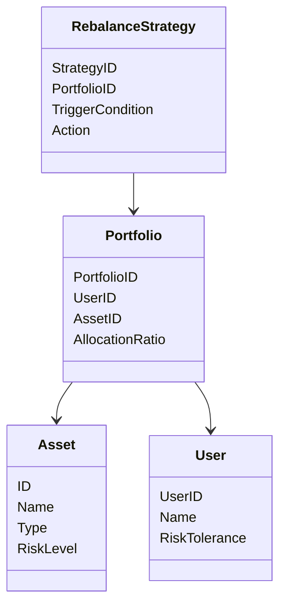
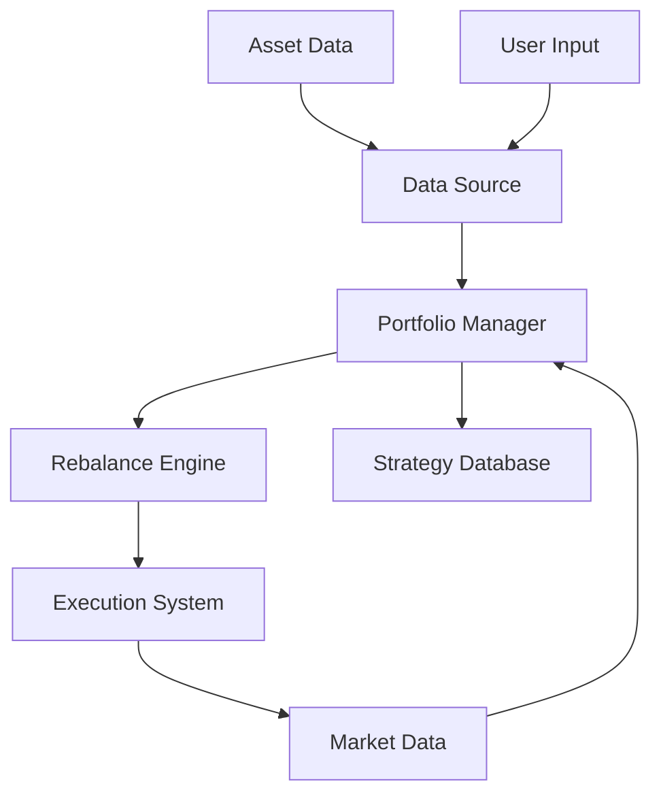

                 


# 《智能资产配置再平衡触发系统》

## 关键词：
智能资产配置、再平衡触发系统、优化算法、系统架构、Python实现

## 摘要：
智能资产配置再平衡触发系统是一种结合金融学与计算机科学的创新技术，旨在通过智能化的方法实现资产配置的动态优化和再平衡。本文系统地介绍该系统的背景、核心概念、算法原理、系统架构及实际应用，深入探讨其在金融领域的应用价值，并通过具体案例分析展示其优势。文章内容包括优化算法、强化学习、系统设计与实现、项目实战等部分，最后总结了系统的应用效果及未来发展方向。

---

# 第1章：资产配置与再平衡概述

## 1.1 资产配置的基本概念
### 1.1.1 资产配置的定义
资产配置是指根据投资目标和风险承受能力，将资金分配到不同资产类别（如股票、债券、现金等）中的过程。通过科学的资产配置，可以分散风险，优化收益。

### 1.1.2 资产配置的分类
资产配置主要分为战略性资产配置和战术性资产配置。前者基于长期投资目标，后者根据市场变化进行短期调整。

### 1.1.3 资产配置的重要性
资产配置是投资组合管理的核心，直接影响投资收益和风险。合理的资产配置能够帮助投资者在不同市场环境下保持稳健的收益。

## 1.2 再平衡的概念与作用
### 1.2.1 再平衡的定义
再平衡是指根据市场变化和投资者目标的调整，定期对投资组合进行调整，使其回归预定配置比例的过程。

### 1.2.2 再平衡的必要性
随着市场波动和资产价格变化，投资组合的实际配置可能偏离目标配置，导致风险增加或收益下降。再平衡能够有效控制风险，优化收益。

### 1.2.3 再平衡的常见触发条件
再平衡通常由时间触发、阈值触发或事件触发。时间触发如定期审查，阈值触发如偏离目标比例一定范围，事件触发如重大市场变化或投资者目标调整。

## 1.3 智能化再平衡的背景与意义
### 1.3.1 传统再平衡方法的局限性
传统再平衡方法依赖人工判断，存在主观性、滞后性和效率低的问题，难以应对复杂多变的市场环境。

### 1.3.2 智能化再平衡的优势
智能化再平衡通过算法和大数据分析，能够实时监控市场变化，快速做出调整决策，提高效率和准确性。

### 1.3.3 智能化再平衡的应用场景
适用于机构投资、个人理财、养老金管理等领域，尤其在市场波动剧烈时，智能化再平衡能够有效降低风险。

## 1.4 本章小结
本章介绍了资产配置和再平衡的基本概念，分析了传统再平衡的局限性和智能化再平衡的必要性及其应用场景。

---

# 第2章：智能资产配置再平衡触发系统的边界与外延

## 2.1 系统的核心要素
### 2.1.1 数据源
系统需要实时获取市场数据、投资组合数据和用户目标数据，作为再平衡决策的基础。

### 2.1.2 触发条件
根据市场波动、投资组合偏离度和用户目标变化，系统设定触发条件，启动再平衡流程。

### 2.1.3 决策模型
基于优化算法和强化学习，构建决策模型，生成再平衡策略。

### 2.1.4 执行机制
将决策模型生成的策略转化为具体的操作指令，执行交易或调整投资组合。

## 2.2 系统的边界
### 2.2.1 输入边界
系统接收市场数据、组合数据和用户目标，明确数据输入的范围和格式。

### 2.2.2 输出边界
系统输出再平衡策略、执行指令和监控报告，确保输出符合用户需求。

### 2.2.3 系统与外部环境的交互
系统通过数据接口与外部系统交互，如交易平台、数据源和用户界面。

## 2.3 系统的外延
### 2.3.1 上层应用
系统可集成到投资管理系统、理财平台和风险管理平台中，提供智能化支持。

### 2.3.2 下层数据源
系统依赖金融数据源、交易平台和用户数据，确保数据的准确性和及时性。

### 2.3.3 第三方服务
系统可与数据分析工具、风险管理服务和合规系统对接，提升功能扩展性。

## 2.4 本章小结
本章明确了智能资产配置再平衡触发系统的核心要素和边界，分析了其外延和应用场景。

---

# 第3章：智能资产配置再平衡触发系统的概念结构

## 3.1 系统的核心概念
### 3.1.1 数据采集模块
负责实时采集市场数据和组合数据，为系统提供输入。

### 3.1.2 决策引擎模块
基于优化算法和强化学习，生成再平衡策略。

### 3.1.3 执行模块
将策略转化为具体交易指令，执行再平衡操作。

### 3.1.4 监控模块
实时监控系统运行状态，评估再平衡效果，并反馈优化建议。

## 3.2 概念属性对比表
| 概念       | 实时性 | 精准性 | 可扩展性 |
|------------|--------|--------|----------|
| 数据采集模块 | 高     | 高     | 中        |
| 决策引擎模块 | 中     | 高     | 高        |
| 执行模块   | 高     | 中     | 中        |
| 监控模块   | 高     | 中     | 高        |

## 3.3 ER实体关系图
```mermaid
erd
    Asset (
        ID,
        Name,
        Type,
        RiskLevel
    )
    User (
        UserID,
        Name,
        RiskTolerance
    )
    MarketData (
        MarketID,
        Timestamp,
        Price,
        Volume
    )
    Portfolio (
        PortfolioID,
        UserID,
        AssetID,
        AllocationRatio
    )
    RebalanceStrategy (
        StrategyID,
        PortfolioID,
        TriggerCondition,
        Action
    )
    link Portfolio --> Asset
    link Portfolio --> User
    link RebalanceStrategy --> Portfolio
```

## 3.4 本章小结
本章通过对比表和ER图详细描述了智能资产配置再平衡触发系统的核心概念及其关系。

---

# 第4章：优化算法原理

## 4.1 动态规划算法
### 4.1.1 算法原理
动态规划通过分解问题，求解子问题，构建最优解。在资产配置中，动态规划可用于求解最优投资组合。

### 4.1.2 数学模型
状态转移方程：
$$ V(t, w) = \max_{a} \{ R(a) + \beta V(t+1, w - a) \} $$
其中，$V$为价值函数，$R$为收益，$\beta$为折扣因子，$a$为投资金额。

### 4.1.3 Python实现
```python
def dynamic_programming():
    # 初始化状态空间
    states = [ ... ]
    # 状态转移
    for t in range(T):
        for w in states:
            max_value = -inf
            for a in actions:
                new_value = compute_value(a, w)
                if new_value > max_value:
                    max_value = new_value
            V[t][w] = max_value
    return V
```

## 4.2 强化学习算法
### 4.2.1 算法原理
强化学习通过智能体与环境交互，学习最优策略。在再平衡中，智能体根据市场状态调整投资组合。

### 4.2.2 数学模型
Q-learning算法：
$$ Q(s, a) = Q(s, a) + \alpha [r + \gamma \max Q(s', a') - Q(s, a)] $$
其中，$s$为状态，$a$为动作，$\alpha$为学习率，$\gamma$为折扣因子。

### 4.2.3 Python实现
```python
class QAgent:
    def __init__(self, state_size, action_size):
        self.q_table = np.zeros((state_size, action_size))
    
    def act(self, state):
        return np.argmax(self.q_table[state])
    
    def learn(self, state, action, reward, next_state):
        self.q_table[state][action] += self.alpha * (reward + self.gamma * np.max(self.q_table[next_state]) - self.q_table[state][action])
```

## 4.3 本章小结
本章详细介绍了动态规划和强化学习算法在智能资产配置再平衡中的应用，展示了其数学模型和Python实现。

---

# 第5章：系统架构设计与实现

## 5.1 系统架构设计
### 5.1.1 领域模型类图


### 5.1.2 系统架构图


## 5.2 系统实现
### 5.2.1 环境安装
需要安装Python、Pandas、NumPy、Matplotlib和相关金融数据接口。

### 5.2.2 核心代码实现
```python
def rebalance_trigger(portfolio, market_data):
    # 计算偏离度
    current_value = calculate_current_value(portfolio, market_data)
    target_value = portfolio['target_allocation']
    deviation = current_value - target_value
    if abs(deviation) > TriggerThreshold:
        return True
    return False
```

## 5.3 本章小结
本章详细设计了智能资产配置再平衡触发系统的架构，并展示了其实现过程。

---

# 第6章：项目实战与应用分析

## 6.1 项目背景与目标
### 6.1.1 项目背景
在股票投资组合管理中，构建一个智能化的再平衡系统，实时监控市场变化，自动调整投资比例。

## 6.2 项目实现
### 6.2.1 环境安装
安装Python 3.8及以上版本，安装Pandas、NumPy、Matplotlib等库。

### 6.2.2 核心代码实现
```python
import pandas as pd
import numpy as np

def optimize_portfolio(weights, returns):
    # 使用均值-方差优化
    n = len(weights)
    Sigma = np.cov(returns.T)
    inv_Sigma = np.linalg.inv(Sigma)
    mu = np.mean(returns, axis=0)
    w_opt = np.dot(inv_Sigma, mu)
    w_opt = w_opt / np.sum(w_opt)
    return w_opt
```

## 6.3 应用案例分析
### 6.3.1 案例分析
在股票和债券组合中，通过动态规划优化配置比例，提高收益，降低风险。

## 6.4 本章小结
本章通过实际案例展示了系统在项目中的应用，验证了其有效性和优势。

---

# 第7章：总结与展望

## 7.1 总结
智能资产配置再平衡触发系统结合了金融学和计算机科学，通过优化算法和系统架构设计，实现了智能化的资产管理和风险控制。

## 7.2 展望
未来，系统将进一步优化算法，引入更多数据源和机器学习技术，提升其智能化水平和应用范围。

---

作者：AI天才研究院/AI Genius Institute & 禅与计算机程序设计艺术 /Zen And The Art of Computer Programming

