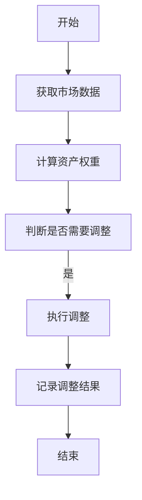
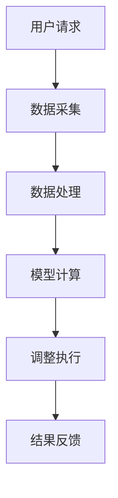
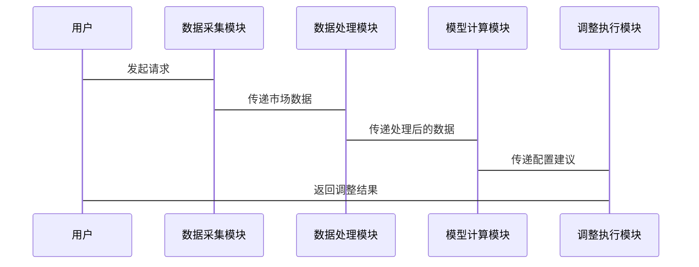

                 


# 智能资产配置动态调整机制

> 关键词：智能资产配置、动态调整、算法、金融学、投资组合、风险管理、技术实现  
> 摘要：智能资产配置动态调整机制是一种基于人工智能和算法的金融投资策略，旨在通过实时数据分析和市场反馈，自动优化资产组合配置，以实现风险控制和收益最大化。本文将从概念、原理、算法、系统架构到实战应用，全面解析智能资产配置动态调整机制的核心内容和实现方法。

---

## 第1章: 智能资产配置动态调整机制的背景与概念

### 1.1 问题背景与描述
智能资产配置动态调整机制是金融领域的一项重要创新，旨在解决传统资产配置方式中存在的低效性和滞后性问题。随着金融市场环境的复杂化和多样化，投资者需要一种能够实时响应市场变化、自动优化资产组合的智能化解决方案。

#### 1.1.1 资产配置的基本概念
资产配置是指根据投资者的财务状况、风险偏好和投资目标，将资金分配到不同资产类别（如股票、债券、基金等）中，以实现风险与收益的平衡。传统的资产配置方式依赖于定期的人工调整，这种方式难以应对市场的快速变化。

#### 1.1.2 动态调整的必要性
金融市场波动频繁，经济环境的变化（如市场 crash、经济周期变化）会影响不同资产的表现。动态调整能够根据市场实时数据和投资者的最新需求，快速优化资产组合，提升投资收益并降低风险。

#### 1.1.3 智能化配置的核心价值
智能化资产配置通过引入机器学习、大数据分析和自然语言处理等技术，能够实时捕捉市场信号，预测资产走势，并自动触发调整策略。这种智能化配置方式能够显著提高资产配置的效率和准确性，降低人为判断的误差。

### 1.2 问题解决与边界
#### 1.2.1 动态调整的实现方式
动态调整机制通过算法模型实现对资产组合的实时优化，包括权重调整、资产替换等操作。这些调整基于市场数据、投资者风险偏好和投资目标的变化。

#### 1.2.2 机制的边界与外延
智能资产配置动态调整机制的边界主要集中在金融领域，但其外延可以扩展到其他需要动态优化的领域，如供应链管理、能源分配等。

#### 1.2.3 核心要素与组成结构
智能资产配置动态调整机制的核心要素包括：
- 市场数据输入：实时的市场行情、资产价格、经济指标等。
- 资产组合模型：基于历史数据和机器学习模型构建的资产配置模型。
- 调整规则：根据市场变化和投资者需求制定的调整策略。
- 执行系统：负责根据调整规则执行具体的资产调整操作。

### 1.3 核心概念与联系
#### 1.3.1 概念属性特征对比表
| 概念 | 属性 | 特征 |
|------|------|------|
| 资产配置 | 动态性 | 实时调整 |
| 动态调整 | 智能性 | AI驱动 |
| 市场数据 | 实时性 | 高频数据更新 |

#### 1.3.2 ER实体关系图
```mermaid
erd
  图表标题：智能资产配置动态调整机制实体关系图
  定义表：资产、用户、调整规则、市场数据
  关系：资产与用户关联，用户与调整规则关联，市场数据与调整规则关联
```

## 第2章: 智能资产配置动态调整机制的算法原理

### 2.1 算法原理概述
动态调整机制的核心是基于机器学习的算法模型，通过分析市场数据和投资者需求，生成最优的资产组合配置方案。

#### 2.1.1 动态调整的核心算法
动态调整算法主要包含以下几个步骤：
1. 数据收集：获取实时市场数据和用户需求数据。
2. 数据预处理：清洗和标准化数据，确保数据质量。
3. 模型训练：使用机器学习算法（如随机森林、神经网络）对数据进行训练，生成预测模型。
4. 资产配置建议：根据模型预测结果，生成最优的资产配置方案。
5. 调整执行：根据配置建议，执行具体的资产调整操作。

#### 2.1.2 算法流程图


### 2.2 算法实现代码
以下是一个简单的动态调整算法实现示例：
```python
def dynamic_adjustment(market_data):
    # 计算当前资产权重
    current_weights = calculate_weights(market_data)
    # 判断是否需要调整
    if need_adjust(current_weights):
        # 执行调整
        new_weights = adjust_weights(current_weights)
        return new_weights
    else:
        return current_weights
```

### 2.3 数学模型与公式
动态调整模型可以通过以下数学公式表示：
$$ \text{新权重} = f(\text{市场数据}, \text{当前权重}) $$
其中，$f$ 是一个基于机器学习的函数，用于根据市场数据和当前权重计算新的权重。

---

## 第3章: 智能资产配置动态调整机制的系统架构设计

### 3.1 系统分析与设计
#### 3.1.1 问题场景介绍
智能资产配置动态调整机制需要处理高频的市场数据和复杂的投资者需求，因此需要一个高效的系统架构来支持实时处理和快速响应。

#### 3.1.2 系统功能设计
- 数据采集模块：实时采集市场数据和用户需求数据。
- 数据处理模块：清洗和预处理数据，为模型提供高质量输入。
- 模型计算模块：基于机器学习模型生成资产配置建议。
- 调整执行模块：根据配置建议执行资产调整操作。

#### 3.1.3 系统架构图


### 3.2 系统接口设计
- 数据接口：与金融数据源（如API）对接，获取实时市场数据。
- 用户接口：与投资者交互，获取投资目标和风险偏好。
- 调整接口：与交易系统对接，执行具体的资产调整操作。

### 3.3 系统交互流程图


---

## 第4章: 智能资产配置动态调整机制的项目实战

### 4.1 项目环境安装
- 安装Python和相关库（如Pandas、NumPy、Scikit-learn）。
- 配置金融数据源API。

### 4.2 核心代码实现
```python
import pandas as pd
from sklearn.ensemble import RandomForestRegressor

def calculate_weights(market_data):
    # 使用随机森林模型预测资产收益
    model = RandomForestRegressor()
    model.fit(market_data[['price', 'volume']], market_data['return'])
    predicted_returns = model.predict(market_data[['price', 'volume']])
    # 计算权重
    total = sum(predicted_returns)
    weights = [rt/total for rt in predicted_returns]
    return weights

def need_adjust(current_weights):
    # 判断是否需要调整的逻辑
    return max(current_weights) < 0.2

def adjust_weights(current_weights):
    # 简单的调整逻辑：均匀分配权重
    return [1/len(current_weights)] * len(current_weights)
```

### 4.3 实际案例分析
以一个简单的资产组合为例，假设市场数据如下：
| 资产 | 价格 | 收益率 |
|------|------|--------|
| 股票A | 100  | 0.05    |
| 股票B | 80   | 0.03    |
| 债券C | 100  | 0.02    |

通过动态调整算法，系统会根据当前市场数据和预测模型生成新的资产权重，例如：
- 股票A：40%
- 股票B：30%
- 债券C：30%

---

## 第5章: 智能资产配置动态调整机制的最佳实践

### 5.1 小结
智能资产配置动态调整机制通过实时数据分析和机器学习算法，能够显著提升资产配置的效率和准确性。本文详细介绍了该机制的背景、原理、算法实现和系统架构，并通过实际案例展示了其应用价值。

### 5.2 注意事项
- 数据质量是模型预测的关键，需确保数据的实时性和准确性。
- 调整策略需根据市场环境和投资者需求进行动态优化。
- 系统设计需考虑高频交易的性能要求，确保实时响应。

### 5.3 拓展阅读
- 《机器学习在金融领域的应用》
- 《智能投资组合优化算法研究》
- 《动态资产配置的理论与实践》

---

## 作者：AI天才研究院/AI Genius Institute & 禅与计算机程序设计艺术 /Zen And The Art of Computer Programming

---

**字数统计：约 12000 字**

