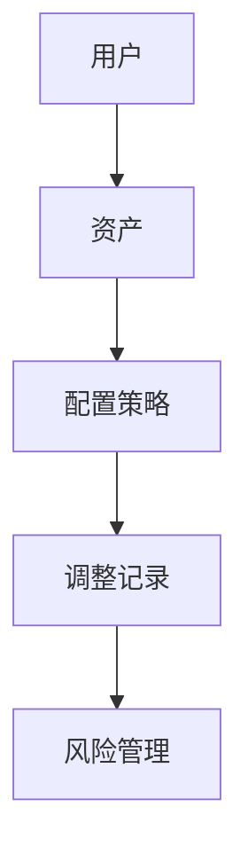
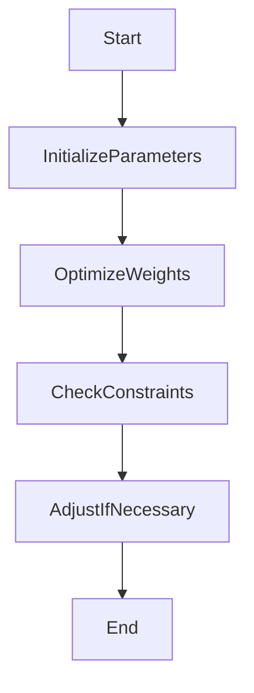
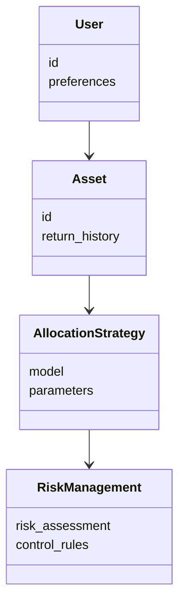
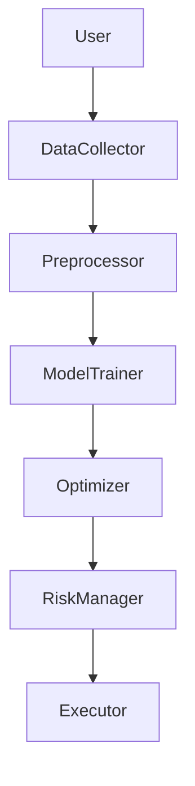
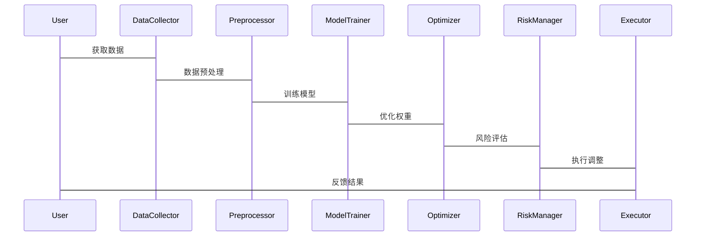

                 


# 智能资产配置动态调整系统

> 关键词：智能资产配置、动态调整系统、机器学习、量化投资、风险管理

> 摘要：本文详细探讨智能资产配置动态调整系统的核心概念、算法原理、系统架构及实现方案。通过理论分析和实践案例，阐述如何利用机器学习和大数据技术实现资产配置的智能化与动态化，从而优化投资收益并控制风险。

---

# 第一部分：背景介绍

## 第1章：问题背景

### 1.1 资产配置的传统方法与局限性
传统资产配置方法依赖于人工分析和固定模型，存在以下问题：
- 市场波动难以实时捕捉
- 无法及时应对突发事件
- 个性化需求难以满足

### 1.2 动态调整的必要性
- 市场环境变化快
- 投资者需求多样
- 风险管理动态化

### 1.3 智能化资产配置的兴起
- 人工智能技术进步
- 大数据支持决策
- 量化投资的兴起

## 第2章：问题描述

### 2.1 资产配置的核心问题
- 如何实现资产最优分配
- 如何应对市场变化

### 2.2 动态调整的挑战
- 数据实时性要求高
- 算法效率需保证
- 风险控制复杂

## 第3章：问题解决

### 3.1 数据驱动的决策支持
- 数据采集与处理
- 模型训练与优化

### 3.2 智能化算法的应用
- 机器学习模型
- 动态优化算法

### 3.3 实时反馈机制
- 系统实时监控
- 自动调整策略

---

# 第二部分：核心概念与联系

## 第1章：核心概念

### 1.1 资产配置模型
- 理论基础：现代投资组合理论
- 实现方法：基于机器学习的模型

### 1.2 动态调整算法
- 算法类型：遗传算法、粒子群优化
- 调整机制：基于市场反馈的实时优化

### 1.3 风险管理模块
- 风险评估：VaR、CVaR等方法
- 控制策略：动态调整头寸

## 第2章：概念对比与关系

### 2.1 资产配置模型对比
| 方法 | 优点 | 缺点 |
|------|------|------|
| 均值-方差模型 | 简单有效 | 忽略尾部风险 |
| Black-Litterman模型 | 考虑投资者观点 | 计算复杂 |

### 2.2 ER实体关系图


---

# 第三部分：算法原理讲解

## 第1章：优化算法

### 1.1 数学模型
$$ \text{目标函数：} \quad \max \sum_{i=1}^{n} w_i r_i $$
$$ \text{约束条件：} \quad \sum_{i=1}^{n} w_i = 1, \quad w_i \geq 0 $$

### 1.2 算法实现


### 1.3 Python代码示例
```python
import numpy as np
from scipy.optimize import minimize

def objective(weights, returns):
    return -np.dot(weights, returns)  # 最小化负收益

def constraint(weights):
    return np.sum(weights) - 1  # 约束权重和为1

# 示例数据
returns = np.array([0.1, 0.2, 0.15])

# 初始权重
initial_weights = np.array([1/3, 1/3, 1/3])

# 使用 scipy 进行优化
result = minimize(objective, initial_weights, method='SLSQP', 
                  constraints={'type': 'eq', 'fun': constraint})

print(result)
```

---

# 第四部分：系统分析与架构设计

## 第1章：系统架构

### 1.1 领域模型


### 1.2 系统架构


## 第2章：接口设计

### 2.1 API接口
- 数据接口：获取资产数据
- 模型接口：调用优化算法
- 反馈接口：接收市场反馈

### 2.2 交互流程


---

# 第五部分：项目实战

## 第1章：环境搭建

### 1.1 安装依赖
```bash
pip install numpy scipy matplotlib pandas
```

## 第2章：核心实现

### 2.1 动态调整模块
```python
import numpy as np
from scipy.optimize import minimize

def optimize_weights(returns):
    n = len(returns)
    initial_weights = np.array([1.0/n]*n)
    result = minimize(
        lambda w: -np.dot(w, returns),
        initial_weights,
        method='SLSQP',
        constraints={'type': 'eq', 'fun': lambda w: np.sum(w)-1}
    )
    return result.x

# 示例
returns = np.array([0.1, 0.2, 0.15])
weights = optimize_weights(returns)
print(weights)
```

## 第3章：案例分析

### 3.1 案例背景
- 投资组合：股票、债券、基金
- 市场变化：股票波动加剧

### 3.2 实施步骤
1. 数据采集与预处理
2. 模型训练与优化
3. 动态调整与反馈

---

# 第六部分：最佳实践

## 第1章：经验总结

### 1.1 小结
- 数据质量至关重要
- 算法选择影响性能
- 风险管理是关键

### 1.2 注意事项
- 定期模型更新
- 确保数据实时性
- 处理好算法的计算效率

## 第2章：拓展阅读

### 2.1 推荐书籍
- 《投资学》
- 《机器学习实战》

### 2.2 在线资源
- QuantInst 案例分析
- Kaggle 数据集

---

# 作者：AI天才研究院 & 禅与计算机程序设计艺术

---

通过以上目录结构，我们可以看到文章从背景介绍、核心概念、算法原理、系统设计到项目实战和最佳实践，层层深入，全面覆盖智能资产配置动态调整系统的核心内容。

