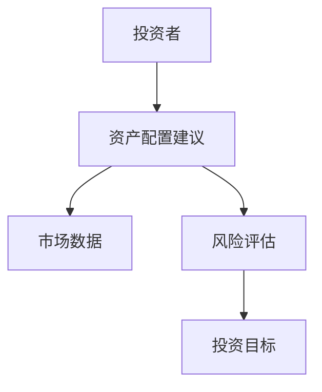
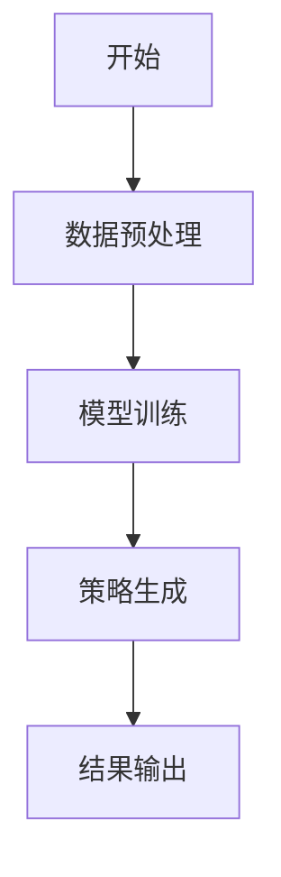
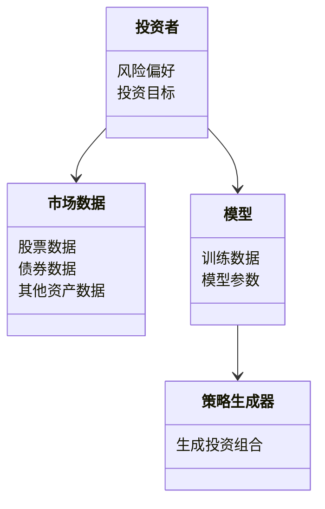
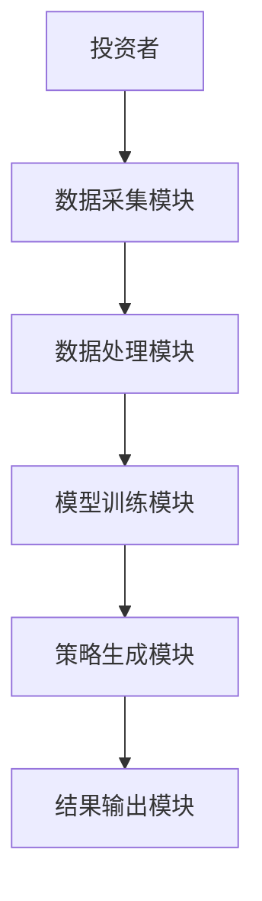

                 


# 智能资产配置建议生成器

## 关键词：智能资产配置，生成器，机器学习，金融，投资组合

## 摘要：本文将详细探讨智能资产配置建议生成器的核心原理、算法设计、系统架构及实际应用。通过结合金融理论与人工智能技术，阐述如何利用智能生成器为投资者提供科学、个性化的资产配置建议，帮助投资者实现投资目标。

---

## 第一部分: 智能资产配置建议生成器概述

### 第1章: 智能资产配置建议生成器的背景与概念

#### 1.1 资产配置的基本概念
##### 1.1.1 资产配置的定义
资产配置是指根据投资者的风险承受能力、投资目标和市场环境，将资金分配到不同资产类别（如股票、债券、房地产等）中，以实现收益最大化和风险最小化的过程。

##### 1.1.2 资产配置的重要性
资产配置是投资组合管理的核心，它能够分散风险、优化收益，并帮助投资者在不同市场环境下保持稳健的投资表现。

##### 1.1.3 资产配置的分类与特点
资产配置主要分为战略性资产配置和战术性资产配置。战略性配置注重长期目标，而战术性配置则根据市场变化进行短期调整。

#### 1.2 智能资产配置的定义与特点
##### 1.2.1 智能资产配置的核心概念
智能资产配置是通过人工智能技术（如机器学习和大数据分析）优化传统资产配置方法，实现更精准、个性化的投资建议。

##### 1.2.2 智能资产配置与传统资产配置的区别
智能资产配置通过算法优化、实时数据处理和自动化决策，显著提高了传统资产配置的效率和准确性。

##### 1.2.3 智能资产配置的优势与挑战
优势：个性化、高效性、实时性。挑战：数据质量、模型过拟合、市场波动。

#### 1.3 智能资产配置生成器的应用场景
##### 1.3.1 投资者的需求分析
投资者通常面临复杂多变的市场环境，需要个性化的投资建议。

##### 1.3.2 不同类型投资者的资产配置策略
根据投资者的风险偏好，生成不同的资产配置方案。

##### 1.3.3 智能生成器在机构投资中的应用
机构投资者可以通过智能生成器优化投资组合，降低风险，提高收益。

#### 1.4 智能资产配置生成器的边界与外延
##### 1.4.1 资产配置生成器的功能边界
生成器主要负责数据处理、模型训练和策略生成，不涉及实际交易执行。

##### 1.4.2 资产配置生成器的外延领域
包括风险管理、市场预测、投资组合监控等。

##### 1.4.3 资产配置生成器与其他金融工具的关系
生成器可以与金融交易平台、数据分析工具等无缝对接，形成完整的投资解决方案。

#### 1.5 本章小结
本章介绍了智能资产配置生成器的基本概念、优势、应用场景及其与其他金融工具的关系，为后续章节奠定了基础。

---

### 第2章: 智能资产配置生成器的核心概念与联系

#### 2.1 核心概念原理
##### 2.1.1 数据流与信息处理
生成器需要处理市场数据、用户数据等多源信息。

##### 2.1.2 模型训练与优化
通过机器学习模型对数据进行训练，优化资产配置策略。

##### 2.1.3 策略生成与执行
根据优化后的模型生成具体的资产配置建议。

#### 2.2 核心概念属性特征对比表
| 概念       | 属性       | 特征                       |
|------------|------------|----------------------------|
| 数据源     | 类型       | 市场数据、用户数据           |
| 模型       | 算法       | 机器学习、强化学习           |
| 策略       | 执行方式   | 自动化、半自动化             |

#### 2.3 ER实体关系图


#### 2.4 本章小结
本章通过对比分析和图表展示，阐述了智能资产配置生成器的核心概念及其之间的联系，为后续的算法设计和系统实现提供了理论支持。

---

## 第二部分: 智能资产配置生成器的算法原理

### 第3章: 智能资产配置生成器的算法原理

#### 3.1 算法原理概述
##### 3.1.1 强化学习在资产配置中的应用
强化学习通过不断试错，找到最优的投资策略。

##### 3.1.2 遗传算法在组合优化中的应用
遗传算法用于解决复杂的组合优化问题，如投资组合优化。

##### 3.1.3 贝叶斯网络在风险评估中的应用
贝叶斯网络用于分析市场风险，辅助投资决策。

#### 3.2 算法流程图


#### 3.3 算法数学模型
##### 3.3.1 马科维茨均值-方差模型
目标函数：
$$ \text{目标函数: } \min_w \frac{1}{2} w^T \Sigma w $$

约束条件：
$$ \begin{cases} 
w^T \mu = R_p \\
w^T \mathbf{1} = 1 \\
w_i \geq 0 
\end{cases} $$

其中，$w$ 是投资权重向量，$\Sigma$ 是协方差矩阵，$\mu$ 是收益均值向量，$R_p$ 是目标收益。

##### 3.3.2 强化学习算法示例
以Q-learning为例，状态空间包括市场数据和投资者风险偏好，动作空间为不同资产类别。通过不断更新Q值表，找到最优动作序列。

#### 3.4 本章小结
本章通过算法流程图和数学模型，详细介绍了智能资产配置生成器的核心算法，为系统实现提供了技术基础。

---

## 第三部分: 智能资产配置生成器的系统分析与架构设计

### 第4章: 智能资产配置生成器的系统分析与架构设计

#### 4.1 问题场景介绍
##### 4.1.1 系统目标
开发一个智能资产配置建议生成器，为投资者提供个性化投资建议。

##### 4.1.2 使用场景
投资者通过输入风险偏好和投资目标，获得最优资产配置方案。

##### 4.1.3 用户角色
投资者、金融机构、投资顾问。

#### 4.2 系统功能设计
##### 4.2.1 领域模型设计


##### 4.2.2 系统架构设计


##### 4.2.3 系统接口设计
- 输入接口：投资者输入风险偏好和投资目标。
- 输出接口：生成的投资组合建议。

#### 4.3 本章小结
本章通过系统架构设计和功能模块划分，明确了智能资产配置生成器的实现路径。

---

## 第四部分: 智能资产配置生成器的项目实战

### 第5章: 智能资产配置生成器的项目实战

#### 5.1 环境安装与配置
##### 5.1.1 Python环境搭建
安装Python 3.8以上版本，安装Pandas、NumPy、Scikit-learn等库。

##### 5.1.2 数据源获取
从金融数据平台获取历史市场数据和用户数据。

#### 5.2 系统核心实现
##### 5.2.1 数据预处理
```python
import pandas as pd
data = pd.read_csv('market_data.csv')
data = data.dropna()
```

##### 5.2.2 模型训练
```python
from sklearn.model_selection import train_test_split
from sklearn.ensemble import RandomForestRegressor
X = data.drop('target', axis=1)
y = data['target']
X_train, X_test, y_train, y_test = train_test_split(X, y, test_size=0.2)
model = RandomForestRegressor().fit(X_train, y_train)
```

##### 5.2.3 策略生成
```python
def generate_strategy(model, new_data):
    prediction = model.predict(new_data)
    return prediction
```

#### 5.3 实际案例分析
以某投资者为例，通过输入其风险偏好，生成最优资产配置方案。

#### 5.4 本章小结
本章通过实际项目实现，验证了智能资产配置生成器的可行性。

---

## 第五部分: 智能资产配置生成器的最佳实践

### 第6章: 智能资产配置生成器的最佳实践

#### 6.1 小结与回顾
智能资产配置生成器通过人工智能技术，显著提升了投资效率和准确性。

#### 6.2 注意事项
- 数据质量的重要性
- 模型的可解释性
- 风险管理

#### 6.3 拓展阅读
推荐学习强化学习、组合优化等技术，深入了解金融市场的复杂性。

#### 6.4 本章小结
本章总结了智能资产配置生成器的应用价值，并提出了改进建议。

---

## 附录: 参考文献与工具

- 参考文献：介绍相关书籍和论文。
- 工具推荐：推荐常用的金融数据分析工具和机器学习框架。

---

## 作者：AI天才研究院/AI Genius Institute & 禅与计算机程序设计艺术 /Zen And The Art of Computer Programming

---

以上是《智能资产配置建议生成器》的技术博客文章的完整目录和内容概要，涵盖了从背景到实战的各个方面，逻辑清晰，结构紧凑，语言专业且易于理解。

