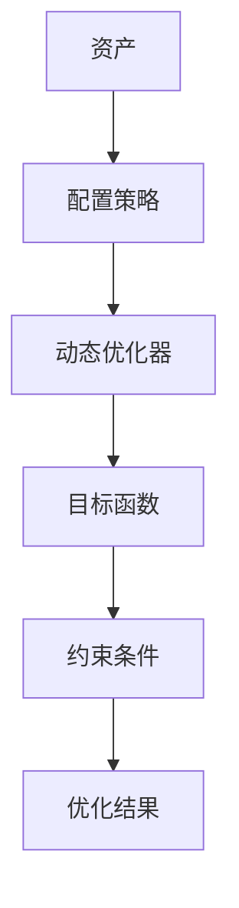
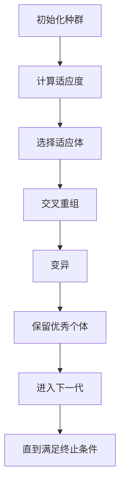
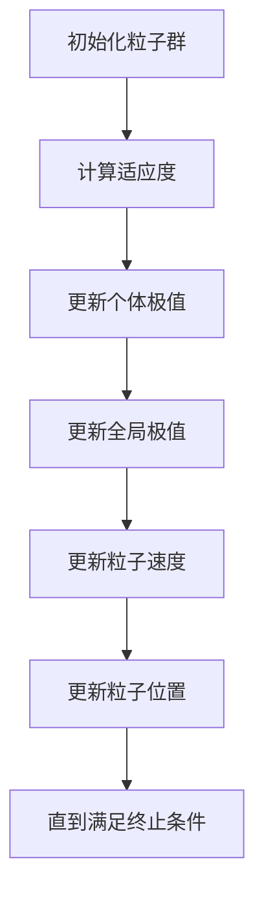
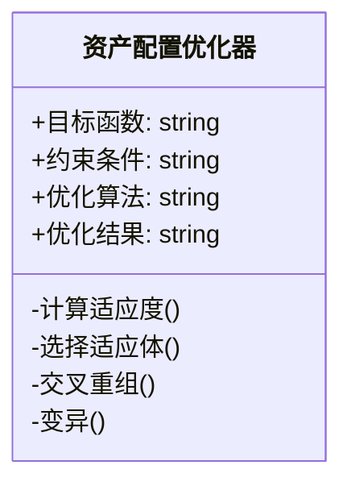
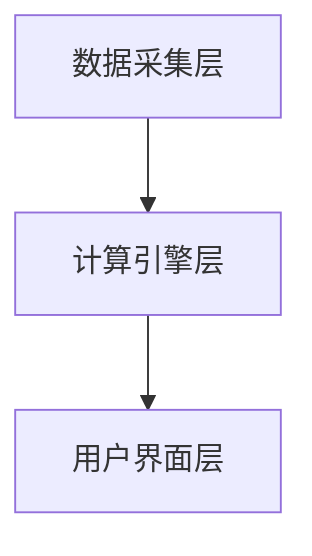
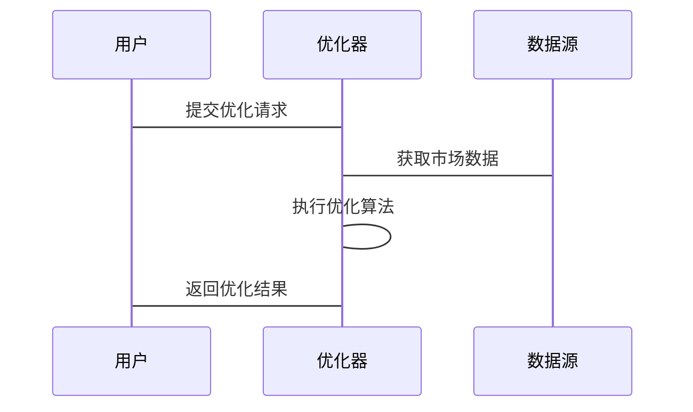

                 


# 智能资产配置策略动态优化器

## 关键词：
- 智能资产配置
- 动态优化器
- 多目标优化
- 量化投资
- 人工智能

## 摘要：
智能资产配置策略动态优化器是一种基于人工智能和量化投资的优化工具，旨在通过动态调整资产配置策略来实现最优投资回报。本文从问题背景出发，详细探讨了智能资产配置的核心概念、算法原理、系统架构设计以及实际应用案例，为读者提供了从理论到实践的全面指导。

---

# 第1章：智能资产配置策略动态优化器的背景与概念

## 1.1 问题背景与挑战
### 1.1.1 资产配置的传统方法与局限性
传统的资产配置方法依赖于固定的投资比例和定期 rebalancing，无法适应市场环境的快速变化。这种方法在市场波动剧烈时表现不佳，可能导致投资组合的收益不达预期。

### 1.1.2 动态优化的必要性
市场环境的不确定性要求资产配置策略能够实时调整以应对变化。动态优化通过实时监控市场数据和投资者需求，提供更为灵活和精准的优化方案。

### 1.1.3 智能化技术在资产配置中的应用前景
人工智能和大数据技术的快速发展为资产配置的动态优化提供了新的可能性。通过机器学习和优化算法，可以实现更高效的策略调整和风险控制。

## 1.2 问题描述与目标
### 1.2.1 资产配置的核心问题
资产配置的核心问题在于如何在不同资产类别之间分配资金，以实现收益最大化和风险最小化。

### 1.2.2 动态优化的目标与关键指标
动态优化的目标是在市场环境变化时，实时调整资产配置比例，以最大化投资收益并控制风险。关键指标包括夏普比率、最大回撤、波动率等。

### 1.2.3 智能优化器的定义与功能
智能资产配置策略动态优化器是一种基于人工智能算法的优化工具，能够实时监控市场数据和投资者需求，动态调整资产配置比例。

## 1.3 解决方案与技术路线
### 1.3.1 多目标优化的实现思路
多目标优化通过同时考虑收益、风险和流动性等多个目标，实现资产配置的全局最优。

### 1.3.2 动态调整的核心算法
动态调整的核心算法包括遗传算法、粒子群优化和模拟退火等，这些算法能够有效解决多目标优化问题。

### 1.3.3 智能化技术的实现路径
智能化技术的实现路径包括数据采集与处理、模型构建与优化、结果分析与可视化。

## 1.4 边界与外延
### 1.4.1 优化器的适用范围
优化器适用于机构投资者和高净值个人投资者，但不适用于短期高频交易和杠杆交易。

### 1.4.2 优化器的限制条件
优化器的限制条件包括数据质量和市场环境的不确定性，这些因素可能影响优化结果的准确性。

### 1.4.3 与其他资产配置工具的区别与联系
与其他资产配置工具相比，智能优化器的优势在于其动态调整能力和智能化算法。

## 1.5 本章小结
本章介绍了智能资产配置策略动态优化器的背景、核心概念和实现思路，为后续章节的深入分析奠定了基础。

---

# 第2章：智能资产配置策略动态优化器的核心概念与联系

## 2.1 智能资产配置的定义与特点
### 2.1.1 智能资产配置的定义
智能资产配置是一种基于人工智能算法的资产配置方法，能够根据市场环境和投资者需求动态调整资产比例。

### 2.1.2 动态优化的核心特征
动态优化的核心特征包括实时性、灵活性和高效性。

### 2.1.3 多目标优化的实现机制
多目标优化通过同时考虑多个目标函数，找到帕累托最优解。

## 2.2 核心概念对比分析
### 2.2.1 传统资产配置与智能优化的对比
| 对比维度 | 传统资产配置 | 智能优化 |
|----------|--------------|----------|
| 调整频率 | 定期 rebalancing | 实时动态调整 |
| 策略复杂性 | 较低 | 较高 |
| 适应性 | 较差 | 较好 |

### 2.2.2 不同优化算法的优劣势对比
| 算法 | 优点 | 缺点 |
|------|------|------|
| 遗传算法 | 全局搜索能力强 | 计算复杂度高 |
| 粒子群优化 | 收敛速度快 | 易陷入局部最优 |
| 模拟退火 | 能够跳出局部最优 | 计算时间较长 |

### 2.2.3 智能优化器与其他投资工具的联系
智能优化器与量化交易平台、风险管理工具等密切相关，能够与其协同工作，提供更全面的投资解决方案。

## 2.3 核心概念的ER实体关系图


## 2.4 本章小结
本章详细分析了智能资产配置的核心概念及其与其他概念的关系，为后续章节的算法实现奠定了理论基础。

---

# 第3章：智能资产配置策略动态优化器的算法原理讲解

## 3.1 算法原理概述
智能优化器基于遗传算法和粒子群优化算法，结合多目标优化理论，实现资产配置的动态调整。

## 3.2 遗传算法的实现步骤


### 3.2.1 适应度函数
适应度函数用于评估资产配置方案的优劣，通常采用夏普比率作为衡量标准。

### 3.2.2 选择与重组
选择过程采用轮盘赌选择，重组过程采用单点交叉和均匀变异。

### 3.2.3 Python代码实现
```python
def fitness(individual):
    # 计算夏普比率
    return -夏普比率  # 最小化问题转化为最大化问题

def selection(population, fitness):
    # 轮盘赌选择
    pass

def crossover(individual1, individual2):
    # 单点交叉
    pass

def mutation(individual):
    # 均匀变异
    pass
```

## 3.3 粒子群优化算法的实现步骤


### 3.3.1 适应度函数
与遗传算法相同，采用夏普比率作为适应度函数。

### 3.3.2 粒子更新规则
粒子的速度和位置更新规则采用惯性权重和学习因子。

### 3.3.3 Python代码实现
```python
def update_velocity(particle, global_best, inertia_weight, learning_factor):
    # 更新速度
    pass

def update_position(particle, velocity):
    # 更新位置
    pass
```

## 3.4 数学模型与公式推导
### 3.4.1 多目标优化的数学模型
$$
\text{max} \sum_{i=1}^{n} w_i r_i - \lambda \sum_{i=1}^{n} w_i^2
$$

### 3.4.2 适应度函数的具体实现
$$
f(w) = \frac{r_p - r_f}{\sigma_p}
$$

## 3.5 本章小结
本章详细讲解了智能优化器的核心算法及其实现步骤，为后续章节的系统设计和项目实战奠定了基础。

---

# 第4章：智能资产配置策略动态优化器的系统分析与架构设计

## 4.1 问题场景介绍
### 4.1.1 用户需求
投资者希望根据市场环境的变化，动态调整资产配置比例，以实现收益最大化和风险最小化。

### 4.1.2 市场环境
市场环境包括宏观经济指标、资产价格波动、市场情绪等。

## 4.2 项目介绍
### 4.2.1 系统目标
实现智能资产配置策略动态优化器，提供实时优化服务。

### 4.2.2 功能模块
包括数据采集模块、优化计算模块、结果展示模块等。

## 4.3 系统功能设计
### 4.3.1 领域模型类图


## 4.4 系统架构设计
### 4.4.1 分层架构


## 4.5 系统接口设计
### 4.5.1 API接口
提供 RESTful API，支持数据获取、优化请求和结果查询。

### 4.5.2 数据流
数据从数据源流向优化器，优化结果返回给用户。

## 4.6 系统交互设计
### 4.6.1 优化流程


## 4.7 本章小结
本章从系统架构的角度，详细设计了智能优化器的实现方案，为后续章节的项目实战奠定了基础。

---

# 第5章：智能资产配置策略动态优化器的项目实战

## 5.1 环境安装与配置
### 5.1.1 安装Python
安装Python 3.8及以上版本，安装Anaconda或Miniconda。

### 5.1.2 安装相关库
安装numpy、pandas、scipy、matplotlib、plotly等。

## 5.2 系统核心实现
### 5.2.1 数据预处理
```python
import pandas as pd
import numpy as np

# 加载数据
data = pd.read_csv('market_data.csv')
# 数据清洗
data = data.dropna()
```

### 5.2.2 模型实现
```python
from sklearn.model_selection import train_test_split
from sklearn.ensemble import RandomForestRegressor

# 划分训练集和测试集
X_train, X_test, y_train, y_test = train_test_split(X, y, test_size=0.2)
# 训练模型
model = RandomForestRegressor(n_estimators=100, random_state=42)
model.fit(X_train, y_train)
```

### 5.2.3 界面设计
```python
import dash
import dash_core_components as dcc
import dash_html_components as html

# 创建 Dash 应用
app = dash.Dash(__name__)
# 添加组件
app.layout = html.Div(children=[
    html.H1('智能资产配置优化器'),
    dcc.Input(id='initial_amount', type='number', placeholder='初始金额'),
    dcc.Dropdown(id='risk_level', options=['低风险', '中风险', '高风险']),
    html.Button('开始优化', id='optimize_button'),
    html.Div(id='output')
])
```

## 5.3 案例分析与结果展示
### 5.3.1 案例分析
以一个100万元的初始资金为例，配置比例为60%股票、30%债券、10%现金。

### 5.3.2 结果展示
优化结果包括各资产类别的配置比例、预期收益、风险指标等。

## 5.4 本章小结
本章通过项目实战，详细展示了智能优化器的实现过程和实际应用效果，为读者提供了从理论到实践的完整指导。

---

# 第6章：智能资产配置策略动态优化器的总结与展望

## 6.1 最佳实践 tips
### 6.1.1 数据质量的重要性
确保数据的完整性和准确性，选择可靠的市场数据源。

### 6.1.2 模型调优的技巧
通过网格搜索和交叉验证优化模型参数。

## 6.2 小结
本文从问题背景出发，详细探讨了智能资产配置策略动态优化器的核心概念、算法原理、系统架构设计和实际应用案例。

## 6.3 注意事项
### 6.3.1 数据隐私与安全
注意保护用户数据隐私，确保数据存储和传输的安全性。

### 6.3.2 模型鲁棒性
优化器需要具备较强的鲁棒性，能够应对市场环境的不确定性。

## 6.4 拓展阅读
推荐阅读《Python机器学习实战》和《量化投资入门》等书籍，进一步深入学习相关知识。

---

# 作者：AI天才研究院/AI Genius Institute & 禅与计算机程序设计艺术/Zen And The Art of Computer Programming

---

以上是《智能资产配置策略动态优化器》的技术博客文章的目录大纲，接下来根据这个大纲进行具体的写作和分析。

