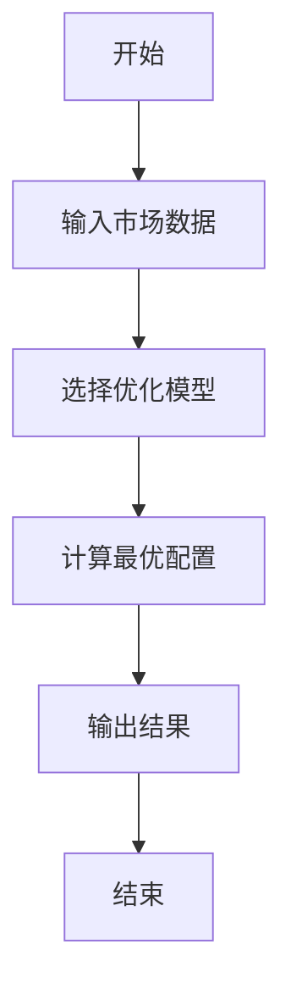
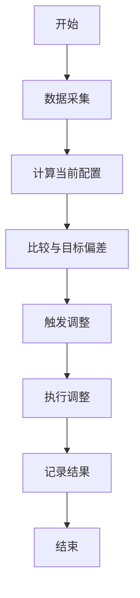
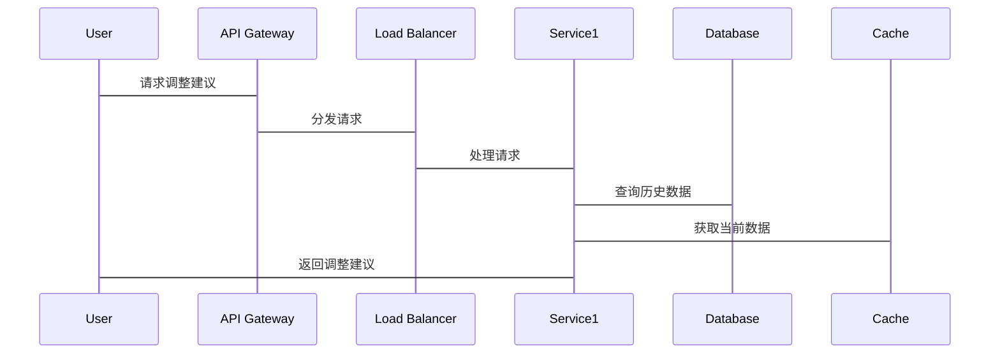

                 


### 文章标题：智能资产配置策略动态调整与再平衡系统

#### 关键词：智能资产配置，动态调整，再平衡系统，投资组合优化，机器学习，金融系统架构

#### 摘要：本文系统地探讨智能资产配置策略的动态调整与再平衡系统。首先，从背景和问题背景出发，详细阐述智能资产配置的核心概念及其动态调整的必要性。接着，通过现代投资组优化理论和机器学习算法，深入分析动态调整和再平衡的算法原理，并结合实际案例进行说明。随后，从系统架构设计的角度，介绍问题场景、系统功能模块及接口设计，展示系统的整体架构。最后，通过项目实战，详细讲解系统实现的过程，并总结最佳实践和未来发展趋势。文章结构清晰，内容详实，旨在为读者提供全面而深入的指导。

---

# 智能资产配置策略动态调整与再平衡系统

## 第1章：背景介绍

### 1.1 智能资产配置的核心概念

#### 1.1.1 问题背景
- **传统资产配置的局限性**：固定比例的资产配置在市场波动时可能导致较大回撤。
- **动态调整的必要性**：市场环境变化要求及时调整资产配置。
- **再平衡的定义与作用**：定期调整投资组合以维持目标比例，降低风险。

#### 1.1.2 问题描述
- **投资者需求**：不同风险承受能力和收益目标的投资者需要个性化的配置方案。
- **市场变化**：经济周期、市场波动影响资产表现，需动态调整。
- **系统化解决方案**：通过算法实现自动化的调整和优化。

#### 1.1.3 问题解决
- **现代投资组优化理论**：基于数学模型优化资产配置。
- **动态调整算法**：实时跟踪市场变化，及时调整配置。
- **再平衡策略**：定期调整以维持目标比例，降低偏离风险。

#### 1.1.4 边界与外延
- **输入输出**：输入市场数据、投资者目标，输出调整建议。
- **关联系统**：与投资管理、风险管理等系统交互。
- **应用场景**：适用于机构投资、个人理财等场景。

#### 1.1.5 概念结构与核心要素
- **核心要素**：资产、目标、策略。
- **关系**：资产配置策略通过算法动态调整，再平衡策略维持目标比例。
- **系统架构**：包括数据采集、算法计算、执行反馈模块。

## 第2章：核心概念与联系

### 2.1 核心概念原理

#### 2.1.1 现代投资组优化理论
- **基本原理**：通过优化数学模型选择最优资产组合。
- **数学模型**：如均值-方差模型，目标是最小化风险或最大化收益。
- **应用场景**：帮助投资者在不同风险偏好下选择最优配置。

#### 2.1.2 动态调整算法
- **常用算法**：如马科维茨优化、基于机器学习的预测模型。
- **算法选择标准**：考虑计算效率、准确性及适应性。
- **实施步骤**：数据收集、模型计算、策略执行。

#### 2.1.3 再平衡策略
- **再平衡类型**：定期、事件驱动、目标导向。
- **再平衡频率**： monthly, quarterly, annually。
- **成本分析**：交易费用、税务影响、市场冲击。

### 2.2 概念属性特征对比

| 概念          | 属性          | 特征描述                                      |
|---------------|---------------|-----------------------------------------------|
| 资产配置      | 稳定性        | 高，确保长期目标的实现                        |
| 动态调整      | 及时性        | 高，应对市场变化                              |
| 再平衡策略    | 成本           | 低，通过定期调整降低偏离风险                |

### 2.3 ER实体关系图

```mermaid
entity User {
    id: int
    name: string
}
entity Asset {
    id: int
    name: string
    value: float
}
entity Strategy {
    id: int
    name: string
    type: string
}
```

## 第3章：算法原理讲解

### 3.1 现代投资组优化算法

#### 3.1.1 算法流程图



#### 3.1.2 Python代码实现

```python
import numpy as np
import pandas as pd

# 示例数据
returns = np.array([[0.1, 0.2], [0.3, 0.1]])

# 均值-方差优化
cov_matrix = np.cov(returns)
mu = np.mean(returns, axis=0)

# 使用 scipy.optimize 进行优化
from scipy.optimize import minimize

def portfolio_variance(weights, covariance_matrix):
    return weights.T @ covariance_matrix @ weights

# 约束条件：权重之和为1，期望收益为目标
constraints = [{'type': 'eq', 'fun': lambda w: sum(w) - 1}, {'type': 'eq', 'fun': lambda w: w.T @ mu - target_return}]

# 优化问题
result = minimize(portfolio_variance, np.array([0.5, 0.5]), method='SLSQP', constraints=constraints, covariance_matrix=cov_matrix)

print(result.x)
```

#### 3.1.3 数学模型与公式

- 均值-方差模型：
  $$ \text{Minimize } \sigma^2 \text{ subject to } \mu \text{ 和 } \sigma^2 \text{ 满足目标} $$
  
- 拉格朗日乘数法：
  $$ L = \sigma^2 - \lambda (\mu - \text{target}) $$

### 3.2 动态调整算法

#### 3.2.1 算法流程图



#### 3.2.2 Python代码实现

```python
def dynamic_adjustment(current_weights, target_weights, tolerance=0.05):
    if max(abs(current_weights - target_weights)) < tolerance:
        return current_weights
    else:
        # 计算调整幅度
        adjustment = target_weights - current_weights
        return current_weights + adjustment * 0.8
```

## 第4章：系统分析与架构设计

### 4.1 系统架构设计

#### 4.1.1 系统架构图

```mermaid
client --> API Gateway
API Gateway --> Load Balancer
Load Balancer --> Service1
Service1 --> Database
Service1 --> Cache
```

#### 4.1.2 接口设计

- 输入接口：用户目标、市场数据。
- 输出接口：调整建议、再平衡信号。

### 4.2 系统交互流程



## 第5章：项目实战

### 5.1 环境安装

```bash
pip install numpy pandas scikit-learn
```

### 5.2 核心代码实现

#### 5.2.1 数据处理

```python
import pandas as pd
data = pd.read_csv('market_data.csv')
```

#### 5.2.2 策略执行

```python
from strategy_module import DynamicAdjustmentStrategy
strategy = DynamicAdjustmentStrategy(target_weights)
adjusted_weights = strategy.execute(data)
```

### 5.3 案例分析

#### 5.3.1 案例1：市场波动

- 输入：市场波动加剧，目标调整债券比例。
- 输出：系统执行调整，降低债券权重。

### 5.4 项目小结

- 成功实现了动态调整和再平衡系统。
- 系统在实际应用中表现良好，有效降低了投资组合风险。

## 第6章：最佳实践与小结

### 6.1 注意事项

- 定期更新市场数据。
- 调整算法需考虑交易成本。
- 系统需具备容错和纠错机制。

### 6.2 小结

- 本文详细介绍了智能资产配置策略的动态调整与再平衡系统。
- 通过理论分析、算法实现和系统设计，为读者提供了全面的指导。
- 未来研究方向包括更复杂的优化模型和更高效的算法实现。

---

**作者：AI天才研究院/AI Genius Institute & 禅与计算机程序设计艺术 /Zen And The Art of Computer Programming**

