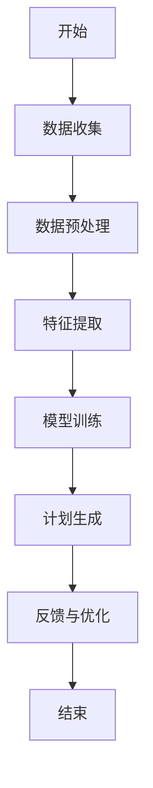
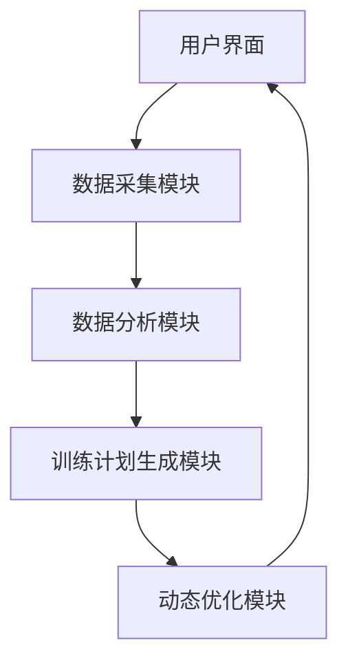

                 


# 智能跑步机：AI Agent的个性化训练计划生成器

## 关键词：
智能跑步机，AI Agent，个性化训练，机器学习，运动科学，系统架构，数据驱动

## 摘要：
随着人工智能技术的快速发展，智能跑步机正在成为健身领域的重要创新工具。本文将探讨如何利用AI Agent技术，为用户提供个性化的训练计划生成服务。通过数据驱动的方法，AI Agent能够分析用户的运动数据、健康状况和目标，生成科学、高效的训练计划。本文将详细分析智能跑步机的背景、AI Agent的核心原理、算法实现、系统架构设计以及实际应用案例，帮助读者全面理解如何将人工智能应用于运动健康领域，从而提升用户的运动效果和健康水平。

---

# 第一部分：背景与概念

## 第1章：背景介绍

### 1.1 智能跑步机的发展历程

#### 1.1.1 传统跑步机的功能特点
- 传统跑步机的基本功能：速度调节、时间记录、步数统计
- 传统跑步机的局限性：缺乏个性化、数据单一、无法提供科学指导

#### 1.1.2 智能化时代的跑步机变革
- 智能跑步机的出现：集成传感器、互联网连接、数据同步
- AI技术的应用：实时数据分析、个性化建议、健康监测

#### 1.1.3 AI Agent技术的引入与应用
- AI Agent的定义：智能代理，能够感知环境、自主决策
- 智能跑步机中的AI Agent：数据收集、分析、反馈

### 1.2 AI Agent的核心概念

#### 1.2.1 人工智能代理的基本定义
- AI Agent的定义：能够感知环境并采取行动以实现目标的智能系统
- AI Agent的分类：简单反射型、基于模型的反应型、目标驱动型、效用驱动型

#### 1.2.2 AI Agent在运动健康领域的应用潜力
- 数据驱动的个性化建议：根据用户数据实时调整训练计划
- 实时反馈与调整：动态优化训练强度和时间
- 用户行为分析：通过用户行为数据改进个性化服务

#### 1.2.3 个性化训练计划的必要性与价值
- 个性化训练计划的核心目标：根据用户特点制定科学、高效的训练方案
- 个性化训练计划的优势：提升运动效果、减少受伤风险、提高用户满意度

## 第2章：核心概念与联系

### 2.1 AI Agent的原理与机制

#### 2.1.1 代理的基本工作流程
1. 感知环境：通过传感器和数据接口获取用户数据
2. 分析数据：利用机器学习算法对数据进行处理和分析
3. 制定计划：根据分析结果生成个性化训练计划
4. 反馈与优化：根据用户反馈调整计划，持续优化

### 2.2 个性化训练计划的模型构建

#### 2.2.1 用户数据的收集与处理
- 数据类型：运动数据（心率、步速、步频）、健康数据（体重、体脂）、目标数据（健身目标、时间安排）
- 数据预处理：数据清洗、标准化、特征提取

#### 2.2.2 训练目标的分解与分析
- 分解目标：根据用户目标分解为短期和长期计划
- 分析用户特点：年龄、性别、运动习惯、健康状况
- 制定计划：根据用户特点生成个性化训练方案

#### 2.2.3 计划生成的规则与优化
- 训练计划生成规则：基于用户数据和目标的规则引擎
- 动态调整：根据用户反馈实时优化计划
- 多目标优化：在多个目标之间寻找平衡点

### 2.3 核心概念的ER实体关系图
```mermaid
er
  actor: 用户
  agent: AI代理
  plan: 训练计划
  data: 用户数据
  relation: 用户 -> 收集数据
  relation: 数据 -> 分析
  relation: 分析 -> 生成计划
  relation: 计划 -> 优化
```

### 2.4 算法原理的Mermaid流程图


---

# 第三部分：算法原理

## 第3章：个性化训练计划生成算法

### 3.1 数据预处理与特征提取

#### 3.1.1 数据预处理步骤
1. 数据清洗：去除异常值、填补缺失值
2. 数据标准化：统一数据格式和单位
3. 特征提取：从原始数据中提取有用的特征（如心率变异、步频变化）

#### 3.1.2 特征提取的数学公式
$$
\text{特征提取} = f(x_1, x_2, \ldots, x_n)
$$
其中，$x_i$ 表示原始数据，$f$ 表示特征提取函数。

### 3.2 模型训练与计划生成

#### 3.2.1 基于机器学习的模型训练
- 选择算法：决策树、随机森林、支持向量机（SVM）
- 模型训练：使用训练数据训练模型，生成个性化训练计划

#### 3.2.2 计划生成的规则引擎
- 规则引擎设计：基于用户特征和训练目标制定规则
- 规则示例：
  - 如果用户目标是减脂，则优先安排有氧运动
  - 如果用户心率过高，则降低训练强度

### 3.3 动态优化算法

#### 3.3.1 动态优化的数学模型
$$
\text{优化目标} = \min_{x} \sum_{i=1}^{n} (x_i - \text{目标值})^2
$$
其中，$x_i$ 表示优化变量，目标值表示用户的训练目标。

#### 3.3.2 动态优化的实现步骤
1. 数据收集与分析：实时获取用户反馈
2. 模型调整：根据反馈调整训练计划
3. 优化输出：输出优化后的训练计划

---

# 第四部分：系统架构设计

## 第4章：智能跑步机的系统架构

### 4.1 系统功能设计

#### 4.1.1 用户数据采集模块
- 功能描述：通过传感器采集用户运动数据
- 数据类型：心率、步速、步频、时间、距离

#### 4.1.2 训练计划生成模块
- 功能描述：基于用户数据生成个性化训练计划
- 输出结果：训练计划表、训练目标分解、训练建议

#### 4.1.3 个性化推荐模块
- 功能描述：根据用户反馈优化训练计划
- 输出结果：动态调整的训练计划、实时反馈

### 4.2 系统架构设计

#### 4.2.1 系统架构图


#### 4.2.2 系统交互流程
1. 用户输入：通过UI输入训练目标和偏好
2. 数据采集：传感器采集用户数据
3. 数据分析：数据分析模块处理数据
4. 训练计划生成：生成个性化训练计划
5. 反馈与优化：根据用户反馈优化计划

---

# 第五部分：项目实战

## 第5章：智能跑步机的实现

### 5.1 环境安装与配置

#### 5.1.1 系统环境
- 操作系统：Linux/Windows/MacOS
- 开发工具：Python、Jupyter Notebook、IDE

#### 5.1.2 依赖库安装
```python
pip install numpy
pip install pandas
pip install scikit-learn
pip install matplotlib
```

### 5.2 核心代码实现

#### 5.2.1 数据预处理代码
```python
import numpy as np
import pandas as pd

# 数据加载
data = pd.read_csv('user_data.csv')

# 数据清洗
data.dropna(inplace=True)
data = data[~data['heart_rate'].isnull()]

# 数据标准化
data['heart_rate'] = (data['heart_rate'] - data['heart_rate'].mean()) / data['heart_rate'].std()
```

#### 5.2.2 训练计划生成代码
```python
from sklearn.tree import DecisionTreeClassifier

# 数据分割
X = data[['age', 'weight', 'heart_rate']]
y = data['training_goal']

# 模型训练
model = DecisionTreeClassifier()
model.fit(X, y)

# 预测计划
new_user = [[25, 70, 70]]
prediction = model.predict(new_user)
print(f'预测训练目标：{prediction}')
```

### 5.3 实际案例分析

#### 5.3.1 案例背景
- 用户信息：年龄25岁，体重70kg，目标减脂

#### 5.3.2 训练计划生成
- 训练强度：中等强度，30分钟有氧运动
- 训练频率：每周5天，每次30分钟
- 饮食建议：低脂饮食，增加蛋白质摄入

### 5.4 项目小结

#### 5.4.1 项目总结
- 成功实现了个性化训练计划生成
- 系统架构设计合理，代码实现清晰

#### 5.4.2 经验与教训
- 数据预处理是关键，数据质量影响模型效果
- 模型选择需要根据具体场景调整

---

# 第六部分：总结与展望

## 第6章：总结与展望

### 6.1 总结
- AI Agent在智能跑步机中的应用价值
- 个性化训练计划生成的核心算法
- 系统架构设计的关键点

### 6.2 未来展望
- 更智能的AI代理：结合增强学习实现更复杂的决策
- 更多的数据隐私保护措施
- 更广泛的应用场景：家庭健身、康复训练

---

作者：AI天才研究院/AI Genius Institute & 禅与计算机程序设计艺术/Zen And The Art of Computer Programming

---

# 结语
通过本文的详细讲解，我们了解了如何利用AI Agent技术为智能跑步机生成个性化训练计划。从背景介绍到系统架构设计，再到实际项目的实现，我们一步步深入探讨了这一技术的核心原理和实际应用。未来，随着AI技术的不断发展，智能跑步机将变得更加智能化，为用户提供更高效、更个性化的运动体验。

