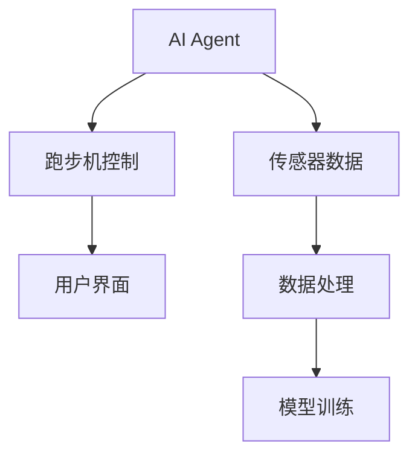

                 


# 智能跑步机：AI Agent的实时配速与体能管理

> 关键词：智能跑步机，AI Agent，实时配速，体能管理，机器学习，深度学习，运动健康

> 摘要：本文深入探讨了AI Agent在智能跑步机中的应用，重点分析了AI Agent如何通过实时数据采集、分析和反馈，实现对用户跑步配速的智能调整和体能的有效管理。文章从AI Agent的基本概念、算法原理、系统架构到项目实战，全面解析了智能跑步机的核心技术与实现细节，为读者提供了从理论到实践的完整指南。

---

# 第一部分: 智能跑步机与AI Agent的背景介绍

## 第1章: AI Agent与智能跑步机概述

### 1.1 AI Agent的基本概念
AI Agent（人工智能代理）是一种能够感知环境、自主决策并执行任务的智能实体。它通过传感器获取数据，利用算法进行分析，并根据结果采取行动。AI Agent的核心特点包括实时性、自主性、适应性和智能性。

### 1.2 跑步机的基本原理
传统跑步机通过电机控制带速，用户可以根据预设程序选择固定配速或手动调节。智能跑步机则在传统基础上加入了传感器和AI技术，能够实时采集用户数据并动态调整配速。

### 1.3 AI在运动健康中的应用
AI技术在运动健康领域的应用广泛，包括运动数据分析、个性化推荐和安全监控。通过AI，用户可以获得更科学的运动建议，降低运动损伤风险。

---

## 第2章: AI Agent在智能跑步机中的角色

### 2.1 AI Agent的核心功能
AI Agent在智能跑步机中主要负责实时配速调整和体能管理。它通过传感器获取用户的心率、步频、速度等数据，结合用户的历史数据和当前状态，动态优化跑步计划。

### 2.2 AI Agent与智能跑步机的交互流程
1. 数据采集：AI Agent通过传感器获取用户的心率、步频、速度等数据。
2. 数据处理：将采集的数据传输到云端或本地进行分析。
3. 算法决策：基于机器学习算法，AI Agent生成配速调整建议。
4. 反馈执行：将调整指令传递给跑步机的控制系统，实时调整带速。

### 2.3 AI Agent的核心算法与模型
- **实时配速调整**：基于用户当前心率和目标心率区间，AI Agent通过回归算法优化配速。
- **体能评估**：利用深度学习模型分析用户的运动数据，评估体能水平并制定个性化训练计划。

---

# 第二部分: AI Agent的算法原理与数学模型

## 第3章: AI Agent算法原理

### 3.1 数据采集与预处理
AI Agent通过多种传感器（如心率带、加速度计）采集用户数据，包括心率、步频、速度、加速度等。数据预处理包括去噪和平滑处理。

### 3.2 特征提取与选择
从原始数据中提取特征，例如最大心率、平均心率、步频标准差等。利用特征选择算法（如LASSO回归）优化特征集。

### 3.3 模型训练与优化
- **机器学习模型**：使用随机森林或支持向量机（SVM）进行配速预测。
- **深度学习模型**：通过LSTM网络分析时间序列数据，预测用户的体能状态。

### 3.4 实时调整与反馈
基于训练好的模型，AI Agent实时调整跑步机配速，并通过反馈机制优化算法。

---

## 第4章: 数学模型与公式

### 4.1 配速调整模型
配速调整公式：
$$ v = v_{\text{target}} + \alpha \cdot (v_{\text{current}} - v_{\text{target}}) $$
其中，$\alpha$是调整系数，$v_{\text{target}}$是目标配速，$v_{\text{current}}$是当前配速。

### 4.2 体能评估模型
体能评估公式：
$$ \text{Fitness Level} = \beta \cdot \text{VO2 max} + (1-\beta) \cdot \text{Heart Rate} $$
其中，$\beta$是权重系数，$\text{VO2 max}$是最大摄氧量，$\text{Heart Rate}$是心率。

---

# 第三部分: 系统架构与项目实战

## 第5章: 系统架构设计

### 5.1 系统功能设计
- **数据采集模块**：负责采集用户数据。
- **AI算法模块**：实现配速调整和体能管理。
- **用户反馈模块**：提供实时反馈和建议。

### 5.2 系统架构图


### 5.3 接口设计
- **传感器接口**：通过蓝牙或Wi-Fi连接心率带和加速度计。
- **用户接口**：提供实时反馈和调整建议。

---

## 第6章: 项目实战

### 6.1 环境安装
- **开发环境**：Python 3.8以上版本、TensorFlow 2.0以上版本。
- **传感器驱动**：安装心率带和加速度计的驱动程序。

### 6.2 核心代码实现
```python
import numpy as np
from sklearn.ensemble import RandomForestRegressor

# 数据预处理
def preprocess(data):
    # 假设data是一个包含传感器数据的DataFrame
    data.dropna(inplace=True)
    return data

# 特征选择
def feature_selection(data):
    features = ['heart_rate', 'step_frequency', 'acceleration']
    return data[features]

# 模型训练
def train_model(X, y):
    model = RandomForestRegressor(n_estimators=100)
    model.fit(X, y)
    return model

# 实时调整
def adjust_pace(current_pace, target_pace, alpha=0.1):
    return current_pace + alpha * (target_pace - current_pace)
```

### 6.3 实际案例分析
假设用户目标配速为12 km/h，当前配速为10 km/h，心率为100 bpm，目标心率区间为90-110 bpm。AI Agent会根据算法调整配速到11 km/h，并实时监控心率变化，逐步优化配速。

---

## 第7章: 总结与展望

### 7.1 小结
本文详细介绍了AI Agent在智能跑步机中的应用，从算法原理到系统架构，再到项目实战，全面解析了智能跑步机的核心技术。

### 7.2 最佳实践
- 定期更新模型，确保算法的准确性。
- 提供用户友好的反馈机制，增强用户体验。

### 7.3 注意事项
- 数据隐私问题需要注意，确保用户数据的安全性。
- 系统稳定性是关键，避免因技术问题影响用户体验。

### 7.4 拓展阅读
- 推荐阅读《深度学习》（Deep Learning, Ian Goodfellow等著）。
- 关注AI在运动健康领域的最新研究。

---

# 作者：AI天才研究院 & 禅与计算机程序设计艺术

