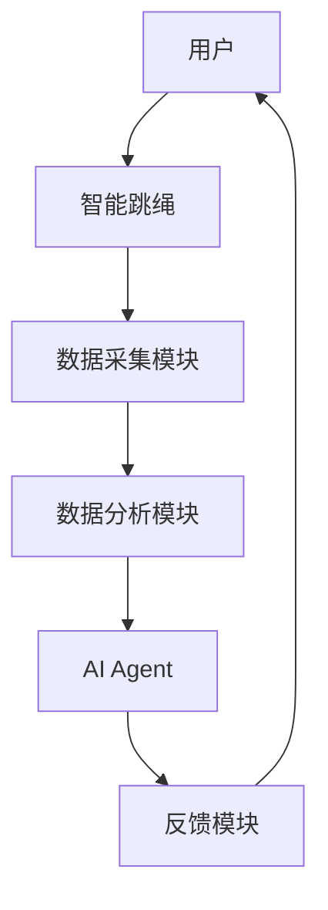

                 


# 智能跳绳：AI Agent的有氧运动效果分析

> 关键词：智能跳绳，AI Agent，有氧运动，运动效果分析，机器学习，数据采集，系统架构

> 摘要：本文探讨智能跳绳结合AI Agent技术在有氧运动效果分析中的应用。通过详细分析AI Agent的工作原理、算法实现、系统架构及实际案例，揭示智能跳绳如何优化用户的运动体验，提升运动效果。文章旨在为技术爱好者和运动爱好者提供深入的技术解析与实践指导。

---

## 第1章：智能跳绳与AI Agent概述

### 1.1 智能跳绳的基本概念

#### 1.1.1 传统跳绳的局限性
传统跳绳是一种简单但有效的有氧运动工具，但存在以下问题：
- **缺乏反馈**：用户无法实时了解跳绳速度、节奏和数量。
- **单一功能**：仅作为运动工具，无法提供个性化建议。
- **数据不足**：无法记录长期运动数据，难以分析进步。

#### 1.1.2 智能跳绳的定义与特点
智能跳绳通过集成传感器和AI技术，具备以下特点：
- **数据采集**：实时监测跳绳速度、次数、时间等数据。
- **智能分析**：通过AI算法评估运动效果并提供建议。
- **交互反馈**：通过手机App或语音助手实时反馈数据和建议。

#### 1.1.3 AI Agent在智能跳绳中的作用
AI Agent（智能代理）负责处理数据并优化运动计划，主要功能包括：
- **数据采集与处理**：收集用户的跳绳数据。
- **运动效果分析**：评估用户的运动量、心率变化等指标。
- **个性化建议**：根据分析结果推荐适合的运动计划。

### 1.2 有氧运动效果分析的重要性

#### 1.2.1 有氧运动的基本概念
有氧运动是指需要较长时间持续供氧的运动，如跳绳、跑步、游泳等，能有效提升心肺功能。

#### 1.2.2 运动效果分析的必要性
通过分析运动数据，用户可以了解运动强度、消耗的热量等，帮助制定科学的运动计划。

#### 1.2.3 AI Agent在运动效果分析中的优势
AI Agent能够实时分析数据，提供个性化建议，帮助用户更高效地达成运动目标。

---

## 第2章：AI Agent的核心概念与原理

### 2.1 AI Agent的基本原理

#### 2.1.1 AI Agent的定义
AI Agent是一种智能实体，能够感知环境并采取行动以实现目标。

#### 2.1.2 AI Agent的核心要素
- **感知**：通过传感器或API获取数据。
- **决策**：使用算法分析数据并制定策略。
- **执行**：通过反馈机制优化行动。

#### 2.1.3 AI Agent的工作流程
1. **数据采集**：从智能跳绳收集跳绳次数、速度等数据。
2. **数据处理**：清洗和预处理数据，提取关键特征。
3. **分析与决策**：使用机器学习模型分析数据，生成建议。
4. **反馈执行**：将建议反馈给用户，并根据用户反馈调整策略。

### 2.2 智能跳绳中的AI Agent设计

#### 2.2.1 数据采集与处理
- **传感器数据**：跳绳速度、次数、时间等。
- **预处理**：去噪、归一化处理，确保数据准确性。

#### 2.2.2 数据分析与运动效果评估
- **算法选择**：使用回归分析或神经网络预测运动效果。
- **指标评估**：计算最大心率、卡路里消耗等关键指标。

#### 2.2.3 AI Agent的反馈机制
- **实时反馈**：通过App或语音助手提供即时建议。
- **长期优化**：根据长期数据调整运动计划。

---

## 第3章：AI Agent的算法原理与实现

### 3.1 算法原理讲解

#### 3.1.1 算法选择与模型设计
- **强化学习**：通过奖励机制优化运动策略。
- **监督学习**：使用历史数据训练分类模型。

#### 3.1.2 算法实现步骤
1. 数据采集：通过智能跳绳获取运动数据。
2. 数据预处理：清洗和标准化数据。
3. 模型训练：使用训练数据训练AI Agent。
4. 模型部署：将模型应用于实际运动分析。

#### 3.1.3 算法优化与调优
- **超参数调整**：优化学习率、批次大小等参数。
- **模型评估**：通过准确率、召回率等指标评估模型性能。

### 3.2 算法实现的代码示例

```python
import numpy as np
from sklearn import linear_model

# 示例数据：跳绳次数与消耗的卡路里
X = np.array([[100], [200], [300], [400]])  # 跳绳次数
y = np.array([200, 400, 600, 800])         # 卡路里

# 创建线性回归模型
model = linear_model.LinearRegression()
model.fit(X, y)

# 预测新数据
new_X = np.array([[250]])
prediction = model.predict(new_X)
print(f"预测消耗的卡路里：{int(prediction[0])}")
```

### 3.3 算法的数学模型与公式

#### 3.3.1 线性回归模型
$$ y = \beta_0 + \beta_1 x + \epsilon $$

其中：
- $y$ 是目标变量（如卡路里消耗）。
- $x$ 是自变量（如跳绳次数）。
- $\beta_0$ 是截距。
- $\beta_1$ 是回归系数。
- $\epsilon$ 是误差项。

#### 3.3.2 强化学习的奖励机制
$$ R = \sum_{t=1}^{T} r_t $$

其中：
- $R$ 是总奖励。
- $r_t$ 是时间$t$的奖励。
- $T$ 是总时间步数。

---

## 第4章：系统分析与架构设计

### 4.1 系统架构设计

#### 4.1.1 系统模块划分
- **数据采集模块**：负责采集跳绳数据。
- **数据分析模块**：处理数据并分析运动效果。
- **用户反馈模块**：将分析结果反馈给用户。

#### 4.1.2 系统架构图


### 4.2 数据流与交互设计

#### 4.2.1 数据采集流程
1. 用户开始跳绳。
2. 智能跳绳采集数据。
3. 数据传输到数据分析模块。

#### 4.2.2 数据分析流程
1. 数据预处理：清洗和标准化。
2. 数据分析：使用机器学习模型分析。
3. 结果生成：生成运动建议。

#### 4.2.3 用户反馈与系统响应
1. 系统通过App或语音反馈建议。
2. 用户根据反馈调整运动计划。

---

## 第5章：项目实战

### 5.1 环境安装与配置

#### 5.1.1 安装必要的库
```bash
pip install numpy pandas scikit-learn
```

#### 5.1.2 安装智能跳绳设备
购买并配置智能跳绳设备，确保与手机App连接正常。

### 5.2 核心代码实现

#### 5.2.1 数据采集代码
```python
import pandas as pd

# 数据采集函数
def collect_data(duration):
    # 采集跳绳数据
    data = pd.DataFrame(columns=['time', 'count', 'speed'])
    for i in range(duration):
        count = get_count()  # 获取跳绳次数
        speed = get_speed()  # 获取跳绳速度
        data.loc[i] = [i, count, speed]
    return data
```

#### 5.2.2 数据分析与反馈代码
```python
from sklearn.linear_model import LinearRegression

def analyze_data(data):
    model = LinearRegression()
    model.fit(data[['count', 'speed']], data['calories'])
    return model
```

### 5.3 实际案例分析

#### 5.3.1 案例背景
用户A，25岁，每周跳绳3次，每次30分钟。

#### 5.3.2 数据分析结果
- 平均速度：120次/分钟。
- 卡路里消耗：300 kcal/次。

#### 5.3.3 系统反馈
建议用户增加速度至140次/分钟，以提高燃脂效率。

### 5.4 项目小结

- **优势**：AI Agent能够实时分析数据，提供个性化建议。
- **挑战**：数据隐私和设备兼容性问题。

---

## 第6章：最佳实践与扩展阅读

### 6.1 最佳实践

#### 6.1.1 数据采集注意事项
确保数据的准确性和完整性，避免噪声干扰。

#### 6.1.2 算法优化建议
选择合适的算法，定期更新模型以适应用户需求。

#### 6.1.3 系统维护
定期检查设备和软件，确保系统稳定运行。

### 6.2 小结

通过本文的分析与实战，读者可以深入了解智能跳绳与AI Agent在有氧运动中的应用，掌握从数据采集到算法实现的全过程。

### 6.3 注意事项

- 数据隐私：确保用户数据的安全。
- 设备兼容性：支持多种智能设备。
- 用户体验：设计直观的用户界面。

### 6.4 扩展阅读

- **书籍推荐**：《机器学习实战》。
- **论文推荐**：《基于强化学习的运动效果优化研究》。

---

## 作者：AI天才研究院/AI Genius Institute & 禅与计算机程序设计艺术/Zen And The Art of Computer Programming

---

**本文由AI天才研究院精心撰写，转载请注明出处。**

