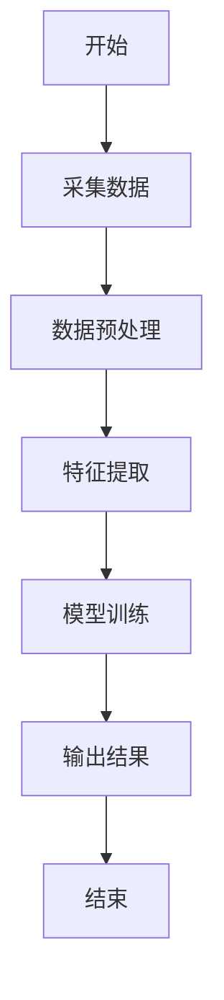
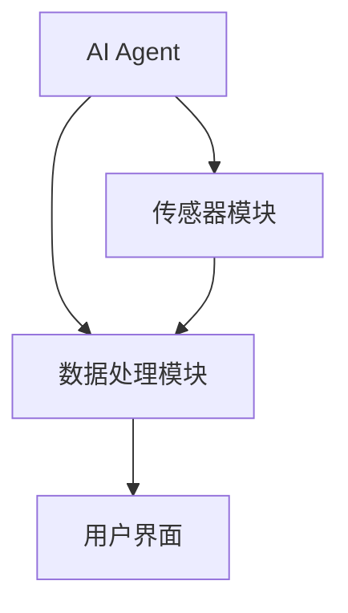

                 


# 智能运动服：AI Agent的实时生理指标监测

---

## 关键词：
智能运动服，AI Agent，实时监测，生理指标，传感器技术，数据融合

---

## 摘要：
智能运动服是一种结合了人工智能和物联网技术的智能服装，能够实时监测用户的生理指标，如心率、体温和运动数据。本文深入探讨了智能运动服的核心技术，包括AI Agent的工作原理、多传感器融合算法、系统架构设计以及实际应用案例。文章通过详细的理论分析和实际案例，展示了智能运动服在运动健康领域的巨大潜力，并展望了其未来的发展方向。

---

## 正文：

### 第一部分：智能运动服概述

#### 第1章：智能运动服的发展背景

##### 1.1 智能运动服的定义
智能运动服是一种集成了多种传感器和智能算法的运动服装，能够实时采集并分析用户的生理数据，如心率、体温、运动速度和步频等。通过与AI Agent结合，智能运动服能够为用户提供个性化的运动建议和健康监测服务。

##### 1.2 智能运动服的发展现状
智能运动服市场近年来迅速发展，主要得益于传感器技术的进步和AI算法的优化。目前市面上主流的智能运动服主要集中在心率监测、运动数据分析和体温监测等领域。未来，随着5G和AI技术的进一步发展，智能运动服的功能将更加智能化和多样化。

##### 1.3 智能运动服的技术基础
智能运动服的核心技术包括：
- **传感器技术**：用于采集生理数据，如光电式心率传感器、温度传感器和加速度传感器。
- **无线通信技术**：用于将数据传输到手机或云端，如蓝牙和Wi-Fi。
- **数据处理技术**：通过AI算法对数据进行分析和处理，如机器学习和深度学习算法。

---

### 第二部分：生理指标监测原理

#### 第2章：生理指标监测技术

##### 2.1 心率监测
心率监测是智能运动服的重要功能之一。以下是心率监测的实现原理：
- **传感器**：使用光电式心率传感器，通过发射红光和红外光，检测皮肤的血液流动变化。
- **算法**：通过FFT（快速傅里叶变换）提取心率信号，消除噪声干扰。

##### 2.2 体温监测
体温监测通过内置的温度传感器实现，传感器将采集到的体温数据传输到AI Agent进行分析。

##### 2.3 运动数据监测
运动数据监测包括运动速度和步频，通过加速度传感器和陀螺仪实现。

---

### 第三部分：AI Agent的核心原理

#### 第3章：AI Agent的定义与工作原理

##### 3.1 AI Agent的定义
AI Agent是一种智能代理，能够感知环境、执行任务并做出决策。在智能运动服中，AI Agent负责接收传感器数据、分析数据并提供反馈。

##### 3.2 AI Agent的工作原理
AI Agent通过以下步骤实现生理指标监测：
1. 数据采集：接收来自传感器的生理数据。
2. 数据处理：使用机器学习算法对数据进行清洗和分析。
3. 数据融合：结合多源数据，提高监测准确性。
4. 反馈输出：将分析结果反馈给用户或设备。

---

### 第四部分：算法原理与实现

#### 第4章：算法原理与实现

##### 4.1 基于AI的实时监测算法
以下是基于AI的实时监测算法的流程图：



##### 4.2 数据融合算法
数据融合算法通过加权融合多传感器数据，提高监测精度。以下是数据融合的数学模型：

$$
y = \sum_{i=1}^{n} w_i x_i
$$

其中，$w_i$是传感器权重，$x_i$是传感器数据。

---

### 第五部分：系统架构与设计

#### 第5章：系统架构设计

##### 5.1 系统功能设计
智能运动服的系统功能模块包括：
- **传感器模块**：采集生理数据。
- **数据处理模块**：分析并融合数据。
- **AI Agent模块**：提供反馈和建议。

##### 5.2 系统架构图
以下是系统架构图：



---

### 第六部分：项目实战

#### 第6章：项目实战

##### 6.1 环境搭建
需要以下工具和库：
- **Python**：编程语言。
- **TensorFlow**：机器学习框架。
- **传感器库**：如心率传感器库。

##### 6.2 核心代码实现
以下是AI Agent的核心代码：

```python
import tensorflow as tf
import numpy as np

class AI_Agent:
    def __init__(self):
        self.model = self.build_model()
    
    def build_model(self):
        model = tf.keras.Sequential([
            tf.keras.layers.Dense(64, activation='relu'),
            tf.keras.layers.Dense(1, activation='linear')
        ])
        model.compile(optimizer='adam', loss='mean_squared_error')
        return model
    
    def train(self, X, y):
        self.model.fit(X, y, epochs=100, batch_size=32)
    
    def predict(self, X):
        return self.model.predict(X)
```

##### 6.3 测试与优化
测试数据集分为训练集和测试集，使用交叉验证优化模型。

---

### 第七部分：总结与展望

#### 第7章：总结与展望

##### 7.1 最佳实践
- 定期校准传感器，确保数据准确性。
- 使用高精度传感器和优化算法。

##### 7.2 未来展望
未来，智能运动服将集成更多传感器和更强大的AI算法，提供更全面的健康监测服务。

---

## 作者：
**AI天才研究院/AI Genius Institute**  
**禅与计算机程序设计艺术 /Zen And The Art of Computer Programming**

