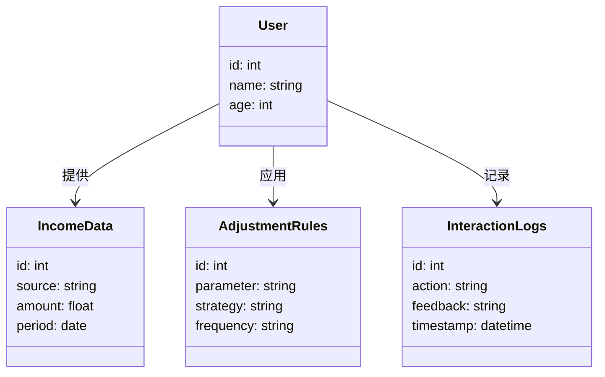
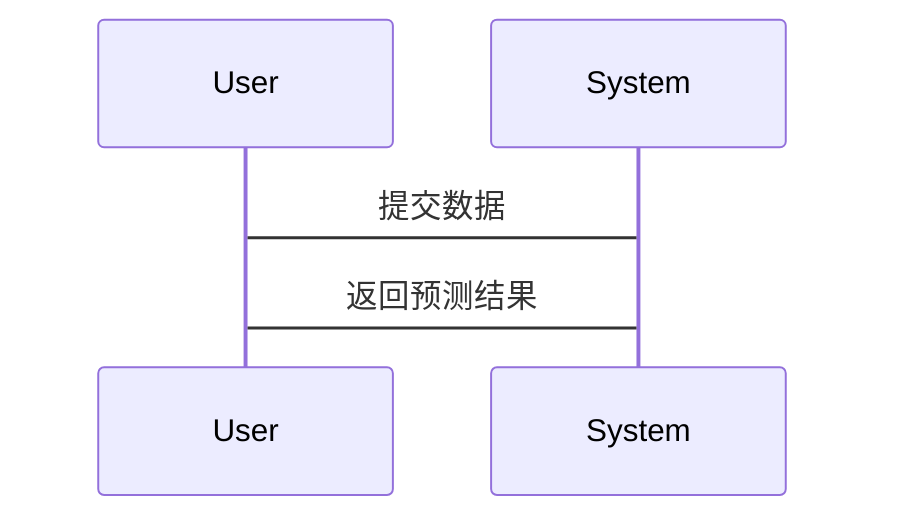

                 

<think>
好的，我现在要帮用户设计《智能退休收入规划动态调整器》这本书的目录大纲。用户希望这个大纲详细且逻辑清晰，覆盖所有主题内容。首先，我需要理解这本书的主题。智能退休收入规划动态调整器听起来像是一个帮助人们规划退休收入并根据情况自动调整的工具。这可能涉及到人工智能、算法、系统设计等方面。

用户还给了一个示例，结构很清晰，分为几个部分，每部分有章节，章节下有小节，甚至有三级目录。所以，我需要按照类似的结构来组织这本书的内容。

首先，我应该考虑这本书的结构。通常，技术书籍会分为背景介绍、核心概念、算法原理、系统设计、项目实战和总结等部分。用户还特别提到要包括背景介绍、核心概念与联系、算法原理、数学模型、系统分析、项目实战以及最佳实践等部分。

那我先从背景介绍开始。这部分需要涵盖问题背景、问题描述、解决方案、边界和外延，以及概念结构和核心要素。可能需要一章来详细说明退休规划的重要性，以及为什么需要动态调整。

接下来是核心概念与联系。这里需要解释智能退休收入规划动态调整器的工作原理，可能包括核心概念的原理、属性对比和ER图。可能需要一章来详细描述这些内容，并用mermaid图来展示。

然后是算法原理。这部分需要详细讲解算法的流程，可能包括数据预处理、特征选择、模型训练等步骤，并用mermaid流程图来展示。同时，还需要用Python代码实现，并给出数学模型和公式，比如线性回归或机器学习模型的公式。

接下来是系统分析与架构设计。这部分需要介绍系统功能设计，可能包括领域模型、架构图、接口设计和交互序列图。可能需要一章来详细描述系统的各个部分，并用mermaid图来展示架构和交互过程。

然后是项目实战。这部分需要指导读者如何安装环境，实现核心功能，解读代码，并分析实际案例。可能需要一章，包括环境配置、代码实现、案例分析等内容。

最后是总结与展望。总结全书内容，展望未来的发展方向，并给出一些注意事项和最佳实践。

现在，我需要确保每个部分都有足够的章节和小节，细化到三级目录。同时，要包含用户要求的所有内容，比如数学公式、mermaid图、代码示例等。

可能需要检查一下，确保每个章节都有明确的主题，并且内容连贯。例如，背景介绍应该在最前面，帮助读者理解为什么需要这本书。核心概念和算法原理接着展开，然后是系统设计，最后是实战和总结。

在编写目录大纲时，要确保每个部分都有足够的细节，但又不冗长。例如，背景介绍可能需要包括退休规划的重要性、传统方法的不足、动态调整器的必要性等。

另外，用户提到要使用mermaid图，所以在目录中需要明确指出哪些部分会有图表，比如系统架构图、流程图等。同时，数学公式要用latex格式，独立段落用$$，段落内用$符号。

现在，我大致有了结构，接下来可以开始详细编写每个部分的章节和小节了。确保每个章节都覆盖用户要求的内容，并且逻辑清晰，层次分明。

好的，现在我来详细组织一下内容。

# 智能退休收入规划动态调整器

## 关键词：
- 智能退休收入规划
- 动态调整器
- AI算法
- 系统设计
- 项目实战

## 摘要：
随着人口老龄化加剧，退休收入规划的重要性日益凸显。传统的静态规划方法已难以应对经济波动和个体差异带来的挑战。本书介绍了一种基于人工智能的智能退休收入规划动态调整器，通过实时数据采集、智能算法和动态调整，帮助用户实现精准的退休收入规划。内容涵盖背景分析、核心算法、系统设计及实际案例，为读者提供全面的解决方案。

---

## 目录大纲：

### 第一部分：背景介绍

#### 第1章：退休收入规划的现状与挑战
- 1.1 退休规划的重要性
  - 1.1.1 退休收入的基本概念
  - 1.1.2 退休规划的核心要素
  - 1.1.3 退休收入的常见问题
- 1.2 传统退休规划方法的局限性
  - 1.2.1 静态规划的缺陷
  - 1.2.2 经济波动的影响
  - 1.2.3 个体差异的挑战
- 1.3 智能动态调整器的必要性
  - 1.3.1 AI在退休规划中的应用
  - 1.3.2 动态调整的优势
  - 1.3.3 用户需求的变化

#### 第2章：智能动态调整器的背景与意义
- 2.1 智能技术的发展与应用
  - 2.1.1 AI在金融领域的应用
  - 2.1.2 大数据技术的影响
- 2.2 动态调整器的核心优势
  - 2.2.1 实时数据处理
  - 2.2.2 精准预测
  - 2.2.3 个性化服务
- 2.3 本书的目标与结构
  - 2.3.1 解决方案的提出
  - 2.3.2 本书的章节安排
  - 2.3.3 学习方法与预期收获

### 第二部分：核心概念与联系

#### 第3章：智能动态调整器的核心概念
- 3.1 数据来源与特征
  - 3.1.1 收入数据
  - 3.1.2 开支数据
  - 3.1.3 资产数据
- 3.2 智能算法的核心原理
  - 3.2.1 机器学习的基础
  - 3.2.2 算法的选择与优化
- 3.3 动态调整机制
  - 3.3.1 调整规则
  - 3.3.2 调整策略
  - 3.3.3 调整频率

#### 第4章：核心概念的对比分析
- 4.1 数据特征对比
  - 4.1.1 不同数据源的特征分析
  - 4.1.2 数据质量的影响
- 4.2 算法原理对比
  - 4.2.1 线性回归与随机森林的对比
  - 4.2.2 传统算法与深度学习的差异
- 4.3 调整机制的优劣分析
  - 4.3.1 常规调整方法的优缺点
  - 4.3.2 智能调整的优势

#### 第5章：实体关系图（ER图）
- 5.1 用户信息表
  - 5.1.1 用户ID
  - 5.1.2 用户年龄
  - 5.1.3 用户收入
- 5.2 收入数据表
  - 5.2.1 收入来源
  - 5.2.2 收入金额
  - 5.2.3 时间周期
- 5.3 调整规则表
  - 5.3.1 调整参数
  - 5.3.2 调整策略
  - 5.3.3 调整频率
- 5.4 交互日志表
  - 5.4.1 用户操作记录
  - 5.4.2 系统反馈
  - 5.4.3 时间戳

```mermaid
erDiagram
    user {
        id: int
        name: string
        age: int
        income: float
    }
    income_data {
        id: int
        source: string
        amount: float
        period: date
    }
    adjustment_rules {
        id: int
        parameter: string
        strategy: string
        frequency: string
    }
    interaction_logs {
        id: int
        action: string
        feedback: string
        timestamp: datetime
    }
    user --> income_data: 提供
    user --> adjustment_rules: 应用
    user --> interaction_logs: 记录
```

### 第三部分：算法原理

#### 第6章：算法原理与实现
- 6.1 数据预处理
  - 6.1.1 数据清洗
  - 6.1.2 数据转换
  - 6.1.3 特征工程
- 6.2 特征选择
  - 6.2.1 特征重要性评估
  - 6.2.2 特征筛选方法
- 6.3 模型训练
  - 6.3.1 线性回归模型
  - 6.3.2 支持向量机（SVM）
  - 6.3.3 随机森林

#### 第7章：数学模型与公式
- 7.1 线性回归模型
  - 7.1.1 线性回归的基本公式
    $$ y = \beta_0 + \beta_1 x + \epsilon $$
  - 7.1.2 最小二乘法的优化
- 7.2 支持向量机（SVM）
  - 7.2.1 SVM的基本原理
    $$ \text{min} \frac{1}{2}||\beta||^2 $$
  - 7.2.2 核函数的选择
- 7.3 随机森林的应用
  - 7.3.1 随机森林的投票机制
  - 7.3.2 随机森林的特征重要性

#### 第8章：算法实现与优化
- 8.1 Python代码实现
  - 8.1.1 数据加载与处理
  - 8.1.2 模型训练与预测
  - 8.1.3 模型评估与优化
- 8.2 算法优化策略
  - 8.2.1 参数调优
  - 8.2.2 并行计算
  - 8.2.3 模型集成

### 第四部分：系统分析与架构设计

#### 第9章：系统功能设计
- 9.1 领域模型
  - 9.1.1 用户信息管理
  - 9.1.2 数据采集与处理
  - 9.1.3 模型预测与调整
- 9.2 系统架构设计
  - 9.2.1 分层架构
  - 9.2.2 微服务架构
  - 9.2.3 数据库设计



#### 第10章：系统接口设计
- 10.1 API接口设计
  - 10.1.1 数据接口
  - 10.1.2 模型接口
  - 10.1.3 用户接口
- 10.2 接口文档编写
  - 10.2.1 RESTful API
  - 10.2.2 JSON格式
  - 10.2.3 接口版本控制

#### 第11章：交互序列图
- 11.1 用户登录与数据输入
  - 11.1.1 登录流程
  - 11.1.2 数据提交
  - 11.1.3 系统反馈
- 11.2 模型预测与调整
  - 11.2.1 数据处理
  - 11.2.2 模型运行
  - 11.2.3 结果展示



### 第五部分：项目实战

#### 第12章：环境配置与安装
- 12.1 开发环境搭建
  - 12.1.1 Python安装
  - 12.1.2 库依赖安装
  - 12.1.3 数据库安装
- 12.2 项目初始化
  - 12.2.1 创建项目结构
  - 12.2.2 初始化配置文件
  - 12.2.3 数据库连接配置

#### 第13章：核心功能实现
- 13.1 数据处理模块
  - 13.1.1 数据清洗
  - 13.1.2 特征工程
  - 13.1.3 数据存储
- 13.2 模型训练模块
  - 13.2.1 模型选择
  - 13.2.2 模型训练
  - 13.2.3 模型保存
- 13.3 动态调整模块
  - 13.3.1 调整规则设定
  - 13.3.2 实时数据处理
  - 13.3.3 自动调整执行

#### 第14章：代码实现与解读
- 14.1 数据处理代码
  ```python
  import pandas as pd
  data = pd.read_csv('income.csv')
  data.dropna(inplace=True)
  data['age'].fillna(data['age'].mean(), inplace=True)
  ```
- 14.2 模型训练代码
  ```python
  from sklearn.ensemble import RandomForestRegressor
  model = RandomForestRegressor(n_estimators=100, random_state=42)
  model.fit(X_train, y_train)
  ```
- 14.3 动态调整代码
  ```python
  def adjust_income(current_income, inflation_rate):
      return current_income * (1 + inflation_rate)
  ```

#### 第15章：案例分析与效果评估
- 15.1 实际案例分析
  - 15.1.1 案例背景
  - 15.1.2 数据分析
  - 15.1.3 调整效果
- 15.2 效果评估指标
  - 15.2.1 MAE
  - 15.2.2 RMSE
  - 15.2.3 R²

### 第六部分：总结与展望

#### 第16章：总结与最佳实践
- 16.1 核心内容回顾
  - 16.1.1 背景介绍
  - 16.1.2 核心概念
  - 16.1.3 算法实现
- 16.2 最佳实践
  - 16.2.1 数据质量的重要性
  - 16.2.2 模型选择的策略
  - 16.2.3 系统设计的原则
- 16.3 读者的注意事项
  - 16.3.1 数据隐私保护
  - 16.3.2 系统维护与更新
  - 16.3.3 用户教育与培训

#### 第17章：未来发展方向
- 17.1 研究热点
  - 17.1.1 更复杂的模型
  - 17.1.2 多目标优化
  - 17.1.3 跨领域应用
- 17.2 技术趋势
  - 17.2.1 AI在金融领域的深化应用
  - 17.2.2 区块链技术的结合
  - 17.2.3 边缘计算的影响
- 17.3 商业化前景
  - 17.3.1 市场需求
  - 17.3.2 商业模式
  - 17.3.3 市场竞争

---

## 作者：AI天才研究院/AI Genius Institute & 禅与计算机程序设计艺术 /Zen And The Art of Computer Programming

---

以上目录大纲详细覆盖了智能退休收入规划动态调整器的各个方面，从背景介绍到系统设计，再到项目实战，确保内容全面且有深度。每一章都设有具体的子章节，便于读者逐步理解和掌握相关知识。

