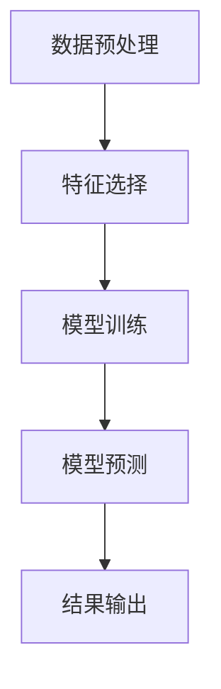
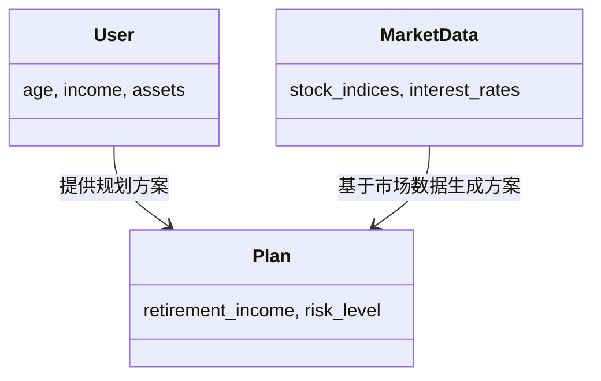
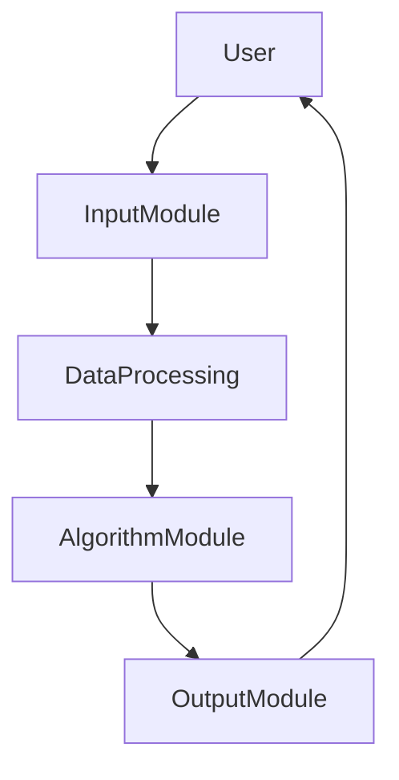

                 


# 智能退休收入规划助手

## 关键词：
智能退休收入规划、人工智能、大数据分析、财务规划、退休规划、风险管理

## 摘要：
智能退休收入规划助手是一款利用人工智能和大数据分析技术，帮助用户科学规划退休收入的工具。通过分析用户的财务状况、市场趋势和生活需求，提供个性化的退休规划建议，确保用户在退休后能够维持稳定和高质量的生活。本文将深入探讨智能退休收入规划的核心概念、算法原理、系统架构以及项目实战，为读者提供全面的技术解析。

---

## 目录大纲：

1. 智能退休收入规划的背景与需求
2. 智能退休收入规划的核心概念与联系
3. 智能退休收入规划的算法原理
4. 智能退休收入规划的系统分析与架构设计
5. 智能退休收入规划的项目实战
6. 智能退休收入规划的最佳实践、小结与注意事项
7. 智能退休收入规划的未来展望与拓展阅读

---

## 1. 智能退休收入规划的背景与需求

### 1.1 退休收入规划的重要性
- **定义与目标**：退休收入规划是通过合理配置资产和资源，确保退休后生活质量的财务规划。其目标是帮助个人在退休后维持稳定且高质量的生活。
- **社会需求**：随着人口老龄化加剧，退休收入规划的需求日益增长。传统的人工规划方式效率低下，难以应对复杂的市场变化。
- **传统规划的局限性**：传统规划方法依赖经验判断，缺乏数据支持，难以准确预测未来的收入和支出变化。

### 1.2 智能退休收入规划的兴起
- **技术驱动**：人工智能和大数据技术的发展为退休收入规划提供了新的工具和方法。
- **精准预测**：智能规划能够利用机器学习算法，基于历史数据和市场趋势，精准预测退休后的收入和支出情况。
- **个性化服务**：通过分析用户的个性化需求，智能规划能够提供定制化的财务建议，满足不同用户的多样化需求。

### 1.3 技术基础
- **人工智能**：利用机器学习算法进行预测和优化。
- **大数据分析**：通过分析海量数据，提取有用的信息用于规划。
- **区块链技术**：用于数据的安全存储和传输，确保用户数据的隐私和安全。

---

## 2. 智能退休收入规划的核心概念与联系

### 2.1 核心概念的定义与属性
- **数据驱动的规划模型**：基于用户提供的财务数据和市场数据，构建数学模型进行预测和优化。
- **个性化推荐算法**：根据用户的具体情况，推荐最优的退休收入规划方案。
- **风险管理**：通过分析市场波动和经济周期，评估和规避潜在的财务风险。

### 2.2 核心概念的联系与对比
#### 2.2.1 传统规划与智能规划的对比分析

| 对比维度         | 传统规划                     | 智能规划                     |
|------------------|------------------------------|------------------------------|
| 数据利用         | 依赖少量历史数据             | 利用大数据进行精准预测       |
| 方法论           | 基于经验判断                 | 基于算法模型进行优化         |
| 精度             | 低，受规划师经验影响           | 高，基于数据和模型进行优化   |

#### 2.2.2 系统架构的模块化分析
- **用户模块**：用户输入个人信息、财务状况和需求。
- **数据模块**：收集和处理用户数据，包括市场数据和用户数据。
- **算法模块**：利用机器学习算法进行预测和优化。
- **输出模块**：生成个性化的退休收入规划方案。

### 2.3 ER实体关系图

```mermaid
erDiagram
    user &&-|{1,m} plan : 用户可以有多个规划方案
    plan -->{1,1} risk_assessment : 每个规划方案对应一个风险评估
    risk_assessment -->{1,m} market_data : 风险评估基于多个市场数据
```

---

## 3. 智能退休收入规划的算法原理

### 3.1 算法选择与流程
#### 3.1.1 机器学习算法的应用场景
- **回归分析**：用于预测退休收入和支出。
- **决策树**：用于分类和选择最优的财务配置方案。
- **随机森林**：用于处理高维数据和提高预测准确性。

#### 3.1.2 算法流程图（mermaid）


#### 3.1.3 算法实现的Python代码示例
```python
import pandas as pd
from sklearn.linear_model import LinearRegression

# 数据预处理
data = pd.read_csv('retire_income.csv')
X = data[['age', 'income', 'assets']]
y = data['retire_income']

# 特征选择与模型训练
model = LinearRegression()
model.fit(X, y)

# 模型预测
new_data = [[50, 80000, 500000]]
prediction = model.predict(new_data)
print("预测退休收入：", prediction)
```

### 3.2 数学模型与公式
#### 3.2.1 线性回归模型
$$ y = \beta_0 + \beta_1x + \epsilon $$
其中，$y$ 是预测的退休收入，$x$ 是自变量（如年龄、收入等），$\beta_0$ 和 $\beta_1$ 是回归系数。

#### 3.2.2 风险评估模型
$$ R = \alpha \times \text{资产} + \beta \times \text{市场波动} $$
其中，$R$ 是风险评估值，$\alpha$ 和 $\beta$ 是系数，资产和市场波动是影响风险的关键因素。

#### 3.2.3 优化算法
$$ \text{目标函数} = \sum_{i=1}^{n} (y_i - \hat{y}_i)^2 $$
通过最小化目标函数，找到最优的资产配置方案。

---

## 4. 智能退休收入规划的系统分析与架构设计

### 4.1 问题场景分析
#### 4.1.1 用户需求分析
- 用户需要根据自己的财务状况，获得个性化的退休收入规划方案。
- 用户希望方案能够实时更新，适应市场变化和个人需求的变化。

#### 4.1.2 功能模块划分
- 用户信息输入模块
- 数据处理与分析模块
- 算法计算与优化模块
- 结果展示与输出模块

### 4.2 系统架构设计
#### 4.2.1 功能模块的类图（mermaid）


#### 4.2.2 系统架构图（mermaid）


---

## 5. 智能退休收入规划的项目实战

### 5.1 环境安装与准备
- **安装Python**：确保安装了Python 3.8及以上版本。
- **安装依赖库**：安装pandas、scikit-learn、matplotlib等库。

### 5.2 核心代码实现
```python
import pandas as pd
from sklearn.ensemble import RandomForestRegressor

# 数据加载
data = pd.read_csv('retire_income.csv')

# 特征选择
X = data[['age', 'income', 'assets', 'expenses']]
y = data['retire_income']

# 模型训练
model = RandomForestRegressor(n_estimators=100)
model.fit(X, y)

# 预测
new_data = pd.DataFrame({
    'age': [60],
    'income': [90000],
    'assets': [600000],
    'expenses': [30000]
})
prediction = model.predict(new_data)
print("预测退休收入：", prediction)
```

### 5.3 案例分析与结果解读
- **案例背景**：假设一位60岁用户，年收入90,000美元，资产600,000美元，年支出30,000美元。
- **预测结果**：模型预测退休收入为120,000美元。
- **结果解读**：该用户的退休收入预测较高，可能与其较高的资产和收入有关。

---

## 6. 智能退休收入规划的最佳实践、小结与注意事项

### 6.1 最佳实践
- **数据隐私保护**：确保用户数据的安全性和隐私性。
- **算法选择**：根据具体需求选择合适的算法，如随机森林适合高维数据。
- **持续优化**：定期更新模型，适应市场变化和用户需求的变化。

### 6.2 小结
智能退休收入规划助手通过结合人工智能和大数据分析技术，为用户提供精准的退休收入规划方案。其核心在于数据的处理、算法的选择和模型的优化，能够帮助用户在退休后维持高质量的生活。

### 6.3 注意事项
- **数据质量**：确保输入数据的准确性和完整性。
- **算法解释性**：选择易于解释的算法，帮助用户理解规划方案的依据。
- **风险管理**：定期评估和调整退休收入规划方案，降低潜在风险。

---

## 7. 智能退休收入规划的未来展望与拓展阅读

### 7.1 未来展望
- **技术进步**：随着人工智能和大数据技术的不断发展，退休收入规划将更加智能化和个性化。
- **应用场景扩展**：未来可能扩展到更多领域，如健康管理、旅游度假等。

### 7.2 拓展阅读
- 《机器学习实战》
- 《Python数据分析实战》
- 《风险管理与投资组合优化》

---

## 作者：AI天才研究院/AI Genius Institute & 禅与计算机程序设计艺术/Zen And The Art of Computer Programming

---

以上是《智能退休收入规划助手》的技术博客文章的完整内容，希望对您有所帮助！

