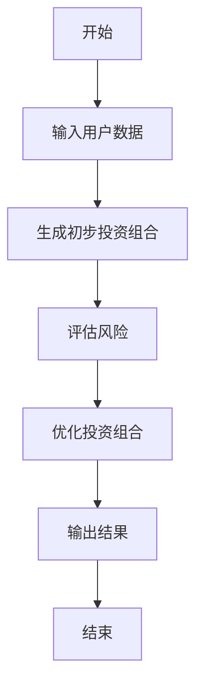

                 


# 智能退休计划优化器

> **关键词**：智能退休计划、优化器、人工智能、财务规划、投资组合、风险管理

> **摘要**：智能退休计划优化器是一种利用人工智能技术帮助用户优化退休规划的工具。本文将从问题背景、核心概念、算法原理、系统架构、项目实战等多个方面详细探讨智能退休计划优化器的设计与实现，分析其在退休规划中的应用价值。

---

## 第一部分：智能退休计划优化器的背景与核心概念

### 第1章：智能退休计划优化器的背景与问题背景

#### 1.1 问题背景

随着全球人口老龄化的加剧，退休规划问题变得日益重要。传统的人工退休规划方法存在效率低下、难以应对复杂需求等问题，尤其是在面对多样化的用户需求和市场变化时，传统方法难以提供个性化的解决方案。因此，引入智能技术，特别是人工智能（AI），成为优化退休规划的重要方向。

- **1.1.1 人口老龄化与退休规划的挑战**
  - 人口老龄化导致退休人口增加，退休资金的需求也随之增长。
  - 传统退休规划方法依赖于人工计算，效率低且难以覆盖所有可能性。

- **1.1.2 传统退休规划的局限性**
  - 需要手动收集和处理大量数据，耗时且容易出错。
  - 难以实时适应市场变化和用户需求的动态调整。

- **1.1.3 智能技术在退休规划中的应用潜力**
  - AI技术可以快速处理大量数据，提供个性化的优化方案。
  - 通过机器学习模型，可以预测市场趋势，优化投资组合。

#### 1.2 问题描述

退休规划的核心问题在于如何在有限的资源下，最大化用户的退休生活质量。这需要综合考虑资金分配、投资收益、风险承受能力等多个因素。传统方法难以满足这些复杂需求，因此需要一种智能化的解决方案。

- **1.2.1 退休规划的核心问题**
  - 如何在不确定的市场环境下实现最大化的投资收益。
  - 如何平衡风险与收益，确保退休资金的可持续性。

- **1.2.2 用户需求与目标的多样性**
  - 不同用户的退休目标、风险承受能力和资金需求各不相同。
  - 需要个性化的解决方案。

- **1.2.3 智能优化器的目标**
  - 提供基于AI的退休规划工具，帮助用户优化投资组合。
  - 实现实时调整和动态优化，适应市场变化和用户需求。

#### 1.3 问题解决与边界

智能退休计划优化器的目标是通过AI技术，为用户提供个性化的退休规划方案。其边界包括：

- **1.3.1 智能优化器的目标**
  - 优化投资组合，最大化收益。
  - 提供风险评估和税务优化建议。

- **1.3.2 边界与外延**
  - 优化器仅针对退休规划，不涉及其他财务领域。
  - 数据来源和范围需要明确界定。

- **1.3.3 核心要素与组成**
  - 用户数据输入。
  - AI算法模型。
  - 优化结果输出。

---

## 第二部分：智能退休计划优化器的核心概念与联系

### 第2章：核心概念与原理

#### 2.1 核心概念

智能退休计划优化器的核心概念包括数据驱动的退休规划、人工智能在退休规划中的应用以及智能优化算法。

- **2.1.1 数据驱动的退休规划**
  - 数据是优化的基础，需要收集和处理用户的财务数据、市场数据等。
  - 通过数据分析，识别用户需求和市场趋势。

- **2.1.2 人工智能在退休规划中的应用**
  - 使用机器学习模型预测市场趋势。
  - 利用深度学习技术生成个性化的优化方案。

- **2.1.3 智能优化算法**
  - 采用遗传算法、模拟退火等优化算法，寻找最优解。

#### 2.2 核心概念对比表

以下是传统退休规划与智能退休优化的对比：

| **方面**       | **传统退休规划**                | **智能退休优化**                |
|----------------|----------------------------------|----------------------------------|
| 数据处理       | 手动处理，效率低                 | AI自动处理，高效精准             |
| 投资组合优化   | 依赖人工经验，结果有限           | 算法驱动，结果最优               |
| 风险评估       | 难以全面评估，结果片面           | AI模型全面评估，结果准确         |

#### 2.3 ER实体关系图

以下是智能退休计划优化器的ER实体关系图：

```mermaid
erDiagram
    用户 : 用户信息
    退休计划优化器 : 优化算法
    投资组合 : 投资组合建议
    风险评估 : 风险评估结果
    税务优化 : 税务优化建议
    用户 --> 退休计划优化器 : 提供输入数据
    退休计划优化器 --> 投资组合 : 生成投资组合建议
    退休计划优化器 --> 风险评估 : 评估风险
    退休计划优化器 --> 税务优化 : 优化税务
```

---

## 第三部分：智能退休计划优化器的算法原理

### 第3章：算法原理与流程

#### 3.1 算法原理

智能退休计划优化器的核心算法包括优化目标与约束条件、算法选择与实现。

- **3.1.1 优化目标与约束条件**
  - 优化目标：最大化投资收益。
  - 约束条件：风险承受能力、资金可用性、投资期限等。

- **3.1.2 算法选择与实现**
  - 采用遗传算法（Genetic Algorithm）进行全局优化。
  - 使用模拟退火算法（Simulated Annealing）进行局部优化。

#### 3.2 算法流程图

以下是智能退休计划优化器的算法流程图：



#### 3.3 算法实现代码

以下是优化算法的Python实现示例：

```python
def optimize_retirement_plan(user_data):
    # 示例代码，具体实现取决于具体算法
    return optimized_plan
```

---

## 第四部分：智能退休计划优化器的系统分析与架构设计

### 第4章：系统分析与架构设计

#### 4.1 系统

---

## 作者

**作者**：AI天才研究院/AI Genius Institute & 禅与计算机程序设计艺术 /Zen And The Art of Computer Programming

---

以上是《智能退休计划优化器》的技术博客文章目录大纲，涵盖了从背景介绍到系统设计的各个方面。接下来将根据这个大纲撰写完整的文章，确保每个部分都详细展开，内容丰富且逻辑清晰。

