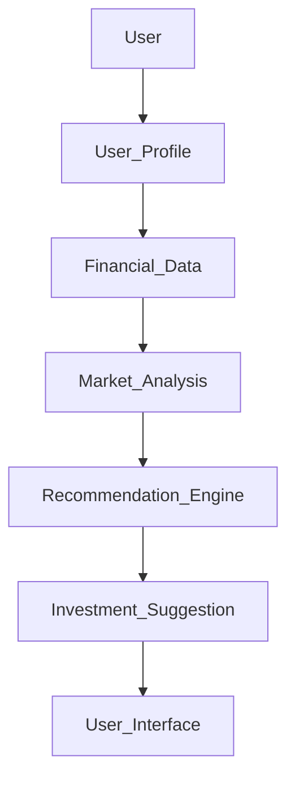
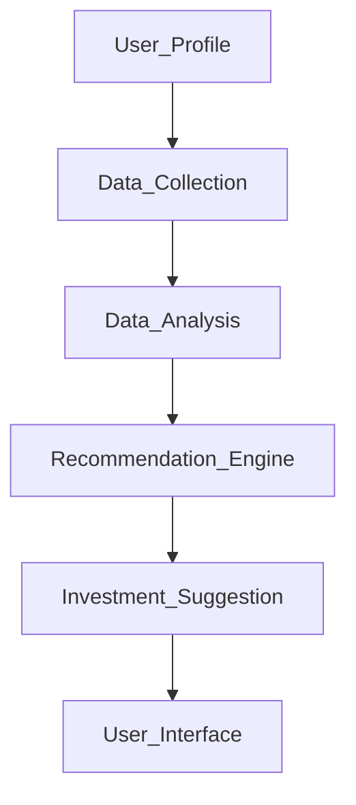
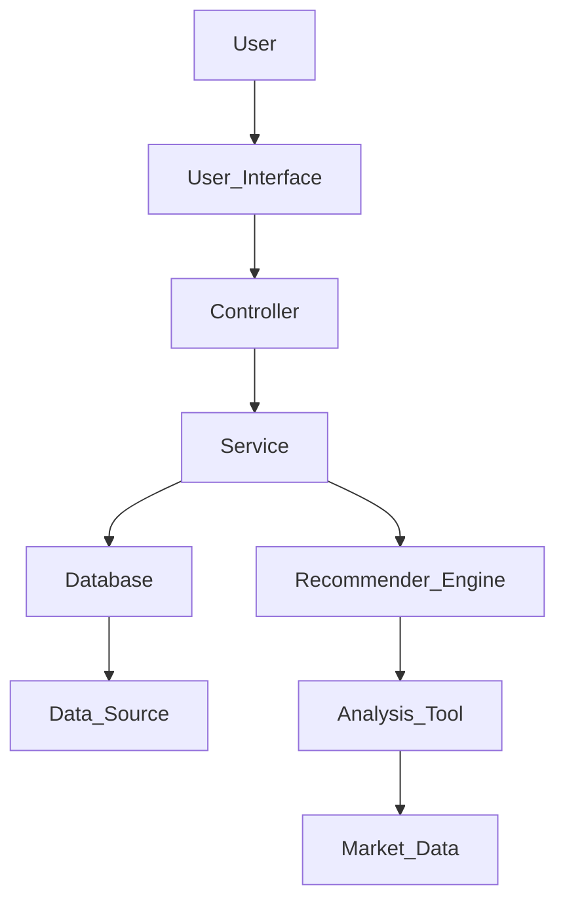
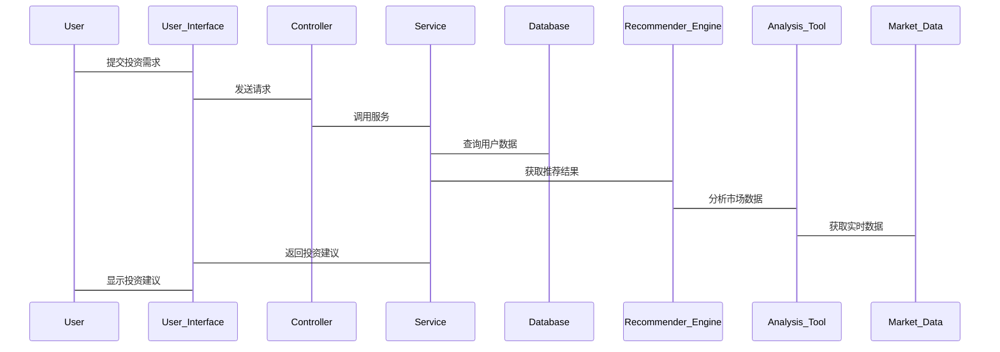

                 


# 智能金融顾问系统的设计与实现

## 关键词：智能金融顾问，人工智能，大数据，推荐算法，系统架构

## 摘要：  
智能金融顾问系统是一种结合人工智能、大数据和金融分析技术的智能系统，旨在为用户提供个性化的金融咨询和投资建议。本文将从系统背景、核心概念、算法原理、系统架构设计、项目实战等方面详细阐述智能金融顾问系统的实现过程，并探讨其在实际应用中的优势与挑战。

---

## 第一章：智能金融顾问系统背景介绍

### 1.1 智能金融顾问的定义与特点  
智能金融顾问（Smart Financial Advisor）是一种基于人工智能和大数据技术的金融咨询服务系统，能够根据用户的财务状况、投资目标和市场变化，提供个性化的投资建议和资产配置方案。  

#### 核心特点：  
- **智能化**：利用机器学习算法分析市场数据和用户需求，提供自动化、个性化的服务。  
- **实时性**：能够实时跟踪市场动态，及时调整投资建议。  
- **数据驱动**：基于海量金融数据和用户行为数据，提供精准的分析结果。  
- **交互性**：通过自然语言处理技术，支持用户与系统进行自然对话，提升用户体验。  

### 1.2 智能金融顾问系统的现状与发展趋势  
目前，智能金融顾问系统在全球范围内得到了广泛应用，尤其是在财富管理和投资领域。随着人工智能和大数据技术的不断进步，智能金融顾问系统正在从简单的数据展示工具向智能化的决策支持系统转变。未来，智能金融顾问系统将更加注重用户体验，实现从“数据驱动”到“决策驱动”的转变。

### 1.3 智能金融顾问系统的技术基础  
智能金融顾问系统的核心技术包括：  
- **人工智能**：用于自然语言处理、模式识别和机器学习。  
- **大数据技术**：用于金融数据的采集、存储和分析。  
- **区块链技术**：用于金融交易的安全性和透明性。  

### 1.4 智能金融顾问系统的必要性  
传统的金融顾问服务存在效率低、成本高、覆盖面窄等问题。而智能金融顾问系统能够通过自动化和智能化的方式，显著提升金融服务的效率和质量，降低服务成本，扩大服务覆盖面。

---

## 第二章：智能金融顾问系统的核心概念与联系  

### 2.1 系统架构的核心概念  
智能金融顾问系统的架构主要包括以下几个核心模块：  
- **用户需求分析模块**：通过问卷调查、用户行为分析等方式，获取用户的财务状况、风险偏好和投资目标。  
- **金融数据分析模块**：对市场数据、用户数据和经济指标进行分析，生成投资建议。  
- **智能推荐引擎模块**：基于分析结果，利用推荐算法生成个性化投资方案。  
- **用户交互界面模块**：通过网页或移动应用，向用户提供投资建议和交互服务。  

### 2.2 系统功能模块的实体关系  
下图展示了智能金融顾问系统的核心实体关系：  



### 2.3 数据流与系统功能  
下图展示了系统的数据流和功能关系：  



---

## 第三章：智能金融顾问系统的算法原理  

### 3.1 推荐算法的选择与实现  
智能金融顾问系统的核心算法是推荐算法，常用的推荐算法包括协同过滤（Collaborative Filtering）、基于内容的推荐（Content-Based Filtering）和混合推荐（Hybrid Recommendation）。  

#### 协同过滤算法  
协同过滤算法是一种基于用户相似性推荐算法，公式如下：  

$$similarity(u, v) = \frac{\sum_{i=1}^n (r_{u,i} - \bar{r}_u)(r_{v,i} - \bar{r}_v)}{\sqrt{\sum_{i=1}^n (r_{u,i} - \bar{r}_u)^2} \cdot \sqrt{\sum_{i=1}^n (r_{v,i} - \bar{r}_v)^2}}$$  

其中，$r_{u,i}$表示用户$u$对物品$i$的评分，$\bar{r}_u$表示用户$u$的平均评分。  

#### 协同过滤算法的实现步骤：  
1. 数据预处理：对用户评分数据进行归一化处理。  
2. 计算用户相似度：基于协同过滤公式计算用户之间的相似度。  
3. 推荐计算：基于相似用户的评分数据，预测目标用户的评分，进行排序并推荐。  

#### 协同过滤算法的Python实现：  
```python
import numpy as np

def collaborative_filtering(user_ratings, user_ids, item_ids):
    # 创建用户-物品评分矩阵
    ratings_matrix = np.zeros((len(user_ids), len(item_ids)))
    for i, user_id in enumerate(user_ids):
        for j, item_id in enumerate(item_ids):
            ratings_matrix[i, j] = user_ratings.get((user_id, item_id), 0)
    
    # 计算用户平均评分
    user_avg = np.mean(ratings_matrix, axis=1)
    item_avg = np.mean(ratings_matrix, axis=0)
    
    # 数据归一化
    normalized_ratings = ratings_matrix - user_avg[:, np.newaxis]
    
    # 计算相似度
    similarity = np.zeros((len(user_ids), len(user_ids)))
    for i in range(len(user_ids)):
        for j in range(len(user_ids)):
            if i == j:
                similarity[i, j] = 0
            else:
                numerator = np.sum(normalized_ratings[i] * normalized_ratings[j])
                denominator = np.sqrt(np.sum(normalized_ratings[i]**2)) * np.sqrt(np.sum(normalized_ratings[j]**2))
                similarity[i, j] = numerator / denominator if denominator != 0 else 0
    return similarity
```

### 3.2 自然语言处理技术的应用  
智能金融顾问系统还可以通过自然语言处理技术，理解用户的文本输入，提供更加个性化的服务。例如，用户可以通过输入文本描述其财务状况和投资目标，系统通过文本分析生成相应的投资建议。

---

## 第四章：智能金融顾问系统的系统分析与架构设计  

### 4.1 系统问题场景分析  
智能金融顾问系统需要解决以下问题：  
- 如何高效地采集和处理用户数据？  
- 如何实现个性化的投资建议？  
- 如何保证系统的安全性和稳定性？  

### 4.2 系统功能设计  
系统功能设计主要包括以下几个方面：  
- **用户管理**：用户注册、登录、信息管理。  
- **数据采集**：用户问卷调查、市场数据采集。  
- **数据分析**：市场分析、用户分析、风险评估。  
- **推荐引擎**：投资组合推荐、风险提示。  
- **用户交互**：在线咨询、投资建议展示。  

### 4.3 系统架构设计  
下图展示了智能金融顾问系统的架构设计：  



### 4.4 接口设计  
系统主要接口包括：  
- **用户接口**：用户通过网页或移动应用与系统交互。  
- **数据接口**：与金融数据源（如股票市场数据）对接。  
- **推荐接口**：与推荐算法模块对接，获取投资建议。  

### 4.5 交互设计  
系统交互流程如下：  



---

## 第五章：智能金融顾问系统的项目实战  

### 5.1 环境安装与配置  
- **Python**：安装Python 3.8以上版本。  
- **库依赖**：安装numpy、pandas、scikit-learn、flask等库。  

### 5.2 核心功能实现  
#### 推荐引擎的实现  
```python
from sklearn.metrics.pairwise import cosine_similarity

def main():
    # 示例数据：用户-物品评分矩阵
    ratings = {
        ('User1', 'Item1'): 5,
        ('User1', 'Item2'): 4,
        ('User2', 'Item1'): 3,
        ('User2', 'Item2'): 5,
        ('User3', 'Item1'): 4,
        ('User3', 'Item2'): 3,
    }
    
    # 创建用户和物品列表
    user_ids = ['User1', 'User2', 'User3']
    item_ids = ['Item1', 'Item2']
    
    # 创建评分矩阵
    ratings_matrix = np.zeros((len(user_ids), len(item_ids)))
    for key, value in ratings.items():
        i = user_ids.index(key[0])
        j = item_ids.index(key[1])
        ratings_matrix[i, j] = value
    
    # 计算相似度矩阵
    similarity = cosine_similarity(ratings_matrix)
    
    # 推荐算法实现
    # （此处可以根据需要进一步优化）
    print(similarity)
    
if __name__ == '__main__':
    main()
```

#### 系统功能分析  
通过上述代码，我们可以实现一个简单的协同过滤推荐算法。实际应用中，还需要考虑数据的实时更新和系统的可扩展性。

---

## 第六章：智能金融顾问系统的最佳实践与小结  

### 6.1 最佳实践  
- **数据安全**：确保用户数据的安全性和隐私性。  
- **系统性能**：优化算法和数据库性能，确保系统的高效运行。  
- **用户体验**：注重用户交互设计，提升用户体验。  

### 6.2 小结  
智能金融顾问系统的实现结合了人工智能、大数据和金融分析技术，能够为用户提供高效、个性化的金融服务。然而，在实际应用中，还需要考虑系统的可扩展性、安全性和用户体验等问题。

---

## 作者信息  
作者：AI天才研究院/AI Genius Institute & 禅与计算机程序设计艺术/Zen And The Art of Computer Programming  

---

## 参考文献与工具  
- [1] 章鱼帮. 《Python机器学习实战》. 人民邮电出版社, 2019.  
- [2] 李明. 《深入浅出人工智能》. 清华大学出版社, 2020.  
- [3] scikit-learn官方文档：https://scikit-learn.org/stable/modules/generated/sklearn.metrics.pairwise.cosine_similarity.html  

---

通过以上步骤，您可以实现一个智能金融顾问系统，并根据实际需求进行功能扩展和优化。希望本文对您有所帮助！

