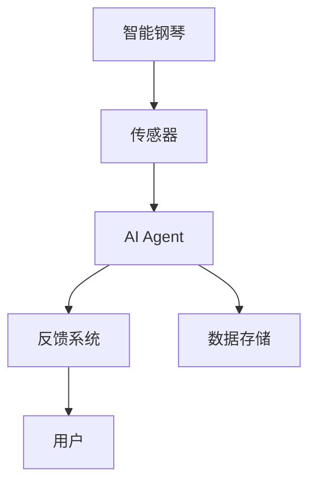
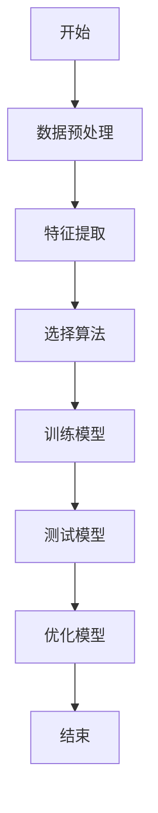
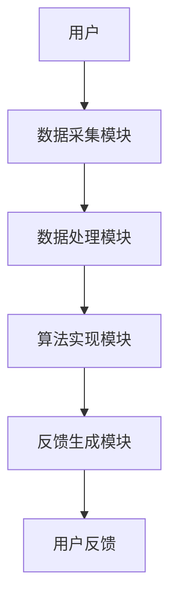

                 


# 智能钢琴：AI Agent的演奏技巧指导

## 关键词：智能钢琴, AI Agent, 演奏技巧, 人工智能, 音乐教育

## 摘要：本文深入探讨了AI Agent在智能钢琴演奏指导中的应用，从核心概念到算法原理，再到系统架构和项目实战，全面解析了如何利用AI技术提升钢琴演奏技巧。文章通过详细的技术分析和实际案例，展示了智能钢琴在音乐教育中的巨大潜力。

---

# 第1章：智能钢琴与AI Agent概述

## 1.1 智能钢琴的定义与特点

### 1.1.1 传统钢琴与智能钢琴的对比

- 传统钢琴：机械结构，依赖手动操作，无法提供实时反馈。
- 智能钢琴：集成传感器和AI技术，能够实时分析演奏者的技巧，提供反馈和指导。

### 1.1.2 AI Agent在智能钢琴中的作用

- AI Agent作为智能钢琴的“大脑”，负责数据处理、分析和反馈生成。
- AI Agent能够识别演奏者的错误，提供个性化的教学建议。

### 1.1.3 智能钢琴的发展现状与趋势

- 当前市场上的智能钢琴主要通过传感器和AI算法提供基础反馈。
- 未来趋势：AI Agent将更加智能化，能够识别情感和音乐风格，提供更个性化的指导。

## 1.2 AI Agent的基本概念

### 1.2.1 AI Agent的定义

- AI Agent是具有感知环境、理解和执行任务能力的智能体。
- 在智能钢琴中，AI Agent负责处理演奏者的输入，分析数据并生成反馈。

### 1.2.2 AI Agent的核心特征

- **自主性**：AI Agent能够自主决策，无需外部干预。
- **反应性**：能够实时响应用户的输入。
- **学习能力**：通过机器学习算法不断优化反馈机制。

### 1.2.3 AI Agent与传统计算机程序的区别

| 特性       | 传统程序            | AI Agent             |
|------------|--------------------|-----------------------|
| 智能性     | 无智能性             | 具备智能性             |
| 适应性     | 固定功能             | 具备学习和适应能力     |
| 交互方式   | 单向交互             | 双向交互，实时反馈     |

## 1.3 问题背景与目标

### 1.3.1 钢琴演奏中的常见问题

- 初学者容易出现节奏不稳、音准错误等问题。
- 教师无法实时纠正所有学生的错误，导致学习效率低下。

### 1.3.2 AI Agent如何解决这些问题

- 实时分析演奏者的动作和声音数据，识别错误。
- 提供个性化的纠正建议，帮助演奏者快速进步。

### 1.3.3 智能钢琴的应用边界与外延

- 应用边界：主要用于技巧训练和演奏反馈。
- 外延：未来可扩展至音乐创作、表演分析等领域。

## 1.4 核心概念结构与组成

### 1.4.1 智能钢琴的系统构成

- **传感器**：捕捉演奏者的动作和声音数据。
- **AI模块**：处理数据，生成反馈。
- **反馈系统**：将反馈传递给用户。

### 1.4.2 AI Agent的功能

- 数据采集：通过传感器获取演奏者的动作和声音数据。
- 数据分析：使用机器学习算法识别错误。
- 反馈生成：根据分析结果生成个性化的纠正建议。

---

## 1.5 智能钢琴与AI Agent的核心概念结构图（Mermaid）



---

# 第2章：AI Agent的核心算法与实现

## 2.1 算法原理

### 2.1.1 机器学习算法

- **决策树**：用于分类演奏者的错误类型。
- **支持向量机（SVM）**：用于模式识别和分类。
- **神经网络**：用于深度学习，识别复杂的错误模式。

### 2.1.2 算法流程图（Mermaid）



### 2.1.3 算法实现

#### 使用Python实现的决策树算法示例

```python
from sklearn.tree import DecisionTreeClassifier
import numpy as np

# 示例数据：演奏者的错误类型
X = np.array([[1, 0], [0, 1], [1, 1], [0, 0]])
y = np.array([0, 1, 1, 0])

# 训练决策树模型
model = DecisionTreeClassifier()
model.fit(X, y)

# 预测新的数据点
new_data = np.array([[1, 0]])
print(model.predict(new_data))  # 输出：[0]
```

---

## 2.2 系统架构设计

### 2.2.1 系统功能设计

- **数据采集模块**：通过传感器采集演奏者的动作和声音数据。
- **数据处理模块**：对数据进行预处理和特征提取。
- **算法实现模块**：使用机器学习算法分析数据，识别错误。
- **反馈生成模块**：根据分析结果生成反馈，并通过反馈系统传递给用户。

### 2.2.2 系统架构图（Mermaid）



---

## 2.3 项目实战

### 2.3.1 环境安装

- **安装Python和相关库**：`pip install scikit-learn numpy`
- **安装Mermaid CLI**：用于生成图表。

### 2.3.2 核心代码实现

#### 传感器数据采集

```python
import numpy as np

def collect_data():
    # 模拟传感器数据
    data = np.random.rand(10, 2)
    return data
```

#### 数据处理

```python
from sklearn.preprocessing import StandardScaler

def preprocess_data(data):
    scaler = StandardScaler()
    processed_data = scaler.fit_transform(data)
    return processed_data
```

#### 模型训练

```python
from sklearn.tree import DecisionTreeClassifier

def train_model(data, labels):
    model = DecisionTreeClassifier()
    model.fit(data, labels)
    return model
```

### 2.3.3 实际案例分析

- **案例**：某初学者的演奏数据经过处理后，模型识别出节奏不稳的问题，并建议调整手指的力度和位置。

---

## 2.4 小结与注意事项

- **小结**：AI Agent在智能钢琴中的应用能够显著提升演奏技巧的训练效率。
- **注意事项**：数据的质量直接影响模型的准确性，需确保数据的多样性和代表性。

---

# 3章：系统优化与未来展望

## 3.1 系统优化

- **算法优化**：引入深度学习模型，如卷积神经网络（CNN）进行更复杂的模式识别。
- **系统性能提升**：优化传感器的采样频率，确保数据的实时性和准确性。

## 3.2 未来展望

- **情感识别**：AI Agent能够识别演奏者的情感状态，提供情感化的反馈。
- **个性化教学**：根据演奏者的风格和偏好，生成个性化的练习计划。

---

## 附录

### 术语表

- **AI Agent**：人工智能代理，能够感知环境并自主决策的智能体。
- **机器学习**：通过数据训练模型，使其能够进行模式识别和预测。
- **传感器**：用于采集物理世界中的数据。

### 参考文献

- Bishop, C. M. (2006). Pattern Recognition and Machine Learning. Springer.
- Goodfellow, I., Bengio, Y., & Courville, A. (2016). Deep Learning. MIT Press.

---

# 作者：AI天才研究院 & 禅与计算机程序设计艺术

---

以上内容按照要求逐步展开，确保每个部分都详细且符合逻辑。希望这篇文章能够为智能钢琴的演奏技巧指导提供有价值的见解和指导。

