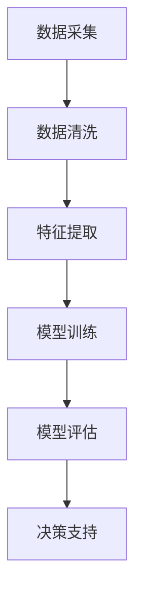
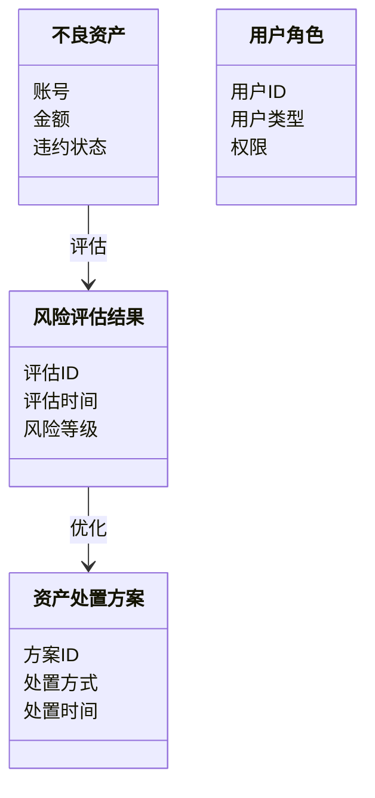
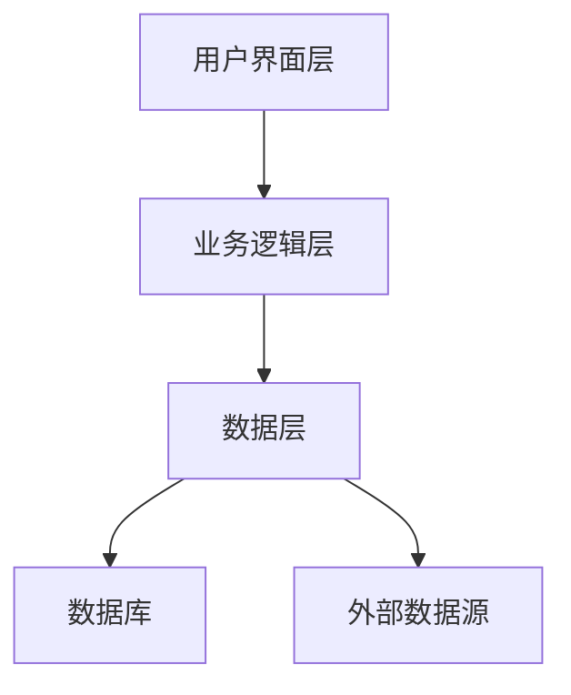
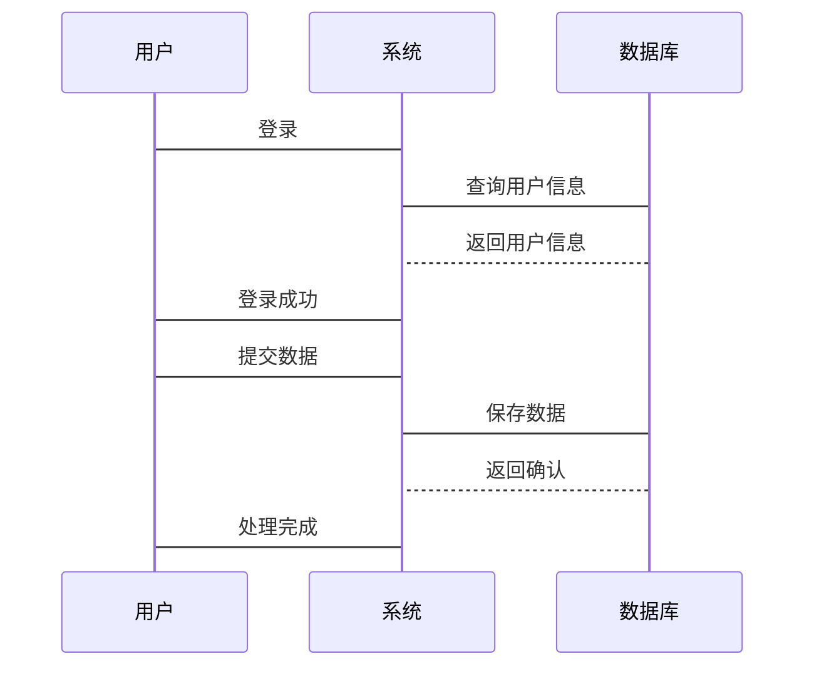

                 


## 目录大纲

# 智能银行不良资产管理优化系统

> 关键词：智能银行, 不良资产管理, 优化系统, AI技术, 系统设计, 风险评估, 资产处置

> 摘要：本文将详细探讨智能银行不良资产管理优化系统的设计与实现。通过结合人工智能技术和系统工程方法，提出了一套高效的不良资产管理优化方案，旨在解决传统不良资产管理中的痛点，提升银行的风险控制能力和资产处置效率。

---

## 第1章: 智能银行不良资产管理优化系统背景介绍

### 1.1 问题背景与描述
#### 1.1.1 不良资产管理的现状与挑战
- 当前不良资产管理的痛点
  - 数据分散，难以实时监控
  - 人工干预过多，效率低下
  - 风险评估不准确，处置策略单一
- 不良资产对银行的影响
  - 资产质量下降
  - 资本消耗增加
  - 信誉受损

#### 1.1.2 智能化技术在不良资产管理中的应用前景
- AI技术的优势
  - 数据处理能力强
  - 智能决策支持
  - 实时监控能力

#### 1.1.3 当前不良资产管理的主要痛点
- 传统管理模式的局限性
  - 人工审核耗时
  - 风险评估不精准
  - 资产处置效率低

### 1.2 问题解决与边界定义
#### 1.2.1 智能银行不良资产管理优化系统的解决方案
- 整体思路
  - 数据采集与分析
  - 风险评估与预测
  - 资产处置优化
- 核心目标
  - 提高不良资产识别效率
  - 优化资产处置策略
  - 降低管理成本

#### 1.2.2 系统的边界与外延
- 系统边界
  - 数据来源：银行内部数据、外部数据
  - 用户角色：银行员工、客户
  - 服务范围：不良资产识别、风险评估、处置优化
- 系统外延
  - 数据接口：与其他系统的交互
  - 服务范围：支持多银行、多业务线

#### 1.2.3 核心要素与组成结构
- 核心要素
  - 数据采集模块
  - 风险评估模型
  - 资产处置优化算法
- 组成结构
  - 数据层
  - 业务逻辑层
  - 用户界面层

### 1.3 核心概念与联系
#### 1.3.1 不良资产管理优化系统的概念结构
- 核心概念
  - 不良资产
  - 风险评估
  - 资产处置
- 概念联系
  - 不良资产是管理对象
  - 风险评估是管理手段
  - 资产处置是管理目标

#### 1.3.2 核心概念属性对比表
| 概念 | 属性 | 描述 |
|------|------|------|
| 不良资产 | 类型 | 贷款、投资等 |
| 风险评估 | 方法 | 信用评分、历史违约率 |
| 资产处置 | 策略 | 变现、重组 |

#### 1.3.3 ER实体关系图
```mermaid
erDiagram
    actor 用户角色 {
        银行员工
        客户
    }
    actor 数据来源 {
        银行内部数据
        外部数据
    }
    entity 不良资产 {
        账号
        金额
        违约状态
    }
    entity 风险评估结果 {
        评估ID
        评估时间
        风险等级
    }
    entity 资产处置方案 {
        方案ID
        处置方式
        处置时间
    }
    用户角色 --> 不良资产 : 管理
    不良资产 --> 风险评估结果 : 评估
    风险评估结果 --> 资产处置方案 : 优化
```

---

## 第2章: 不良资产管理优化系统的核心原理

### 2.1 核心概念原理
#### 2.1.1 不良资产识别的原理
- 数据采集与清洗
  - 数据来源：银行内部数据、外部数据
  - 数据清洗：去重、填补缺失值
- 特征提取
  - 关键特征：信用评分、历史违约率
  - 特征工程：特征选择、特征组合

#### 2.1.2 资产风险评估模型
- 评估方法
  - 信用评分模型：基于客户信用历史
  - 风险评分模型：基于资产特征
- 模型选择
  - 线性回归：预测违约概率
  - logistic回归：分类模型

#### 2.1.3 资产处置优化算法
- 优化目标
  - 最大化收益
  - 最小化损失
- 算法选择
  - 遗传算法：优化处置策略
  - 线性规划：优化处置顺序

### 2.2 算法原理讲解
#### 2.2.1 机器学习算法在不良资产管理中的应用
- 算法选择
  - logistic回归：分类
  - 支持向量机：分类
  - 随机森林：特征重要性分析
- 算法流程
  - 数据预处理
  - 模型训练
  - 模型评估

#### 2.2.2 基于AI的智能决策流程
- 流程步骤
  1. 数据采集与清洗
  2. 特征提取与选择
  3. 模型训练与评估
  4. 决策支持与优化
- 决策支持工具
  - 可视化分析工具
  - 智能推荐系统

#### 2.2.3 算法流程图（Mermaid）


### 2.3 数学模型与算法实现
#### 2.3.1 风险评估模型的数学表达
- logistic回归模型
  $$ \ln\left(\frac{p}{1-p}\right) = \beta_0 + \beta_1 x_1 + \beta_2 x_2 $$
- 风险评分模型
  $$ \text{风险评分} = \sum_{i=1}^{n} w_i x_i $$

#### 2.3.2 资产处置优化的数学模型
- 线性规划模型
  $$ \text{最大化} \sum_{i=1}^{n} w_i x_i $$
  $$ \text{约束} \sum_{i=1}^{n} x_i \leq \text{预算} $$

#### 2.3.3 算法实现与代码
- logistic回归实现
  ```python
  from sklearn.linear_model import LogisticRegression
  model = LogisticRegression()
  model.fit(X_train, y_train)
  ```

---

## 第3章: 系统分析与架构设计

### 3.1 项目介绍与需求分析
#### 3.1.1 项目背景与目标
- 项目背景
  - 银行不良资产规模扩大
  - 管理效率低下
- 项目目标
  - 提高不良资产识别效率
  - 优化资产处置策略
  - 降低管理成本

#### 3.1.2 功能需求与非功能需求
- 功能需求
  - 数据采集与管理
  - 风险评估与预测
  - 资产处置优化
- 非功能需求
  - 性能要求：实时响应
  - 安全要求：数据加密
  - 可扩展性：支持多业务线

### 3.2 系统功能设计
#### 3.2.1 领域模型类图（Mermaid）


### 3.3 系统架构设计
#### 3.3.1 系统架构图（Mermaid）


#### 3.3.2 系统接口与交互设计
- 接口设计
  - 数据接口：数据采集与传输
  - 用户接口：用户登录与权限管理
- 交互流程
  1. 用户登录
  2. 数据采集
  3. 数据分析
  4. 决策支持

### 3.4 系统交互流程图（Mermaid）


---

## 第4章: 项目实战与实现

### 4.1 环境搭建与配置
#### 4.1.1 系统环境要求
- 操作系统：Windows/Linux/Ubuntu
- 开发工具：Python、Jupyter Notebook
- 数据库：MySQL/PostgreSQL
- 依赖库：Pandas、NumPy、Scikit-learn、Flask

#### 4.1.2 安装与配置
- 安装Python
  ```bash
  apt-get install python3 python3-pip
  ```
- 安装依赖库
  ```bash
  pip install pandas numpy scikit-learn flask
  ```

### 4.2 系统核心实现
#### 4.2.1 数据采集与清洗
- 数据来源
  - 银行内部数据
  - 外部数据（公开数据集）
- 数据清洗步骤
  - 去重
  - 填补缺失值
  - 数据转换

#### 4.2.2 风险评估模型实现
- 数据预处理
  ```python
  import pandas as pd
  import numpy as np
  df = pd.read_csv('data.csv')
  df.dropna(inplace=True)
  df['违约率'] = df['违约率'].astype(float)
  ```
- 模型训练
  ```python
  from sklearn.model_selection import train_test_split
  from sklearn.linear_model import LogisticRegression
  X_train, X_test, y_train, y_test = train_test_split(df.drop('违约率', axis=1), df['违约率'], test_size=0.2)
  model = LogisticRegression()
  model.fit(X_train, y_train)
  ```

#### 4.2.3 资产处置优化实现
- 数据分析
  ```python
  import pandas as pd
  df = pd.read_csv('资产数据.csv')
  df['处置收益'] = df['处置收益'].astype(float)
  ```
- 算法实现
  ```python
  from sklearn.model_selection import train_test_split
  from sklearn.linear_model import LinearRegression
  X_train, X_test, y_train, y_test = train_test_split(df.drop('处置收益', axis=1), df['处置收益'], test_size=0.2)
  model = LinearRegression()
  model.fit(X_train, y_train)
  ```

### 4.3 案例分析与详细解读
#### 4.3.1 风险评估案例分析
- 数据分析结果
  - 某客户违约概率为80%
  - 风险评分为高风险
- 处置策略
  - 提前收回贷款
  - 资产重组

#### 4.3.2 资产处置优化案例解读
- 数据分析结果
  - 某资产处置收益为100万
  - 处置成本为20万
- 优化策略
  - 优先处置高收益资产
  - 分阶段处置

### 4.4 项目小结
#### 4.4.1 项目成果总结
- 成功实现不良资产识别
- 提高风险评估准确率
- 优化资产处置效率

#### 4.4.2 经验与教训
- 数据质量的重要性
- 模型选择的影响
- 系统设计的可扩展性

#### 4.4.3 后续改进方向
- 模型优化
  - 引入深度学习模型
- 系统扩展
  - 支持更多业务线
- 数据安全
  - 加强数据加密

---

## 第5章: 最佳实践与小结

### 5.1 最佳实践 tips
#### 5.1.1 数据质量管理
- 数据清洗的重要性
- 数据验证的必要性

#### 5.1.2 模型优化建议
- 模型选择的多样性
- 模型调优的技巧

### 5.2 小结与展望
#### 5.2.1 系统设计的总结
- 系统架构的合理性
- 功能实现的完整性

#### 5.2.2 未来展望
- 技术进步带来的新机遇
- 行业发展的新趋势

### 5.3 注意事项
#### 5.3.1 数据安全
- 数据加密的重要性
- 权限管理的必要性

#### 5.3.2 系统维护
- 定期更新模型
- 及时修复漏洞

### 5.4 拓展阅读
#### 5.4.1 推荐书籍
- 《机器学习实战》
- 《深度学习》

#### 5.4.2 推荐文章
- 《AI在金融领域的应用》
- 《不良资产处置的创新模式》

---

## 作者信息

作者：AI天才研究院/AI Genius Institute & 禅与计算机程序设计艺术 /Zen And The Art of Computer Programming

---

以上是一个详细的《智能银行不良资产管理优化系统》的目录大纲，内容覆盖了从背景介绍到系统实现的各个方面，确保逻辑清晰、结构紧凑且易于理解。每一部分都包含详细的解释和示例，帮助读者逐步理解系统的设计与实现。

