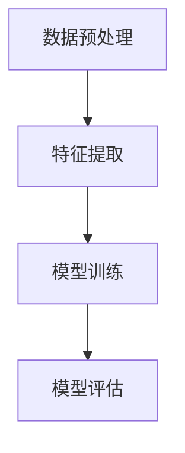

                 


# 智能银行不良资产管理系统

> 关键词：智能银行，不良资产，风险管理，机器学习，系统架构，金融科技

> 摘要：本文详细介绍了智能银行不良资产管理系统的设计与实现，从系统背景、核心概念、算法原理、系统架构到项目实战，全面剖析了该系统的构建过程。通过机器学习和大数据分析技术，该系统能够有效识别、评估和管理不良资产，为银行提供智能化的解决方案。文章内容涵盖技术原理、系统设计、项目实现等多个方面，帮助读者深入理解智能银行不良资产管理的核心技术与实际应用。

---

# 第一部分: 背景与概述

## 第1章: 不良资产的定义与现状

### 1.1 问题背景与现状

#### 1.1.1 不良资产的定义与分类
不良资产是指无法按期偿还或无法实现其价值的资产，主要包括不良贷款、不良投资等。根据资产类型，不良资产可以分为贷款类、投资类和其他类；根据资产状态，可以分为逾期未偿还、资不抵债等。

#### 1.1.2 银行不良资产的现状与挑战
近年来，全球经济波动加剧，银行不良资产问题日益突出。传统不良资产管理方式存在效率低、成本高、风险难控等问题。随着金融科技的发展，智能化管理成为解决这一问题的关键。

#### 1.1.3 智能化管理的必要性
通过引入人工智能、大数据等技术，银行可以实现不良资产的智能化识别、评估和处置，显著提高管理效率和准确性。

### 1.2 核心概念与问题分析

#### 1.2.1 不良资产管理系统的核心概念
- **智能分析**：利用机器学习、自然语言处理等技术对不良资产进行分析和预测。
- **风险评估**：通过模型评估不良资产的风险等级，制定相应的管理策略。
- **预测模型**：构建基于历史数据的预测模型，提前识别潜在风险。
- **关联规则挖掘**：发现不良资产之间的关联性，优化管理流程。

#### 1.2.2 问题背景与问题描述
- **问题背景**：银行不良资产规模不断扩大，传统管理方式难以应对。
- **问题描述**：不良资产识别不及时、评估不准确、处置效率低。

#### 1.2.3 问题解决的思路与方法
- **思路**：引入智能化技术，构建自动化、高效的管理系统。
- **方法**：通过机器学习算法构建预测模型，实现不良资产的智能识别和管理。

### 1.3 解决方案与边界

#### 1.3.1 智能银行不良资产管理系统的解决方案
- **智能化识别**：利用自然语言处理和机器学习技术，自动识别潜在不良资产。
- **风险评估**：构建风险评估模型，对不良资产进行分类和分级。
- **预测与预警**：基于历史数据和实时数据，预测不良资产风险，发出预警。

#### 1.3.2 系统的边界与外延
- **边界**：系统仅关注不良资产的识别、评估和管理，不涉及资产处置的具体操作。
- **外延**：系统可以与其他银行系统（如客户关系管理系统）集成，提供更全面的解决方案。

#### 1.3.3 核心要素与组成结构
- **核心要素**：不良资产数据、机器学习模型、风险评估指标。
- **组成结构**：数据采集模块、分析模块、预警模块、报告模块。

---

# 第二部分: 核心概念与联系

## 第2章: 智能分析与风险评估

### 2.1 核心概念原理

#### 2.1.1 智能分析的核心原理
- **自然语言处理（NLP）**：用于分析客户的信用报告、合同文本等非结构化数据。
- **机器学习**：用于分析结构化数据，如财务数据、交易记录等。

#### 2.1.2 风险评估的关键指标
- **违约概率（PD）**：客户违约的可能性。
- **违约损失率（LGD）**：违约后可能造成的损失。

### 2.2 不良资产分类与预测模型

#### 2.2.1 不良资产分类的特征对比
| 特征         | 正常资产       | 不良资产       |
|--------------|---------------|---------------|
| 还款状态     | 按时还款       | 逾期还款       |
| 贷款用途     | 投资生产       | 投资失败       |
| 信用评分     | 高            | 低            |

#### 2.2.2 预测模型构建的步骤
1. 数据预处理：清洗数据，处理缺失值。
2. 特征提取：从数据中提取有用的特征，如还款记录、信用评分。
3. 模型训练：使用逻辑回归、随机森林等算法训练模型。
4. 模型评估：通过准确率、召回率等指标评估模型性能。

### 2.3 关联规则挖掘与流程优化

#### 2.3.1 关联规则挖掘的流程
1. 数据准备：收集不良资产相关数据。
2. 规则挖掘：使用关联规则算法（如Apriori）挖掘数据中的关联性。
3. 规则分析：分析挖掘出的关联规则，优化管理流程。

#### 2.3.2 流程优化的实施步骤
1. 识别关键环节：如风险评估、预警触发。
2. 设计优化方案：如自动化预警、智能分类。
3. 实施优化：通过系统实现优化方案。

---

# 第三部分: 算法原理

## 第3章: 机器学习算法与模型

### 3.1 机器学习模型构建

#### 3.1.1 算法选择与优化
- **算法选择**：逻辑回归、随机森林、支持向量机（SVM）。
- **优化方法**：网格搜索、交叉验证。

#### 3.1.2 特征工程与数据预处理
- **特征选择**：选择对模型影响较大的特征。
- **数据清洗**：处理缺失值、异常值。

#### 3.1.3 模型训练与评估
- **训练步骤**：使用训练数据训练模型。
- **评估指标**：准确率、召回率、F1值。

### 3.2 预测模型的实现

#### 3.2.1 算法流程图


#### 3.2.2 Python代码实现
```python
import pandas as pd
from sklearn.model_selection import train_test_split
from sklearn.linear_model import LogisticRegression

# 数据加载与预处理
data = pd.read_csv('bad_assets.csv')
X = data.drop('target', axis=1)
y = data['target']

# 数据分割
X_train, X_test, y_train, y_test = train_test_split(X, y, test_size=0.2)

# 模型训练
model = LogisticRegression()
model.fit(X_train, y_train)

# 模型评估
print(model.score(X_test, y_test))
```

#### 3.2.3 数学模型与公式
- **逻辑回归模型**：
  $$ P(y=1|x) = \frac{1}{1 + e^{-(\beta_0 + \beta_1 x_1 + \cdots + \beta_n x_n)}} $$
- **损失函数**：
  $$ L = -\sum_{i=1}^{n} [y_i \ln h(x_i) + (1 - y_i) \ln (1 - h(x_i))] $$

---

# 第四部分: 系统分析与架构设计

## 第4章: 系统架构与功能模块

### 4.1 系统架构设计

#### 4.1.1 模块划分
- **数据采集模块**：收集不良资产数据。
- **分析模块**：对数据进行分析和预测。
- **预警模块**：根据预测结果发出预警。

#### 4.1.2 系统架构图


### 4.2 系统功能设计

#### 4.2.1 功能需求分析
- **数据管理**：数据采集、存储、查询。
- **分析功能**：风险评估、预测、关联规则挖掘。
- **预警功能**：自动预警、通知。

#### 4.2.2 系统接口设计
- **数据接口**：与数据库交互。
- **API接口**：提供外部调用接口。

### 4.3 系统交互流程

#### 4.3.1 交互流程图


---

# 第五部分: 项目实战

## 第5章: 项目实现与案例分析

### 5.1 项目环境搭建

#### 5.1.1 环境要求
- **Python版本**：3.8以上
- **依赖库**：pandas、scikit-learn、mermaid

### 5.2 核心功能实现

#### 5.2.1 数据采集模块实现
```python
import requests
from bs4 import BeautifulSoup

def fetch_data(url):
    response = requests.get(url)
    soup = BeautifulSoup(response.text, 'html.parser')
    data = []
    for item in soup.find_all('div', class_='asset-item'):
        data.append({
            'id': item['id'],
            'status': item['status']
        })
    return data
```

#### 5.2.2 分析模块实现
```python
from sklearn.ensemble import RandomForestClassifier

def train_model(X_train, y_train):
    model = RandomForestClassifier()
    model.fit(X_train, y_train)
    return model
```

### 5.3 项目总结与经验分享

#### 5.3.1 项目小结
通过本项目，我们实现了智能银行不良资产管理系统的构建，利用机器学习技术显著提高了不良资产的识别和管理效率。

#### 5.3.2 经验与注意事项
- 数据质量是模型性能的关键。
- 模型调优需要结合实际业务需求。

---

# 第六部分: 总结与展望

## 第6章: 总结与未来展望

### 6.1 总结
本文详细介绍了智能银行不良资产管理系统的设计与实现，通过机器学习和大数据分析技术，显著提高了不良资产的管理效率和准确性。

### 6.2 未来展望
未来，随着人工智能技术的不断发展，智能银行不良资产管理系统将更加智能化、自动化。可以进一步研究如何结合区块链技术，提高系统的安全性和可信度。

---

# 作者：AI天才研究院 & 禅与计算机程序设计艺术

