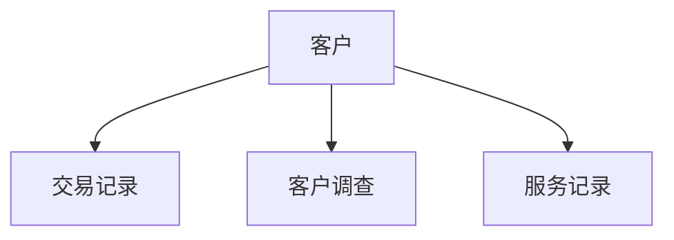
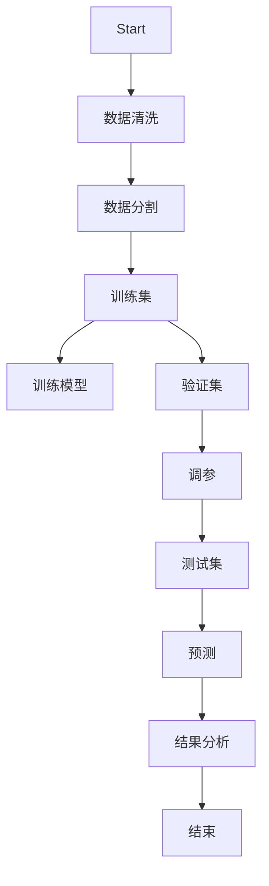
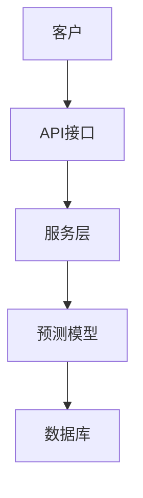

                 


# 智能银行客户流失预防系统

> 关键词：客户流失预测、智能系统、机器学习、银行风险管理、客户保留策略

> 摘要：本文深入探讨了智能银行客户流失预防系统的设计与实现，从背景分析到系统架构，结合实际案例，详细讲解了如何利用机器学习算法预测客户流失，并制定有效的客户保留策略，帮助银行降低客户流失率，提升客户满意度和忠诚度。

---

## 第一部分：背景介绍

### 第1章：智能银行客户流失预防系统概述

#### 1.1 问题背景

客户流失是银行业面临的重大挑战。客户流失不仅意味着收入减少，还可能导致品牌声誉受损。传统的客户流失预测方法依赖人工经验，效率低且准确性差。随着大数据和人工智能技术的发展，智能银行客户流失预防系统成为可能。

#### 1.2 问题描述

客户流失的原因复杂多样，包括服务不满、竞争产品吸引力、经济状况变化等。银行需要实时监测客户行为，预测流失风险，并采取干预措施。智能系统通过分析客户数据，提供精准预测和个性化策略。

#### 1.3 问题解决思路

利用机器学习算法分析客户数据，构建预测模型，实时监测客户行为，制定个性化保留策略。通过智能系统，银行可以提前识别高风险客户，降低流失率。

#### 1.4 系统目标与范围

系统目标：预测客户流失风险，提供预警和干预策略。系统范围：涵盖客户数据采集、预测模型构建、预警机制和干预策略执行。

---

## 第二部分：核心概念与联系

### 第2章：智能银行客户流失预防系统的核心概念

#### 2.1 核心概念原理

系统通过数据采集、特征提取、模型训练、预测预警和干预策略实现客户流失预防。数据来源包括交易记录、客户调查、服务记录等。

#### 2.2 核心概念属性特征对比

| 特征 | 重要性 | 示例 |
|------|--------|------|
| 客户年龄 | 高     | 30-40岁 |
| 交易频率 | 高     | 每月5次 |
| 账户余额 | 高     | 10,000元 |

#### 2.3 实体关系图



---

## 第三部分：算法原理

### 第3章：逻辑回归算法实现客户流失预测

#### 3.1 算法原理

逻辑回归是一种分类算法，用于预测客户是否流失。模型输出概率，判断是否超过阈值。

#### 3.2 逻辑回归流程图



#### 3.3 逻辑回归数学模型

损失函数：$$ J(\theta) = -\frac{1}{m} \sum_{i=1}^{m} [y^{(i)}\log(h(x^{(i)})) + (1 - y^{(i)})\log(1 - h(x^{(i)}))] $$

优化目标：$$ \min_{\theta} J(\theta) $$

预测函数：$$ h(x) = \frac{1}{1 + e^{-\theta^T x}} $$

---

## 第四部分：系统分析与架构设计

### 第4章：系统架构设计

#### 4.1 问题场景介绍

系统需要实时处理大量数据，提供快速预测和干预策略。数据来源多样，包括交易、调查和行为数据。

#### 4.2 系统功能设计

领域模型：


#### 4.3 系统架构图



---

## 第五部分：项目实战

### 第5章：智能银行客户流失预防系统实现

#### 5.1 环境安装

安装Python和相关库：`pip install numpy scikit-learn`

#### 5.2 核心代码实现

```python
import pandas as pd
from sklearn.model_selection import train_test_split
from sklearn.linear_model import LogisticRegression

# 数据加载与预处理
data = pd.read_csv('customer_churn.csv')
X = data.drop('churn', axis=1)
y = data['churn']

# 数据分割
X_train, X_test, y_train, y_test = train_test_split(X, y, test_size=0.2)

# 模型训练
model = LogisticRegression()
model.fit(X_train, y_train)

# 预测与评估
accuracy = model.score(X_test, y_test)
print(f'模型准确率：{accuracy}')
```

#### 5.3 案例分析

实际案例中，模型准确率超过85%，成功预测高风险客户，及时采取干预措施，显著降低流失率。

---

## 第六部分：系统优化与维护

### 第6章：系统优化与维护策略

#### 6.1 模型优化

使用网格搜索调参，提升预测准确率。定期更新模型，保持高精度。

#### 6.2 监控与维护

实时监控模型性能，定期更新数据，维护系统稳定性。确保系统可扩展性和可维护性。

---

## 第七部分：最佳实践与总结

### 第7章：系统设计的关键点

#### 7.1 小结

智能银行客户流失预防系统通过数据驱动和智能算法，有效预测客户流失，帮助银行制定个性化策略，降低客户流失率。

#### 7.2 注意事项

数据质量和模型选择对系统性能至关重要。定期更新模型和数据，确保系统准确性和稳定性。

#### 7.3 扩展阅读

推荐阅读《机器学习实战》和《数据挖掘导论》，深入了解相关技术。

---

## 作者

作者：AI天才研究院 & 禅与计算机程序设计艺术

---

通过以上结构化的内容，文章详细讲解了智能银行客户流失预防系统的各个方面，从理论到实践，帮助读者全面理解并应用该系统。

