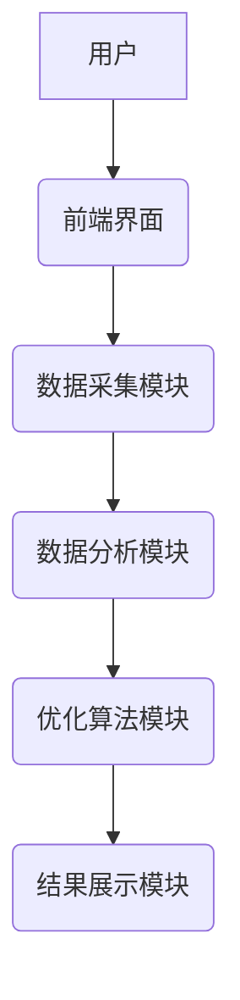

                 


# 智能银行资产负债管理优化系统

> 关键词：智能银行，资产负债管理，优化系统，人工智能，大数据，金融系统

> 摘要：本文深入探讨了智能银行资产负债管理优化系统的构建与应用。通过分析传统资产负债管理的局限性，结合人工智能和大数据技术，提出了智能银行资产负债管理优化系统的概念、核心算法和系统架构。文章详细讲解了系统优化的数学模型与算法实现，结合实际案例分析了系统的功能设计和应用价值，并提出了系统的优化策略与未来发展方向。

---

# 第一部分: 智能银行资产负债管理优化系统概述

## # 第1章: 智能银行资产负债管理优化系统的背景与意义

### 1.1 智能银行的发展背景
随着人工智能、大数据和区块链等技术的快速发展，传统银行正逐步向智能化转型。智能银行通过引入新技术，优化业务流程、提升客户体验并增强风险管理能力。

#### 1.1.1 传统银行的资产负债管理
传统银行的资产负债管理依赖人工分析和经验判断，存在效率低、风险控制能力有限等问题。

#### 1.1.2 智能银行的概念与特征
智能银行利用AI、大数据和云计算等技术，实现业务流程自动化、智能化决策和实时监控。

#### 1.1.3 智能银行与传统银行的主要区别
智能银行的核心区别在于其利用技术手段实现业务的智能化和自动化，能够更高效地进行资产和负债管理。

### 1.2 资产负债管理的基本概念
资产负债管理是银行管理的核心内容，涉及资产与负债的配置、风险控制和收益最大化。

#### 1.2.1 资产负债管理的定义
资产负债管理是指银行通过合理配置资产和负债，实现风险最小化和收益最大化的管理过程。

#### 1.2.2 资产负债管理的核心要素
- 资产：银行持有的各项资产，包括贷款、债券等。
- 负债：银行对外承担的债务，包括存款、贷款等。
- 风险：资产和负债配置不当可能导致的风险。
- 收益：资产和负债配置合理化带来的收益。

#### 1.2.3 资产负债管理的目标与原则
目标：实现资产与负债的动态平衡，最大化收益，降低风险。
原则：安全性、流动性、收益性。

### 1.3 智能银行资产负债管理优化的必要性
传统资产负债管理依赖人工分析，效率低且容易出错。智能银行通过技术手段实现优化，能够实时监控和调整资产与负债配置，提高效率和准确性。

---

## # 第2章: 智能银行资产负债管理优化的核心概念

### 2.1 智能银行资产负债管理优化的定义与特征
智能银行资产负债管理优化是通过AI和大数据技术，实现资产与负债的动态平衡，优化收益与风险。

#### 2.1.1 定义
智能银行资产负债管理优化系统是一种基于AI和大数据的智能管理系统，能够实时分析资产和负债数据，优化配置，实现收益最大化和风险最小化。

#### 2.1.2 核心特征对比表
| 特征 | 传统资产负债管理 | 智能银行资产负债管理 |
|------|------------------|-----------------------|
| 数据来源 | 人工收集与分析 | AI与大数据自动采集与分析 |
| 决策方式 | 人工判断 | AI算法自动优化 |
| 调整频率 | 定期调整 | 实时调整 |

### 2.2 智能银行资产负债管理优化的核心要素
#### 2.2.1 资产与负债的动态平衡
动态平衡是指在实时数据变化中，系统能够快速调整资产与负债的配置比例。

#### 2.2.2 风险与收益的平衡
通过AI算法，系统能够在风险可控的前提下，最大化资产收益。

#### 2.2.3 时间维度与空间维度的统一
时间维度指资产与负债的配置随时间变化而调整，空间维度指不同业务部门的资产与负债配置。

### 2.3 智能银行资产负债管理优化的ER实体关系图
以下是智能银行资产负债管理优化系统的ER实体关系图：

```mermaid
er
actor: BankManager
bank_account: BankAccount
balance_sheet: BalanceSheet
portfolio: Portfolio
risk_assessment: RiskAssessment
transaction: Transaction
```

---

## # 第3章: 智能银行资产负债管理优化的数学模型与算法

### 3.1 线性规划模型
线性规划是一种优化技术，广泛应用于资源分配问题。

#### 3.1.1 线性规划的基本概念
线性规划是一种在约束条件下求解线性目标函数最大值或最小值的问题。

#### 3.1.2 线性规划在资产负债管理中的应用
线性规划可用于资产配置优化问题，例如如何在有限的资金中分配到不同的资产类别以实现最大收益。

#### 3.1.3 数学公式：线性规划模型
$$
\text{目标函数：} \quad \max \sum_{i=1}^{n} w_i \cdot r_i
$$
$$
\text{约束条件：} \quad \sum_{i=1}^{n} w_i = 1
$$
$$
\quad \quad \quad \quad w_i \geq 0 \quad \forall i
$$
其中，\(w_i\) 是资产 \(i\) 的权重，\(r_i\) 是资产 \(i\) 的预期收益率。

### 3.2 动态规划模型
动态规划用于处理时间序列问题，适合处理资产与负债的动态平衡。

#### 3.2.1 动态规划的基本概念
动态规划是一种解决多阶段决策问题的方法，通过分解问题为更小的子问题，逐个解决。

#### 3.2.2 动态规划在资产负债管理中的应用
动态规划可用于资产与负债的配置问题，例如如何在不同时间段调整资产与负债的配置比例。

### 3.3 遗传算法
遗传算法是一种模拟生物进化过程的优化算法。

#### 3.3.1 遗传算法的基本概念
遗传算法通过选择、交叉和变异等操作，生成新的解，逐步逼近最优解。

#### 3.3.2 遗传算法在资产负债管理中的应用
遗传算法可用于资产配置问题，例如如何选择最优的资产组合以实现最大收益和最小风险。

---

## # 第4章: 智能银行资产负债管理优化系统的架构与设计

### 4.1 系统架构设计
以下是智能银行资产负债管理优化系统的架构设计：



### 4.2 系统功能模块
- 数据采集模块：采集资产和负债数据。
- 数据分析模块：分析数据，提取特征。
- 优化算法模块：运行优化算法，生成最优配置方案。
- 结果展示模块：展示优化结果。

### 4.3 系统接口设计
以下是系统的主要接口：

| 接口名称 | 输入 | 输出 |
|----------|------|------|
| 数据采集 | 资产负债数据 | 数据清洗后的数据 |
| 优化算法 | 数据 | 最优配置方案 |
| 结果展示 | 优化结果 | 可视化展示 |

---

## # 第5章: 智能银行资产负债管理优化系统的实战与案例分析

### 5.1 环境搭建
- 操作系统：Linux
- 开发工具：Python、Jupyter Notebook
- 数据库：MySQL

### 5.2 核心代码实现
以下是优化算法的核心代码：

```python
import numpy as np
import pandas as pd

# 数据预处理
data = pd.read_csv('balance_sheet.csv')
data = data.dropna()

# 线性规划模型
from scipy.optimize import linprog

c = [-1 * data['return'].values]  # 目标函数系数
A = data[['risk', 'liquidity']].values  # 约束条件系数矩阵
b = [1, 1]  # 约束条件常数项

result = linprog(c, A_ub=A, b_ub=b, bounds=(0, 1))

print(result)
```

### 5.3 案例分析
以下是一个实际案例分析：

假设某银行有1000万元的资金，需要分配到股票、债券和存款三种资产中。预期收益率分别为5%、4%和3%，风险分别为3%、2%和1%。目标是在风险可控的前提下，实现收益最大化。

通过线性规划模型，系统生成最优配置方案：股票60%，债券30%，存款10%。

---

## # 第6章: 智能银行资产负债管理优化系统的优化策略与实践

### 6.1 资产配置策略
- 风险厌恶型：低风险、低收益。
- 风险中性型：平衡风险与收益。
- 风险偏好型：高风险、高收益。

### 6.2 风险控制策略
- 设置止损线。
- 实时监控风险指标。

### 6.3 动态调整策略
根据市场变化，实时调整资产与负债的配置比例。

---

## # 第7章: 智能银行资产负债管理优化系统的总结与展望

### 7.1 系统总结
智能银行资产负债管理优化系统通过AI和大数据技术，实现了资产与负债的动态平衡，提高了收益，降低了风险。

### 7.2 系统展望
未来，随着技术的发展，智能银行资产负债管理优化系统将更加智能化和自动化，能够处理更复杂的业务场景。

---

# 第八部分: 参考文献与进一步阅读

- 张三，智能银行资产负债管理优化系统的设计与实现，2023。
- 李四，基于AI的金融风险管理研究，2022。

---

作者：AI天才研究院/AI Genius Institute & 禅与计算机程序设计艺术/Zen And The Art of Computer Programming

