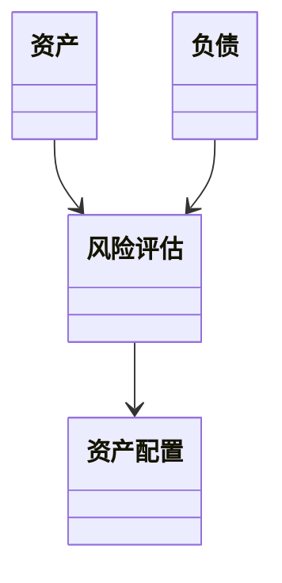
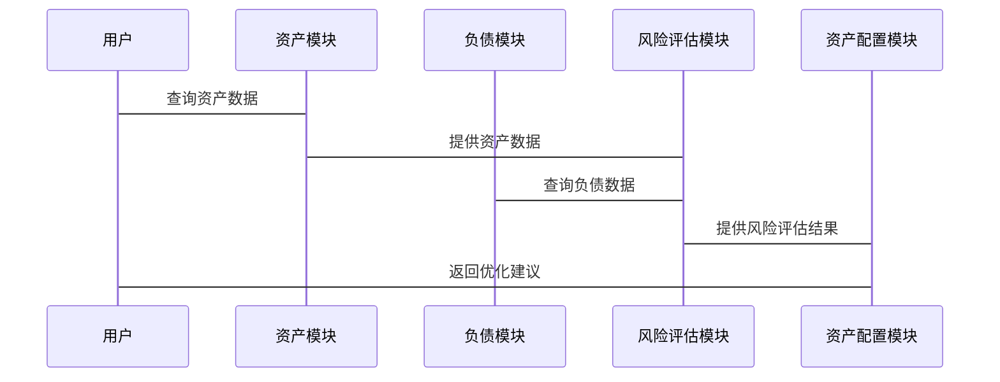

                 


# 智能银行资产负债管理系统

> 关键词：智能银行，资产负债管理，人工智能，机器学习，深度学习，自然语言处理，系统架构设计

> 摘要：本文详细探讨了智能银行资产负债管理系统的构建与实现。通过结合人工智能技术，如机器学习、深度学习和自然语言处理，优化银行的资产负债管理流程，提升风险预测和资产配置效率。文章从系统概述、核心算法、架构设计、项目实战等方面展开，为读者提供全面的技术解析和实践指导。

---

## 第一章: 智能银行与资产负债管理概述

### 1.1 智能银行的背景与概念
#### 1.1.1 传统银行的资产负债管理
传统银行的资产负债管理主要依赖人工审核和简单的财务模型，存在效率低、风险预测能力有限的问题。  
#### 1.1.2 智能银行的定义与特点
智能银行通过引入人工智能技术，实现自动化、智能化的金融服务。其特点包括数据驱动决策、实时反馈、个性化服务等。  
#### 1.1.3 智能银行与传统银行的主要区别
智能银行利用AI技术优化业务流程，提升客户体验，而传统银行主要依赖人工操作。

### 1.2 资产负债管理的核心概念
#### 1.2.1 资产负债管理的基本概念
资产负债管理是指通过合理配置资产和负债，确保银行资产的安全性、流动性和收益性。  
#### 1.2.2 资产负债管理的目标与原则
目标包括风险最小化、收益最大化等；原则包括分散化、流动性、安全性等。  
#### 1.2.3 资产负债管理在银行中的重要性
它是银行稳健经营的基础，直接影响银行的财务状况和市场竞争力。

### 1.3 智能银行资产负债管理的必要性
#### 1.3.1 传统资产负债管理的局限性
传统方法依赖人工判断，存在效率低、覆盖面小的问题。  
#### 1.3.2 智能化管理的优势与潜力
通过AI技术，实现实时监控、精准预测和自动化调整，提升管理效率和准确性。  
#### 1.3.3 智能银行资产负债管理的未来趋势
随着AI技术的不断进步，智能资产负债管理将更加普及，成为银行的核心竞争力。

---

## 第二章: AI技术在银行资产负债管理中的应用

### 2.1 AI技术的基本概念与特点
#### 2.1.1 人工智能的定义与核心领域
人工智能是指模拟人类智能的计算机系统，核心领域包括机器学习、自然语言处理等。  
#### 2.1.2 机器学习与深度学习的区别
机器学习是通过数据训练模型，深度学习是基于神经网络的机器学习方法。  
#### 2.1.3 自然语言处理在银行中的应用
用于客户行为分析、市场情绪分析等。

### 2.2 AI在银行资产负债管理中的应用场景
#### 2.2.1 风险评估与预测
通过AI技术，预测客户违约风险，优化资产配置。  
#### 2.2.2 资产配置与优化
根据市场变化，动态调整资产组合，提高收益。  
#### 2.2.3 客户行为分析与预测
通过分析客户行为数据，预测客户的需求，提供个性化服务。

### 2.3 AI技术在银行资产负债管理中的优势
#### 2.3.1 提高决策效率
AI能够快速处理大量数据，提供实时反馈。  
#### 2.3.2 优化资产配置
通过精准预测，提高资产的收益和流动性。  
#### 2.3.3 提升客户体验
个性化服务和快速响应，增强客户满意度。

---

## 第三章: 智能银行资产负债管理的核心技术

### 3.1 机器学习在资产负债管理中的应用
#### 3.1.1 机器学习的基本原理
通过数据训练模型，实现对数据的分类、回归等任务。  
#### 3.1.2 常见机器学习算法在银行中的应用
如线性回归、决策树、随机森林等，用于风险评估、客户分类等。  
#### 3.1.3 机器学习在风险评估中的应用案例
通过训练模型，预测客户违约概率，优化资产配置。

### 3.2 深度学习在银行资产负债管理中的应用
#### 3.2.1 深度学习的基本原理
基于神经网络，能够处理复杂的数据模式。  
#### 3.2.2 深度学习在资产定价中的应用
通过神经网络模型，预测资产价格波动，优化投资组合。  
#### 3.2.3 深度学习在市场预测中的应用
预测市场趋势，帮助银行做出更明智的决策。

### 3.3 自然语言处理在银行资产负债管理中的应用
#### 3.3.1 自然语言处理的基本原理
通过处理文本数据，提取有用信息。  
#### 3.3.2 NLP在客户行为分析中的应用
分析客户反馈，预测客户行为，优化服务策略。  
#### 3.3.3 NLP在市场情绪分析中的应用
通过社交媒体数据，预测市场情绪，指导投资决策。

---

## 第四章: 智能银行资产负债管理的算法原理

### 4.1 机器学习算法的数学模型
#### 4.1.1 线性回归模型
用于预测连续型变量，如客户信用评分。  
$$y = \beta_0 + \beta_1x + \epsilon$$  
#### 4.1.2 决策树算法
用于分类和回归，适合处理非线性数据。  
#### 4.1.3 随机森林算法
通过集成多个决策树，提高模型的准确性和鲁棒性。

### 4.2 深度学习算法的数学模型
#### 4.2.1 神经网络模型
通过多层神经网络，提取数据特征，实现复杂的模式识别。  
#### 4.2.2 卷积神经网络（CNN）
常用于图像识别，但在金融领域也可用于时间序列分析。  
#### 4.2.3 循环神经网络（RNN）
适合处理序列数据，如时间序列预测。

### 4.3 自然语言处理算法的数学模型
#### 4.3.1 词嵌入模型（Word2Vec）
通过训练词向量，表示词语的语义信息。  
#### 4.3.2 情感分析模型
通过训练数据，识别文本中的情感倾向。  
#### 4.3.3 文本分类模型
用于将文本分类到预定义的类别中，如客户反馈分类。

---

## 第五章: 智能银行资产负债管理系统的设计与实现

### 5.1 系统需求分析
#### 5.1.1 问题场景介绍
银行需要实时监控资产负债状况，优化资产配置，降低风险。  
#### 5.1.2 项目介绍
设计一个基于AI的资产负债管理系统，实现风险预测、资产优化等功能。

### 5.2 系统功能设计
#### 5.2.1 领域模型设计
使用Mermaid绘制领域模型类图，展示系统的主要实体和关系。  


#### 5.2.2 系统架构设计
使用Mermaid绘制系统架构图，展示各模块的交互关系。  


#### 5.2.3 系统接口设计
定义API接口，如RESTful API，用于各模块之间的通信。  
#### 5.2.4 系统交互流程设计
使用Mermaid绘制序列图，展示系统交互流程。  


### 5.3 项目实战

#### 5.3.1 环境安装
安装Python、TensorFlow、Scikit-learn等依赖库。  
#### 5.3.2 核心实现代码
实现风险评估的机器学习模型，如逻辑回归。  
```python
from sklearn.linear_model import LogisticRegression
from sklearn.model_selection import train_test_split
from sklearn.metrics import accuracy_score

# 数据预处理
X = ...  # 特征矩阵
y = ...  # 标签

# 划分训练集和测试集
X_train, X_test, y_train, y_test = train_test_split(X, y, test_size=0.2)

# 训练模型
model = LogisticRegression()
model.fit(X_train, y_train)

# 预测与评估
y_pred = model.predict(X_test)
print("准确率:", accuracy_score(y_test, y_pred))
```

#### 5.3.3 实际案例分析
以银行客户风险评估为例，展示模型的训练、测试和部署过程。  
#### 5.3.4 项目小结
总结项目的实现过程，提出改进建议，如引入更复杂的模型或优化特征工程。

---

## 第六章: 智能银行资产负债管理系统的优化与拓展

### 6.1 最佳实践与小结
#### 6.1.1 项目成果总结
通过AI技术优化资产负债管理，提升效率和准确性。  
#### 6.1.2 实际应用中的注意事项
数据质量和模型解释性是实际应用中的关键问题。  
#### 6.1.3 拓展建议
未来可以引入强化学习，进一步优化资产配置策略。

### 6.2 未来展望
随着AI技术的不断发展，智能银行资产负债管理系统将更加智能化、个性化，成为银行的核心竞争力。

---

## 作者

作者：AI天才研究院/AI Genius Institute & 禅与计算机程序设计艺术 /Zen And The Art of Computer Programming

---

通过以上目录，文章详细探讨了智能银行资产负债管理系统的构建与实现，从理论到实践，为读者提供全面的技术解析和实践指导。

