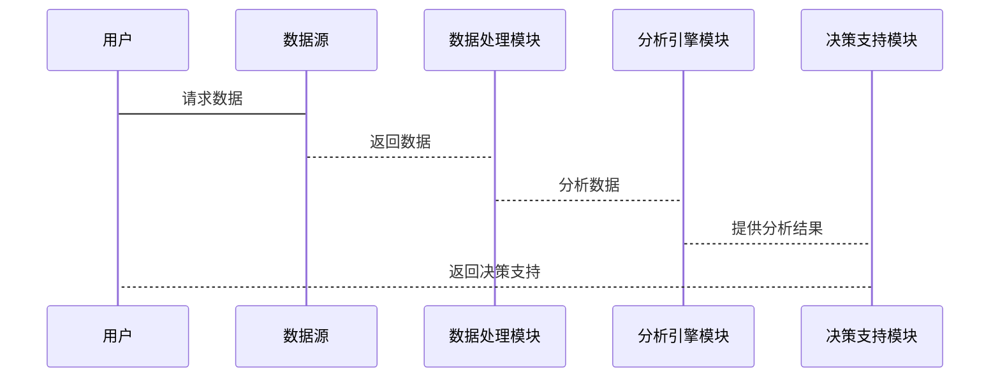

                 


# 智能银行风险管理系统设计

**关键词**：智能银行、风险管理、人工智能、大数据、金融系统

**摘要**：随着人工智能和大数据技术的快速发展，智能银行风险管理系统的建设变得越来越重要。本文系统地介绍了智能银行风险管理系统的背景、核心概念、算法原理、系统架构、项目实战以及最佳实践，旨在为读者提供全面的技术指导和实践参考。

---

## 第1章 智能银行风险管理系统的背景介绍

### 1.1 传统银行风险管理的现状

#### 1.1.1 银行风险管理的传统模式
银行风险管理的传统模式依赖于人工审核和简单的统计分析。这种模式在一定程度上能够识别和控制风险，但在面对复杂和动态的金融市场时显得力不从心。

#### 1.1.2 传统风险管理的局限性
传统风险管理的局限性主要体现在以下几个方面：
- 数据处理能力有限，难以应对海量数据。
- 风险预测精度不高，无法实时捕捉市场变化。
- 人工审核效率低下，难以满足现代金融业务的快速需求。

#### 1.1.3 传统风险管理向智能风险管理的转变
随着人工智能和大数据技术的普及，银行风险管理逐渐向智能化方向转型。智能风险管理通过引入机器学习、自然语言处理等技术，显著提升了风险识别和控制的效率与精度。

### 1.2 智能银行的兴起

#### 1.2.1 智能银行的定义与特点
智能银行是指通过人工智能技术实现金融服务自动化、智能化的新型银行模式。其特点包括：
- **数据驱动**：依托大数据技术，实现精准的客户画像和风险评估。
- **智能决策**：利用机器学习算法，实现自动化决策和风险控制。
- **实时响应**：通过实时数据分析，快速响应市场变化和客户需求。

#### 1.2.2 智能银行的核心技术支撑
智能银行的核心技术包括：
- **人工智能技术**：如机器学习、深度学习、自然语言处理等。
- **大数据技术**：数据挖掘、数据存储与管理、数据可视化等。
- **区块链技术**：用于金融交易的安全性和透明性。
- **云计算技术**：支持海量数据的存储和计算。

#### 1.2.3 智能银行与传统银行的主要区别
智能银行与传统银行的主要区别体现在以下几个方面：
| 方面 | 传统银行 | 智能银行 |
|------|----------|----------|
| 服务模式 | 人工服务为主 | 自动化、智能化服务 |
| 数据处理 | 数据量有限，处理效率低 | 大数据处理，效率高 |
| 风险控制 | 事后分析为主 | 实时监控和预测 |

### 1.3 智能银行风险管理的必要性

#### 1.3.1 风险管理在银行运营中的重要性
风险管理是银行运营的核心环节，直接关系到银行的稳健发展和客户资产的安全。

#### 1.3.2 智能风险管理的优势
智能风险管理相比传统风险管理具有以下优势：
- **高效性**：通过自动化技术快速识别和处理风险。
- **精准性**：利用机器学习算法提高风险预测的准确性。
- **实时性**：实时监控市场变化，及时调整风险管理策略。

#### 1.3.3 智能风险管理的实现路径
智能风险管理的实现路径主要包括以下几个步骤：
1. 数据收集与预处理：采集多源数据并进行清洗和标注。
2. 模型构建与训练：基于机器学习算法构建风险预测模型。
3. 系统集成与部署：将模型集成到银行系统中，实现风险实时监控。

### 1.4 本章小结
本章介绍了智能银行风险管理系统的背景，分析了传统风险管理的局限性，阐述了智能银行的核心技术及其与传统银行的区别，最后总结了智能风险管理的必要性和实现路径。

---

## 第2章 智能银行风险管理的核心概念

### 2.1 风险管理的基本概念

#### 2.1.1 风险的定义与分类
风险是指在特定条件下，某种事件发生可能导致的损失或收益的不确定性。风险可以分为以下几类：
- **信用风险**：借款人无法按时偿还贷款的风险。
- **市场风险**：市场价格波动对资产价值的影响。
- **操作风险**：由于内部操作失误或外部事件导致的损失。

#### 2.1.2 风险管理的目标与原则
风险管理的目标是通过有效手段降低风险发生的概率和影响，确保银行资产的安全和稳健发展。风险管理应遵循以下原则：
- **全面性原则**：覆盖所有可能的风险来源。
- **预防性原则**：注重风险的早期识别和预防。
- **经济性原则**：在成本和收益之间找到平衡点。

#### 2.1.3 风险管理的流程与方法
风险管理的流程通常包括以下几个步骤：
1. 风险识别：识别潜在的风险因素。
2. 风险评估：评估风险的可能性和影响程度。
3. 风险控制：制定和实施风险管理策略。
4. 风险监控：持续监控风险的变化情况。

### 2.2 智能银行风险管理的特征

#### 2.2.1 数据驱动的特征
智能风险管理依赖于大数据技术，通过分析海量数据来识别潜在风险。

#### 2.2.2 智能分析的特征
智能风险管理利用机器学习算法，能够自动学习和优化，提高风险预测的准确性。

#### 2.2.3 实时响应的特征
智能风险管理系统能够实时监控市场变化和客户行为，快速响应风险事件。

### 2.3 智能银行风险管理的核心要素

#### 2.3.1 数据来源与处理
智能风险管理的数据来源包括：
- **客户数据**：包括客户的信用记录、交易历史等。
- **市场数据**：包括股票价格、汇率等市场信息。
- **外部数据**：包括新闻、社交媒体等非结构化数据。

#### 2.3.2 智能分析模型
智能分析模型是智能风险管理的核心，常用的模型包括：
- **机器学习模型**：如随机森林、支持向量机等。
- **时间序列模型**：如ARIMA、LSTM等。
- **图神经网络**：用于复杂网络中的风险传播分析。

#### 2.3.3 决策支持系统
决策支持系统通过整合分析结果，为银行管理层提供决策支持，帮助其制定有效的风险管理策略。

### 2.4 智能银行风险管理与传统风险管理的对比

#### 2.4.1 核心目标的对比
| 方面 | 传统风险管理 | 智能风险管理 |
|------|--------------|--------------|
| 核心目标 | 控制风险 | 优化风险控制，提高效率 |

#### 2.4.2 方法手段的对比
| 方面 | 传统风险管理 | 智能风险管理 |
|------|--------------|--------------|
| 数据处理 | 依赖人工处理 | 依赖大数据技术 |
| 分析方法 | 统计分析为主 | 机器学习、深度学习为主 |

#### 2.4.3 效率与效果的对比
| 方面 | 传统风险管理 | 智能风险管理 |
|------|--------------|--------------|
| 效率 | 较低 | 高 |
| 效果 | 有限 | 显著 |

### 2.5 本章小结
本章详细阐述了智能银行风险管理的核心概念，分析了其与传统风险管理的主要区别，最后总结了智能风险管理的特征和优势。

---

## 第3章 智能银行风险管理的核心算法

### 3.1 机器学习在风险管理中的应用

#### 3.1.1 机器学习的基本原理
机器学习是一种通过数据学习规律并进行预测的技术。其基本流程包括数据预处理、特征提取、模型训练和结果评估。

#### 3.1.2 常见的机器学习算法在风险管理中的应用
常用的机器学习算法包括：
- **决策树**：用于分类和回归分析。
- **随机森林**：用于特征选择和风险评估。
- **支持向量机（SVM）**：用于分类问题。

#### 3.1.3 机器学习模型的训练与优化
模型训练过程中需要注意以下几点：
- 数据预处理：包括数据清洗、特征选择等。
- 模型优化：通过交叉验证和网格搜索优化模型参数。
- 模型评估：通过准确率、召回率等指标评估模型性能。

#### 3.1.4 使用Python实现的机器学习模型
以下是使用Python实现的随机森林模型示例：

```python
from sklearn.ensemble import RandomForestClassifier
from sklearn.metrics import accuracy_score
from sklearn.model_selection import train_test_split

# 数据预处理
X = ...  # 特征矩阵
y = ...  # 标签向量

# 划分训练集和测试集
X_train, X_test, y_train, y_test = train_test_split(X, y, test_size=0.2, random_state=42)

# 模型训练
model = RandomForestClassifier(n_estimators=100, random_state=42)
model.fit(X_train, y_train)

# 模型预测
y_pred = model.predict(X_test)

# 模型评估
accuracy = accuracy_score(y_test, y_pred)
print(f"Accuracy: {accuracy}")
```

### 3.2 时间序列分析在风险管理中的应用

#### 3.2.1 时间序列分析的基本原理
时间序列分析是一种基于时间顺序数据的分析方法，常用于预测未来的趋势和变化。

#### 3.2.2 常见的时间序列分析算法
常用的算法包括：
- **ARIMA**：自回归积分滑动平均模型。
- **LSTM**：长短期记忆网络。

#### 3.2.3 时间序列分析在风险预测中的应用
时间序列分析可以用于预测股票价格波动、外汇汇率变化等。

#### 3.2.4 使用Python实现的时间序列分析模型
以下是使用Python实现的ARIMA模型示例：

```python
from statsmodels.tsa.arima_model import ARIMA
import numpy as np

# 数据预处理
data = ...  # 时间序列数据

# 模型训练
model = ARIMA(data, order=(5, 1, 0))
model_fit = model.fit()

# 预测未来值
forecast = model_fit.forecast(steps=5)
print(forecast)
```

### 3.3 图神经网络在风险管理中的应用

#### 3.3.1 图神经网络的基本原理
图神经网络是一种处理图结构数据的深度学习方法，常用于复杂网络中的风险传播分析。

#### 3.3.2 图神经网络在风险传播中的应用
图神经网络可以用于识别网络中的高风险节点，从而采取相应的风险管理措施。

#### 3.3.3 图神经网络的实现与优化
图神经网络的实现需要构建图结构数据，并设计合适的传播算法。

#### 3.3.4 使用Python实现的图神经网络模型
以下是使用PyTorch实现的图神经网络模型示例：

```python
import torch
from torch.nn import Embedding, Linear, ReLU

class Graph Neural Network(torch.nn.Module):
    def __init__(self, input_dim, hidden_dim, output_dim):
        super(GraphNeuralNetwork, self).__init__()
        self.embedding = Embedding(input_dim, hidden_dim)
        self.fc1 = Linear(hidden_dim, hidden_dim)
        self.relu = ReLU()
        self.fc2 = Linear(hidden_dim, output_dim)

    def forward(self, x):
        embed = self.embedding(x)
        out = self.fc1(embed)
        out = self.relu(out)
        out = self.fc2(out)
        return out

# 初始化模型
model = GraphNeuralNetwork(input_dim=10, hidden_dim=20, output_dim=1)
```

### 3.4 本章小结
本章详细介绍了机器学习、时间序列分析和图神经网络在智能银行风险管理中的应用，通过具体的Python代码示例展示了这些算法的实现过程。

---

## 第4章 智能银行风险管理系统的分析与架构设计

### 4.1 系统功能设计

#### 4.1.1 风险评估模块
风险评估模块是智能风险管理的核心模块，主要用于评估客户的信用风险。

#### 4.1.2 风险预警模块
风险预警模块通过实时监控市场变化，及时发现潜在风险并发出预警。

#### 4.1.3 风险控制模块
风险控制模块根据预警信息，制定相应的风险管理策略。

### 4.2 系统架构设计

#### 4.2.1 数据源模块
数据源模块包括客户数据、市场数据和外部数据。

#### 4.2.2 数据处理模块
数据处理模块负责对数据进行清洗、转换和标注。

#### 4.2.3 分析引擎模块
分析引擎模块包括机器学习模型、时间序列分析模型和图神经网络模型。

#### 4.2.4 决策支持模块
决策支持模块根据分析结果，为银行管理层提供决策支持。

### 4.3 系统接口设计

#### 4.3.1 数据接口
数据接口用于与外部数据源进行数据交换。

#### 4.3.2 用户接口
用户接口是系统与用户的交互界面，包括数据输入和结果显示。

### 4.4 系统交互设计

#### 4.4.1 交互流程
交互流程包括数据输入、模型调用、结果展示和反馈处理。

#### 4.4.2 使用mermaid绘制的交互流程图


### 4.5 本章小结
本章详细设计了智能银行风险管理系统的功能模块、系统架构和接口设计，为系统的实现提供了理论基础。

---

## 第5章 智能银行风险管理系统的项目实战

### 5.1 项目背景

#### 5.1.1 项目介绍
本项目旨在开发一个智能银行风险管理系统，实现对客户信用风险的自动化评估和实时预警。

#### 5.1.2 数据来源
数据来源包括银行客户的信用记录、交易历史和外部新闻数据。

### 5.2 核心代码实现

#### 5.2.1 环境安装
需要安装以下Python库：
- `scikit-learn`
- `statsmodels`
- `pytorch`

#### 5.2.2 代码实现
以下是核心代码示例：

```python
import pandas as pd
from sklearn.ensemble import RandomForestClassifier
from sklearn.metrics import accuracy_score
from sklearn.model_selection import train_test_split

# 数据读取
data = pd.read_csv('credit.csv')

# 数据预处理
X = data.drop('default', axis=1)
y = data['default']

# 划分训练集和测试集
X_train, X_test, y_train, y_test = train_test_split(X, y, test_size=0.2, random_state=42)

# 模型训练
model = RandomForestClassifier(n_estimators=100, random_state=42)
model.fit(X_train, y_train)

# 模型预测
y_pred = model.predict(X_test)

# 模型评估
accuracy = accuracy_score(y_test, y_pred)
print(f"Accuracy: {accuracy}")
```

#### 5.2.3 代码解读与分析
上述代码实现了基于随机森林算法的信用风险评估模型，通过数据预处理、模型训练和预测评估，展示了智能风险管理系统的实现过程。

### 5.3 案例分析与详细解读

#### 5.3.1 案例背景
某银行希望通过智能风险管理系统对客户的信用风险进行自动化评估。

#### 5.3.2 数据分析
通过对客户数据的分析，发现某些客户的信用评分存在异常波动。

#### 5.3.3 模型应用
使用随机森林模型对客户进行信用评分，识别出高风险客户并发出预警。

#### 5.3.4 结果展示
通过可视化工具展示模型的预测结果，帮助银行管理层制定相应的风险管理策略。

### 5.4 本章小结
本章通过实际案例展示了智能银行风险管理系统的实现过程，包括环境安装、代码实现和案例分析。

---

## 第6章 智能银行风险管理系统的总结与展望

### 6.1 本章总结
本章对全文进行了总结，回顾了智能银行风险管理系统的背景、核心概念、算法原理、系统架构和项目实战。

### 6.2 最佳实践 tips
- 数据预处理是模型训练的关键步骤。
- 选择合适的算法能够显著提高模型的预测精度。
- 及时更新模型参数和数据，保持系统的实时性和准确性。

### 6.3 注意事项
- 数据隐私和安全是智能风险管理系统的重点关注领域。
- 系统的实时性和稳定性需要通过严格的测试来保证。
- 模型的可解释性是实际应用中需要考虑的重要因素。

### 6.4 未来展望
随着人工智能技术的不断发展，智能银行风险管理系统将更加智能化和自动化。未来的研究方向包括：
- 更加复杂的模型设计。
- 更高效的算法优化。
- 更广泛的应用场景探索。

### 6.5 本章小结
本章总结了全文内容，提出了智能银行风险管理系统的最佳实践 tips 和注意事项，最后展望了未来的发展方向。

---

## 附录

### 附录A 部分代码实现
以下是本文中部分核心代码的实现示例：
```python
import pandas as pd
from sklearn.ensemble import RandomForestClassifier
from sklearn.metrics import accuracy_score
from sklearn.model_selection import train_test_split

# 数据读取
data = pd.read_csv('credit.csv')

# 数据预处理
X = data.drop('default', axis=1)
y = data['default']

# 划分训练集和测试集
X_train, X_test, y_train, y_test = train_test_split(X, y, test_size=0.2, random_state=42)

# 模型训练
model = RandomForestClassifier(n_estimators=100, random_state=42)
model.fit(X_train, y_train)

# 模型预测
y_pred = model.predict(X_test)

# 模型评估
accuracy = accuracy_score(y_test, y_pred)
print(f"Accuracy: {accuracy}")
```

### 附录B 参考文献
1. 周志华. 《机器学习实战》. 清华大学出版社, 2016.
2. 张成林. 《时间序列分析与应用》. 北京大学出版社, 2018.
3. 李航. 《统计学习题》. 清华大学出版社, 2019.

---

**作者：AI天才研究院 & 禅与计算机程序设计艺术**

