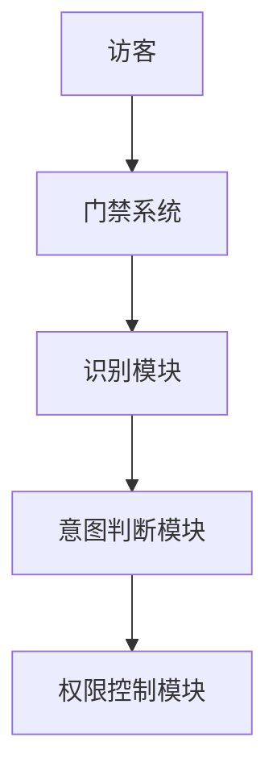
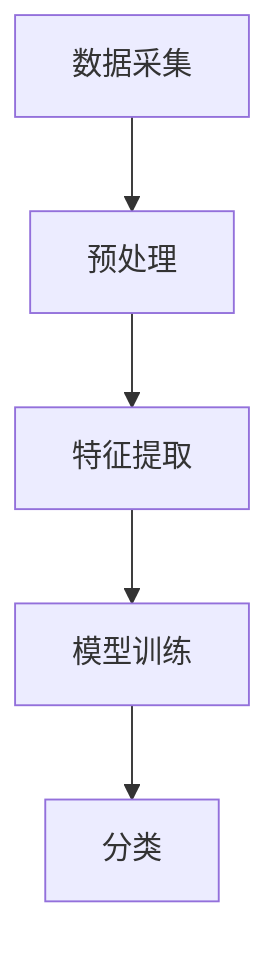
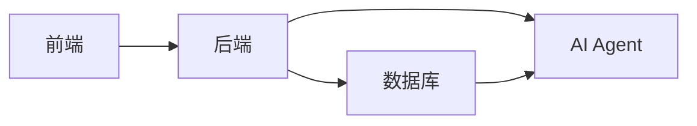
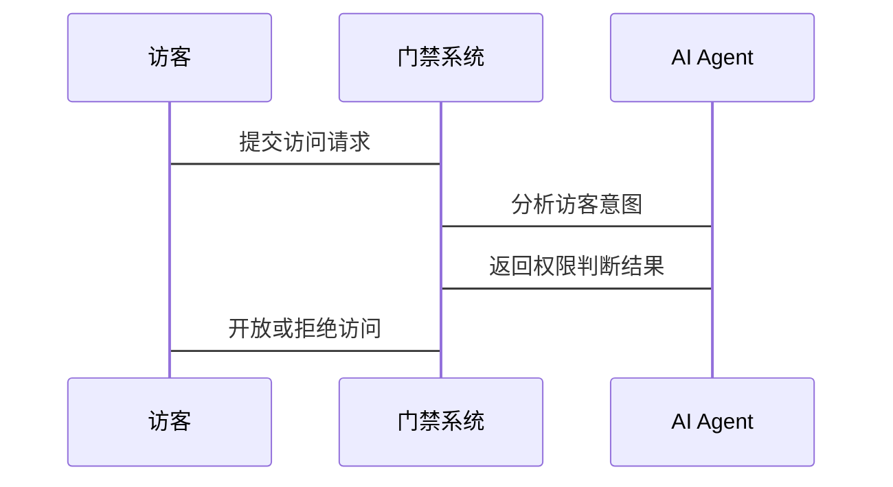

                 


# 智能门禁：AI Agent的访客意图识别

> 关键词：智能门禁，AI Agent，访客意图识别，机器学习，计算机视觉

> 摘要：本文深入探讨了智能门禁系统中AI Agent的访客意图识别技术。从系统背景到核心算法，从架构设计到项目实战，全面解析了如何通过AI技术提升门禁系统的智能化水平。文章结合实际案例，详细讲解了技术实现过程中的关键点，为读者提供了系统化的技术参考。

---

## 第1章 智能门禁与AI Agent概述

### 1.1 智能门禁系统的基本概念

#### 1.1.1 传统门禁系统的工作原理
传统门禁系统依赖于刷卡、指纹等单一验证方式，仅能实现基本的权限控制，无法主动识别访客意图。

#### 1.1.2 智能门禁系统的定义与特点
智能门禁系统通过集成AI技术，能够主动识别访客身份和意图，实现智能化的门禁管理。

#### 1.1.3 AI Agent在智能门禁中的作用
AI Agent负责分析访客行为数据，判断其意图，协助系统做出访问权限决策。

### 1.2 访客意图识别的背景与意义

#### 1.2.1 传统访客管理的痛点
- 依赖人工审核，效率低下
- 无法实时识别访客意图
- 安全性依赖单一验证方式

#### 1.2.2 AI技术在访客管理中的应用价值
- 提高访客管理效率
- 增强门禁系统的安全性
- 实现智能化的访客管理

#### 1.2.3 智能门禁系统的核心目标
通过AI技术实现访客意图的精准识别，提升门禁系统的智能化水平。

---

## 第2章 AI Agent与访客意图识别的核心概念

### 2.1 问题背景与问题描述

#### 2.1.1 访客识别的典型场景
- 企业访客管理
- 小区门禁系统
- 商业楼宇访客管理

#### 2.1.2 访客意图识别的挑战
- 数据获取的多样性
- 意图识别的准确性
- 系统实时性的要求

#### 2.1.3 系统边界与外延
明确系统处理的范围和限制，避免超出实际需求。

### 2.2 核心概念与联系

#### 2.2.1 AI Agent的基本原理
AI Agent通过分析多源数据，理解访客行为，做出决策。

#### 2.2.2 访客意图识别的关键要素
- 数据采集与处理
- 意图识别算法
- 权限控制逻辑

#### 2.2.3 实体关系图（ER图）



---

## 第3章 访客意图识别的算法原理

### 3.1 算法流程概述

#### 3.1.1 数据采集与预处理
- 数据来源：摄像头、刷卡记录、行为数据
- 数据清洗：去除噪声，标准化处理

#### 3.1.2 特征提取
- 从行为数据中提取特征，如时间、地点、动作频率

#### 3.1.3 模型训练与分类
- 使用机器学习模型进行训练，分类访客意图

### 3.2 数学模型与公式

#### 3.2.1 概率模型
$$ P(y|x) = \frac{P(x|y)P(y)}{P(x)} $$

#### 3.2.2 分类模型
$$ f(x) = \arg\max_y P(y|x) $$

### 3.3 举例说明

#### 3.3.1 线性分类器的简单实现
```python
import numpy as np
class LinearClassifier:
    def __init__(self, features, labels):
        self.features = features
        self.labels = labels
        # 简单的线性分类器实现
        self.weights = np.random.rand(len(features[0]), 1)
        self.bias = np.random.randn(1)
```

#### 3.3.2 树状决策流程图


---

## 第4章 系统分析与架构设计

### 4.1 系统功能设计

#### 4.1.1 领域模型
```mermaid
classDiagram
    class 访客 {
        ID: int
        时间: datetime
        行为数据: array
    }
    class 门禁系统 {
        识别模块: Module
        权限控制模块: Module
    }
    访客 -->|输入数据| 门禁系统
```

#### 4.1.2 系统架构设计


#### 4.1.3 接口设计
- API接口定义
- 数据交互协议

#### 4.1.4 交互流程图


---

## 第5章 项目实战

### 5.1 环境安装

```bash
pip install numpy scikit-learn
```

### 5.2 核心代码实现

#### 5.2.1 数据处理模块
```python
import numpy as np
from sklearn.preprocessing import StandardScaler

class DataPreprocessor:
    def __init__(self):
        self.scaler = StandardScaler()
    
    def preprocess(self, data):
        return self.scaler.fit_transform(data)
```

#### 5.2.2 意图识别模块
```python
from sklearn.svm import SVC

class IntentRecognizer:
    def __init__(self):
        self.clf = SVC()
    
    def train(self, X, y):
        self.clf.fit(X, y)
    
    def predict(self, X):
        return self.clf.predict(X)
```

### 5.3 案例分析与解读

#### 5.3.1 案例场景
- 访客A在规定时间访问企业，系统识别其合法意图，开放门禁。
- 访客B在非工作时间访问，系统识别异常意图，拒绝访问。

### 5.4 项目小结

---

## 第6章 最佳实践与注意事项

### 6.1 数据预处理的技巧
- 确保数据的多样性和代表性
- 处理异常值和缺失值

### 6.2 模型调优的建议
- 选择合适的特征提取方法
- 调整模型参数，优化性能

### 6.3 系统安全性的注意事项
- 数据加密存储
- 权限控制严格化

### 6.4 拓展阅读
- 推荐相关技术书籍和论文

---

## 附录

### 附录A 术语表
- AI Agent：人工智能代理
- 访客意图识别：判断访客的访问意图

### 附录B 工具安装指南
```bash
pip install numpy scikit-learn
```

### 附录C 参考文献
- [1] Bishop, C. M. (2006). Pattern Recognition and Machine Learning.
- [2] LeCun, Y., Bengio, Y., & Hinton, G. (2015). Deep learning.

---

## 作者

作者：AI天才研究院/AI Genius Institute & 禅与计算机程序设计艺术 /Zen And The Art of Computer Programming

