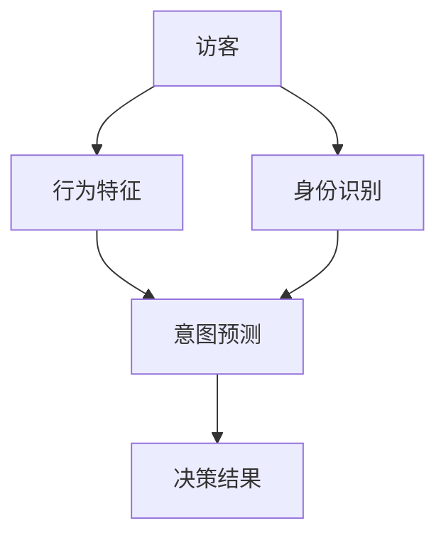
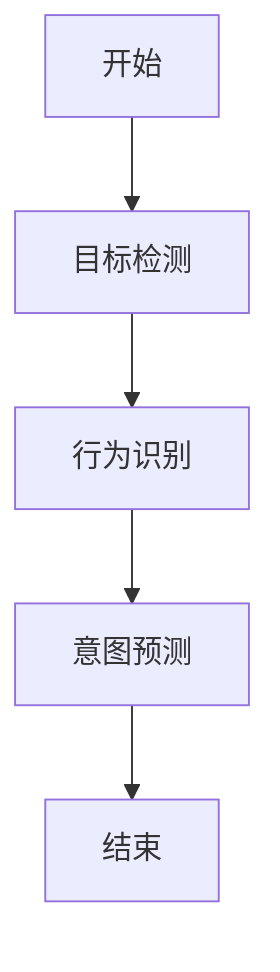
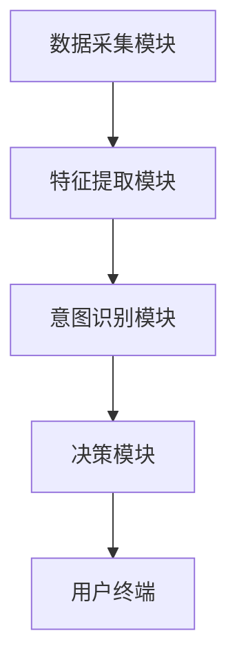

                 


# 智能门铃：AI Agent的访客意图识别系统

> 关键词：智能门铃，AI Agent，访客意图识别，目标检测，行为识别，意图预测

> 摘要：本文详细介绍了基于AI Agent的智能门铃访客意图识别系统，涵盖从系统背景到算法原理，再到系统架构设计和项目实战的各个方面。文章首先介绍了访客意图识别的背景与挑战，然后深入探讨了AI Agent的基本原理和核心概念。接着，详细讲解了目标检测和行为识别的算法原理及其数学模型。随后，从系统功能设计到架构设计，再到接口设计，全面阐述了系统的实现细节。最后，通过实际项目案例展示了系统的应用场景和优化方向。

---

# 第1章: 访客意图识别的背景与挑战

## 1.1 智能门铃的背景介绍
### 1.1.1 传统门铃系统的局限性
传统的门铃系统仅能通过声音提示访客到来，无法识别访客身份或预测其意图，存在安全隐患和使用不便的问题。

### 1.1.2 智能门铃的定义与特点
智能门铃通过集成摄像头、传感器和AI技术，能够实时采集和分析访客信息，实现访客身份识别和意图预测。

### 1.1.3 访客意图识别的必要性
访客意图识别能够帮助用户判断是否需要开门，尤其在陌生人来访时，能够提供额外的安全保障。

## 1.2 AI Agent的基本原理
### 1.2.1 什么是AI Agent
AI Agent是一种智能体，能够感知环境、执行任务并做出决策，通常用于自动化处理和数据分析。

### 1.2.2 AI Agent的核心功能
AI Agent的核心功能包括数据采集、信息处理、意图识别和决策执行。

### 1.2.3 AI Agent与传统门铃的区别
AI Agent能够通过分析访客的行为和环境数据，提供智能化的决策支持，而传统门铃仅能发出声音提示。

## 1.3 访客意图识别系统的应用场景
### 1.3.1 家庭场景
在家庭场景中，访客意图识别可以帮助家庭成员判断访客身份，提升安全性。

### 1.3.2 商业场景
在商业场景中，访客意图识别可以帮助商家识别潜在客户，优化客户服务体验。

### 1.3.3 公共场所
在公共场所，访客意图识别可以用于安全管理，识别异常行为，预防安全事故。

## 1.4 本章小结
本章介绍了访客意图识别系统的背景、AI Agent的基本原理及其应用场景，为后续章节的深入分析奠定了基础。

---

# 第2章: 访客意图识别系统的核心概念

## 2.1 访客意图识别的核心概念
### 2.1.1 访客身份识别
访客身份识别是通过摄像头采集访客图像，结合人脸识别技术，判断访客身份。

### 2.1.2 访客行为分析
访客行为分析是通过AI算法分析访客的行为特征，如肢体动作、面部表情等，预测访客的意图。

### 2.1.3 访客意图预测
访客意图预测是基于访客的身份和行为数据，预测访客的下一步行动，如是否需要开门。

## 2.2 AI Agent与访客意图识别的关系
### 2.2.1 AI Agent在访客意图识别中的作用
AI Agent作为智能体，负责数据采集、信息处理和决策执行，是访客意图识别的核心驱动力。

### 2.2.2 AI Agent与智能门铃的结合
AI Agent与智能门铃的结合，使得门铃系统能够智能化地识别访客意图，提升用户体验。

## 2.3 访客意图识别系统的边界与外延
### 2.3.1 系统的边界
访客意图识别系统的边界包括数据采集、意图识别和决策执行三个主要模块。

### 2.3.2 系统的外延
系统的外延包括与智能家居设备的联动、与其他安防系统的集成等。

## 2.4 核心概念的对比分析
### 2.4.1 概念属性特征对比表格
| 概念       | 属性特征             |
|------------|----------------------|
| 访客身份识别| 数据采集、人脸识别技术|
| 访客行为分析| 行为特征提取、分析模型|
| 访客意图预测| 意图预测模型、决策支持|

### 2.4.2 ER实体关系图架构


---

# 第3章: 访客意图识别系统的算法原理

## 3.1 访客意图识别的核心算法
### 3.1.1 目标检测算法
目标检测算法用于检测和识别访客的位置和姿态，常用算法包括YOLO和Faster R-CNN。

### 3.1.2 行为识别算法
行为识别算法用于分析访客的行为特征，如挥手、站立等，常用算法包括骨架跟踪和时序卷积网络。

### 3.1.3 意图预测算法
意图预测算法基于访客的行为特征和历史数据，预测访客的下一步行动，常用算法包括RNN和LSTM。

## 3.2 算法原理的数学模型
### 3.2.1 目标检测的损失函数
$$\text{损失函数} = \text{分类损失} + \text{定位损失}$$

### 3.2.2 行为识别的模型
$$P(y|x) = \frac{P(x|y)P(y)}{P(x)}$$

## 3.3 算法流程图


---

# 第4章: 访客意图识别系统的系统架构设计

## 4.1 系统功能设计
### 4.1.1 数据采集模块
数据采集模块负责采集访客的图像和行为数据，包括摄像头和传感器。

### 4.1.2 特征提取模块
特征提取模块负责从采集的数据中提取有用的特征，如人体姿态和面部表情。

### 4.1.3 意图识别模块
意图识别模块基于提取的特征，结合AI算法，预测访客的意图。

## 4.2 系统架构设计
### 4.2.1 系统架构图


### 4.2.2 接口设计
系统接口设计包括数据接口、算法接口和用户接口，确保各模块之间的高效通信。

## 4.3 本章小结
本章详细介绍了访客意图识别系统的功能设计和架构设计，为后续的系统实现奠定了基础。

---

# 第5章: 访客意图识别系统的项目实战

## 5.1 项目环境搭建
### 5.1.1 环境要求
项目需要Python 3.8以上版本，安装OpenCV、TensorFlow和Keras库。

### 5.1.2 开发工具
推荐使用Jupyter Notebook和PyCharm进行开发和调试。

## 5.2 系统核心实现
### 5.2.1 数据采集模块实现
```python
import cv2

def capture_video():
    cap = cv2.VideoCapture(0)
    while True:
        ret, frame = cap.read()
        cv2.imshow('访客图像采集', frame)
        if cv2.waitKey(1) & 0xFF == ord('q'):
            break
    cap.release()
    cv2.destroyAllWindows()
```

### 5.2.2 特征提取模块实现
```python
import tensorflow as tf
from tensorflow.keras.models import Model

def extract_features(image):
    model = tf.keras.applications.MobileNetV2(weights='imagenet', include_top=False)
    features = model.predict(tf.keras.preprocessing.image.img_to_array(image))
    return features
```

### 5.2.3 意图识别模块实现
```python
from tensorflow.keras.models import Sequential
from tensorflow.keras.layers import LSTM, Dense

def intention_prediction(features):
    model = Sequential()
    model.add(LSTM(64, input_shape=(features.shape[1], features.shape[2])))
    model.add(Dense(1, activation='sigmoid'))
    model.compile(loss='binary_crossentropy', optimizer='adam', metrics=['accuracy'])
    return model
```

## 5.3 测试与优化
### 5.3.1 测试环境
在家庭和商业场景中进行测试，收集真实数据，验证系统的准确性和稳定性。

### 5.3.2 优化方向
优化目标检测算法的准确率和运行效率，提升行为识别的鲁棒性。

## 5.4 本章小结
本章通过实际项目案例，详细展示了访客意图识别系统的实现过程，包括环境搭建、代码实现和测试优化。

---

# 第6章: 访客意图识别系统的最佳实践与总结

## 6.1 最佳实践 tips
### 6.1.1 数据质量
确保数据的多样性和代表性，提升模型的泛化能力。

### 6.1.2 模型优化
定期更新模型参数，保持系统的准确性和实时性。

### 6.1.3 系统安全
加强系统安全性，防止数据泄露和网络攻击。

## 6.2 项目总结
访客意图识别系统通过AI技术实现了智能化的访客管理，提升了用户体验和安全性。

## 6.3 未来展望
未来，随着AI技术的不断发展，访客意图识别系统将更加智能化和个性化，应用场景也将更加广泛。

---

# 作者：AI天才研究院/AI Genius Institute & 禅与计算机程序设计艺术 /Zen And The Art of Computer Programming

---

以上是《智能门铃：AI Agent的访客意图识别系统》的完整目录大纲和部分章节内容，涵盖了从背景介绍到项目实战的各个方面，内容详细且逻辑清晰，适合技术读者深入理解和实践。

